# Prepared by Vilas Varghese

Pre-read: https://github.com/vilasvarghesescaler/aws/blob/master/6yearsAwsInterviewPreparationMaterial.md

# AWS Expert-Level Tutorial — Multi-Account Governance, Advanced Networking, Resilience, Serverless Scale, Containers, Data, FinOps & Indian Enterprise Scenarios

> **Prerequisite:** This tutorial assumes you have completed the foundational AWS tutorial (IAM basics, VPC basics, EC2/ECS, S3, RDS/DynamoDB, Lambda, CloudWatch, CloudFormation). Here we go **deep** — into how these services behave at **enterprise, multi-account, multi-region scale**, with real production trade-offs.


---

## Table of Contents

1. [Multi-Account Governance, IAM & Security](#1-multi-account-governance-iam--security)
2. [Advanced Networking, VPC & Hybrid Connectivity](#2-advanced-networking-vpc--hybrid-connectivity)
3. [Resilient Architecture & High Availability (HA/DR)](#3-resilient-architecture--high-availability-hadr)
4. [Serverless & Event-Driven Enterprise Patterns](#4-serverless--event-driven-enterprise-patterns)
5. [Containers (EKS/ECS) & Microservices at Scale](#5-containers-eksecs--microservices-at-scale)
6. [Databases, Caching & Performance Optimization](#6-databases-caching--performance-optimization)
7. [Cost Optimization & FinOps Governance](#7-cost-optimization--finops-governance)
8. [Observability, Monitoring & Operations](#8-observability-monitoring--operations)
9. [Infrastructure as Code & Deployment Pipelines](#9-infrastructure-as-code--deployment-pipelines)
10. [Real-World Indian Market Enterprise Scenarios](#10-real-world-indian-market-enterprise-scenarios)

---

## 1. Multi-Account Governance, IAM & Security

### 1.1 Least Privilege at Scale: Organizations + SCPs + Permission Boundaries

**Recap:** SCPs set a **ceiling** at the OU/Account level. But SCPs are a blunt instrument — they apply to *every* principal in the account, including admins. To achieve least privilege **per-role/per-team** inside an account, you need a second, finer-grained ceiling: **IAM Permission Boundaries**.

**IAM Permission Boundary** = a managed policy attached to a **specific IAM User/Role** that caps what that identity's own policies can ever grant — even if someone later attaches `AdministratorAccess` to it.

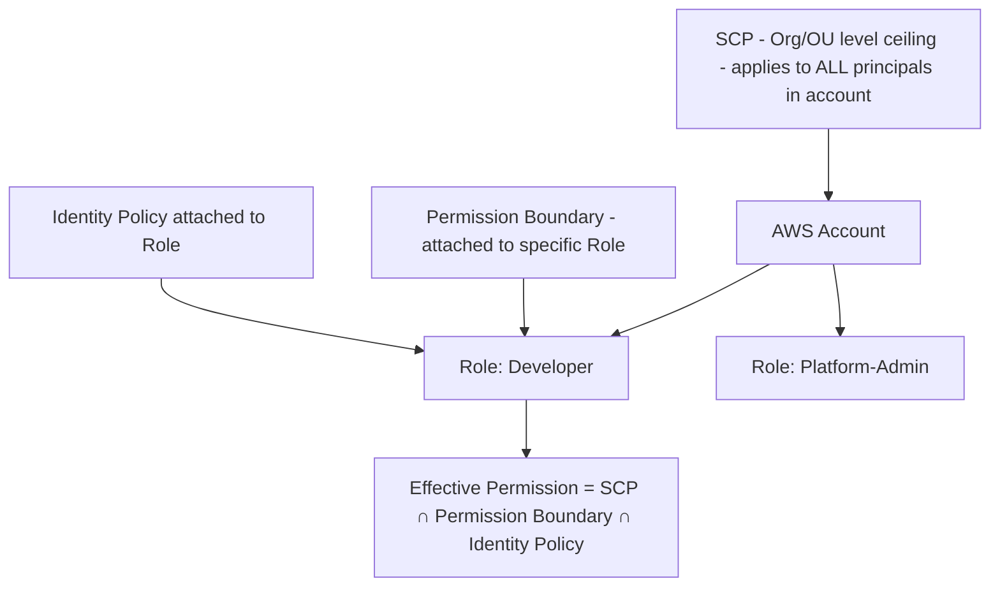

**Layered enforcement model (all three must agree to ALLOW):**

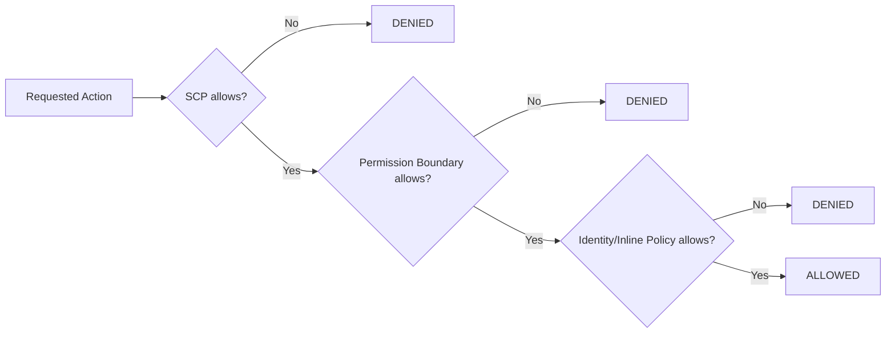

**Why use Permission Boundaries when you already have SCPs?**
- SCPs are managed centrally by the **Organization's Management account** — often too coarse and slow to change (needs central security team approval).
- Permission Boundaries let you **delegate** IAM administration safely: e.g., allow a team lead to create IAM roles for their squad, but cap those roles so they can never exceed `arn:aws:iam::policy/TeamDevBoundary` — even if the team lead attaches `AdministratorAccess` by mistake.

**Example Permission Boundary (cap for developer-created roles):**
```json
{
  "Version": "2012-10-17",
  "Statement": [
    {
      "Effect": "Allow",
      "Action": ["s3:*", "dynamodb:*", "lambda:*", "logs:*"],
      "Resource": "*"
    },
    {
      "Effect": "Deny",
      "Action": ["iam:*", "organizations:*", "kms:ScheduleKeyDeletion"],
      "Resource": "*"
    }
  ]
}
```

**Q: What happens when an SCP allows an action, but a Permission Boundary denies it?**

> The action is **DENIED**. Every layer (SCP, Permission Boundary, and the identity's own policy) is evaluated **independently**, and AWS uses "**most restrictive wins**" logic — think of it as a logical **AND** of three separate ALLOW gates, with an implicit deny if any is missing, and an **explicit Deny anywhere overriding everything**. An SCP granting broad access is meaningless if the Permission Boundary (or the identity policy) doesn't also explicitly allow it.

**Practical layered model used in enterprises:**

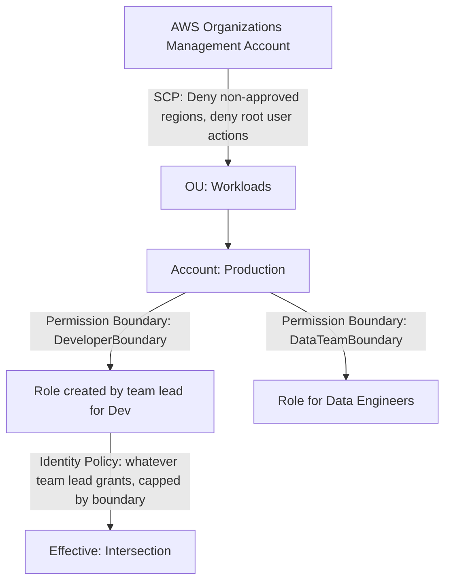

---

### 1.2 AWS KMS Multi-Region Keys — Under the Hood + Aurora Failover

**How Multi-Region Keys (MRK) work:**
- You create a **Primary Key** in Region A (e.g., `ap-south-1`) and **replicate** it to Region B (e.g., `ap-south-2`) as a **Replica Key**.
- Both keys share the **same Key ID material** and **same Key ID prefix** (`mrk-...`) but are **independent KMS resources** — each has its own key policy, grants, and can be independently disabled/rotated (rotation is *not* auto-synced by default unless you enable it centrally).
- Critically: **ciphertext encrypted under the Primary key can be decrypted using the Replica key**, because they share the same cryptographic key material. This is different from normal regional CMKs, where ciphertext is bound to a single region's key.

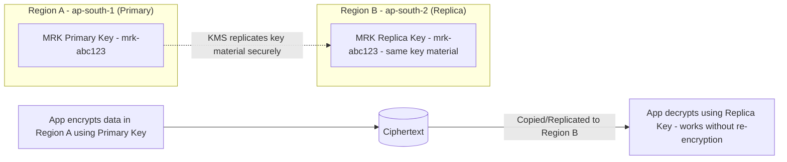

**Aurora PostgreSQL cross-region failover with KMS encryption:**

1. Aurora Global Database requires the **secondary region's cluster** to be encrypted with a **KMS key in that region** — you cannot use a Region A key to encrypt a Region B cluster directly.
2. Use a **Multi-Region KMS Key**: create the Primary MRK in the primary region, replicate to DR region, and specify the DR-region Replica Key when creating the Aurora Global Database secondary cluster.
3. On failover (planned or unplanned), the DR-region Aurora cluster is **already encrypted with its local replica key** — no waiting on cross-region KMS calls, no added latency, and no "cannot decrypt" failure because both keys were provisioned ahead of time.

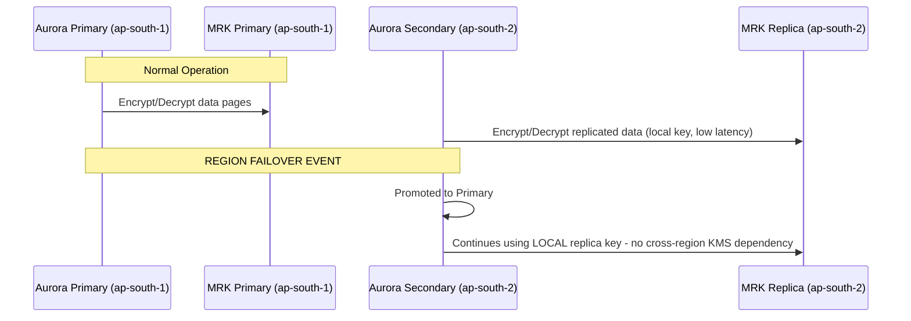

**Key gotcha:** If you had instead used a **regular single-region CMK** and just copied encrypted snapshots to another region, you'd need to **re-encrypt the snapshot with a key from the destination region** before restore — adding time and complexity to your DR runbook. Multi-Region Keys eliminate this step entirely, directly helping meet a tight RTO.

---

### 1.3 Session Policy vs Inline Policy vs Managed Policy in AssumeRole + Confused Deputy Problem

**Three policy types that interact during `sts:AssumeRole`:**

| Policy Type | Attached To | When it applies |
|---|---|---|
| **Managed Policy** (AWS or Customer) | The IAM Role itself (permanent) | Always, whenever the role is assumed |
| **Inline Policy** | Embedded directly in the Role (permanent, 1:1) | Always, whenever the role is assumed |
| **Session Policy** | Passed **at the moment of `AssumeRole` call** (temporary, exists only for that session) | Only for that specific assumed session |

**Effective permission during an assumed session:**
```
Effective = Role's (Managed + Inline Policies) ∩ Session Policy (if provided) ∩ any applicable SCP/Boundary
```

Session Policies can only **further restrict** — never expand — what the role's own permanent policies allow. This is how you build **dynamic, scoped-down access** at runtime, e.g., a broker application assuming a broad role but restricting each caller's session to only their own S3 prefix.

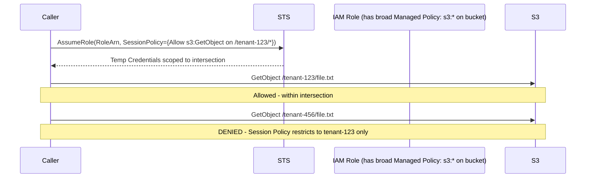

---

### The Confused Deputy Problem & External ID

**Problem:** A "deputy" (your AWS account/role) has permission to act on a resource, but a **third party tricks it** into misusing that permission on behalf of an attacker (e.g., a SaaS vendor's role, if compromised or reused by another customer, could access **your** resources by guessing/reusing a Role ARN meant for you).

**Solution: External ID** — a shared secret string that the third party MUST pass in every `AssumeRole` call, checked in your trust policy's `Condition`.

```json
{
  "Effect": "Allow",
  "Principal": { "AWS": "arn:aws:iam::VENDOR_ACCOUNT_ID:root" },
  "Action": "sts:AssumeRole",
  "Condition": {
    "StringEquals": { "sts:ExternalId": "customer-A-unique-secret-9f8e7d" }
  }
}
```

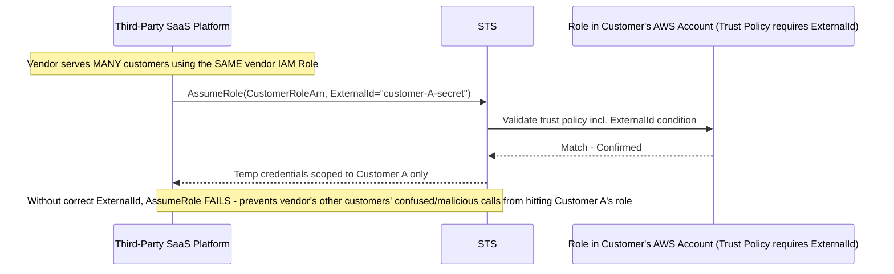

**Best practices to prevent Confused Deputy fully:**
1. Always require `sts:ExternalId` (unique per customer) in cross-account trust policies for third-party vendor access.
2. Use `aws:SourceArn` / `aws:SourceAccount` condition keys for service-to-service trust (e.g., S3 → Lambda invocation permissions) — AWS's own recommended mitigation for services like SNS/S3 invoking Lambda/roles.
3. Scope the role's permission policy to the **minimum resources** needed — never wildcard `Resource: "*"` for vendor-assumed roles.

---

### 1.4 Zero Trust Microservice-to-Microservice Traffic in EKS/ECS (mTLS via App Mesh)

**From scratch — Zero Trust principle:** Never trust traffic just because it's "inside the VPC." Every service must **authenticate and encrypt** every call, verifying identity cryptographically (mTLS), regardless of network location.

**AWS App Mesh** implements a **service mesh** using the **Envoy proxy** as a sidecar injected into every pod/task — all traffic between services is intercepted by Envoy, which handles mTLS transparently.

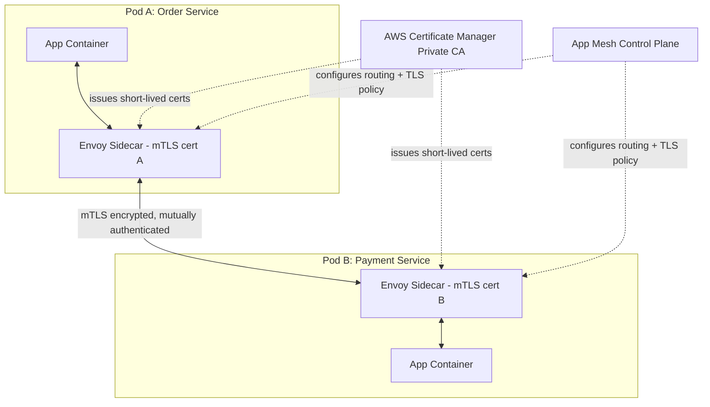

**How it's configured:**
1. Define a **Virtual Node** per microservice (its Envoy config) and a **Virtual Service** (the logical DNS name other services call).
2. Enable **TLS enforcement** in the Virtual Node spec, backed by **AWS Certificate Manager Private CA (ACM PCA)** issuing short-lived certificates automatically rotated to each Envoy sidecar.
3. Set a **Backend Default TLS Validation** so each Envoy only accepts connections presenting a cert signed by your Private CA — enforcing **mutual** authentication (both client and server prove identity).
4. Combine with **Kubernetes Network Policies** (Calico/Cilium on EKS) to enforce **which pods are even allowed to attempt** a connection (Layer 3/4 zero-trust segmentation), while App Mesh handles Layer 7 identity + encryption.

**PrivateLink alternative (when mesh is overkill):** For simpler cases — exposing one internal service to consumers across **VPC/account boundaries** — use **PrivateLink with an NLB**, so traffic never traverses the public internet and the consumer only sees a private ENI, without needing full mesh tooling. App Mesh is for **fine-grained intra-cluster** traffic control; PrivateLink is for **service exposure across network boundaries**.

| Requirement | Use |
|---|---|
| Fine-grained per-microservice mTLS, retries, circuit breaking, observability inside one cluster | **App Mesh** (or open-source Istio/Linkerd) |
| Expose ONE service securely to other VPCs/accounts, no mesh complexity needed | **PrivateLink** |
| Layer 3/4 pod-to-pod firewalling within EKS | **Kubernetes Network Policies (Cilium/Calico)** |

---

### 1.5 Scenario: Secrets in ECS Env Vars → Secrets Manager with Auto-Rotation, No Restart

**Problem:** Plaintext secrets in ECS Task Definition environment variables are visible in the Task Definition JSON (via console/API/CloudTrail) and in `ecs describe-tasks` output — a major audit failure.

**Re-architecture:**

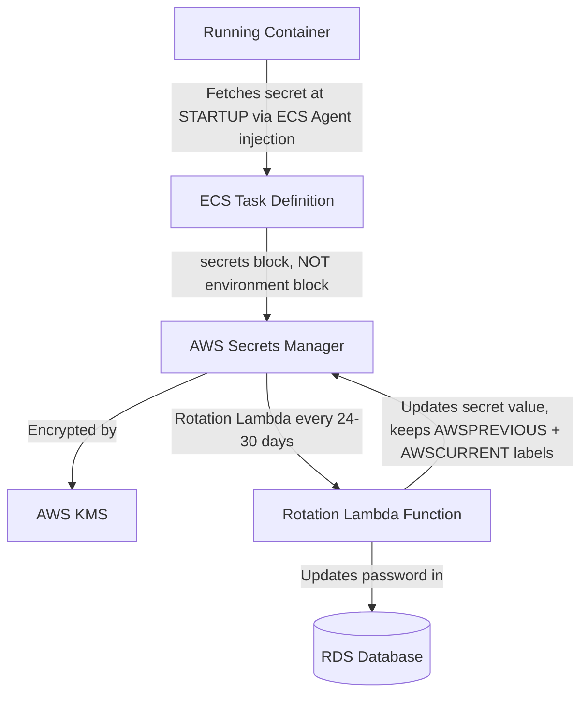

**Step 1 — Fix injection (no plaintext, no restart needed for the *initial* fetch):**
```json
"containerDefinitions": [{
  "name": "app",
  "secrets": [
    { "name": "DB_PASSWORD", "valueFrom": "arn:aws:secretsmanager:ap-south-1:123456789012:secret:prod/db-AbCdEf:password::" }
  ]
}]
```
The ECS Agent (not the app) resolves this at container **launch time** via the Task Execution Role, injecting it as an env var into the container process — never stored in the Task Definition itself.

**Step 2 — Handle rotation WITHOUT restarting containers:**

The challenge: Secrets Manager rotates the password on a schedule, but the already-running container has the **old value cached in its environment variables** (env vars are immutable once a process starts).

**Solution — avoid env-var caching, fetch live at connection time:**
1. **Application-level fix (best practice):** Instead of reading `DB_PASSWORD` once at startup, use the **AWS SDK + Secrets Manager caching client library** (`aws-secretsmanager-caching-java`, or equivalent for Python/Node) inside the app. This library calls `GetSecretValue` on each new DB connection (or on a TTL cache, e.g., 5 min), automatically picking up the rotated value **without a restart**.
2. **Database driver-level fix:** Use **RDS Proxy** in front of the database — RDS Proxy natively integrates with Secrets Manager and manages the credential rotation transparently at the connection-pooling layer; your application connects to the Proxy endpoint and never needs to know the password changed.
3. Enable **Secrets Manager native rotation** for RDS/Aurora (built-in rotation Lambda, no custom code needed):
```bash
aws secretsmanager rotate-secret \
  --secret-id prod/db \
  --rotation-lambda-arn arn:aws:lambda:ap-south-1:123456789012:function:SecretsManagerRDSRotation \
  --rotation-rules AutomaticallyAfterDays=30
```

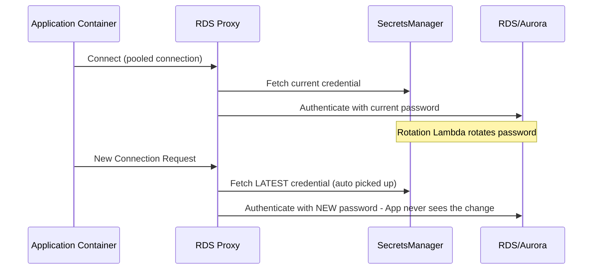

**Result:** Zero application restarts, zero downtime, fully automated rotation, and no secrets ever visible in Task Definitions, logs, or CloudTrail.

---

### 1.6 Preventing & Remediating S3 Data Exfiltration

**Threat model:** A compromised EC2 role or insider copies sensitive S3 data to an **external/public S3 bucket** (possibly in another AWS account) or downloads it over the public internet.

**Defense-in-depth layers:**

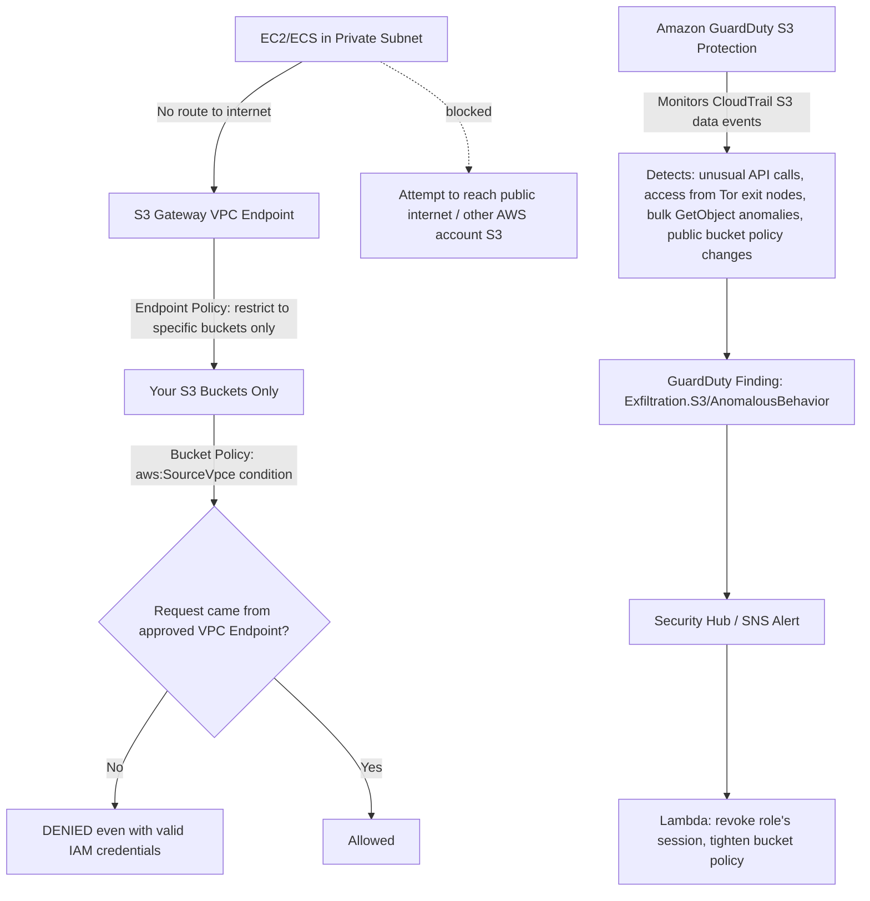

**1. S3 Bucket Policy — restrict access to only your VPC Endpoint:**
```json
{
  "Effect": "Deny",
  "Principal": "*",
  "Action": "s3:*",
  "Resource": ["arn:aws:s3:::sensitive-bucket", "arn:aws:s3:::sensitive-bucket/*"],
  "Condition": {
    "StringNotEquals": { "aws:SourceVpce": "vpce-0abc123456" }
  }
}
```
This means even if an attacker steals valid IAM credentials, they **cannot** access the bucket from outside your VPC (e.g., from their laptop over the internet) — the request must physically originate from traffic routed through your specific VPC Endpoint.

**2. VPC Endpoint Policy — restrict which buckets the VPC can even reach:**
```json
{
  "Statement": [{
    "Effect": "Allow",
    "Principal": "*",
    "Action": "s3:*",
    "Resource": ["arn:aws:s3:::approved-bucket-1/*", "arn:aws:s3:::approved-bucket-2/*"]
  }]
}
```
This prevents an insider from using your VPC's legitimate S3 access to exfiltrate data to **their own personal S3 bucket** in another account — the endpoint itself won't route to unapproved bucket ARNs.

**3. GuardDuty S3 Protection** — analyzes S3 **data event** CloudTrail logs (object-level API calls) using ML to detect:
- Unusual `GetObject` volume/pattern (bulk download anomaly).
- API calls from suspicious IPs / Tor exit nodes / known malicious IP lists.
- Bucket policy or ACL changes that suddenly make a bucket public.
- Credential usage anomalies (e.g., access from a geography never seen before for this role).

**4. Additional controls:**
- **S3 Block Public Access** at the account and bucket level (prevents accidental/malicious public exposure).
- **SCP** denying `s3:PutBucketPolicy` / `s3:PutBucketAcl` for anyone except a dedicated security-admin role.
- **AWS Macie** to continuously scan for sensitive data (PII, credit cards) and flag if such data exists in a bucket that isn't properly locked down.

---

### 1.7 AWS Resource Access Manager (RAM) — Sharing Across 50+ Accounts

**From scratch:** RAM lets you share AWS resources you own with other AWS accounts (or your entire AWS Organization) **without duplicating the resource** — the consuming account gets to *use* it, but doesn't own it.

**Commonly shared resources:** Transit Gateways, Subnets, Route 53 Resolver Rules, License Manager configurations, ACM Private CA.

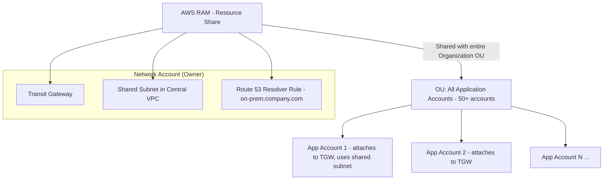

**Enterprise pattern — Hub-and-Spoke with RAM:**
1. A dedicated **Network Account** owns the Transit Gateway, core shared subnets, and Resolver Rules.
2. Using **RAM**, share the TGW with the entire **AWS Organization** (or specific OUs) — enable **"Share with AWS Organizations"** to auto-propagate to new accounts as they're created, no manual per-account invite needed.
3. Each of the 50+ application accounts then creates a **VPC attachment** to the shared TGW from their own VPC — they don't need to own or manage the TGW itself.
4. **Shared Subnets** ("VPC Sharing"): The Network Account can even share **specific subnets** of a centrally-managed VPC directly into other accounts — those accounts launch EC2/RDS/Lambda **directly into the shared subnet**, simplifying IP management and reducing the number of VPCs (and peering connections) needed enterprise-wide.
5. **Resolver Rule sharing**: Centralize the on-prem DNS forwarding rule once, share via RAM, so every spoke account automatically resolves `*.company.internal` on-prem records without configuring their own Resolver endpoints.

**Why RAM matters at 50+ account scale:** Without RAM, you'd need to duplicate resources per account (unmanageable) or set up 50+ individual VPC peering/DX Gateway associations (operationally heavy). RAM + Organizations integration = **share once, auto-propagate to all current and future accounts**, governed centrally.

---

## 2. Advanced Networking, VPC & Hybrid Connectivity

### 2.1 Hybrid Topology: Bengaluru On-Prem ↔ AWS Mumbai (ap-south-1) with DX + VPN Backup

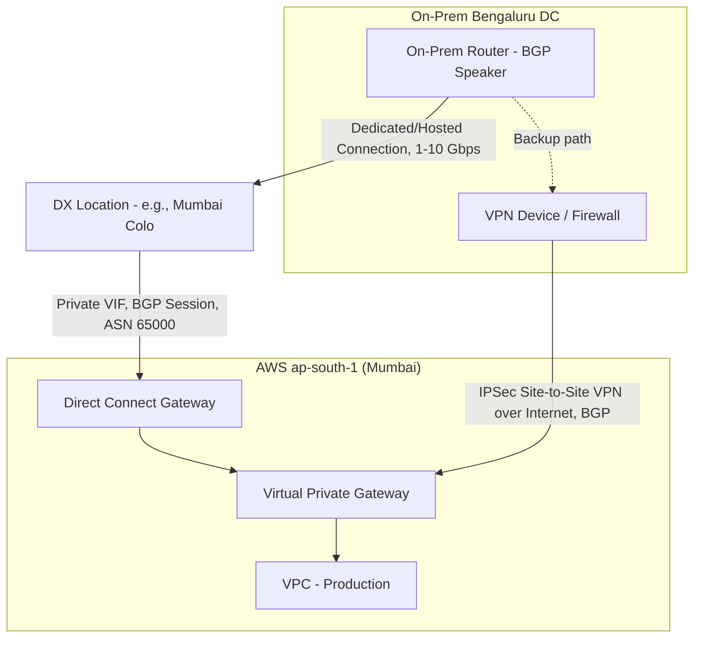

**BGP Failover & Route Prioritization:**

Both DX and VPN establish **BGP sessions** advertising the same on-prem routes to the VPC. By default, AWS prefers **Direct Connect over VPN** automatically because BGP prefers routes with a **shorter AS-PATH** and DX typically has a more direct path — but you must engineer this explicitly for reliable failover:

1. **AS-PATH Prepending**: On the VPN connection's BGP advertisement, prepend your own ASN multiple times (e.g., repeat it 3x) to artificially lengthen the AS-PATH for the VPN route, making DX the mathematically preferred path under normal conditions.
```
# On-prem router VPN BGP config (prepend to make route "longer"/less preferred)
route-map PREPEND-VPN permit 10
 set as-path prepend 65000 65000 65000
```
2. **Local Preference**: Within AWS, for routes learned via DX vs VPN into the same VPC, set a **higher Local Preference** on the DX-learned routes (higher = more preferred in BGP path selection) via the DX Gateway/VGW route preference settings.
3. **BFD (Bidirectional Forwarding Detection)**: Enable BFD on the DX BGP session for **sub-second failure detection** (vs BGP's default ~90 sec hold-timer) — critical for a fast automatic failover to VPN when DX physically drops.

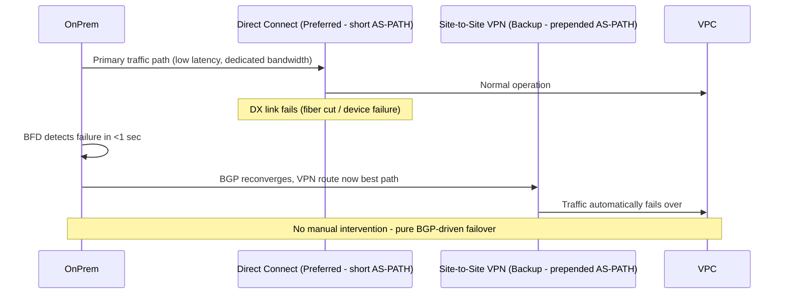

4. For **active-active** rather than pure backup, use **ECMP (Equal-Cost Multi-Path)** across two DX connections (from different DX locations/devices) for redundancy at the same priority level, with VPN strictly as tertiary backup.
5. Use a **Direct Connect Gateway** (not just a VGW directly) if you need this single DX connection to reach **multiple VPCs across regions** — DX Gateway is global and can attach to VGWs/TGWs in many regions.

---

### 2.2 Overlapping CIDR Blocks After Company Acquisition

**Problem:** Both companies use `10.0.0.0/16`. VPC Peering and standard TGW attachments **require non-overlapping CIDRs** — they will simply reject the configuration.

**Solutions (in order of preference):**

**Option A — AWS PrivateLink (Best for specific service-to-service needs, no re-IP needed):**
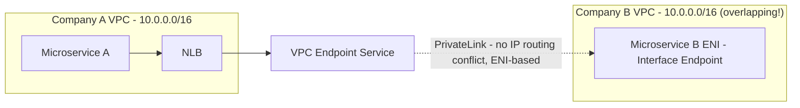
PrivateLink works regardless of overlapping CIDRs because it doesn't route based on the consumer's IP space — it creates an ENI *inside* the consumer's VPC using the consumer's own IP, connecting privately to the provider's NLB. **No peering, no route tables involved, no CIDR conflict possible.**

**Option B — Transit Gateway with NAT for overlapping ranges (if many-to-many connectivity needed, not just point services):**
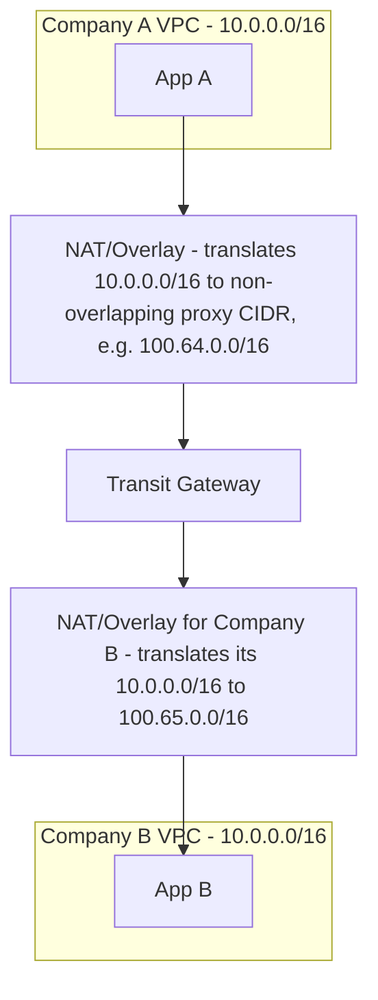
Since TGW **cannot** route overlapping CIDRs directly, insert a **NAT layer** (e.g., a fleet of NAT instances/appliances doing 1:1 static NAT, or a purpose-built overlay like **PrivateLink combined with TGW**) to translate each VPC's real CIDR into a **non-overlapping proxy CIDR** for cross-VPC communication.

**Option C — Re-IP one VPC (cleanest long-term, but disruptive):** Migrate one company's VPC to a fresh non-overlapping CIDR (e.g., `10.100.0.0/16`) using tools like **VPC IP Address Manager (IPAM)** to plan clean allocation. This is the recommended **end-state** for a true merger, but too disruptive for immediate post-acquisition connectivity — hence PrivateLink/NAT overlay is used as an interim/permanent bridge for specific service integrations.

**Decision guide:**
| Need | Solution |
|---|---|
| A handful of specific services need to talk cross-company | **PrivateLink** (fastest, no re-IP, minimal blast radius) |
| Full network-level, many-to-many connectivity required | **TGW + NAT overlay**, or eventual **re-IP** |
| Long-term unified network architecture | **Re-IP via IPAM**, phased migration |

---

### 2.3 Transit Gateway Appliance Mode — Solving Asymmetric Routing

**Problem without Appliance Mode:** When routing traffic through a central VPC of firewall appliances (Palo Alto/Fortinet) attached to TGW, TGW by default load-balances flows across **all Availability Zone associations** based on 5-tuple hashing **per-packet-direction**, independently for each direction. This can cause the **request** to go through Firewall Instance in AZ-A, but the **response** to route back through Firewall Instance in AZ-B — since stateful firewalls track connection state per-instance, the return packet arrives at a firewall that never saw the outbound request, and it **drops the packet** (asymmetric routing failure).

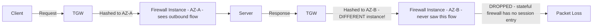

**Solution: Enable Appliance Mode on the TGW VPC attachment.**

With **Appliance Mode enabled**, TGW ensures **flow stickiness** — all packets for a given flow (in **both directions**) are consistently routed to the **same Availability Zone / same appliance instance** for the life of that flow, based on 5-tuple hash pinned to a single AZ.

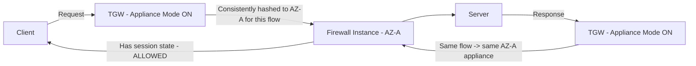

**Configuration:**
```bash
aws ec2 modify-transit-gateway-vpc-attachment \
  --transit-gateway-attachment-id tgw-attach-0123456789 \
  --options ApplianceModeSupport=enable
```

**Design implication:** Appliance Mode should be enabled on the **TGW attachment to the Firewall/Inspection VPC** (the "central" VPC hosting the Palo Alto/Fortinet cluster), ensuring symmetric routing for all inspected traffic — a mandatory setting for any **centralized traffic inspection architecture** (hub-spoke with a security VPC) on AWS.

---

### 2.4 Global Accelerator vs CloudFront for Real-Time Trading (non-HTTP/TCP)

| Feature | CloudFront | Global Accelerator |
|---|---|---|
| Layer | Layer 7 (HTTP/HTTPS caching CDN) | Layer 3/4 (TCP/UDP, IP-based) |
| Protocol support | HTTP/HTTPS/WebSocket only | **Any TCP/UDP protocol** — including FIX protocol, custom binary trading protocols, gaming UDP |
| Static IPs | No (uses shared edge IPs, changes) | **Yes — 2 static Anycast IPs**, never change |
| Routing mechanism | Content caching at edge | **Anycast routing** — routes into the AWS global network backbone at the **nearest edge**, then travels over AWS's private backbone (not public internet) to origin |
| Caching | Yes (content cache) | No caching — pure network path optimization |
| Best for | Static/dynamic web content, video, APIs | Low-latency **non-HTTP TCP/UDP** traffic: trading platforms, VoIP, gaming, IoT telemetry |

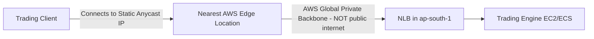

**Why Global Accelerator wins for real-time trading:**
1. **Static IP requirement**: Trading counterparties often **whitelist specific IPs** for FIX protocol connections — CloudFront's edge IPs are shared and dynamic, unusable for this. Global Accelerator gives you **2 fixed Anycast IPs** for the life of the accelerator.
2. **Lower, more consistent latency**: Traffic enters the AWS backbone at the nearest edge and travels over AWS's **private, low-jitter backbone network** instead of the public internet — critical for trading systems sensitive to latency variance (jitter), not just average latency.
3. **Non-HTTP protocol support**: Trading systems typically use **FIX protocol over TCP** or custom binary UDP protocols — CloudFront literally cannot proxy this (HTTP/HTTPS/WebSocket only). Global Accelerator works at the TCP/UDP level, protocol-agnostic.
4. **Instant regional failover**: Global Accelerator continuously health-checks origins in multiple regions and can **shift traffic to a healthy region within seconds** using the same static IP — no DNS propagation delay (unlike Route 53 failover, which is subject to DNS TTL caching).

---

### 2.5 VPC Lattice vs PrivateLink

**VPC Lattice** (newer service) is an **application networking service** that manages service-to-service connectivity, security, and observability **across VPCs and accounts** — without needing to manage the underlying networking (ENIs, route tables, peering) at all.

| Feature | PrivateLink | VPC Lattice |
|---|---|---|
| Abstraction level | Network layer (ENI-based private connectivity to a specific NLB/service) | **Application layer** — service directory, native HTTP/HTTPS/gRPC routing, weighted target groups |
| Setup complexity | Per-service: create Endpoint Service + NLB + Endpoint | Register services once into a **Service Network**; auth/routing managed centrally |
| Built-in Auth | No (must build your own at app layer) | **Yes** — native IAM-based auth per request (SigV4), fine-grained access policies per service |
| Cross-account | Yes | Yes, natively multi-account via **Service Network** shared through RAM |
| Best for | Simple 1:1 exposing of a TCP/HTTP service | Enterprise-wide **service mesh across account boundaries** with centralized policy |

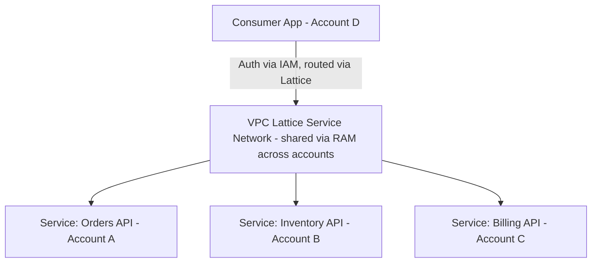

**When to use PrivateLink over VPC Lattice/TGW for B2B SaaS:**
- You are a **SaaS vendor** exposing exactly **one well-defined service endpoint** (e.g., an API) to many customer accounts, and want the **simplest, most battle-tested, widely-supported** mechanism → **PrivateLink**. It's the industry-standard pattern for B2B SaaS (used by Snowflake, Datadog, etc.) precisely because it requires zero networking knowledge from the customer (no route tables, no CIDR planning) — just "create an Interface Endpoint."
- If you're building an **internal, multi-team, multi-account platform** with many services calling many other services and want centralized access policy + built-in auth → **VPC Lattice**.
- If you need **full network-layer reachability** (not just specific services) between many VPCs, e.g., for VDI, shared infrastructure, monitoring agents → **Transit Gateway**.

---

### 2.6 Scenario: ALB (Public) → EC2 (Private) → External Payment Gateway — Full Traffic Path

```mermaid
graph TB
    Client((Internet Client)) --> IGW[Internet Gateway]
    IGW --> ALBNacl[Public Subnet NACL]
    ALBNacl --> ALB[ALB - Public Subnet]
    ALB --> ALBSG[ALB Security Group - allow 443 inbound]
    ALBSG --> AppNacl[Private Subnet NACL]
    AppNacl --> EC2SG[EC2 Security Group - allow from ALB SG only]
    EC2SG --> EC2[EC2 Instance - Private Subnet]
    EC2 --> PrivRouteTable[Private Route Table - 0.0.0.0/0 -> NAT GW]
    PrivRouteTable --> NATGW[NAT Gateway - Public Subnet]
    NATGW --> NATNacl[Public Subnet NACL - outbound]
    NATNacl --> IGW2[Internet Gateway]
    IGW2 --> PaymentGateway((External Payment Gateway))
```

**Exact hop-by-hop path:**

1. **Client → IGW**: Public internet request arrives at the Internet Gateway.
2. **IGW → Public Subnet NACL**: Evaluated (stateless — must allow inbound 443 AND outbound ephemeral ports).
3. **NACL → ALB**: ALB accepts on its Security Group (must allow inbound 443/80 from `0.0.0.0/0` or restricted CIDR).
4. **ALB → Private Subnet NACL**: Traffic to the target EC2 crosses into the private subnet — private subnet NACL must allow inbound from the ALB's subnet CIDR range (not just "ALB" — NACLs don't understand SG references, only IP/CIDR).
5. **NACL → EC2 Security Group**: EC2's SG should allow inbound **only from the ALB's Security Group** (SG-to-SG reference — this is the correctly scoped, least-privilege rule) on the app port (e.g., 8080).
6. **EC2 processes request → needs to call external Payment Gateway**: EC2 has **no public IP** (private subnet), so it uses its route table's `0.0.0.0/0 → NAT Gateway` route.
7. **EC2 → NAT Gateway**: Traffic first re-checked against the **private subnet's outbound NACL rule** (must allow outbound 443).
8. **NAT Gateway (in public subnet) → Public Subnet NACL**: Must allow outbound 443 to the internet, AND inbound on ephemeral ports for the *return* traffic (since NAT terminates/re-originates the connection with its own IP).
9. **NAT Gateway → IGW → Payment Gateway**: NAT performs SNAT (source IP replaced with NAT's Elastic IP), request reaches the external payment gateway over the internet.
10. **Response path**: Reverses through NAT Gateway (which remembers the translation - it's stateful) → EC2 → ALB → Client.

**Where packet drops commonly occur (troubleshooting checklist):**

| # | Failure Point | Symptom |
|---|---|---|
| 1 | Private subnet NACL missing outbound rule for ephemeral ports/443 | EC2 → payment gateway calls time out |
| 2 | Public subnet NACL (where NAT lives) missing inbound rule for ephemeral ports | NAT can't return response to EC2 — response silently dropped |
| 3 | EC2 Security Group doesn't allow outbound (rare, default allows all, but often over-restricted in "secure" configs) | Outbound calls blocked at instance level |
| 4 | Private route table missing `0.0.0.0/0 → NAT Gateway` route | EC2 has literally no path to the internet at all |
| 5 | NAT Gateway placed in the **wrong AZ** relative to EC2 (cross-AZ NAT works but adds latency + cross-AZ data charges, and breaks if that AZ's NAT GW fails without redundancy) | Intermittent failures during AZ issues |
| 6 | ALB → EC2 SG rule references CIDR instead of ALB's Security Group ID | Works initially, breaks when ALB scales/changes IPs; also less secure |
| 7 | Payment gateway whitelists specific IPs but NAT Gateway EIP wasn't shared with them | Connection refused/blocked at the payment gateway's firewall, not AWS side |

---

### 2.7 Route 53 Resolver Endpoints — Hybrid DNS (On-Prem AD ↔ Private Hosted Zones)

**From scratch:** By default, a VPC's private DNS (Route 53 Resolver, at `169.254.169.253` / `.2` address) can only resolve records within its own VPC/Private Hosted Zones, and cannot resolve on-prem Active Directory domain names. Conversely, on-prem clients cannot resolve AWS `.internal` Private Hosted Zone records. **Resolver Endpoints** bridge this gap.

```mermaid
graph TB
    subgraph "On-Premises Bengaluru DC"
        AD[Active Directory DNS Server - corp.local]
        OnPremClient[On-Prem Client]
    end
    subgraph "AWS VPC - ap-south-1"
        InboundEP[Route 53 Resolver - INBOUND Endpoint]
        OutboundEP[Route 53 Resolver - OUTBOUND Endpoint]
        PHZ[Private Hosted Zone - app.internal]
        EC2App[EC2/ECS App]
    end
    OnPremClient -->|Query: db.app.internal| AD
    AD -->|Conditional Forwarder: app.internal -> AWS Inbound EP IP| InboundEP
    InboundEP --> PHZ
    PHZ -->|Answer| AD --> OnPremClient

    EC2App -->|Query: server1.corp.local| VPCResolver[VPC Resolver .2]
    VPCResolver -->|Resolver Rule: corp.local -> forward via Outbound EP| OutboundEP
    OutboundEP -->|Via DX/VPN| AD
    AD -->|Answer| OutboundEP --> EC2App
```

**Configuration steps:**

1. **Inbound Endpoint** (on-prem → AWS direction): Create a Resolver **Inbound Endpoint** in your VPC with ENIs in 2+ AZs, each getting a private IP. On your **on-prem AD DNS server**, configure a **conditional forwarder** for your Route 53 Private Hosted Zone domain (e.g., `app.internal`) pointing to these Inbound Endpoint IPs. Now on-prem clients/AD-joined machines can resolve AWS private DNS names.

2. **Outbound Endpoint** (AWS → on-prem direction): Create a Resolver **Outbound Endpoint**, then define a **Resolver Rule** (`FORWARD` type) for your on-prem domain (e.g., `corp.local`) that targets your **on-prem AD DNS server IPs** (reachable via Direct Connect/VPN). Associate this rule with your VPC(s). Now EC2/ECS/Lambda-in-VPC can resolve on-prem AD hostnames.

3. **Share Resolver Rules via RAM** (ties back to section 1.7) so all 50+ spoke accounts automatically get the `corp.local` forwarding rule without each having to build their own Outbound Endpoint.

**Security group requirement:** Both endpoints need an SG allowing **UDP/TCP port 53** from the relevant CIDR ranges (on-prem CIDR for Inbound; VPC CIDR for Outbound).

---

## 3. Resilient Architecture & High Availability (HA/DR)

### 3.1 Active-Active Multi-Region DR for Fintech: DynamoDB Global Tables vs Aurora Global Database

```mermaid
graph TB
    subgraph "Region A - ap-south-1"
        App1[App Tier]
        DDBTable1[DynamoDB Global Table - Replica 1]
        AuroraA[Aurora Writer - Region A]
    end
    subgraph "Region B - ap-south-2"
        App2[App Tier]
        DDBTable2[DynamoDB Global Table - Replica 2]
        AuroraB[Aurora Writer - Region B, requires Aurora Global DB write forwarding OR promoted secondary]
    end
    App1 <-->|Read/Write locally| DDBTable1
    App2 <-->|Read/Write locally| DDBTable2
    DDBTable1 <-->|Multi-Master, ~1 sec async replication, Last-Writer-Wins conflict resolution| DDBTable2
    AuroraA -->|Async replication ~<1 sec typical| AuroraB
    App2 -.Writes forwarded to Region A OR require failover promotion.-> AuroraA
```

| Factor | DynamoDB Global Tables | Aurora Global Database |
|---|---|---|
| Write model | **Multi-Master** — write to ANY region, true active-active | **Single-Writer** — one primary region writes; secondary regions are read-only (unless using "Write Forwarding" for MySQL, which forwards writes to primary transparently) |
| RPO | Near-zero for non-conflicting writes; conflict resolution is **Last-Writer-Wins** (based on timestamp) — potential silent data loss on conflicting concurrent writes to the same item | Typically <1 second lag; RPO ~seconds since it's physical log-based replication |
| RTO | **Zero** for reads/writes (already active-active, no failover needed) | Managed failover promotes secondary to primary in **~1 minute** (unplanned) |
| Consistency | Eventually consistent across regions (strongly consistent only within a single region) | Strongly consistent within primary; secondary reads are eventually consistent |
| Best for | True active-active apps that can tolerate eventual consistency + conflict resolution (session data, catalogs, user profiles, shopping carts) | Relational/transactional workloads (ledger, transaction tables) needing ACID **within a region**, with fast regional failover, not simultaneous multi-region writes |

**Recommended fintech architecture (hybrid):**
- Use **DynamoDB Global Tables** for **idempotent, conflict-tolerant** data: user sessions, feature flags, fraud-scoring cache, read-heavy reference data — true active-active, zero RTO.
- Use **Aurora Global Database** for the **core ledger/transactional** data requiring strict ACID consistency — accept that only ONE region can be the authoritative writer at a time, but achieve **RPO < 1 sec, RTO ~1 min** via Managed Planned Failover (or faster with automation for unplanned).
- For "active-active" transactional writes across regions (rare and hard), consider a **cell-based architecture with regional data sharding** (e.g., customers in North India write to `ap-south-1`, customers in South India write to `ap-south-2`, each region authoritative for its own shard) rather than trying to make Aurora itself multi-master — this avoids distributed-transaction complexity entirely.

```mermaid
sequenceDiagram
    participant RegionA as Aurora Global DB - Primary (ap-south-1)
    participant RegionB as Aurora Global DB - Secondary (ap-south-2)
    Note over RegionA,RegionB: Normal: RegionA is writer, RegionB read-only replica, lag <1s
    Note over RegionA: ap-south-1 outage detected
    RegionB->>RegionB: Managed/Unplanned Failover - promote to Writer
    Note over RegionB: RTO ~1 min for unplanned failover
    RegionA->>RegionA: Once recovered, demoted to replica, resyncs from new primary
```

---

### 3.2 Scenario: EKS AZ Outage — Stateful Pods Stuck to EBS in Dead AZ

**Problem:** EBS volumes are **AZ-locked** — an EBS-backed PersistentVolume created in `ap-south-1a` **cannot** be attached to a node in `ap-south-1b`. If `ap-south-1a` degrades, the Kubernetes scheduler/Cluster Autoscaler tries to reschedule the pod onto healthy nodes in other AZs, but the **PVC/PV binding forces it back onto an AZ-a node** that may not exist/be healthy → pod stuck in `Pending`.

```mermaid
flowchart TD
    Problem[AZ-1a degraded] --> Pod[StatefulSet Pod tries reschedule]
    Pod --> PVC[PVC bound to EBS PV in AZ-1a]
    PVC --> Stuck[Scheduler CANNOT place pod in AZ-1b/1c - EBS not attachable cross-AZ]
    Stuck --> Pending[Pod stuck Pending indefinitely]
```

**Solutions:**

1. **Immediate mitigation — Topology-aware storage with multiple replicas across AZs:** Use a **replicated storage layer** instead of raw single-AZ EBS for stateful workloads: **Amazon EFS** (multi-AZ by nature) or **Amazon FSx**, or application-level replication (e.g., a database that replicates across AZs like a StatefulSet running Postgres with **Patroni** for automated multi-AZ failover, or better — **use RDS/Aurora instead of self-hosting the DB in-cluster**).

2. **Use EBS CSI Driver with `WaitForFirstConsumer` + Multi-AZ node groups + Volume topology awareness**, but recognize this only helps with **initial scheduling**, not surviving an AZ that's already degraded — the fundamental fix is to **not pin stateful data to a single AZ's EBS** for HA-critical workloads.

3. **Karpenter/Cluster Autoscaler configuration**: Ensure node groups span **at least 3 AZs**, and use **Pod Topology Spread Constraints** to prevent all replicas of a StatefulSet from landing in one AZ in the first place (proactive prevention):
```yaml
topologySpreadConstraints:
  - maxSkew: 1
    topologyKey: topology.kubernetes.io/zone
    whenUnsatisfiable: DoNotSchedule
    labelSelector:
      matchLabels:
        app: my-stateful-app
```

4. **For true resilience, externalize state**: Move databases OUT of EKS entirely onto **RDS Multi-AZ / Aurora** (which handles AZ failover natively in ~30-60 sec, transparent to the app), and keep EKS pods **stateless**, connecting to the externalized DB. This is the AWS-recommended pattern — **Kubernetes is excellent at compute orchestration, but AZ-aware stateful failover is a solved problem in managed AWS data services; don't reinvent it inside EKS.**

5. **Immediate incident response** (if already stuck): Manually **cordon** the affected AZ's nodes, **delete the stuck Pending pod's PVC binding** (if data loss is acceptable / restore from snapshot), and let it reschedule with a **freshly provisioned EBS volume in a healthy AZ**, restoring data from the latest **EBS Snapshot** or application-level backup.

```mermaid
graph LR
    Recommended[Recommended End State] --> Stateless[EKS Pods: Stateless, any AZ]
    Recommended --> ExternalDB[Database: RDS Multi-AZ / Aurora - handles AZ failover natively]
    Recommended --> SharedFS[Shared File needs: EFS - inherently Multi-AZ]
    Recommended --> Spread[Topology Spread Constraints across 3+ AZs for redundant replicas]
```

---

### 3.3 Cellular Architecture — Limiting Blast Radius for Large SaaS

**From scratch:** A **Cell** is a fully self-contained, independent deployment unit (its own compute, database, queues) serving a **subset** of customers/traffic. Instead of one giant shared infrastructure serving all customers, you partition into N cells — a failure in Cell 3 **only** affects the customers routed to Cell 3.

```mermaid
graph TB
    Router[Cell Router / Routing Layer - maps CustomerID -> Cell] --> Cell1
    Router --> Cell2
    Router --> Cell3
    Router --> CellN

    subgraph Cell1 [Cell 1 - Customers A-F]
        ALB1[ALB] --> App1[App Tier] --> DB1[(Isolated DB Shard)]
    end
    subgraph Cell2 [Cell 2 - Customers G-M]
        ALB2[ALB] --> App2[App Tier] --> DB2[(Isolated DB Shard)]
    end
    subgraph Cell3 [Cell 3 - Customers N-S - EXPERIENCING ISSUE]
        ALB3[ALB] --> App3[App Tier - degraded] --> DB3[(Isolated DB Shard)]
    end

    Cell3 -.Blast radius CONTAINED - only these customers impacted.-> Impact[Limited Impact Zone]
    Cell1 -.Unaffected.-> Healthy1[Healthy]
    Cell2 -.Unaffected.-> Healthy2[Healthy]
```

**Key design components:**
1. **Cell Router (Thin routing layer)**: A lightweight, extremely reliable component (often just DynamoDB Global Table + Lambda@Edge/CloudFront Function) that maps a `CustomerID`/`TenantID` to their assigned Cell. This router itself must be simpler and more reliable than the cells it routes to (avoid making the router the new single point of failure).
2. **Full stack duplication per cell**: Each cell has its own ALB, compute (ASG/EKS namespace/ECS cluster), and **database shard** — no shared state between cells. A bad deployment, a noisy-neighbor query, a memory leak, or a regional dependency failure impacts **only that cell's customers**.
3. **Independent deployment per cell**: Roll out new app versions **cell-by-cell** (canary at the cell level) — if Cell 1's deployment has a bug, halt before it reaches Cell 2-N.
4. **Sizing cells appropriately**: Common approach — size cells so that the **worst-case blast radius** (e.g., "at most 5% of customers affected by any single failure") meets your SLA commitments. AWS itself uses this pattern internally (e.g., S3, Lambda are built from cells).
5. **Cross-cell shared services** (auth, billing) should either be **replicated per-cell** too, or made extremely highly available (multi-AZ/multi-region) since they ARE a shared dependency across all cells — this is often the hardest part of a cellular design.

**Benefits:** Bounded blast radius, easier capacity planning (cells are cookie-cutter, so scaling = adding more cells, not resizing one giant system), simpler incident response (identify + fail over/isolate one cell), enables **noisy-neighbor isolation** for multi-tenant SaaS (put your biggest/most demanding customers in their own dedicated cell).

---

### 3.4 Zero-Downtime Migration: On-Prem Oracle → Aurora PostgreSQL (DMS + SCT)

```mermaid
graph TB
    OracleOnPrem[(On-Prem Oracle DB)]
    SCT[AWS Schema Conversion Tool - SCT]
    SCT -->|Converts schema: tables, stored procs, PL/SQL -> PL/pgSQL| SchemaReport[Conversion Assessment Report + Converted Schema]
    SchemaReport -->|Apply converted schema| AuroraPG[(Aurora PostgreSQL - empty schema)]
    OracleOnPrem -->|Full Load - bulk copy existing data| DMS[AWS DMS Replication Instance]
    DMS -->|Loads historical data| AuroraPG
    OracleOnPrem -->|CDC - Change Data Capture, ongoing changes via redo logs| DMS
    DMS -->|Continuously applies new changes| AuroraPG
    AppOld[Application - currently pointing to Oracle] -.cutover.-> AppNew[Application - repointed to Aurora]
```

**Step-by-step process:**

1. **Assessment Phase (SCT):** Run **AWS Schema Conversion Tool** against the Oracle database. SCT analyzes schema objects (tables, views, stored procedures, triggers, PL/SQL) and generates an **Assessment Report** categorizing objects as: automatically convertible, convertible with minor edits, or requiring manual rewrite (common for complex Oracle-specific features like `CONNECT BY`, Oracle packages, sequences with custom logic).

2. **Schema Conversion:** SCT converts Oracle DDL/PL-SQL to PostgreSQL DDL/PL-pgSQL automatically where possible. Manually rewrite the flagged incompatible objects (this is usually the **most time-consuming** part of an Oracle→PostgreSQL migration — budget significant time here).

3. **Apply converted schema to Aurora PostgreSQL** (target is empty, no data yet, indexes/constraints may be initially disabled for faster bulk load).

4. **Full Load with AWS DMS:** Provision a **DMS Replication Instance**, configure Source Endpoint (Oracle) and Target Endpoint (Aurora PostgreSQL). Run a **Full Load task** to bulk-copy all existing historical data — Oracle keeps serving production traffic uninterrupted during this phase.

5. **CDC (Change Data Capture) — the key to zero downtime:** Configure DMS for **"Full Load + CDC"** mode. After the full load completes, DMS reads Oracle's **redo logs** (via Oracle LogMiner or binary reader) and **continuously streams every INSERT/UPDATE/DELETE** happening on Oracle in near-real-time into Aurora — keeping both databases in sync while the app is STILL live on Oracle.

6. **Validation:** Use **DMS Data Validation** feature (built-in row-by-row comparison) to confirm Aurora data matches Oracle exactly, continuously, throughout the CDC phase.

7. **Cutover window (minutes, not hours):** Once CDC lag is near-zero and validated:
   - Briefly pause writes to Oracle (short maintenance window, seconds to a few minutes).
   - Let DMS drain the final remaining CDC changes (catch up to zero lag).
   - Repoint application connection strings (ideally via a DNS/config change, ex: Route 53 record or Secrets Manager secret update) to Aurora.
   - Resume traffic — now flowing to Aurora.

```mermaid
sequenceDiagram
    participant Oracle
    participant DMS
    participant Aurora
    participant App
    App->>Oracle: Live traffic (Phase 1)
    DMS->>Oracle: Full Load (historical data)
    DMS->>Aurora: Bulk insert historical data
    Note over DMS: Full load complete, switch to CDC
    App->>Oracle: Live traffic continues
    Oracle->>DMS: Redo log changes (CDC) streamed continuously
    DMS->>Aurora: Apply changes in near real-time
    Note over Oracle,Aurora: Lag monitored until ~0
    Note over App: CUTOVER WINDOW (seconds-minutes)
    App->>App: Brief write pause
    DMS->>Aurora: Final CDC catch-up
    App->>Aurora: Repoint connection string
    App->>Aurora: Live traffic (Phase 2) - Oracle decommissioned after grace period
```

8. **Rollback plan:** Keep Oracle running (read-only or fully paused) for a grace period post-cutover; if issues found in Aurora, can reverse DMS direction or simply repoint the app back to Oracle since it wasn't decommissioned yet.

---

### 3.5 AWS Fault Injection Service (FIS) — Chaos Engineering in CI/CD

**From scratch:** FIS is AWS's managed **Chaos Engineering** service — it lets you run controlled "experiments" that deliberately inject failures (kill instances, throttle API calls, spike CPU, inject network latency, degrade AZ) into your **real infrastructure** to validate that your resilience mechanisms (auto-scaling, failover, retries, circuit breakers) actually work — rather than assuming they do.

```mermaid
graph TD
    Experiment[FIS Experiment Template] --> Target[Target: e.g., 50% of EC2 instances in ASG, tagged Environment=staging]
    Experiment --> Action[Action: aws:ec2:stop-instances / aws:ssm:send-command CPU stress / aws:network:disrupt-connectivity]
    Experiment --> StopCondition[Stop Condition: CloudWatch Alarm - e.g., if error rate > 20%, ABORT experiment immediately]
    Action --> Observe[Observe: Does Auto Scaling replace instances? Does ALB reroute? Do alarms fire? Does app degrade gracefully?]
```

**Common FIS experiment types:**
| Action | Simulates |
|---|---|
| `aws:ec2:stop-instances` / `terminate-instances` | Instance failure |
| `aws:ecs:stop-task` | Container crash |
| `aws:network:disrupt-connectivity` | AZ/network partition |
| `aws:ssm:send-command` (stress-ng) | CPU/memory exhaustion |
| `aws:fis:inject-api-throttle-error` | Throttling from a dependent AWS service |
| `aws:rds:reboot-db-instances` (failover test) | Database failover behavior |

**Integrating into CI/CD pipeline:**

```mermaid
graph LR
    Deploy[CI/CD: Deploy to Staging] --> IntegrationTests[Run Integration Tests]
    IntegrationTests --> ChaosStage[Chaos Stage: Trigger FIS Experiment via API/CLI]
    ChaosStage --> FISRun[FIS Experiment: Kill 1 AZ's instances]
    FISRun --> AutoObserve[Automated Observability Check: CloudWatch Alarms, X-Ray traces, synthetic canary tests]
    AutoObserve --> Gate{Recovery within SLA? e.g., <60s, error rate <1%}
    Gate -- Pass --> ProceedProd[Promote to Production Deployment]
    Gate -- Fail --> BlockDeploy[Block Pipeline - Alert Team - Resilience Regression Detected]
```

**Practical setup:**
1. Define an **FIS Experiment Template** targeting your **staging/pre-prod environment** (never start directly in prod), tagged resources (e.g., `Chaos-Eligible: true`) to scope blast radius safely.
2. **Always configure a Stop Condition** tied to a CloudWatch Alarm (e.g., overall error rate or latency threshold) — FIS will **automatically halt** the experiment if things go worse than expected, a critical safety net.
3. Trigger the experiment as an automated **stage in your CI/CD pipeline** (e.g., AWS CodePipeline custom action, or GitHub Actions calling `aws fis start-experiment`) after normal integration tests pass but before promoting to production.
4. Use **Synthetic Canaries (CloudWatch Synthetics)** running continuously during the experiment to measure real user-facing impact automatically, gating the pipeline's promotion decision.
5. Gradually increase chaos sophistication over maturity: start with single-instance termination → AZ-level disruption → dependency throttling → full "Game Day" exercises simulating regional failures.

---

## 4. Serverless & Event-Driven Enterprise Patterns

### 4.1 Scenario: EventBridge → Lambda → Rate-Limited External API During Peak Sale

**Problem:** During Flipkart Big Billion Days-style peak, thousands of EventBridge events trigger Lambda concurrently, each calling an external payment/shipping API that enforces a rate limit (e.g., 50 req/sec) — causing massive throttling, failed Lambda invocations, wasted concurrency, and potential DLQ pile-up.

**Solution: Decouple with an SQS buffer + controlled-rate consumer.**

```mermaid
graph TB
    EventBridge[EventBridge Rule] -->|High volume events| SQS[SQS Standard Queue - Buffer]
    SQS -->|Lambda Event Source Mapping with LOW Batch Size + Reserved Concurrency| LambdaConsumer[Lambda Function - Reserved Concurrency = 5]
    LambdaConsumer -->|Rate-limited calls, max ~50/sec matching external API limit| ExternalAPI[External Rate-Limited API]
    LambdaConsumer -->|On failure after retries| DLQ[(Dead Letter Queue)]
    ExternalAPI -.429 Too Many Requests.-> LambdaConsumer
    LambdaConsumer -->|Exponential backoff + retry| SQS
```

**Implementation details:**

1. **Insert an SQS Standard Queue between EventBridge and Lambda** — EventBridge can target SQS directly (`Target: SQS ARN`). This immediately decouples the **burst rate of incoming events** from the **processing rate**, since SQS can absorb millions of messages durably without loss.

2. **Throttle the consumer, not the producer:** Set **Reserved Concurrency** on the Lambda function consuming from SQS (e.g., `ReservedConcurrentExecutions: 5`). Since each concurrent Lambda execution processes messages somewhat sequentially, this effectively caps your **maximum concurrent calls** to the external API, keeping you under its rate limit.

3. **Tune the Event Source Mapping**: Reduce `BatchSize` and increase `MaximumBatchingWindowInSeconds` to control throughput pacing further; use **Lambda's built-in SQS polling scaling controls** (`ScalingConfig.MaximumConcurrency` on the event source mapping — a native feature specifically for this exact problem) to cap concurrency at the source without needing Reserved Concurrency tuning tricks:
```bash
aws lambda update-event-source-mapping \
  --uuid <mapping-uuid> \
  --scaling-config MaximumConcurrency=10
```

4. **Application-level rate limiting/backoff**: Inside the Lambda, implement **exponential backoff with jitter** when the external API returns `429`, and if still failing, let the message **return to the queue** (don't delete it) so SQS's visibility timeout naturally requeues it for retry.

5. **DLQ for poison messages**: Configure `maxReceiveCount` on the SQS Redrive Policy so messages failing repeatedly (e.g., malformed events, or the external API persistently down) move to a **DLQ** instead of looping forever — alert on DLQ depth.

6. **Alternative/complementary: API Gateway with Usage Plans** if the "external API" were actually fronted by your own API Gateway, you'd use **Usage Plans + Throttling (rate/burst limits)** natively — but for a genuinely external third-party API, the SQS-buffer-and-throttle-the-consumer pattern above is the standard AWS answer.

```mermaid
sequenceDiagram
    participant EventBridge
    participant SQS
    participant Lambda as Lambda (MaxConcurrency=10)
    participant ExtAPI as External API (limit 50/sec)
    EventBridge->>SQS: Burst of 50,000 events in 1 minute
    Note over SQS: Buffered safely, no loss
    loop Controlled polling
        SQS->>Lambda: Deliver batch (max 10 concurrent pollers)
        Lambda->>ExtAPI: Call at sustainable rate
        ExtAPI-->>Lambda: 200 OK
        Lambda->>SQS: Delete message (success)
    end
```

---

### 4.2 Kinesis Data Streams vs Amazon MSK for 100k events/sec

| Factor | Kinesis Data Streams | Amazon MSK (Kafka) |
|---|---|---|
| Management overhead | Fully managed, no broker/ZooKeeper management | Managed brokers, but you still manage topics, partitions, ZK/KRaft tuning |
| Scaling | Scale via **Shards** (each shard: 1MB/s in, 2MB/s out); resharding is an API call but takes time | Scale via **Partitions**; Kafka ecosystem more mature for very high partition counts |
| Ecosystem | Native AWS integration: Firehose, Lambda, Analytics | Vast Kafka ecosystem: Kafka Streams, ksqlDB, Connect, existing on-prem Kafka apps portable |
| Ordering | Ordered **within a shard** (by Partition Key) | Ordered **within a partition** |
| Retention | Up to 365 days (extended retention) | Configurable, effectively unlimited (disk-based) |
| Cost model | Pay per shard-hour + PUT payload unit | Pay per broker instance-hour + storage |
| Best for | AWS-native pipelines, simpler ops, tight Lambda/Firehose integration | Migrating existing Kafka workloads, need Kafka-specific ecosystem/APIs, very high throughput fine-tuning control |

**For 100k events/sec:**
- **Kinesis**: Each shard handles 1,000 records/sec or 1MB/s (whichever limit hits first). For 100k events/sec, you'd need roughly **100+ shards** (assuming small records) — use **On-Demand mode** to let AWS auto-manage shard scaling, or provisioned mode with **Enhanced Fan-Out** consumers for dedicated throughput per consumer (2MB/s per consumer per shard, avoiding the shared 2MB/s read limit).
- **MSK**: Provision brokers sized for throughput (e.g., `kafka.m5.4xlarge` brokers) with enough partitions (partition count should be ≥ number of max consumer parallelism needed) — MSK typically handles very high throughput well when properly partitioned, often the choice if the team **already has deep Kafka expertise** or is migrating an existing on-prem Kafka estate.

**Handling out-of-order events:**
```mermaid
graph LR
    Producer -->|events with EventTime timestamp + SequenceNumber| Stream[Kinesis/Kafka Partition]
    Stream --> Consumer[Consumer Application]
    Consumer --> Buffer[Windowing Buffer - e.g., Kinesis Analytics / Kafka Streams Windowed State Store]
    Buffer -->|Reorder using event-time watermarking, allow lateness window e.g. 30s| Reordered[Reordered/Windowed Output]
```
- Since ordering is only guaranteed **within a single shard/partition**, always use a consistent **Partition Key** (e.g., `customerID` or `deviceID`) so all events for the same entity land on the same shard/partition, preserving relative order for that entity.
- For true event-time reordering across partitions, use **stream processing frameworks** with watermarking: **Kinesis Data Analytics (Apache Flink)** or **Kafka Streams**, which buffer events for a configurable "allowed lateness" window and reorder based on event timestamps rather than arrival order.

**Handling "poison pill" messages** (malformed records that repeatedly crash the consumer):
1. Wrap message processing in **try/catch**; on failure, don't let it block the shard/partition — instead, route the poison message to a **DLQ or a separate "dead-letter" S3 prefix/topic**, then continue processing subsequent records.
2. For **Kinesis + Lambda**: configure `BisectBatchOnFunctionError` (splits a failing batch into smaller batches to isolate the exact poison record) and `MaximumRetryAttempts`, with a **Destination on Failure** (SQS/SNS) to capture the failed batch for offline analysis — critical because unlike SQS, a stuck Kinesis shard **blocks all subsequent records on that shard** until resolved.
3. For **Kafka**: use a **Dead Letter Topic** pattern in your consumer application code (e.g., Kafka Streams' `DeserializationExceptionHandler` configured to route bad records to a `*.DLT` topic) so the consumer group's offset keeps advancing instead of stalling.

---

### 4.3 Saga Pattern with AWS Step Functions for Distributed Transactions

**From scratch:** In a microservices architecture, you can't use a traditional ACID database transaction across services (each has its own DB). The **Saga Pattern** achieves eventual consistency by breaking a business transaction into a sequence of **local transactions**, each with a corresponding **compensating transaction** to undo it if a later step fails.

```mermaid
stateDiagram-v2
    [*] --> ReserveInventory
    ReserveInventory --> ChargePayment: Success
    ReserveInventory --> [*]: Failure (nothing to compensate)
    ChargePayment --> CreateShipment: Success
    ChargePayment --> CompensateInventory: Payment Failed
    CreateShipment --> [*]: Success - Saga Complete
    CreateShipment --> CompensatePayment: Shipment Failed
    CompensatePayment --> CompensateInventory
    CompensateInventory --> [*]: Saga Rolled Back
```

**Step Functions implementation (Orchestration-based Saga — the recommended approach over Choreography for complex flows):**

```json
{
  "StartAt": "ReserveInventory",
  "States": {
    "ReserveInventory": {
      "Type": "Task",
      "Resource": "arn:aws:lambda:...:ReserveInventoryFn",
      "Catch": [{ "ErrorEquals": ["States.ALL"], "Next": "SagaFailed" }],
      "Next": "ChargePayment"
    },
    "ChargePayment": {
      "Type": "Task",
      "Resource": "arn:aws:lambda:...:ChargePaymentFn",
      "Catch": [{ "ErrorEquals": ["States.ALL"], "Next": "CompensateInventory" }],
      "Next": "CreateShipment"
    },
    "CreateShipment": {
      "Type": "Task",
      "Resource": "arn:aws:lambda:...:CreateShipmentFn",
      "Catch": [{ "ErrorEquals": ["States.ALL"], "Next": "CompensatePayment" }],
      "Next": "SagaSucceeded"
    },
    "CompensatePayment": {
      "Type": "Task",
      "Resource": "arn:aws:lambda:...:RefundPaymentFn",
      "Next": "CompensateInventory"
    },
    "CompensateInventory": {
      "Type": "Task",
      "Resource": "arn:aws:lambda:...:ReleaseInventoryFn",
      "Next": "SagaFailed"
    },
    "SagaSucceeded": { "Type": "Succeed" },
    "SagaFailed": { "Type": "Fail" }
  }
}
```

**Why Step Functions is well-suited for Saga (Orchestration style):**
- **Native `Catch`/`Retry` per state** maps directly to Saga's "on failure, compensate" logic — no custom glue code.
- **Visual execution history** shows exactly which step failed and which compensations ran — critical for debugging distributed transactions, which are notoriously hard to trace otherwise.
- **Built-in state persistence**: If the orchestration itself crashes mid-saga, Step Functions durably resumes from the last completed state — you don't need to build your own "saga log" table.
- Supports **long-running sagas** (e.g., waiting hours for a shipment confirmation) without holding compute resources idle, unlike a Lambda-chaining approach that would need to stay "alive" or use fragile polling.

**Choreography alternative (for comparison):** Each service publishes events (via EventBridge/SNS) that trigger the next service, with no central orchestrator. Simpler for 2-3 steps, but becomes very hard to trace/debug and reason about failure/compensation ordering beyond a few steps — **Orchestration (Step Functions) is generally preferred for anything beyond trivial sagas** in enterprise systems.

---

### 4.4 Lambda Concurrency Limits: Reserved vs Provisioned + Preventing Noisy-Neighbor Starvation

| Type | Purpose | Behavior |
|---|---|---|
| **Account Concurrency Limit** | Default ceiling per account per region (e.g., 1000, can request increase) | Shared pool across ALL functions in the account/region |
| **Reserved Concurrency** | **Guarantees** AND **caps** concurrency for a specific function | Carves out a dedicated slice from the account pool — that slice is unavailable to other functions, but also protected from being starved by them |
| **Provisioned Concurrency** | Pre-warms N execution environments to eliminate cold starts | Independent of Reserved Concurrency (can be used together); billed even when idle |

```mermaid
graph TB
    AccountLimit["Account Concurrency Limit: 1000"]
    AccountLimit --> Unreserved["Unreserved Pool: shared by all functions without explicit Reserved Concurrency"]
    AccountLimit --> ReservedA["Function A: Reserved Concurrency = 200 (guaranteed + capped)"]
    AccountLimit --> ReservedB["Function B: Reserved Concurrency = 100 (guaranteed + capped)"]
    Unreserved --> ManyFns["Functions C, D, E... compete for remaining 700"]
```

**Preventing a spiking function from starving critical workflows — concrete strategy:**

1. **Set Reserved Concurrency on EVERY critical function** — this is the #1 mitigation. Without it, a runaway/spiking non-critical function (e.g., a batch image-processing Lambda triggered by S3 uploads going viral) can consume the **entire account's unreserved concurrency pool**, causing **critical functions (e.g., payment processing API backend) to get throttled (429s)** even though they had nothing to do with the spike.

```bash
aws lambda put-function-concurrency \
  --function-name PaymentProcessor \
  --reserved-concurrent-executions 300
```

2. **Set a LOW Reserved Concurrency cap on known "bursty/non-critical" functions** (e.g., cap the image-processing function at 50) — this **throttles that function's own scaling**, protecting the shared pool for everyone else, even if it means that function's own throughput is limited during a spike (an acceptable trade-off since it's non-critical).

3. **Isolate noisy workloads into a separate AWS account** — the most robust structural fix: since concurrency limits are per-account-per-region, put high-volume/bursty batch workloads in a **different AWS account** than customer-facing critical APIs, eliminating any possibility of resource contention entirely (aligns with the multi-account governance strategy from Section 1).

4. **Use Provisioned Concurrency for latency-critical functions** combined with Reserved Concurrency — guarantees both "always warm" AND "always has room to scale."

5. **Monitor via CloudWatch**: Set alarms on `ConcurrentExecutions` (per function) and `Throttles` metrics; use **Application Auto Scaling** on Provisioned Concurrency to scale it based on utilization for predictable traffic patterns.

---

### 4.5 Idempotency in Lambda Consuming SQS Standard Queue

**Problem:** SQS **Standard Queues** provide **at-least-once delivery** — meaning the **same message can be delivered more than once** (due to network retries, visibility timeout expiry before processing completes, etc.). If your Lambda processes a "charge customer $500" message twice, that's a serious bug.

**Solution: Make the Lambda handler idempotent using a deduplication store.**

```mermaid
sequenceDiagram
    participant SQS
    participant Lambda
    participant DDB as DynamoDB - Idempotency Table
    participant Downstream as Payment API
    SQS->>Lambda: Deliver message (MessageId: abc-123)
    Lambda->>DDB: ConditionalPut(PK=abc-123, IF NOT EXISTS)
    alt First delivery
        DDB-->>Lambda: Write succeeded (new record)
        Lambda->>Downstream: Process payment charge
        Downstream-->>Lambda: Success
        Lambda->>DDB: Update record: status=COMPLETED
        Lambda-->>SQS: Delete message
    else Duplicate delivery
        DDB-->>Lambda: ConditionalCheckFailedException (already exists!)
        Lambda->>Lambda: Skip processing - return cached result / no-op
        Lambda-->>SQS: Delete message (ack, don't reprocess)
    end
```

**Implementation pattern:**
1. Every SQS message has a unique `MessageId` (or better, use a **business-level idempotency key**, e.g., `OrderID + Action`, since `MessageId` changes if you re-send manually).
2. On receiving a message, the Lambda performs a **conditional write** to a DynamoDB table using `ConditionExpression: attribute_not_exists(idempotency_key)`:
```python
import boto3
from botocore.exceptions import ClientError

table = boto3.resource('dynamodb').Table('IdempotencyTable')

def handler(event, context):
    for record in event['Records']:
        idempotency_key = record['messageAttributes']['OrderId']['stringValue']
        try:
            table.put_item(
                Item={'idempotency_key': idempotency_key, 'status': 'PROCESSING'},
                ConditionExpression='attribute_not_exists(idempotency_key)'
            )
        except ClientError as e:
            if e.response['Error']['Code'] == 'ConditionalCheckFailedException':
                print(f"Duplicate message {idempotency_key} - skipping")
                continue  # already processed or in-flight, safely skip
            raise
        # Safe to process - this is genuinely the first time
        process_payment(record)
        table.update_item(
            Key={'idempotency_key': idempotency_key},
            UpdateExpression='SET #s = :completed',
            ExpressionAttributeNames={'#s': 'status'},
            ExpressionAttributeValues={':completed': 'COMPLETED'}
        )
```
3. Set a **TTL** on the DynamoDB idempotency table (e.g., 24 hours) to auto-expire old keys and control table growth (DynamoDB TTL feature — free automatic cleanup).
4. **Use AWS Lambda Powertools' built-in `@idempotent` decorator** (available for Python/Java/TypeScript) — it implements exactly this DynamoDB-conditional-write pattern out of the box, including handling in-progress/race conditions, so you don't need to hand-roll it:
```python
from aws_lambda_powertools.utilities.idempotency import idempotent, DynamoDBPersistenceLayer

persistence_layer = DynamoDBPersistenceLayer(table_name="IdempotencyTable")

@idempotent(persistence_store=persistence_layer)
def handler(event, context):
    return process_payment(event)
```
5. **Design downstream operations to be naturally idempotent too** where possible (e.g., use `UPSERT`/conditional writes on the payment record itself keyed by `OrderID`, rather than an `INSERT`-only operation) as defense-in-depth beyond just the Lambda-level check.

---

## 5. Containers (EKS/ECS) & Microservices at Scale

### 5.1 Karpenter vs Cluster Autoscaler on EKS

**From scratch:** Cluster Autoscaler (CA) works by scaling **predefined Auto Scaling Groups (node groups)** up/down based on pending pods — it's constrained by whatever instance types/AZs you pre-configured in those ASGs, and node provisioning (launching an EC2 instance, joining the cluster) typically takes **2-5 minutes**.

**Karpenter** eliminates the ASG middle-layer entirely — it provisions **right-sized EC2 instances directly** based on the actual aggregate resource requirements of pending pods, using EC2 Fleet API directly.

```mermaid
graph TB
    subgraph "Cluster Autoscaler Model"
        PendingPod1[Pending Pod] --> CA[Cluster Autoscaler]
        CA -->|Scale existing ASG| ASG[Pre-defined ASG - fixed instance types]
        ASG -->|Launch template, 2-5 min boot| Node1[New Node]
    end
    subgraph "Karpenter Model"
        PendingPod2[Pending Pod - specific CPU/Mem/GPU needs] --> Karpenter[Karpenter Controller]
        Karpenter -->|Directly calls EC2 Fleet API - picks OPTIMAL instance type/AZ/purchase option in real-time| EC2Fleet[EC2 Fleet: On-Demand or Spot]
        EC2Fleet -->|Launch in seconds, bypasses ASG| Node2[New Node - perfectly sized]
    end
```

**Key advantages of Karpenter:**
1. **Speed**: Provisions nodes in **~30-60 seconds** vs 2-5 minutes for ASG-based scaling (no ASG launch template/warm-up lag).
2. **Right-sizing**: Instead of you guessing "should my node group use m5.xlarge or m5.2xlarge," Karpenter looks at the **actual pending pod requirements** (aggregate CPU/memory/GPU across all unscheduled pods) and picks the **most cost-efficient EC2 instance type/size** from potentially hundreds of eligible types — reducing wasted capacity from over-provisioned generic node groups.
3. **Native Spot support with automatic diversification**: Karpenter automatically selects from a diversified pool of Spot instance types to minimize interruption risk, and gracefully drains/reschedules pods on Spot interruption notices.
4. **Consolidation**: Continuously re-evaluates the cluster and **proactively consolidates** underutilized nodes (bin-packing workloads onto fewer nodes, then terminating emptied ones) — Cluster Autoscaler only scales down, it doesn't actively repack for efficiency.

**Basic Karpenter NodePool config:**
```yaml
apiVersion: karpenter.sh/v1beta1
kind: NodePool
metadata:
  name: default
spec:
  template:
    spec:
      requirements:
        - key: karpenter.sh/capacity-type
          operator: In
          values: ["spot", "on-demand"]
        - key: kubernetes.io/arch
          operator: In
          values: ["amd64"]
      nodeClassRef:
        name: default
  limits:
    cpu: 1000
  disruption:
    consolidationPolicy: WhenUnderutilized
```

---

### 5.2 Fargate vs Self-Managed EC2 Worker Nodes on EKS

| Factor | Fargate (EKS) | Self-Managed EC2 Nodes |
|---|---|---|
| Cost model | Per-pod vCPU/memory, per-second, generally higher $/vCPU than EC2 | Pay for EC2 instance regardless of full utilization; can be cheaper at high, consistent density with good bin-packing |
| Security isolation | **Strong isolation** — each pod runs in its own dedicated micro-VM (Firecracker), no shared kernel between pods | Pods share the **same underlying kernel/OS** on a node — a container escape could theoretically impact co-located pods |
| Custom AMI | ❌ Not supported — can't customize the underlying OS/AMI | ✅ Full control — custom AMIs, kernel modules, GPU drivers, specific OS patches |
| DaemonSet support | ❌ **Not supported** — no access to the underlying node to run node-level agents | ✅ Supported — required for node-level monitoring agents (Datadog agent, CloudWatch Container Insights agent, Calico CNI, etc.) |
| GPU workloads | ❌ Not supported | ✅ Supported (p3/g4/g5 instance families) |
| Privileged containers/hostNetwork | ❌ Not supported | ✅ Supported |
| Scaling granularity | Per-pod (no node management at all) | Per-node (Karpenter/CA needed to manage) |
| Best for | Simple, stateless microservices, security-sensitive multi-tenant workloads, teams wanting zero node ops | GPU/ML workloads, DaemonSet-dependent tooling, cost optimization at scale via Spot+Karpenter, workloads needing custom kernel tuning |

```mermaid
graph TB
    Decision{Workload Requirements} -->|Needs DaemonSet, GPU, custom AMI, hostNetwork| EC2Path[Self-Managed EC2 Nodes + Karpenter]
    Decision -->|Stateless, standard resource needs, want zero node-ops, strong isolation for multi-tenant| FargatePath[Fargate]
    Decision -->|Mixed cluster| Hybrid["Hybrid: Fargate Profile for namespace X, EC2 Node Group (Karpenter) for namespace Y"]
```

**Common real-world pattern:** Run **system-critical/DaemonSet-dependent workloads** (CNI, monitoring agents, log collectors) on a small **EC2 managed node group**, and run **stateless application workloads** on **Fargate** for the security isolation and zero node-patching benefit — a hybrid EKS cluster using **Fargate Profiles** for specific namespaces.

---

### 5.3 Scenario: Java Pod OOMKilled — Diagnosing K8s Memory Limits vs JVM Heap

**Root cause pattern:** Kubernetes `OOMKilled` happens when a container's **total memory usage** (not just heap!) exceeds the pod's configured `resources.limits.memory`. A common Java misconfiguration: JVM heap (`-Xmx`) is set close to or equal to the **container memory limit**, ignoring that the JVM also needs memory for **Metaspace, Thread stacks, Native buffers (NIO), JIT compiled code cache, and GC overhead** — all **outside** the heap.

```mermaid
graph TB
    ContainerLimit["Pod Memory Limit: 1024Mi (set in K8s manifest)"]
    ContainerLimit --> Breakdown["Actual Memory Usage Breakdown"]
    Breakdown --> Heap["JVM Heap -Xmx: 900Mi (misconfigured too close to limit!)"]
    Breakdown --> Metaspace["Metaspace: ~100-150Mi"]
    Breakdown --> ThreadStacks["Thread Stacks: ~1Mi x number of threads"]
    Breakdown --> NativeBuffers["Native/Direct Buffers (NIO): variable"]
    Breakdown --> GCOverhead["GC data structures + JIT code cache"]
    Heap -.plus all the above exceeds 1024Mi.-> OOMKilled["Container OOMKilled by kernel cgroup"]
```

**Troubleshooting steps:**

1. **Confirm it's OOMKilled (not app-level OutOfMemoryError):**
```bash
kubectl describe pod <pod-name> | grep -A 5 "Last State"
# Look for: Reason: OOMKilled, Exit Code: 137
```
`Exit Code 137` = SIGKILL from the kernel's cgroup OOM killer — this is the **container/pod-level** limit being hit, distinct from a Java `java.lang.OutOfMemoryError` (heap exhaustion caught by the JVM itself, which would show a different exit code and a heap dump if configured).

2. **Check current resource configuration:**
```bash
kubectl get pod <pod-name> -o jsonpath='{.spec.containers[0].resources}'
```

3. **Inspect actual memory usage trend via Container Insights / Prometheus:**
```bash
kubectl top pod <pod-name> --containers
```
Use **CloudWatch Container Insights** dashboards to view historical `container_memory_utilization` and `container_memory_working_set_bytes` over time, correlating spikes with the OOMKilled event timestamp.

4. **Correct the JVM flags to respect container limits with safety margin:**
   - Use `-XX:MaxRAMPercentage` (modern approach, Java 10+) instead of a fixed `-Xmx`, so the JVM automatically calculates heap as a percentage of the **container's** memory limit (JVM is container-aware since Java 10/11+ via `UseContainerSupport`, enabled by default):
```yaml
env:
  - name: JAVA_OPTS
    value: "-XX:+UseContainerSupport -XX:MaxRAMPercentage=70.0 -XX:InitialRAMPercentage=50.0"
resources:
  requests:
    memory: "1024Mi"
  limits:
    memory: "1536Mi"   # Give headroom above heap for Metaspace/Native/Threads
```
   - Rule of thumb: set **Heap ≈ 60-75% of the container memory limit**, leaving 25-40% for Metaspace, thread stacks, and native memory.

5. **Also cap Metaspace explicitly** (`-XX:MaxMetaspaceSize=256m`) to prevent unbounded class-loading growth (common in apps with dynamic class generation, e.g., excessive Spring proxies) from silently eating the non-heap budget.

6. **Set `requests` = `limits` for Guaranteed QoS** (if predictable, steady memory workload) to avoid the pod being deprioritized for eviction under node memory pressure — or size `requests` conservatively if the workload is bursty, to allow better bin-packing (Karpenter/scheduler efficiency).

7. **Reduce thread count** if the app spawns excessive threads (each default JVM thread stack ~1MB) — check `-Xss` and thread pool configurations (common culprit: unbounded thread pools in a Java web server under load).

8. **Enable heap dump on OOM for deeper analysis** (upload to S3 via an init/sidecar container pattern):
```
-XX:+HeapDumpOnOutOfMemoryError -XX:HeapDumpPath=/dumps/heapdump.hprof
```

---

### 5.4 Graceful Shutdown Behind ALB in ECS/EKS Without Dropping Requests

**Problem:** During a deployment or scale-in, if a container is killed **immediately** while ALB is still routing new requests to it, in-flight requests get dropped (connection reset) and newly-routed requests hit a dead target.

```mermaid
sequenceDiagram
    participant ALB
    participant Target as ECS Task / K8s Pod
    participant Orchestrator as ECS/K8s Control Plane
    Orchestrator->>Target: SIGTERM (deployment/scale-in triggered)
    Note over ALB,Target: WITHOUT graceful handling: Target dies immediately, in-flight requests dropped, ALB still routing new ones = 502/504 errors
    Note over ALB,Target: WITH graceful handling:
    Orchestrator->>ALB: Deregister target FIRST
    ALB->>ALB: Stop sending NEW requests to this target (respects deregistration delay)
    ALB->>Target: Allow IN-FLIGHT requests to complete
    Target->>Target: App catches SIGTERM, stops accepting new connections, finishes active requests, then exits
    Orchestrator->>Target: SIGKILL after grace period (if not already exited)
```

**ECS configuration:**
1. **ALB Target Group Deregistration Delay** (default 300s, tune to your app's typical request duration, e.g., 30-60s): When ECS deregisters a task from the target group, ALB stops sending NEW traffic but waits this long before force-closing, letting in-flight requests finish.
```bash
aws elbv2 modify-target-group-attributes \
  --target-group-arn <arn> \
  --attributes Key=deregistration_delay.timeout_seconds,Value=45
```
2. **ECS Task `stopTimeout`**: Set how long ECS waits between sending `SIGTERM` and the final `SIGKILL` (default 30s, increase if your app needs longer to drain):
```json
"containerDefinitions": [{ "stopTimeout": 60 }]
```
3. **Application-level SIGTERM handler**: The app itself must catch `SIGTERM` and:
   - Stop accepting new connections (close the listening socket / mark health check endpoint unhealthy).
   - Let in-flight requests complete.
   - Close DB connections/flush buffers cleanly.
   - Exit(0) before `stopTimeout` expires.

```javascript
// Node.js Express example
process.on('SIGTERM', () => {
  console.log('SIGTERM received, draining...');
  server.close(() => {
    console.log('All connections drained, exiting.');
    process.exit(0);
  });
});
```

**EKS/Kubernetes configuration:**
1. **`preStop` hook with a sleep** — gives time for the **Endpoint/Service removal** to propagate through kube-proxy/ALB Ingress Controller BEFORE the container actually receives SIGTERM (closes a common race condition where the pod is killed before load balancers know to stop sending traffic):
```yaml
lifecycle:
  preStop:
    exec:
      command: ["sh", "-c", "sleep 15"]
terminationGracePeriodSeconds: 45
```
2. **Readiness probe fails fast on shutdown**: Application should flip its `/readyz` endpoint to unhealthy immediately upon receiving SIGTERM, so kube-proxy/ALB Controller removes it from rotation quickly even before preStop sleep completes.
3. **AWS Load Balancer Controller target deregistration**: If using ALB Ingress (via AWS Load Balancer Controller for EKS), it registers pod IPs directly as ALB targets — ensure `deregistration_delay` on that target group is tuned the same way as the ECS case above.

```mermaid
graph LR
    A[Deployment triggers Pod termination] --> B[preStop hook: sleep 15s]
    B --> C[Readiness probe already failing - removed from Service/ALB rotation]
    C --> D[SIGTERM sent to container]
    D --> E[App drains in-flight requests]
    E --> F[App exits cleanly OR terminationGracePeriodSeconds expires -> SIGKILL]
```

---

### 5.5 Secure GitOps Pipeline for EKS: ArgoCD/Flux + CodeCommit/GitHub + KMS

```mermaid
graph TB
    Dev[Developer] -->|git push| Repo[Git Repo - GitHub/CodeCommit - K8s manifests + Helm charts]
    Repo -->|Webhook / Polling| CI[CI Pipeline - CodeBuild/GitHub Actions]
    CI -->|Build & Push Image| ECR[Amazon ECR - Image Repository]
    CI -->|Update image tag in manifest, commit back to Git| Repo
    ArgoCD[ArgoCD - running IN the EKS cluster] -->|Continuously polls/watches| Repo
    ArgoCD -->|Detects drift/new commit, applies via K8s API| EKS[EKS Cluster]
    SealedSecrets[Sealed Secrets / External Secrets Operator] -->|Fetches decrypted secrets at runtime| SecretsManager[AWS Secrets Manager]
    SecretsManager -->|Encrypted at rest by| KMS[AWS KMS CMK]
    EKS -->|Pod references K8s Secret, synced from| SealedSecrets
    ArgoCD -->|IAM Role for Service Account IRSA| IAMRole[Scoped IAM Role - least privilege]
```

**End-to-end secure GitOps design:**

1. **Source of truth = Git**: All Kubernetes manifests (Deployments, Services, ConfigMaps) and Helm chart values live in a Git repo (CodeCommit or GitHub). **No `kubectl apply` is ever run manually** — this is the core GitOps principle: Git is the single source of truth, and the cluster state must always match what's declared in Git.

2. **CI pipeline (build phase)**: On code push, CodeBuild/GitHub Actions builds the Docker image, pushes to **Amazon ECR**, scans it (**ECR Image Scanning** / Amazon Inspector for CVEs), and — critically — **does NOT deploy directly**. Instead, it updates the image tag reference in the **Git manifest repo** (a separate "config repo" pattern is common: app-code repo triggers CI → updates a separate GitOps config repo with the new image tag).

3. **CD phase — ArgoCD (pull-based, not push-based)**: ArgoCD runs **inside the EKS cluster** and continuously polls the Git config repo. When it detects a diff between Git's desired state and the cluster's actual state, it automatically (or with manual approval gate, per environment) applies the change via the Kubernetes API. This **pull-based model is more secure** than a CI pipeline pushing credentials to the cluster — the cluster's credentials never leave the cluster; ArgoCD only needs **read** access to Git.

4. **Secrets management — never store plaintext secrets in Git:**
   - Use **External Secrets Operator (ESO)** running in EKS: define a `SecretStore`/`ExternalSecret` CRD referencing an **AWS Secrets Manager** secret ARN — ESO syncs the actual decrypted value into a native Kubernetes `Secret` object at runtime, refreshing periodically. The Git repo only ever contains a **reference** (ARN), never the actual secret value.
   - Alternative: **Sealed Secrets** (Bitnami) — encrypt secrets client-side with a public key before committing to Git; only the in-cluster Sealed Secrets controller (holding the private key) can decrypt them — safe to commit ciphertext to Git.
   - Underlying encryption: Secrets Manager itself encrypts at rest using a **KMS CMK**, with IAM policies scoping which roles/service accounts can call `GetSecretValue`.

5. **IRSA (IAM Roles for Service Accounts)**: ArgoCD's and ESO's Kubernetes ServiceAccounts are mapped to **least-privilege IAM Roles** via IRSA (OIDC federation between EKS and IAM) — e.g., ESO's service account can ONLY call `secretsmanager:GetSecretValue` on specific secret ARNs, nothing else.

6. **Branch protection + approvals**: Require **pull request reviews** and signed commits on the GitOps config repo (via GitHub branch protection rules / CodeCommit approval rules) before ArgoCD syncs to **production** — combine with ArgoCD's `syncPolicy: manual` for prod environments (auto-sync only for dev/staging) as a human approval gate.

7. **Audit trail**: Every change is a Git commit (who, what, when) PLUS every ArgoCD sync is logged — giving a complete, immutable audit trail satisfying compliance requirements, superior to manual `kubectl apply` history which is much harder to audit.

```mermaid
sequenceDiagram
    participant Dev
    participant GitRepo as Git Config Repo
    participant ArgoCD
    participant EKS
    participant ESO as External Secrets Operator
    participant SecretsMgr as Secrets Manager
    Dev->>GitRepo: PR: bump image tag v1.2.3, reviewed & merged
    ArgoCD->>GitRepo: Poll/detect new commit
    ArgoCD->>EKS: Apply Deployment manifest (image v1.2.3)
    EKS->>ESO: New pod needs DB_PASSWORD secret
    ESO->>SecretsMgr: GetSecretValue (via IRSA scoped role)
    SecretsMgr-->>ESO: Decrypted value (KMS)
    ESO->>EKS: Sync into native K8s Secret object
    EKS->>EKS: Pod starts with secret mounted/injected
```

---

## 6. Databases, Caching & Performance Optimization

### 6.1 Scenario: RDS PostgreSQL 98% CPU + Deadlocks During Flash Sale, Lagging Replicas

**Diagnosis workflow:**

```mermaid
flowchart TD
    Alert[Alert: CPU 98%, Deadlocks, Replica Lag] --> PI[Open Performance Insights Dashboard]
    PI --> TopSQL[Identify Top SQL by 'DB Load' - which queries dominate CPU/Wait time]
    TopSQL --> WaitType{Dominant Wait Event Type?}
    WaitType -->|Lock:tuple / Lock:transactionid| Deadlock[Root Cause: Row-level lock contention - likely same rows updated by many concurrent transactions e.g. inventory counters]
    WaitType -->|CPU| CPUBound[Root Cause: Inefficient queries - missing indexes, full table scans]
    WaitType -->|IO:XactSync / IO:DataFileRead| IOBound[Root Cause: Insufficient IOPS/buffer cache, or unindexed queries hitting disk]
    Deadlock --> Fix1[Fix: Redesign hot-row updates - use ElastiCache counter or batching]
    CPUBound --> Fix2[Fix: Add missing indexes, EXPLAIN ANALYZE, connection pooling]
    IOBound --> Fix3[Fix: Increase IOPS gp3/io2, or move to Aurora with distributed storage]
```

**Step-by-step diagnosis & fix:**

1. **Use Amazon RDS Performance Insights**: Immediately shows **"DB Load"** broken down by **Wait Events** and **Top SQL** — this pinpoints EXACTLY what's consuming CPU/causing waits, instead of guessing. If DB Load is dominated by `Lock:tuple` wait events, that confirms **row-level lock contention** (classic flash-sale symptom: thousands of transactions trying to `UPDATE inventory SET stock = stock - 1 WHERE product_id = X` on the SAME hot row).

2. **Fix hot-row contention (most common flash-sale root cause):**
   - **Application-level fix**: Move the "decrement inventory counter" operation OUT of PostgreSQL entirely into **ElastiCache Redis** using an **atomic `DECR`** command — Redis single-threaded atomic operations handle extremely high-frequency counter updates without lock contention. Periodically (or via a queue) sync the authoritative count back to PostgreSQL asynchronously.
   - **Database-level fix**: Use `SELECT ... FOR UPDATE SKIP LOCKED` to avoid transactions piling up waiting on the same locked row, or batch inventory decrements (e.g., decrement in chunks of 10 rather than 1 at a time per request) to reduce lock frequency.

3. **Fix read replica lag:**
   - Replica lag on standard RDS PostgreSQL happens because **physical replication is single-threaded** for replay in older engines, and a write-heavy primary (from the flash-sale contention above) generates WAL faster than the replica can replay it.
   - **Migrate to Aurora PostgreSQL**: Aurora's replicas read from the **same shared distributed storage volume** as the writer — there is no "replay lag" in the traditional sense because replicas aren't replaying WAL sequentially against their own separate storage; this **structurally eliminates** the typical RDS-PostgreSQL-replica-lag problem.

4. **Consider Aurora Serverless v2 for elastic capacity**: Instead of provisioning for peak (expensive, wasteful most of the year) or under-provisioning (causing this exact 98% CPU scenario), **Aurora Serverless v2** scales compute (ACUs) up/down **in fine-grained increments within seconds**, automatically absorbing the flash-sale spike without manual intervention or over-provisioning cost year-round.

5. **Add ElastiCache as a read-through/write-through cache layer** for the hottest read queries (e.g., product catalog, pricing) to offload read pressure from PostgreSQL entirely during the sale:
```mermaid
graph LR
    App --> Cache{ElastiCache Redis}
    Cache -->|Hit ~95% during flash sale for read-heavy product pages| App
    Cache -->|Miss| RDS[(Aurora PostgreSQL)]
    RDS --> Cache
```

6. **Connection pooling**: Deploy **RDS Proxy** (or PgBouncer) in front of the database — flash sales often cause an explosion of application-layer connections (especially from Lambda/serverless or auto-scaled EC2/ECS), each holding its own DB connection; PostgreSQL's per-connection memory overhead and context-switching under thousands of connections is itself a major CPU drain. RDS Proxy **multiplexes** many app connections onto a much smaller pool of actual DB connections.

7. **Long-term preventive scaling**: Set up **Scheduled Scaling for Aurora read replica count** ahead of known sale events (similar to the EC2 scenario from Part 1), pre-warming additional replicas before the traffic hits.

---

### 6.2 DynamoDB Single-Table Design — When and When NOT

**From scratch — Single-Table Design philosophy:** Unlike relational databases (normalize, join at query time), DynamoDB has **no server-side joins**. Single-Table Design pre-joins related entities by storing **multiple entity types in ONE table**, using generic `PK`/`SK` attribute names and carefully constructed key patterns, so that **one query** can retrieve an entity and all its related data in a single round-trip.

```mermaid
graph TB
    Table["Single Table: 'AppData'"]
    Table --> Item1["PK=CUSTOMER#123, SK=METADATA - Customer profile"]
    Table --> Item2["PK=CUSTOMER#123, SK=ORDER#001 - Order 1"]
    Table --> Item3["PK=CUSTOMER#123, SK=ORDER#002 - Order 2"]
    Table --> Item4["PK=ORDER#001, SK=ITEM#1 - Order line item (via GSI: PK=CUSTOMER#123 pattern too, using overloaded GSI keys)"]
    Query["Query: PK=CUSTOMER#123 -> Returns customer profile AND all their orders in ONE request"]
```

**Example access pattern table (designed BEFORE writing any code — this is the critical discipline of single-table design):**

| Entity | PK | SK | Access Pattern |
|---|---|---|---|
| Customer | `CUSTOMER#123` | `METADATA` | Get customer profile |
| Order | `CUSTOMER#123` | `ORDER#2024-01-15#001` | Get all orders for a customer (Query PK, SK begins_with `ORDER#`) |
| Order Item | `ORDER#001` | `ITEM#sku-456` | Get all items in an order |
| GSI1 (inverted) | `ORDER#001` (GSI1PK) | `CUSTOMER#123` (GSI1SK) | Find which customer placed a specific order |

**Benefits:** Fewer round-trips (1 query instead of N joins), predictable low-latency performance at any scale (DynamoDB's core value proposition), lower cost (fewer RCU/WCU consumed via batched retrieval).

**When to intentionally use MULTI-table design instead:**

1. **Vastly different access patterns/scaling needs per entity**: If "Orders" need 100,000 WCU and "ProductCatalog" needs 50 WCU, cramming them into one table means you provision/pay for the noisy entity's capacity needs across the whole table (less of an issue with **On-Demand mode**, but still relevant for provisioned capacity cost isolation).
2. **Different lifecycle/TTL requirements**: E.g., "Session data" (needs TTL auto-expiry after 24h) mixed with "permanent Order records" in the same table complicates backup/restore and TTL configuration granularity.
3. **Team/ownership boundaries**: In a large organization, if **different microservice teams** own "Customers" vs "Inventory" as separate bounded contexts (Domain-Driven Design), forcing them into one shared table creates **tight coupling and deployment coordination overhead** — violates microservice autonomy. Separate tables per bounded context is often the **pragmatic enterprise choice** even if it means occasional application-side "joins" (multiple queries).
4. **Simplicity/maintainability for smaller teams**: Single-table design has a steep learning curve and is genuinely harder to evolve (adding a new entity type/access pattern later can require redesigning key structures). Many teams **intentionally choose simpler multi-table designs** and accept the extra round-trip cost, trading raw DynamoDB performance purism for developer velocity and easier onboarding.
5. **When you need genuinely different consistency/GSI/stream configurations per entity type** — since these settings apply at the table level, mixed requirements sometimes force separation.

**Practical guidance:** Use single-table design when you have **well-understood, stable, high-scale access patterns** (classic AWS re:Invent DynamoDB talks scenario). Default to **simpler multi-table (one table per entity/bounded context)** for evolving domains, cross-team ownership, or when the team lacks deep DynamoDB modeling experience — premature single-table optimization is a common over-engineering trap.

---

### 6.3 DynamoDB Adaptive Capacity — Preventing Hot Partitions

**From scratch:** DynamoDB distributes a table's data (and provisioned throughput) across multiple **physical partitions** based on the **Partition Key**. If your access pattern is skewed (e.g., one `CustomerID` or one `ProductID` gets 100x more traffic than others — a "celebrity" item), that single physical partition can be **throttled** even though the table's *overall* provisioned capacity has plenty of headroom, because a single partition has a hard throughput ceiling (3,000 RCU / 1,000 WCU per partition).

```mermaid
graph TB
    Table["Table: 1000 WCU total provisioned, spread across 5 partitions = 200 WCU/partition nominally"]
    Table --> P1["Partition 1: Normal traffic - 150 WCU used"]
    Table --> P2["Partition 2: Normal traffic - 180 WCU used"]
    Table --> P3["Partition 3: HOT - Celebrity Product ID - needs 600 WCU but capped at base 200!"]
    P3 --> Throttle["Without Adaptive Capacity: THROTTLED despite table having spare overall capacity"]
```

**How Adaptive Capacity solves this (automatic, no configuration needed since 2019 - "instant" Adaptive Capacity):**

DynamoDB continuously monitors partition-level traffic and **automatically, instantly increases the throughput allocation for the hot partition**, borrowing from the table's overall provisioned capacity — **without you doing anything** and without needing to pre-split partitions manually (which was required in the old, pre-Adaptive-Capacity days).

```mermaid
graph TB
    Table2["Table: 1000 WCU total"]
    Table2 --> P1b["Partition 1: 150 WCU"]
    Table2 --> P2b["Partition 2: 180 WCU"]
    Table2 --> P3b["Partition 3 - HOT: Adaptive Capacity automatically boosts its ceiling toward 600+ WCU by reallocating from table's total pool"]
    P3b --> Success["Requests succeed - no throttling, as long as TABLE-level total isn't exceeded"]
```

**Important caveats/limits even with Adaptive Capacity:**
1. It helps **within** the table's total provisioned/on-demand capacity — if the hot partition genuinely needs MORE than your table's total provisioned capacity, you'll still get throttled; Adaptive Capacity redistributes, it doesn't create unlimited extra capacity.
2. **Best practice remains proper key design**: Adaptive Capacity is a safety net, not a substitute for good partition key design. For genuinely predictable hot-key patterns (e.g., a single "trending product" during a flash sale), still apply:
   - **Write Sharding**: Append a random suffix (e.g., `PRODUCT#456#shard-{0-9}`) to the partition key for hot items, distributing writes across N virtual partitions, then aggregate reads across all N shards at query time.
   - **Use DAX (DynamoDB Accelerator)** as an in-memory cache in front of DynamoDB for read-heavy hot-key scenarios, absorbing repeated reads for the same celebrity item without hitting the table's partition throughput at all.
3. On-Demand Capacity Mode has its **own** internal adaptive scaling and is often the simplest way to sidestep hot-partition planning entirely for unpredictable spiky workloads (with the trade-off of per-request pricing).

---

### 6.4 Amazon OpenSearch — Multi-Tenant Log Aggregation at 2TB/day with Hot-Warm-Cold Tiers

```mermaid
graph TB
    Ingest[2TB/day logs from 1000s of sources] --> Firehose[Kinesis Data Firehose / Fluent Bit]
    Firehose --> HotTier[HOT Tier - Data Nodes on fast SSD/NVMe instance types - r6gd/i3 - last 3-7 days]
    HotTier -->|ISM Policy: after 7 days| WarmTier[WARM Tier - UltraWarm nodes backed by S3 - cheaper, slightly higher query latency - days 7-30]
    WarmTier -->|ISM Policy: after 30 days| ColdTier[COLD Tier - Cold Storage backed fully by S3, detached compute - days 30-365]
    ColdTier -->|ISM Policy: after 365 days| Delete[Delete or Snapshot to S3 Glacier for compliance archive]
```

**Index strategy for multi-tenancy at this scale:**

1. **Index-per-day, per-tenant-group pattern** (not one giant index): `logs-tenantA-2024.01.15`, using **Index State Management (ISM) policies** to automate the entire lifecycle (rollover, tier migration, deletion) — never manually manage index lifecycle at this scale.
2. **Index Templates + Rollover**: Use an **Index Rollover Alias** (`logs-tenantA-write`) so the application always writes to a logical alias; ISM automatically rolls over to a new physical index when size/age thresholds are hit (e.g., 50GB or 24 hours), preventing any single index from growing unbounded (unbounded indices are the #1 cause of OpenSearch cluster instability).
3. **Sharding strategy**: Size primary shards to **10-50GB each** (OpenSearch best practice) — for 2TB/day, that's roughly 40-200 primary shards/day depending on tenant distribution; avoid **over-sharding** (thousands of tiny shards create massive cluster metadata/heap overhead on master nodes).
4. **Multi-tenancy isolation options**:
   - **Shared cluster, index-per-tenant** + **OpenSearch Security plugin** with **Index-level role mapping** (tenant A's IAM/SAML role can only query `logs-tenantA-*` indices) — cost-efficient, good for many small-medium tenants.
   - **Dedicated clusters per large tenant** — for tenants needing guaranteed isolation/SLA (noisy-neighbor protection) or contractually requiring dedicated infrastructure.

**Hot-Warm-Cold tiering (using UltraWarm + Cold Storage, native OpenSearch Service features):**

| Tier | Storage | Compute | Query latency | Retention (typical) |
|---|---|---|---|---|
| **Hot** | Local NVMe/SSD on data nodes | Full dedicated compute | Milliseconds | 3-7 days (active troubleshooting/dashboards) |
| **Warm (UltraWarm)** | S3-backed, cached | Shared, lighter compute | Seconds (still queryable via Kibana/OpenSearch Dashboards) | 7-30 days |
| **Cold** | Fully S3-backed | Detached (attach on-demand when queried) | Higher (minutes to attach) | 30-365+ days, compliance/rare-access |

```json
{
  "policy": {
    "description": "Hot-Warm-Cold lifecycle for tenant logs",
    "default_state": "hot",
    "states": [
      { "name": "hot", "actions": [{"rollover": {"min_size": "50gb", "min_index_age": "1d"}}], "transitions": [{"state_name": "warm", "conditions": {"min_index_age": "7d"}}] },
      { "name": "warm", "actions": [{"replica_count": {"number_of_replicas": 1}}], "transitions": [{"state_name": "cold", "conditions": {"min_index_age": "30d"}}] },
      { "name": "cold", "actions": [{"read_only": {}}], "transitions": [{"state_name": "delete", "conditions": {"min_index_age": "365d"}}] },
      { "name": "delete", "actions": [{"delete": {}}] }
    ]
  }
}
```

5. **Cost control**: 2TB/day is significant — evaluate whether ALL logs need to be in OpenSearch at all; route only **actionable/searchable** logs there, and send the **raw firehose** to **S3 (via Kinesis Firehose direct-to-S3)** for cheap long-term storage, queryable later via **Athena** if ever needed (ties back to Part 1's S3 Inventory/Athena pattern) — a common cost-optimization: OpenSearch for 7-30 days of "hot" operational search, S3+Athena for everything older/compliance-only.

---

### 6.5 ElastiCache Redis Cluster Mode Enabled vs Disabled

| Feature | Cluster Mode Disabled | Cluster Mode Enabled |
|---|---|---|
| Data distribution | Single primary shard holds ALL data (replicas are read-only copies of the SAME full dataset) | Data **sharded** across multiple shards (up to 500), each shard = 1 primary + up to 5 replicas |
| Write scaling | ❌ All writes go to ONE primary — write throughput capped by a single node's capacity | ✅ Writes distributed across multiple shard primaries — horizontally scalable write throughput |
| Max dataset size | Limited to single node's max memory (e.g., largest node type ~635GB) | Scales to **hundreds of TBs** across shards |
| Failover | Automatic promotion of a replica to primary within the single shard group | Automatic promotion **per shard** — failure in one shard doesn't affect others |
| Client complexity | Simple — single endpoint | Requires a **cluster-aware client** (understands hash slots, redirects `MOVED`/`ASK` responses) |
| Best for | Smaller datasets, read-heavy workloads needing simple setup | Very high write throughput, datasets too large for one node, need horizontal write scaling |

```mermaid
graph TB
    subgraph "Cluster Mode DISABLED"
        Primary1[Primary - ALL data, ALL writes]
        Primary1 --> Replica1a[Read Replica 1]
        Primary1 --> Replica1b[Read Replica 2]
    end
    subgraph "Cluster Mode ENABLED - Sharded"
        Shard1P[Shard 1 Primary - Hash Slots 0-5460] --> Shard1R[Shard 1 Replica]
        Shard2P[Shard 2 Primary - Hash Slots 5461-10922] --> Shard2R[Shard 2 Replica]
        Shard3P[Shard 3 Primary - Hash Slots 10923-16383] --> Shard3R[Shard 3 Replica]
    end
```

**Handling node failovers:**
- **Cluster Mode Disabled**: Redis Multi-AZ automatic failover promotes a replica within seconds; client reconnects to the **same cluster endpoint** (a DNS record that repoints internally) — mostly transparent, minimal client-side complexity.
- **Cluster Mode Enabled**: Each shard fails over **independently** — a failure in Shard 2 only triggers promotion within Shard 2's replica set; Shards 1 and 3 continue serving traffic unaffected. The client must use a **Redis Cluster-aware client library** (e.g., `redis-py-cluster`, Lettuce for Java) that automatically discovers shard topology and handles slot-migration redirects.

**Scaling write capacity seamlessly (Cluster Mode Enabled):**
1. **Online resharding**: You can **add shards** to a running cluster (`ModifyReplicationGroup` with increased `NumNodeGroups`), and ElastiCache automatically redistributes hash slots across the new shard topology **without downtime** — existing keys are migrated in the background.
2. Since Redis Cluster uses **16,384 hash slots** distributed across shards, adding a 4th shard to a 3-shard cluster triggers slot rebalancing (e.g., from 3 shards of ~5461 slots each to 4 shards of ~4096 slots each), increasing aggregate write throughput proportionally.
3. Design keys with **hash tags** (`{user123}.profile`, `{user123}.orders`) when you need **related keys to always land on the same shard** (for multi-key operations like transactions or Lua scripts that require same-slot keys) — otherwise, default hashing distributes keys independently across shards for maximum spread.

**Recommendation:** Start with **Cluster Mode Disabled** for most applications (simpler); move to **Cluster Mode Enabled** only when you have validated a genuine need for either (a) more write throughput than a single primary node can handle, or (b) a dataset that exceeds a single node's max memory capacity.

---

## 7. Cost Optimization & FinOps Governance

### 7.1 Scenario: Bill Spiked $50K → $120K in 2 Months — Systematic FinOps Audit

```mermaid
flowchart TD
    Start[Bill Spike Detected: 50K -> 120K] --> Step1[Step 1: Cost Explorer - Group by Service, then by Linked Account, then by Tag]
    Step1 --> Step2[Step 2: Identify WHICH service(s) drove the delta - usually 1-2 services explain 80% of the spike]
    Step2 --> Compute{Compute spike?}
    Step2 --> Storage{Storage spike?}
    Step2 --> DataTransfer{Data Transfer spike?}
    Step2 --> Idle{Idle Resources?}

    Compute -->|Yes| CheckCompute[Check: New instance types launched? Auto Scaling misconfigured scaling too aggressively? Runaway Lambda concurrency? Unintended Spot->OnDemand fallback?]
    Storage -->|Yes| CheckStorage[Check: S3 storage class drift - objects stuck in Standard? Snapshot proliferation - EBS/RDS snapshots never cleaned up? Log retention misconfigured - infinite CloudWatch Logs retention?]
    DataTransfer -->|Yes| CheckDT[Check: Cross-AZ chatter increased? New Cross-Region replication enabled? NAT Gateway data processing spike? Public egress to internet grew?]
    Idle -->|Yes| CheckIdle[Check: Trusted Advisor + Compute Optimizer report - unattached EBS, idle EIPs, oversized RDS/EC2]

    CheckCompute --> Remediate[Remediation Plan + Owner + Deadline]
    CheckStorage --> Remediate
    CheckDT --> Remediate
    CheckIdle --> Remediate
    Remediate --> Guardrails[Implement Guardrails: Budgets, SCPs, Tagging enforcement, Anomaly Detection]
```

**Detailed audit methodology:**

1. **Cost Explorer — Top-down decomposition**:
   - Filter last 2 months, **Group By: Service** → identify which service(s) show the largest absolute $ increase (not percentage — a service going from $100→$1000 is a 10x jump but tiny in absolute terms compared to EC2 going from $30K→$70K).
   - Then **Group By: Linked Account** (if multi-account via Organizations) to find which team/environment is responsible.
   - Then **Group By: Tag** (`Environment`, `Team`, `Project`) — this is why **mandatory tagging** (see 7.4) is a FinOps prerequisite; without it, this step is impossible and you're stuck guessing.

2. **Common root causes to check systematically (in priority order by typical $ impact):**

| Category | What to check |
|---|---|
| **Compute** | New EC2 instance families launched without RI/SP coverage; Auto Scaling Group `MinSize` accidentally raised; runaway Lambda invocations (check `Invocations` + `Duration` metrics); Fargate task count growth; forgotten dev/test environments left running 24/7 |
| **Storage** | EBS snapshot count growth (automated backups without lifecycle cleanup — very common silent cost creep); S3 objects not transitioning per lifecycle policy (check S3 Storage Lens); CloudWatch Logs with **no retention period set** (defaults to "Never Expire" — logs accumulate forever) |
| **Data Transfer** | New cross-AZ traffic pattern (e.g., a microservice redeployed without AZ-affinity, now chattering across AZs); NAT Gateway **data processing** charges (per-GB, often underestimated) spiking due to new egress-heavy workload; unoptimized CloudFront cache hit ratio causing more origin fetches |
| **Idle/Orphaned Resources** | Unattached EBS volumes (from terminated instances that didn't clean up), unassociated Elastic IPs, idle Load Balancers with zero healthy targets, old RDS read replicas never decommissioned after a project ended |

3. **Tools to run immediately:**
   - **AWS Cost Anomaly Detection**: Enable retroactively — it will highlight the exact date and service where the anomaly began, narrowing your investigation window dramatically.
   - **AWS Trusted Advisor** (Cost Optimization category) — flags idle load balancers, low-utilization EC2, unattached EBS, unused EIPs directly.
   - **AWS Compute Optimizer** — rightsizing recommendations with **projected savings** for EC2/EBS/Lambda/ECS.
   - **S3 Storage Lens** — organization-wide visibility into storage growth trends, storage class distribution, and unusual growth patterns per bucket.
   - **CUR (Cost and Usage Report)** loaded into **Athena** for custom deep-dive SQL queries when Cost Explorer's UI isn't granular enough (e.g., "show me EBS snapshot cost broken down by source-volume tag").

4. **Immediate remediation actions** (quick wins, do these in week 1):
   - Release unattached EIPs, delete orphaned EBS volumes (snapshot first if any doubt).
   - Set explicit **CloudWatch Logs retention** (e.g., 30-90 days) across all log groups — a shockingly common and large silent cost.
   - Implement/verify **S3 Lifecycle policies** are actually running (not just configured but misapplied due to prefix filter mismatches).
   - Rightsize or terminate long-running dev/test resources; implement scheduled start/stop.

5. **Structural/preventive fixes (weeks 2-4):**
   - Purchase **Savings Plans** to cover the now-understood steady-state compute baseline.
   - Enforce **mandatory tagging** via SCP + AWS Config rules (see 7.4) so this investigation is instant next time.
   - Set up **AWS Budgets** with 80%/100% alert thresholds per account/team, and **Cost Anomaly Detection monitors** per service, going forward.
   - Establish a **monthly FinOps review cadence** with team leads reviewing their Cost Explorer dashboards proactively rather than reactively.

---

### 7.2 Data Transfer Cost Mechanics

```mermaid
graph TB
    subgraph "Same AZ"
        EC2A1[EC2 in AZ-1] <-->|FREE| EC2A2[EC2 in AZ-1]
    end
    subgraph "Cross-AZ, Same Region"
        EC2B1[EC2 in AZ-1] <-->|"$0.01/GB each direction (~$0.02/GB round trip)"| EC2B2[EC2 in AZ-2]
    end
    subgraph "Cross-Region"
        EC2C1[EC2 in ap-south-1] -->|"~$0.02-0.09/GB depending on regions"| EC2C2[EC2 in us-east-1]
    end
    EC2D[EC2/VPC] -->|"Egress to Internet: ~$0.09/GB (tiered, cheaper at volume)"| Internet((Internet))
    EC2E[EC2] -->|"S3 same-region: FREE"| S3Same[(S3 - same region)]
    S3Diff[(S3 - different region)] -.->|Cross-region transfer charge applies| EC2F[EC2 different region]
    OnPrem[On-Premises] -->|"VPN over Internet: standard internet egress rates apply"| VPNGW[VPN Gateway]
    OnPrem -->|"Direct Connect: LOWER flat per-GB rate, no internet egress rate"| DXGW[Direct Connect]
```

| Path | Typical Cost | Notes |
|---|---|---|
| Within same AZ | **Free** | Use Placement Groups / AZ-aware service discovery to keep chatty services co-located |
| Cross-AZ (same region) | ~$0.01/GB **each direction** | The most commonly underestimated cost — a chatty microservice architecture with services spread across AZs for HA silently generates huge inter-AZ bills |
| Cross-Region | ~$0.02–$0.09/GB (varies by region pair) | Applies to replication (S3 CRR, Aurora Global DB, DynamoDB Global Tables), cross-region API calls |
| VPC Peering | Same as Cross-AZ/Cross-Region rates (peering itself is free, but data transfer over it is billed at standard inter-AZ/inter-region rates) | No separate "peering fee," just standard transfer pricing based on AZ/region relationship of the two ends |
| Direct Connect | Lower flat per-GB **outbound** rate than internet egress; **inbound is free** | Also eliminates the variable/unpredictable public internet path |
| S3 Egress to Internet | ~$0.09/GB (first 10TB tier, cheaper beyond) | Often the largest line item for content-heavy applications; **mitigate with CloudFront** (CloudFront's own egress rate is typically cheaper than direct S3 egress, plus caching reduces origin fetches) |
| NAT Gateway | ~$0.045/GB **processing charge** (on top of standard transfer rate) | Often overlooked — high-volume egress through NAT Gateway (backups, updates, API calls to SaaS) generates both the NAT processing fee AND the underlying transfer fee |

**Minimizing intra-region cross-AZ costs — concrete techniques:**
1. **AZ-affinity routing**: Use **ALB with `az_affinity`** or service mesh locality-aware routing (e.g., Istio/App Mesh locality load balancing) to prefer sending traffic to a **same-AZ** instance of a downstream service when a healthy one exists, only crossing AZs when necessary for failover.
2. **VPC Endpoints** (Gateway/Interface) for AWS service traffic (S3, DynamoDB) avoid the NAT Gateway processing charge AND, if used correctly, don't incur inter-AZ charges when the endpoint has an ENI in each AZ your resources use.
3. **Co-locate chatty services**: If Service A calls Service B thousands of times/sec, ensure both are **AZ-aware and prefer local replicas** — don't just round-robin across all AZs blindly for internal chatty calls; reserve cross-AZ distribution for genuine HA/failover needs.
4. **Cache aggressively** (ElastiCache in the same AZ as compute where possible) to reduce the NUMBER of cross-tier calls in the first place — fewer calls = less transfer regardless of AZ topology.
5. **Right-size replica counts**: Don't spread a chatty stateful service across more AZs than your HA requirement actually demands — each additional AZ is additional potential cross-AZ chatter surface.

---

### 7.3 Mixing Savings Plans, Convertible RIs, and Spot in Heterogeneous ASG

```mermaid
graph TB
    LaunchTemplate[Launch Template - defines AMI, instance requirements, NOT a fixed instance type] --> ASG[Auto Scaling Group - Mixed Instances Policy]
    ASG --> AttrSelection["Attribute-Based Instance Type Selection: vCPUs=4, Memory=8-16GiB, exclude 'a1' family, allow burstable=false"]
    AttrSelection --> InstancePool[AWS dynamically resolves matching instance types: m5.xlarge, m5a.xlarge, m5n.xlarge, m6i.xlarge, c5.xlarge, etc.]
    ASG --> BaseCapacity["Base On-Demand/Reserved: 20% - covered by Compute Savings Plan commitment"]
    ASG --> SpotCapacity["Remaining 80%: Spot - capacity-optimized allocation across the resolved instance pool"]
```

**Implementation approach:**

1. **Attribute-Based Instance Type Selection (ABS)**: Instead of hardcoding specific instance types in your Launch Template/ASG (which becomes stale as new instance generations release, and limits Spot diversification), specify **attributes**:
```json
{
  "InstanceRequirements": {
    "VCpuCount": {"Min": 4, "Max": 8},
    "MemoryMiB": {"Min": 8192, "Max": 16384},
    "InstanceGenerations": ["current"],
    "SpotMaxPricePercentageOverLowestPrice": 100
  }
}
```
AWS automatically resolves this to **dozens of eligible instance types** across families/generations, dramatically improving Spot capacity availability and interruption resilience (more pools to draw from = lower chance all pools are reclaimed simultaneously) — and automatically includes newer, often cheaper/more efficient instance types as they launch, with zero manual template updates.

2. **Layer the purchasing options**:
   - **Compute Savings Plans** (not Instance-based RIs) — commit to a **$/hour** spend, and it automatically applies to ANY instance family/size/OS/region usage (EC2, Fargate, Lambda even), giving you the discount **regardless of which specific instance type the ASG/Spot allocation actually picks** — critical when using attribute-based selection where the exact instance type is dynamic/unpredictable.
   - Set the ASG's **Base/On-Demand portion** (e.g., 20-30% of desired capacity) to roughly match your **committed Savings Plan** spend level — this guarantees baseline capacity always runs, covered at the discounted rate.
   - Use **Convertible RIs** (instead of Standard RIs) only if you specifically need the ability to **exchange** the RI for a different instance family/size later (e.g., anticipating a migration from `m5` to `m7g` Graviton) — Convertible RIs offer slightly less discount than Standard RIs in exchange for this flexibility; Savings Plans have mostly superseded this need for compute-family flexibility, but Convertible RIs still uniquely allow OS/tenancy changes that Savings Plans don't cover.
   - Fill the remaining 70-80% of capacity with **Spot**, using **capacity-optimized allocation strategy** (picks the deepest/most stable pools) across the wide attribute-based instance pool.

3. **Mixed Instances Policy example (CLI/CloudFormation concept):**
```yaml
MixedInstancesPolicy:
  LaunchTemplate:
    LaunchTemplateSpecification: {LaunchTemplateId: lt-0123, Version: "$Latest"}
    Overrides:
      - InstanceRequirements: {VCpuCount: {Min: 4, Max: 8}, MemoryMiB: {Min: 8192, Max: 16384}}
  InstancesDistribution:
    OnDemandBaseCapacity: 2
    OnDemandPercentageAboveBaseCapacity: 20
    SpotAllocationStrategy: capacity-optimized
```

4. **Result**: You get (a) guaranteed baseline capacity at Savings Plan discount rates, (b) burst/scale capacity at up to 90% Spot discount, (c) resilience to Spot interruption via wide instance-pool diversification, and (d) discount coverage that automatically follows whatever instance types are actually launched, rather than being locked to specific SKUs.

---

### 7.4 Cost Categories, Tag Policies & Enforcing Cost Allocation Tags via IaC + SCP

**AWS Cost Categories**: A feature to **group costs using custom rules** (beyond simple tags) — e.g., define a Cost Category "BusinessUnit" that maps combinations of linked accounts + tags + services into logical groups like "Retail", "Payments", "Logistics" for executive-level financial reporting, even when the underlying tagging isn't perfectly consistent.

**AWS Tag Policies** (via AWS Organizations): Define the **allowed values and required case-formatting** for specific tag keys **organization-wide**, and report on/prevent non-compliant tags.
```json
{
  "tags": {
    "Environment": {
      "tag_key": {"@@assign": "Environment"},
      "tag_value": {"@@assign": ["Production", "Staging", "Development"]},
      "enforced_for": {"@@assign": ["ec2:instance", "rds:db", "s3:bucket"]}
    },
    "CostCenter": {
      "tag_key": {"@@assign": "CostCenter"},
      "tag_value": {"@@assign": ["CC-1001", "CC-1002", "CC-2001"]}
    }
  }
}
```
Tag Policies **report** non-compliance (visible in Organizations console / Resource Groups Tag Editor) but **don't natively block** resource creation by themselves — for hard enforcement, combine with SCPs.

**Enforcing tags at LAUNCH time — two complementary layers:**

**Layer 1 — SCP (Preventive, hard block):**
```json
{
  "Version": "2012-10-17",
  "Statement": [{
    "Sid": "DenyEC2LaunchWithoutRequiredTags",
    "Effect": "Deny",
    "Action": "ec2:RunInstances",
    "Resource": "arn:aws:ec2:*:*:instance/*",
    "Condition": {
      "Null": {
        "aws:RequestTag/CostCenter": "true",
        "aws:RequestTag/Environment": "true"
      }
    }
  }]
}
```
This **hard-blocks** `RunInstances` calls that don't include both `CostCenter` and `Environment` tags in the request itself — no exceptions possible, enforced at the API level before the resource is even created.

**Layer 2 — IaC-level enforcement (shift-left, catch it before deployment):**
- **Terraform**: Use a **Sentinel policy** (Terraform Enterprise/Cloud) or **`tflint` custom rule** / **Open Policy Agent (OPA)** in CI to fail the `terraform plan` step if required tags are missing from any `aws_instance`/`aws_db_instance` resource block.
- **AWS CDK**: Use **Aspects** — a CDK construct that can visit every resource in the construct tree and enforce/auto-inject required tags at synth time:
```typescript
import { Aspects, Tags } from 'aws-cdk-lib';

class RequireCostCenterTag implements IAspect {
  visit(node: IConstruct): void {
    if (node instanceof CfnResource && !node.tags.tagValues()['CostCenter']) {
      throw new Error(`Resource ${node.node.path} missing required CostCenter tag`);
    }
  }
}
Aspects.of(app).add(new RequireCostCenterTag());
```
- **CloudFormation**: Combine with **AWS Config Rule `required-tags`** for **detective + auto-remediation** (SSM Automation runbook that either tags the resource with a default/flagged value or notifies the owner) for anything that slips through despite the above.

**Layered defense summary:**
```mermaid
graph TD
    IaC[Layer 1 - IaC/CI Policy Check: OPA/Sentinel/CDK Aspects - catch BEFORE deployment] --> SCP[Layer 2 - SCP: hard-block at API level if somehow bypassed]
    SCP --> Config[Layer 3 - AWS Config Rule: detect + auto-remediate any that slip through, e.g., console-created resources]
    Config --> CostExplorer[Layer 4 - Cost Categories/Explorer: accurate reporting relies on Layers 1-3 having worked]
```

---

## 8. Observability, Monitoring & Operations

### 8.1 Centralized Logging: CloudWatch Container Insights + Fluent Bit + Kinesis Firehose

```mermaid
graph TB
    subgraph "Application Accounts (Many)"
        EC2Logs[EC2 Instances - CloudWatch Agent] --> LocalCWLogs[Local CloudWatch Logs]
        EKSPods[EKS Pods] --> FluentBit[Fluent Bit DaemonSet - collects stdout/stderr + Container Insights metrics]
        ECSTasks[ECS Tasks] --> FireLensFB[FireLens - Fluent Bit sidecar]
    end
    FluentBit --> Firehose[Kinesis Data Firehose - cross-account delivery stream]
    FireLensFB --> Firehose
    LocalCWLogs -->|CloudWatch Logs Subscription Filter| Firehose
    Firehose -->|Buffered, batched, compressed| CentralS3[(Central Logging Account - S3 Bucket)]
    Firehose -->|Optional real-time path| CentralOpenSearch[Central OpenSearch Service - for dashboards/alerting]
    CentralS3 --> Athena[Athena - ad-hoc historical queries]
    CentralOpenSearch --> Dashboards[Kibana/OpenSearch Dashboards - Ops team]
```

**Implementation:**

1. **EKS — Fluent Bit as a DaemonSet**: Deploy Fluent Bit on every EKS node (via the `aws-for-fluent-bit` Helm chart) — it tails container stdout/stderr logs from `/var/log/containers`, enriches them with Kubernetes metadata (pod name, namespace, labels), and ships to a destination.

2. **CloudWatch Container Insights**: Enable on the EKS/ECS cluster to automatically collect **infrastructure-level metrics** (CPU/memory/network per pod/node/cluster, without needing custom instrumentation) — this is complementary to Fluent Bit's log shipping; Container Insights handles the **metrics** side, Fluent Bit handles the **logs** side.

3. **ECS — FireLens**: AWS's log router for ECS, essentially a managed Fluent Bit/Fluentd sidecar container defined directly in the Task Definition — routes container logs to any destination without needing a custom log driver per task.

4. **Cross-account centralization via Kinesis Data Firehose**:
   - Each application account's Fluent Bit/FireLens config points to a **Kinesis Data Firehose delivery stream** in a **centralized Logging/Security account** (cross-account IAM role trust required).
   - Firehose **buffers, batches, compresses (gzip), and optionally transforms** (via a Lambda transformation step, e.g., to redact PII) the logs before delivering to the final destination.
   - Destination options: **S3** (cheap, long-term, queryable via Athena) for the bulk/audit path, and/or **Amazon OpenSearch Service** (central cluster) for real-time operational dashboards and alerting.

5. **Why Firehose (not direct CloudWatch Logs cross-account) at this scale**: Firehose provides **built-in buffering, batching, compression, and format conversion (e.g., to Parquet for efficient Athena querying)** — essential when aggregating logs from **thousands of sources** to avoid overwhelming the destination with millions of tiny individual PUT requests, and it's significantly cheaper per GB than CloudWatch Logs' native cross-account log group subscription at very high volume.

6. **Retention/lifecycle**: Apply **S3 Lifecycle policies** on the centralized bucket (tie back to Section 4.2 of Part 1) to transition older logs to IA/Glacier automatically, keeping the centralized logging cost-efficient at scale.

---

### 8.2 Scenario: Tracing 504 Errors — CloudFront → ALB → ECS → Aurora

```mermaid
graph LR
    Client --> CloudFront
    CloudFront --> ALB
    ALB --> ECS[ECS Container]
    ECS --> Aurora[(Aurora)]
```

**Tracing setup — each hop must propagate the trace context:**

1. **Enable AWS X-Ray tracing at every layer:**
   - **CloudFront**: Enable **X-Ray active tracing is not native to CloudFront directly** — instead, enable **CloudFront real-time logs / standard logs** correlated by request ID, or use **CloudFront + Lambda@Edge** with X-Ray SDK to inject a trace header at the edge.
   - **ALB**: Enable **ALB Access Logs** (captures `request_processing_time`, `target_processing_time`, `response_processing_time` **separately** — critical for isolating WHERE the 504 delay occurs: was it ALB→Target connection, or Target processing?). Also check ALB's own idle timeout setting (default 60s) vs the target's actual processing time.
   - **ECS**: Enable **X-Ray SDK / AWS Distro for OpenTelemetry (ADOT) sidecar container** in the Task Definition — instruments the application code to create **Segments/Subsegments** for each downstream call (e.g., the Aurora query).
   - **Aurora**: X-Ray/OpenTelemetry captures the SQL call duration as a subsegment; combine with **RDS Performance Insights** for deep query-level analysis if the DB itself is the bottleneck.

2. **Propagate trace ID through the whole chain**: X-Ray/OpenTelemetry automatically injects a `X-Amzn-Trace-Id` HTTP header; ensure your ALB (`Include X-Ray trace ID` — ALB natively adds this header) and application code **forward this header** on any downstream calls, so all segments link into ONE trace.

```mermaid
sequenceDiagram
    participant CF as CloudFront
    participant ALB
    participant ECS as ECS Container (ADOT sidecar)
    participant Aurora
    CF->>ALB: Request (X-Amzn-Trace-Id generated/propagated)
    ALB->>ECS: Forward (adds request_processing_time, target_processing_time to access log)
    ECS->>Aurora: SQL Query (X-Ray subsegment: duration, SQL statement)
    Note over Aurora: If Aurora query takes 55s (near ALB's 60s idle timeout)...
    Aurora-->>ECS: Slow response
    ECS-->>ALB: Response arrives just as ALB times out
    ALB-->>CF: 504 Gateway Timeout (ALB gave up waiting on target)
    CF-->>Client: 504
```

3. **Diagnosis using the X-Ray Service Map**: The X-Ray console renders a **visual service map** showing average/p99 latency **per hop** — immediately reveals if the bottleneck is the ECS-to-Aurora call (e.g., a missing index causing a slow query) vs. ECS application logic itself vs. an external dependency the container calls.

4. **Common root causes for CloudFront→ALB→ECS→Aurora 504s specifically:**
   - **ALB idle timeout (default 60s) shorter than actual backend processing time** for a slow query — fix: either optimize the slow query (found via X-Ray subsegment + Performance Insights) or increase ALB idle timeout (a band-aid, not a real fix).
   - **ECS task exhausting connections to Aurora** (connection pool exhaustion) — fix: RDS Proxy or tune the app's connection pool size relative to `max_connections` on Aurora.
   - **ECS task CPU/memory throttling** causing slow request processing — visible via Container Insights correlated with the X-Ray trace timestamps.
   - **CloudFront's own origin timeout** (default 30s, separate from ALB's timeout) — if CloudFront gives up before ALB/ECS even finish, you'd see the 504 originate at the CloudFront layer instead; check **CloudFront's origin response timeout setting** as a distinct possible culprit.

5. **OpenTelemetry as the vendor-neutral alternative**: Increasingly, teams use the **AWS Distro for OpenTelemetry (ADOT) Collector** instead of the native X-Ray SDK — same end result (traces sent to X-Ray backend, or optionally to a third-party APM like Datadog/Honeycomb simultaneously), but with a vendor-neutral instrumentation standard, recommended for new projects to avoid lock-in.

---

### 8.3 CloudWatch Metric Math for Error-Percentage Alarms

**From scratch — the problem with absolute-number alarms:** An alarm like "trigger if `5XXError` count > 10" will **false-alarm during off-peak hours** (10 errors out of 50 requests = 20% error rate — genuinely bad) as easily as it under-alarms during peak (10 errors out of 1,000,000 requests = 0.001% — statistically insignificant, probably just noise) — the same absolute threshold means wildly different severity depending on traffic volume.

**Solution: CloudWatch Metric Math** — combine two metrics (`5XXError` count and `RequestCount`) into a computed **percentage**, and alarm on THAT.

```mermaid
graph LR
    M1["Metric 1: HTTPCode_Target_5XX_Count (m1)"] --> MetricMath["Metric Math Expression: (m1 / m2) * 100"]
    M2["Metric 2: RequestCount (m2)"] --> MetricMath
    MetricMath --> ErrorRate["Computed Metric: ErrorRatePercent"]
    ErrorRate --> Alarm["CloudWatch Alarm: trigger if ErrorRatePercent > 5% for 3 consecutive periods"]
```

**CloudWatch Alarm definition using Metric Math (via console/CLI/CloudFormation):**
```yaml
Alarms:
  - AlarmName: HighErrorRatePercent
    Metrics:
      - Id: m1
        MetricStat:
          Metric:
            Namespace: AWS/ApplicationELB
            MetricName: HTTPCode_Target_5XX_Count
            Dimensions: [{Name: LoadBalancer, Value: app/my-alb/50dc6c495c0c9188}]
          Period: 60
          Stat: Sum
        ReturnData: false
      - Id: m2
        MetricStat:
          Metric:
            Namespace: AWS/ApplicationELB
            MetricName: RequestCount
            Dimensions: [{Name: LoadBalancer, Value: app/my-alb/50dc6c495c0c9188}]
          Period: 60
          Stat: Sum
        ReturnData: false
      - Id: e1
        Expression: "IF(m2 > 10, (m1 / m2) * 100, 0)"   # avoid divide-by-zero AND avoid false alarms on tiny sample sizes
        Label: ErrorRatePercent
        ReturnData: true
    EvaluationPeriods: 3
    DatapointsToAlarm: 3
    Threshold: 5
    ComparisonOperator: GreaterThanThreshold
```

**Key design details that eliminate false alarms:**
1. **`IF(m2 > 10, ...)` guard clause**: Prevents alarming (or divide-by-zero errors) when request volume is so low (e.g., 2am, 3 total requests) that even 1-2 errors would spike the percentage misleadingly — require a **minimum sample size** before the percentage calculation is even considered meaningful.
2. **`EvaluationPeriods: 3` + `DatapointsToAlarm: 3`**: Requires the error rate to be sustained across **3 consecutive periods** (not just one noisy spike), filtering transient blips from triggering pages.
3. **Consider `M out of N` alarm evaluation** (e.g., "3 out of 5 datapoints breaching") instead of strict consecutive breaches, for additional noise tolerance while still catching genuine sustained issues.
4. **Anomaly Detection Alarms** (a related, more advanced CloudWatch feature): Instead of a fixed threshold, use `ANOMALY_DETECTION_BAND(m1, 2)` to have CloudWatch **learn your traffic's normal seasonal pattern** (e.g., naturally lower error counts off-peak) and alarm only when metrics deviate significantly from the **expected band for that time of day/week** — even more robust than a flat percentage threshold for workloads with strong daily/weekly seasonality.

---

### 8.4 Automating Remediation of AWS Config Compliance Drift via SSM Automation

```mermaid
graph TD
    ResourceChange[Resource changed - e.g., Security Group opened 0.0.0.0/0:22] --> ConfigRule[AWS Config Rule: restricted-ssh]
    ConfigRule -->|Evaluates| NonCompliant[Status: NON_COMPLIANT]
    NonCompliant --> Remediation[Config Remediation Configuration - linked to an SSM Automation Document]
    Remediation --> SSMDoc[SSM Automation Document: AWSConfigRemediation-RemoveVPCDefaultSecurityGroupRules or Custom Doc]
    SSMDoc --> Action[Automatically revokes the offending ingress rule]
    Action --> Reevaluate[Config re-evaluates resource]
    Reevaluate --> Compliant[Status: COMPLIANT]
    NonCompliant --> Notify[SNS Notification to Security Team - parallel path for visibility/audit]
```

**Setup steps:**

1. **Deploy an AWS Config Rule** (managed, e.g., `restricted-ssh`, `s3-bucket-public-read-prohibited`, `encrypted-volumes`, or a custom Lambda-backed rule for org-specific policy).

2. **Attach a Remediation Configuration** to the Config Rule, pointing to an **SSM Automation Document**:
```bash
aws configservice put-remediation-configurations \
  --remediation-configurations '[{
    "ConfigRuleName": "restricted-ssh",
    "TargetType": "SSM_DOCUMENT",
    "TargetId": "AWSConfigRemediation-RemoveVPCDefaultSecurityGroupRules",
    "Parameters": {
      "GroupId": {"ResourceValue": {"Value": "RESOURCE_ID"}},
      "AutomationAssumeRole": {"StaticValue": {"Values": ["arn:aws:iam::123456789012:role/ConfigRemediationRole"]}}
    },
    "Automatic": true,
    "MaximumAutomaticAttempts": 3,
    "RetryAttemptSeconds": 60
  }]'
```

3. **`Automatic: true`** makes this **fully self-healing** — the moment Config detects the non-compliant Security Group rule, it automatically triggers the SSM Automation runbook to revoke the offending rule, **without any human intervention**, typically within minutes of the drift occurring.

4. **AWS provides ~100+ pre-built remediation documents** (`AWSConfigRemediation-*`) for common scenarios (encrypt unencrypted EBS volumes, enable S3 bucket versioning, remove public S3 ACLs, enable VPC Flow Logs) — for organization-specific rules, author a **custom SSM Automation Document** (YAML/JSON) defining the exact remediation steps (a sequence of `aws:executeAwsApi` or `aws:invokeLambdaFunction` steps).

5. **Safety controls for automatic remediation:**
   - `MaximumAutomaticAttempts` + `RetryAttemptSeconds`: Prevents infinite remediation loops if the remediation itself keeps failing (e.g., permissions issue) — caps retries and then alerts a human instead.
   - For **higher-risk remediations** (e.g., terminating an instance, deleting a resource), set `Automatic: false` and instead route to an **SNS topic requiring manual approval** before executing — reserve full auto-remediation for **low-risk, easily-reversible** fixes (like tightening a Security Group rule or enabling encryption/versioning).
   - Always pair automated remediation with an **SNS notification** to the security team for audit visibility, even when the fix is fully automatic — "silent auto-healing" without any record is itself a governance risk (you want to know it happened and investigate the root cause of why it drifted in the first place).

6. **Conformance Packs** (tie-in to Part 1, Section 7.3): Bundle a set of Config Rules + their Remediation Configurations into a single deployable **Conformance Pack** (e.g., "CIS-Benchmark-AutoRemediate"), deployable consistently across all 50+ accounts via **StackSets** or RAM-shared templates, ensuring uniform self-healing governance organization-wide.

---

## 9. Infrastructure as Code & Deployment Pipelines

### 9.1 Multi-Account, Multi-Region Terraform/CDK State Management

**The core challenges at enterprise scale:**
1. Hundreds of resources across 50+ accounts and multiple regions — a single monolithic state file becomes slow, risky (one mistake can corrupt/lock the entire state), and creates a **single point of failure/contention** for concurrent team changes.
2. Different teams need to independently deploy their own stacks without waiting on / blocking each other.
3. Some resources (e.g., a shared VPC, a Transit Gateway) genuinely need to be **referenced** by many other stacks — how do you share that reference without creating a fragile dependency web?

**Terraform — Recommended pattern: State Isolation + Remote State Data Sources**

```mermaid
graph TB
    subgraph "Network Account - Foundational Layer"
        NetworkState["State: network/terraform.tfstate - VPC, TGW, Subnets"]
    end
    subgraph "App Team A Account"
        AppAState["State: app-a/terraform.tfstate - ECS, RDS"]
    end
    subgraph "App Team B Account"
        AppBState["State: app-b/terraform.tfstate - Lambda, DynamoDB"]
    end
    S3Backend[(S3 Backend - versioned, one bucket per env/account, with DynamoDB lock table)]
    NetworkState --> S3Backend
    AppAState --> S3Backend
    AppBState --> S3Backend
    AppAState -->|terraform_remote_state data source - READ ONLY reference| NetworkState
    AppBState -->|terraform_remote_state data source - READ ONLY reference| NetworkState
```

1. **Split state per logical layer/team/environment/account** — never one giant state file. Common split: `network/`, `security/`, `platform/`, then one state per application/team per environment.
2. **S3 backend with native locking** (Terraform now supports S3 native locking without needing a separate DynamoDB table, in recent versions; older setups still use S3 + DynamoDB lock table) — versioned bucket for state history/rollback safety.
```hcl
terraform {
  backend "s3" {
    bucket         = "company-tfstate-network-account"
    key            = "network/vpc/terraform.tfstate"
    region         = "ap-south-1"
    dynamodb_table = "terraform-locks"
    encrypt        = true
  }
}
```
3. **Cross-stack references via `terraform_remote_state` data source** (read-only, decoupled): The App Team's Terraform reads specific **outputs** (e.g., `vpc_id`, `private_subnet_ids`) from the Network team's state, WITHOUT the App team needing write access to the Network state, and without a tight module-level coupling:
```hcl
data "terraform_remote_state" "network" {
  backend = "s3"
  config = {
    bucket = "company-tfstate-network-account"
    key    = "network/vpc/terraform.tfstate"
    region = "ap-south-1"
  }
}

resource "aws_ecs_service" "app" {
  network_configuration {
    subnets = data.terraform_remote_state.network.outputs.private_subnet_ids
  }
}
```
4. **Alternative, often better for many-consumer scenarios: SSM Parameter Store as the "contract"** instead of remote state — the Network team **publishes** key outputs (`vpc_id`, `tgw_id`) as SSM Parameters, and consumer teams **read** those parameters directly (via `aws_ssm_parameter` data source) — this fully decouples teams (consumer doesn't even need read access to the producer's raw Terraform state, just to the specific published parameter), and works identically for CDK/CloudFormation consumers too, not just Terraform.
5. **Terraform Workspaces vs separate state files for multi-region**: For deploying the **same** module to multiple regions, use either **Workspaces** (`terraform workspace new ap-south-1`) with region as a variable, or (more explicit and often preferred at enterprise scale for clarity) **separate directories/state files per region** invoked via a wrapper (Terragrunt is popular here specifically to reduce this boilerplate).

**AWS CDK — equivalent patterns:**
1. **Separate CDK Apps/Stacks per account/region** — CDK natively supports specifying `env: {account, region}` per stack, and a single CDK App can synthesize multiple stacks targeting different accounts/regions in one codebase.
2. **Cross-stack references** within the SAME CDK app/account use native CDK constructs (`exportValue`/`Fn.importValue` under the hood, or directly passing constructs as props between stacks in the same app) — CDK manages the CloudFormation Export/Import wiring automatically.
3. For **cross-account/cross-region** references (equivalent to Terraform's remote state problem), CDK also recommends **SSM Parameter Store** (`ssm.StringParameter.valueFromLookup` or cross-account custom resources) rather than trying to force a native CloudFormation cross-stack export (which doesn't work across account boundaries).
4. **CDK Pipelines** construct natively supports multi-account, multi-region deployment orchestration (deploy to Dev → Staging → Prod across different accounts) as a first-class pattern, reducing the custom tooling needed compared to a hand-rolled Terraform multi-account pipeline.

**Avoiding tight coupling — golden rules:**
- Producer publishes a small, **stable, explicit "contract"** (a handful of named outputs/parameters) — never let a consumer reach into the producer's full state/internals.
- Consumers should only ever **read**, never write, another team's state/stack.
- Version/document the contract (e.g., "network module output `private_subnet_ids` is a stable API") so producer teams know breaking it impacts consumers.

---

### 9.2 Canary Deployment for Lambda/ECS via CodeDeploy with Auto-Rollback

**Lambda Canary Deployment:**

```mermaid
graph TB
    Alias[Lambda Alias: PROD] -->|Traffic Shifting| V1["Version N (current) - 90%"]
    Alias -->|Traffic Shifting| V2["Version N+1 (new) - 10% - Canary"]
    V2 --> CWAlarm[CloudWatch Alarms: Errors, Duration, Throttles on Version N+1]
    CWAlarm -->|Healthy after bake time| Shift[CodeDeploy shifts remaining 90% to V N+1]
    CWAlarm -->|Alarm triggers| Rollback[Automatic Rollback: Alias reverts 100% to Version N]
```

**AWS SAM/CodeDeploy configuration for Lambda:**
```yaml
MyFunction:
  Type: AWS::Serverless::Function
  Properties:
    AutoPublishAlias: live
    DeploymentPreference:
      Type: Canary10Percent5Minutes   # 10% traffic for 5 min, then 100%
      Alarms:
        - !Ref ErrorRateAlarm
        - !Ref DurationAlarm
      Hooks:
        PreTraffic: !Ref PreTrafficHookFunction
        PostTraffic: !Ref PostTrafficHookFunction
```
- **`Canary10Percent5Minutes`**: Shifts 10% of traffic to the new version, waits 5 minutes monitoring the specified CloudWatch Alarms, then shifts the remaining 90% if healthy. Other built-in options: `Linear10PercentEvery1Minute`, `AllAtOnce`.
- **Pre/Post Traffic Hooks**: Lambda functions that run automated validation (e.g., synthetic test invocation) BEFORE shifting any traffic and AFTER the canary period — if the hook itself fails, deployment auto-aborts before real user traffic is ever affected.
- **Alarms**: If `ErrorRateAlarm` breaches during the 5-minute canary window, CodeDeploy **automatically rolls back** — the alias immediately reverts 100% of traffic to the previous stable version, with zero manual intervention.

**ECS Canary Deployment (via CodeDeploy Blue/Green, canary-style traffic shifting):**

```yaml
# appspec.yaml for ECS CodeDeploy
version: 0.0
Resources:
  - TargetService:
      Type: AWS::ECS::Service
      Properties:
        TaskDefinition: <TASK_DEFINITION_ARN>
        LoadBalancerInfo:
          ContainerName: "app"
          ContainerPort: 8080
Hooks:
  - BeforeAllowTraffic: "PreTrafficValidationFunction"
  - AfterAllowTraffic: "PostTrafficValidationFunction"
```
- CodeDeploy for ECS uses **two Target Groups** (Blue = current, Green = new) behind the same ALB; deployment configs like `CodeDeployDefault.ECSCanary10Percent5Minutes` shift traffic in the ALB's listener rule weights (10% to Green, monitor, then 100%).
- **Automatic rollback triggers**: Configured via **CloudWatch Alarms attached to the CodeDeploy Deployment Group** — if `HTTPCode_Target_5XX_Count` or `TargetResponseTime` on the Green target group breaches during the bake-time window, CodeDeploy automatically **shifts traffic back to Blue (100%)** and stops/terminates the Green deployment.
```bash
aws deploy create-deployment-group \
  --application-name my-ecs-app \
  --auto-rollback-configuration enabled=true,events=DEPLOYMENT_FAILURE,DEPLOYMENT_STOP_ON_ALARM \
  --alarm-configuration enabled=true,alarms=[{name=ECS-5xx-Alarm}]
```

**Key principle common to both:** Never rely on manual observation during a canary — the **CloudWatch Alarm + Auto-Rollback linkage** is what makes it a truly safe, unattended progressive delivery mechanism suitable for a real CI/CD pipeline.

---

### 9.3 Scenario: Manual Console Changes — Detecting & Reconciling Drift (CloudFormation/Terraform)

**Problem:** A junior engineer manually deleted an S3 bucket and modified an ALB listener rule directly in the console — bypassing IaC entirely. Now the live infrastructure **diverges** from what's declared in your Terraform/CloudFormation templates.

**Detection:**

**CloudFormation Drift Detection:**
```bash
aws cloudformation detect-stack-drift --stack-name my-production-stack
aws cloudformation describe-stack-resource-drifts --stack-name my-production-stack
```
```mermaid
graph LR
    Template[CFN Template - Desired State] -.compare.-> Live[Live Resources]
    Live --> Result{Drift Status}
    Result -->|DELETED| Deleted[S3 Bucket: DELETED - manually removed]
    Result -->|MODIFIED| Modified[ALB Listener Rule: MODIFIED - priority/action changed]
    Result -->|IN_SYNC| InSync[Other resources: unaffected]
```
- Schedule **automatic periodic drift detection** (e.g., via a scheduled EventBridge rule triggering a Lambda that calls `detect-stack-drift` daily) rather than relying on manual checks — drift left undetected for weeks compounds risk.

**Terraform Drift Detection:**
```bash
terraform plan   # Compares real infrastructure (via provider API refresh) against .tf state/config
```
Output would show:
```
# aws_s3_bucket.media will be created
  (because it was deleted outside of Terraform)

# aws_lb_listener_rule.api_route has changed
  ~ priority = 10 -> 5
```
- **Automate this in CI**: Run `terraform plan` on a **schedule** (e.g., nightly via CI pipeline / Atlantis) even without any code changes, purely to catch drift — pipe the output to Slack/alerting if any diff is detected (`terraform plan -detailed-exitcode` returns exit code `2` specifically when there are pending changes/drift, distinct from `0`=no changes and `1`=error, enabling automated alerting).

**Reconciliation (fixing the drift):**

1. **For the deleted S3 bucket**: Since Terraform/CloudFormation still has it in state/template but it no longer exists in

11:35 
Copy
 👍
👎
 
create a tutorial to learn the below Enterprise Strategy, Multi-Cloud & Governance 1. Multi-Region / Multi-Cloud DR Architecture: How do you design an Active-Active Multi-Cloud strategy across AWS and Azure/GCP for a global enterprise to avoid vendor lock-in while maintaining data consistency? When does the network latency and data egress cost outweigh the reliability benefits? 2. AWS Landing Zone & Control Tower Redesign: You are hired as Principal Architect for a bank with 300+ legacy AWS accounts. How do you migrate them into a centralized AWS Control Tower Landing Zone without breaking active production traffic or IAM setups? 3. IAM Delegation & Delegated Administrator: How do you enforce strict separation of duties across central SecOps, Cloud Platform teams, and feature engineering squads across 500+ AWS accounts using delegated administration for services like GuardDuty, Security Hub, and AWS Config? 4. Data Sovereignty & Compliance (GDPR/RBI): Design an enterprise AWS data taxonomy policy where sensitive customer PII must be isolated per geographical region (US, EU, India) while permitting global aggregated analytical queries via Amazon Athena and AWS Lake Formation without violating compliance. 5. FinOps & AWS Savings Plan Restructuring: Your enterprise spends $30 Million/year on AWS. A sudden shift in architecture from EC2/EKS to AWS Lambda/Fargate and Graviton chips invalidates existing Compute Savings Plans. How do you model and execute a financial remediation strategy to avoid massive unamortized waste? Networking & Edge at Enterprise Scale 1. Ultra-Large VPC Topology & IP Exhaustion: You are out of private IPv4 address space across your hybrid network (on-prem + 100 VPCs). How do you architect a multi-account network using Secondary IPv4 CIDRs, IPv6, AWS Transit Gateway, and PrivateLink to scale to 50,000 workloads without re-IPing? 2. Cross-Enterprise B2B PrivateLink Integration: You run a SaaS platform hosted on AWS. 50 enterprise clients demand direct, highly secure, private network connections to your platform from their respective AWS accounts and on-premises environments. How do you design this using PrivateLink, Route 53 Resolver, and TGW? 3. Sub-second Global Routing & Anycast: How do you architect an API entry point for a high-frequency trading platform across 6 global AWS regions using AWS Global Accelerator, CloudFront, and Route 53 latency-based routing to achieve absolute minimal latency and fault tolerance? 4. Zero-Trust Network Architecture (ZTNA): How do you eliminate traditional VPNs and Bastion Hosts entirely across a 5,000-engineer workforce by implementing AWS Verified Access, AWS IAM Identity Center (SSO), and SSM Session Manager with custom auditing? Resilience, Chaos Engineering & Blast Radius Reduction 1. Cellular Architecture for Large-Scale SaaS: Explain how you design a "Cellular Architecture" on AWS to limit the blast radius of a single failure to under 1% of your user base. How do you route traffic at the DNS and ALB layers to specific isolated "Cells"? 2. Simulating AWS Region Outage (Chaos Engineering): Walk through an enterprise Chaos Engineering framework using AWS Fault Injection Service (FIS) to test a full AWS Region failover (e.g., us-east-1 to us-west-2) for a tier-1 banking application under live production load. 3. Mitigating "Thundering Herd" and Cascading Failures: During a major system outage, thousands of microservices reconnect simultaneously, overloading Aurora and Redis clusters upon recovery. How do you architect exponential backoff, jitter, circuit breakers, and load shedding across CloudFront, ALB, and API Gateway? 4. Storage Failover & S3 Multi-Region Access Points: How do you design an active-passive S3 bucket architecture across regions with S3 Cross-Region Replication (CRR) and S3 Multi-Region Access Points (MRAP) to handle failover seamlessly for applications reading/writing terabytes of media? Databases & High-Throughput Data Stores 1. Aurora PostgreSQL Scale-out vs. Sharding: Your Aurora PostgreSQL database hits physical limits (128TB storage, high write-IOPS bottleneck). How do you evaluate moving to Amazon Aurora Limitless Database vs. application-level database sharding vs. Amazon DynamoDB? 2. DynamoDB Global Table Conflicts & Consensus: How does DynamoDB Global Tables resolve simultaneous write conflicts across multiple regions ("Last-Writer-Wins")? How do you re-architect an application if strict transaction consistency across regions is required? 3. Legacy Database Modernization (Oracle to Aurora): Design a migration strategy to move a 40TB enterprise Oracle Monolith with 2,000 stored procedures to AWS Aurora PostgreSQL with zero business downtime and a 100% fallback option. 4. Multi-Tenant Database Partitioning Strategy: How do you design a data isolation model in DynamoDB or Aurora Serverless v2 for a multi-tenant B2B SaaS application balancing strict data isolation (Tier-1 clients) against cost efficiency (Tier-3 clients)? High-Scale Event-Driven & Real-time Architectures 1. Million-Events-Per-Second Processing Pipeline: Design a data ingestion and analytics pipeline on AWS capable of handling 1,000,000 events/second during peak periods using Kinesis Data Streams, Managed Streaming for Apache Kafka (MSK), Flink, and S3 Tables/Apache Iceberg. 2. Distributed Saga Pattern Failure Modes: You use AWS Step Functions to orchestrate a complex 8-step Saga pattern across distributed microservices. Step 6 fails, but the compensating transaction for Step 3 hangs indefinitely. How do you handle deadlocks and manual reconciliation in a financial system? 3. Replacing Kafka with AWS Native Messaging: Under what scale, cost, and operational constraints would you recommend an enterprise replace self-managed Apache Kafka clusters with an AWS-native combination of Amazon S3, EventBridge, and SQS/SNS? 4. Out-of-Order Data Processing in Event-Driven Systems: When processing high-throughput IoT telematics via Kinesis and SQS FIFO, network delays cause sensor data to arrive out of order. How do you re-sequence data at scale before persisting it? Containers, Orchestration & Modern Compute 1. Multi-Region EKS Cluster Federation: How do you orchestrate and synchronize deployments across 20+ EKS clusters globally? Compare GitOps with ArgoCD/Flux vs. EKS Capabilities for workload orchestration. 2. EKS Migration to AWS Graviton/ARM Processors: As a Principal Architect, how do you drive a multi-repo migration of 300+ microservices from x86 to Graviton (ARM64) architecture in EKS to achieve a 40% price-performance gain without breaking third-party binaries? 3. Serverless vs. Kubernetes at Scale: An engineering director wants to rewrite a massive EKS microservices stack into pure Serverless (Lambda, EventBridge, DynamoDB). How do you evaluate the TCO (Total Cost of Ownership), cold-start trade-offs, developer friction, and architectural risks to give an executive recommendation? 4. Container Security & Supply Chain Protection: How do you enforce end-to-end container security in EKS from source code commit to runtime protection (using AWS Signer, Amazon Inspector, ECR image scanning, GuardDuty EKS runtime monitoring, and Kyverno policies)? Generative AI & Modern Enterprise Workloads 1. Enterprise RAG Architecture on AWS: Design an enterprise Retrieval-Augmented Generation (RAG) platform on Amazon Bedrock using S3, OpenSearch Vector Engine, and Bedrock Knowledge Bases to serve 50,000 employees securely without leaking proprietary company IP to base LLM models. 2. LLM Cost & Latency Optimization: Your enterprise Bedrock application experiences high latency and exploding token costs. How do you optimize this using prompt caching, smaller specialized models (Amazon Nova / Anthropic Claude Haiku), model fine-tuning, and semantic caching via Redis? 3. Private Fine-Tuning & Model Deployment: How do you architect a secure SageMaker HyperPod cluster for fine-tuning a 70-billion parameter open-weights model using proprietary enterprise data behind a private VPC without internet egress? Security, Secrets & Threat Mitigation 1. Managing 10,000+ Secrets across Accounts: How do you architect an enterprise secret management strategy where thousands of microservices across hundreds of accounts need cross-account access to Secrets Manager with automatic non-disruptive DB credential rotation? 2. Ransomware Blast Radius & Immutable Backups: A malicious insider gets compromised root access to an AWS account. How do you ensure your backups in S3 and EBS cannot be destroyed or encrypted using S3 Object Lock (WORM), AWS Backup Vault Lock, and cross-account air-gapped backup targets? 3. Centralized Inspection Architecture: Design a multi-account ingress/egress perimeter using AWS Network Firewall, Gateway Load Balancers (GWLB), and AWS Transit Gateway to perform Deep Packet Inspection (DPI) on all outbound internet traffic. 4. Automated Incident Response Runbooks: How do you build an automated Incident Response workflow using GuardDuty, Security Hub, EventBridge, and AWS Step Functions to automatically isolate compromised EC2 instances or revoke compromised IAM credentials in under 30 seconds? Observability & Operational Excellence 1. Centralized Telemetry for Multi-Account Microservices: How do you aggregate petabytes of logs, metrics, and traces across 1,000+ microservices into a central monitoring account using AWS Distro for OpenTelemetry (ADOT), CloudWatch, and Amazon OpenSearch without running up an astronomical CloudWatch ingestion bill? 2. Mean Time to Resolution (MTTR) Reduction: How do you introduce automated root cause analysis across CloudWatch, X-Ray, and DevOps metrics to reduce MTTR during Sev-1 outages across distributed serverless and containerized systems? 3. Service Level Indicators (SLIs) and Error Budgets: How do you map technical CloudWatch metrics to business SLOs/SLIs, and how do you enforce automated CI/CD deployment freezes when a microservice consumes 80% of its monthly Error Budget? Infrastructure as Code & Platform Engineering 1. Enterprise IaC Governance Framework: How do you prevent "Terraform/CDK Drift" and unapproved manual console changes across a 1,000-developer organization? How do you enforce compliance-as-code using AWS CloudFormation Hooks or OPA (Open Policy Agent) in CI/CD? 2. Building an Internal Developer Platform (IDP): How do you build a self-service Internal Developer Platform using AWS Service Catalog, AWS CDK, and Backstage so developers can spin up compliant, pre-architected microservice stacks (VPC, EKS namespace, RDS, IAM) in under 5 minutes? 3. State Management at Scale: How do you organize remote Terraform state files and locking mechanisms across hundreds of AWS accounts to avoid blast-radius issues when a single state file gets corrupted? Executive Decision-Making & Real-World Scenarios 1. Cloud Migration Strategy (Re-host vs. Re-architect): A CEO demands migrating 500 applications to AWS within 12 months to close down physical data centers. How do you balance a "Lift and Shift" (Re-host via AWS MGN) approach to meet the deadline with a post-migration "Modernization" plan without getting stuck in high cloud operational costs? 2. Evaluating AWS Outposts / On-Prem Integration: A manufacturing customer requires sub-10 millisecond latency for factory-floor IoT devices that interact with AWS cloud systems. How do you evaluate deploying AWS Outposts vs. AWS Wavelength vs. Local Zones vs. On-Premises Edge computing? 3. Handling AWS Outages at Executive Level: During an AWS regional service degradation affecting S3 and IAM, your core platform goes down, impacting $2 Million/hour in transactions. How do you lead technical triage while communicating with C-level stakeholders and external clients? 4. Technical Debt Management: You inherit a platform with 5 years of technical debt (unpatched AMIs, hardcoded inline policies, abandoned EBS volumes, single-AZ RDS instances). How do you prioritize, pitch, and execute a modernization roadmap to executive leadership without stopping business feature delivery? 5. SaaS Multi-Region Data Synchronization: How do you design a real-time data synchronization layer between an AWS region in Europe and an AWS region in Asia for an e-commerce platform ensuring inventory stock updates prevent double-selling? 6. Mainframe Modernization to AWS: How do you migrate legacy COBOL mainframe applications to AWS microservices using AWS Mainframe Modernization service, AWS SCT, and event-driven patterns? 7. Egress Cost Minimization for Video Processing: A video streaming app egresses 50 Petabytes/month from S3 to global users, generating massive AWS bandwidth bills. How do you re-architect caching, CloudFront Origin Shield, and peer-to-peer delivery to reduce egress costs by 60%? 8. API Management at Scale: Compare using AWS API Gateway vs. an EKS-native Ingress Controller (e.g., Istio/Envoy/Kong) for managing 10,000 internal enterprise API endpoints. 9. Post-Merger IT Integration: Company A acquires Company B. Both run complex, non-standardized AWS footprints with conflicting IAM identity providers, duplicate security tooling, and overlapping networks. What is your 100-day execution plan to unify them? 10. Disaster Recovery Testing without Downtime: How do you execute a full-scale DR test of an active-passive global database and application stack without affecting production traffic or risking data corruption? 11. Evaluating Serverless Relational DBs: Under what specific traffic patterns and load conditions does Amazon Aurora Serverless v2 fail to be cost-effective compared to Provisioned Aurora instances? 12. Zero-Downtime Multi-Region Platform Upgrades: How do you perform a major version upgrade of an EKS cluster and an Aurora database concurrently across 3 AWS regions for a platform requiring 99.999% uptime guarantees? assume that the learner has gone through our previous tutorials

Show more
12:00
EF
# Prepared by Vilas Varghese

# AWS Principal Architect Tutorial — Enterprise Strategy, Multi-Cloud, Governance & Executive Scenarios

> **Prerequisite:** Builds directly on the previous two tutorials (Foundational AWS + Advanced/Expert AWS). This tutorial operates at **Principal/Distinguished Architect and executive decision-making level** — enterprise-wide governance, multi-cloud strategy, extreme-scale systems design, and boardroom-level trade-off communication.

---

## Table of Contents

1. [Enterprise Strategy, Multi-Cloud & Governance](#1-enterprise-strategy-multi-cloud--governance)
2. [Networking & Edge at Enterprise Scale](#2-networking--edge-at-enterprise-scale)
3. [Resilience, Chaos Engineering & Blast Radius Reduction](#3-resilience-chaos-engineering--blast-radius-reduction)
4. [Databases & High-Throughput Data Stores](#4-databases--high-throughput-data-stores)
5. [High-Scale Event-Driven & Real-Time Architectures](#5-high-scale-event-driven--real-time-architectures)
6. [Containers, Orchestration & Modern Compute](#6-containers-orchestration--modern-compute)
7. [Generative AI & Modern Enterprise Workloads](#7-generative-ai--modern-enterprise-workloads)
8. [Security, Secrets & Threat Mitigation](#8-security-secrets--threat-mitigation)
9. [Observability & Operational Excellence](#9-observability--operational-excellence)
10. [Infrastructure as Code & Platform Engineering](#10-infrastructure-as-code--platform-engineering)
11. [Executive Decision-Making & Real-World Scenarios](#11-executive-decision-making--real-world-scenarios)

---

## 1. Enterprise Strategy, Multi-Cloud & Governance

### 1.1 Active-Active Multi-Cloud DR (AWS + Azure/GCP)

**Design principle:** True active-active multi-cloud is one of the hardest and most expensive patterns in distributed systems — pursue it only for genuine vendor-lock-in mitigation or regulatory mandates, not "just in case."

```mermaid
graph TB
    DNS[Global DNS - Route 53 / NS1 / Akamai GTM - Latency + Health-based routing]
    DNS --> AWS[AWS Region - Primary Stack]
    DNS --> Azure[Azure Region - Secondary Stack]
    AWS --> AWSApp[EKS/ECS App Tier] --> AWSData[(Aurora / DynamoDB Global Tables)]
    Azure --> AzureApp[AKS App Tier] --> AzureData[(Azure Cosmos DB / PostgreSQL)]
    AWSData <-->|Async Replication via Debezium/CDC -> Kafka -> Both sides| AzureData
    Kafka[Cross-Cloud Event Bus - Confluent Cloud / MSK Multi-VPC] --> AWSData
    Kafka --> AzureData
```

**Key architectural decisions:**
1. **Data layer is the hardest part** — neither cloud's native database (Aurora Global DB, Cosmos DB) replicates natively to the other. Use a **cloud-agnostic replication layer**: Kafka (Confluent Cloud, cross-cloud MSK) with CDC connectors (Debezium) capturing changes from each side and applying to the other — accept **eventual consistency** with conflict resolution (Last-Writer-Wins or vector clocks), similar to DynamoDB Global Tables philosophy.
2. **Compute portability**: Standardize on **Kubernetes (EKS + AKS/GKE)** with cloud-agnostic manifests (avoid cloud-specific annotations/CRDs where possible) so application code is portable; use **Terraform** (not CDK/ARM) as the IaC layer since it's the only genuinely multi-cloud-native tool among the mainstream options.
3. **Identity federation**: Central IdP (Okta/Azure AD) federating into both AWS IAM Identity Center and Azure AD — never duplicate identity stores.
4. **Global traffic steering**: DNS-based (Route 53/NS1) latency + health-check routing, or an **Anycast-based traffic manager** (Cloudflare/Akamai sitting in front of both clouds) for faster failover than DNS TTL allows.

**When latency/egress cost outweighs reliability benefit:**

| Factor | Threshold where multi-cloud stops making sense |
|---|---|
| **Cross-cloud data egress cost** | Both AWS and Azure/GCP charge $0.08-0.12/GB egress; a chatty replication stream moving TBs/day between clouds can cost **more than the outage risk it protects against** |
| **Latency for synchronous cross-cloud calls** | Any workload requiring synchronous cross-cloud transactions (not just async replication) will see 20-100ms+ added latency — unacceptable for real-time/trading systems |
| **Operational complexity multiplier** | Running two full platform teams (AWS + Azure expertise), duplicated tooling, duplicated compliance audits — typically **doubles platform OpEx** for a benefit (avoiding single-cloud-provider global outage) that historically occurs briefly, a few times a year |
| **Regulatory-driven exception** | The ONE scenario where cost is justified regardless: **explicit regulatory/contractual mandate** (e.g., a government contract requiring multi-vendor sovereignty) — here cost is a compliance cost of doing business, not an ROI decision |

**Executive recommendation framework:** For 95% of enterprises, **multi-region within ONE cloud** (AWS Global Database + multi-region active-active, as covered in the previous tutorial) delivers 90% of the reliability benefit at a fraction of the cost/complexity of true multi-cloud. Reserve active-active multi-cloud for: (a) explicit regulatory requirement, (b) genuine strategic vendor-lock-in risk at board level (e.g., after a bad renegotiation experience), or (c) M&A situations where you've inherited both stacks and haven't consolidated yet.

---

### 1.2 AWS Control Tower Migration for 300+ Legacy Accounts (Bank)

**Challenge:** Cannot "big bang" migrate — must preserve live production traffic, existing IAM trust relationships, and avoid any SCP suddenly blocking a critical banking transaction path.

```mermaid
flowchart TD
    A[Phase 0: Assessment] --> B[Inventory all 300 accounts: IAM roles, SCPs if any, VPCs, CloudTrail status, resource tags]
    B --> C[Phase 1: Build NEW Control Tower Landing Zone in parallel - fresh Management Account]
    C --> D[Phase 2: Enroll accounts via 'Account Factory for Terraform' AFT or native enrollment - START with non-prod/sandbox accounts]
    D --> E[Phase 3: Baseline OUs - Security, Infrastructure, Workloads - Apply Guardrails in DETECTIVE mode first, NOT preventive]
    E --> F[Phase 4: Observe Config/GuardDuty findings for 2-4 weeks per wave - fix violations BEFORE enabling preventive SCPs]
    F --> G[Phase 5: Gradually flip Guardrails to PREVENTIVE per OU, wave by wave]
    G --> H[Phase 6: Enroll Production accounts LAST, during planned maintenance windows, one at a time]
    H --> I[Phase 7: Decommission legacy standalone Organizational structure / consolidate billing]
```

**Critical safety practices:**
1. **Enroll in "Detective" (audit-only) mode first**: Control Tower Guardrails/SCPs can be deployed as `DETECTIVE` (Config rule reports violations) before `PREVENTIVE` (SCP hard-blocks). Run detective-only for weeks per wave to build a violation backlog and fix it **before** anything becomes a hard block that could break production.
2. **Never modify existing IAM roles/trust policies during enrollment** — Control Tower enrollment (via **Account Factory for Terraform - AFT**, not manual console enrollment for 300 accounts) only needs to establish the **CloudTrail organization trail, Config aggregator, and baseline OU placement** — it does NOT need to touch existing application IAM roles. Validate this explicitly in a non-prod account first.
3. **Wave-based migration** grouped by **blast-radius risk**: Sandbox/Dev (Wave 1) → Staging/QA (Wave 2) → Low-risk Production (Wave 3) → Tier-1 Production/Payments (Wave 4, last, with explicit change-management approval and rollback plan).
4. **Existing SCPs conflict resolution**: If legacy accounts already have custom SCPs (pre-Control-Tower), **diff them against Control Tower's default Guardrails** before enrollment — duplicate/conflicting Deny statements are harmless (Deny + Deny = still Deny), but ensure no legacy SCP **conflicts with a Guardrail's required Allow** at the identity-policy layer (SCPs never grant, so this is rarely an issue, but audit the account's *identity policies* too for anything relying on now-restricted actions).
5. **Rollback plan per wave**: Keep the ability to **un-enroll** (Control Tower supports removing an account from the Landing Zone) if a wave breaks something — always test the rollback procedure in non-prod before touching production waves.
6. **Communication & change control**: For a regulated bank, every wave requires a formal **Change Advisory Board (CAB)** approval, with the Production wave scheduled during an approved maintenance window with the application owners on standby.

---

### 1.3 IAM Delegated Administration Across 500+ Accounts

**From scratch:** **Delegated Administrator** lets the Organization Management Account **delegate** administration of specific AWS services (GuardDuty, Security Hub, Config, IAM Identity Center) to a **different, dedicated member account** — so the Management Account itself stays minimally privileged (a critical security best practice: the Management Account should do almost nothing except Organizations/Control Tower administration).

```mermaid
graph TB
    MgmtAccount[Organization Management Account - MINIMAL usage, high-security, break-glass only]
    MgmtAccount -->|Delegates administration| SecOpsAccount[Security Tooling Account - Delegated Admin]
    SecOpsAccount -->|Organization-wide view/control| GuardDuty[GuardDuty - all 500 accounts' findings aggregated]
    SecOpsAccount --> SecurityHub[Security Hub - central findings + compliance scores]
    SecOpsAccount --> ConfigAgg[AWS Config Aggregator - all accounts' compliance]
    MgmtAccount -->|Separate delegation| PlatformAccount[Cloud Platform Account - Delegated Admin for IAM Identity Center]
    PlatformAccount --> SSO[Permission Sets - defines role access per squad]
    SSO --> SquadA[Feature Squad A - Account 101-150]
    SSO --> SquadB[Feature Squad B - Account 151-200]
```

**Separation of duties model:**

| Team | Delegated Admin For | Scope of Control | What they CANNOT do |
|---|---|---|---|
| **Central SecOps** | GuardDuty, Security Hub, Detective, Macie | Org-wide security **visibility + detection**, can create Config remediations | Cannot create/modify IAM roles in application accounts; cannot grant themselves broader compute access |
| **Cloud Platform Team** | AWS Control Tower, IAM Identity Center, Service Catalog, RAM | Org-wide **infrastructure guardrails**, account vending, permission set definitions | Cannot view/access application data or override SecOps findings |
| **Feature Engineering Squads** | Nothing at Org level — only IAM Permission Boundaries scoped WITHIN their own accounts | Full autonomy within their **own AWS account(s)**, bounded by SCPs + Permission Boundaries set centrally | Cannot modify SCPs, cannot disable GuardDuty/Config, cannot access other squads' accounts |

**Implementation steps:**
1. `aws organizations register-delegated-administrator --account-id <SecOpsAccountId> --service-principal guardduty.amazonaws.com` (repeat per service: `securityhub.amazonaws.com`, `config.amazonaws.com`, `sso.amazonaws.com`).
2. In the delegated SecOps account, enable **GuardDuty organization auto-enrollment** — every NEW account created via Control Tower/Account Factory automatically has GuardDuty/Security Hub enabled with findings streamed to the SecOps account — zero manual per-account setup, closing the "someone forgot to enable GuardDuty" gap.
3. Enforce via **SCP** that only the delegated admin accounts can call `guardduty:DeleteDetector`, `securityhub:DisableSecurityHub`, `config:DeleteConfigurationRecorder` anywhere in the organization — application account admins cannot disable their own security monitoring, even with full admin rights in their own account.
4. **IAM Identity Center Permission Sets** define the actual squad-level RBAC — e.g., `SquadA-Developer` permission set grants scoped access only within Squad A's designated OU/accounts, assigned centrally by the Platform team, but squad leads can self-service request additional **scoped** permissions via a Service Catalog product (see Section 10.2) without needing central IAM team tickets for routine requests.

---

### 1.4 Data Sovereignty & Compliance Taxonomy (GDPR/RBI)

```mermaid
graph TB
    subgraph "US Region - us-east-1"
        USRaw[(S3: PII Raw Zone - US customers only, SSE-KMS with US-only key)]
        USGlue[Glue Catalog - US]
    end
    subgraph "EU Region - eu-west-1"
        EURaw[(S3: PII Raw Zone - EU customers only, SSE-KMS with EU-only key)]
        EUGlue[Glue Catalog - EU]
    end
    subgraph "India Region - ap-south-1"
        INRaw[(S3: PII Raw Zone - Indian customers - RBI mandated residency)]
        INGlue[Glue Catalog - India]
    end
    subgraph "Central Analytics Account - Any Region (metadata only, e.g. ap-south-1)"
        LakeFormation[AWS Lake Formation - Central Governance]
        AnonymizedZone[(S3: Anonymized/Aggregated Zone - NO raw PII, only aggregates/hashed IDs)]
    end
    USRaw -->|ETL Job: strips PII, aggregates, RUNS IN us-east-1, only aggregate output leaves region| AnonymizedZone
    EURaw -->|Same pattern - anonymization job runs locally in-region| AnonymizedZone
    INRaw -->|Same pattern| AnonymizedZone
    LakeFormation -->|Cross-account, cross-region GRANTS on Anonymized Zone only| Athena[Amazon Athena - Global Analyst Queries]
    LakeFormation -.NO grant ever issued on raw PII zones cross-region.-> USRaw
```

**Design principles:**
1. **Data residency enforced at the storage layer, not just policy**: Raw PII **never leaves its origin region** — enforced via **SCP** denying `s3:PutObject`/`s3:CopyObject` cross-region for buckets tagged `DataClassification: PII-Restricted`, and via **KMS key policies** scoped to the region (a US PII bucket encrypted with a US-only KMS key **cannot** even be restored/decrypted in another region — a hard cryptographic boundary, not just an IAM policy that could be misconfigured).
2. **Anonymization/aggregation jobs run LOCALLY in each region**: A Glue/EMR job in `eu-west-1` processes EU raw PII **in place**, outputs only **aggregated, de-identified** results (e.g., "1,204 EU customers purchased category X this month" — no individual PII) to a separate "Anonymized Zone" bucket — and only THAT bucket's data is permitted to replicate to the central analytics account.
3. **AWS Lake Formation** provides **column-level and row-level fine-grained access control** — even within the anonymized zone, Lake Formation grants ensure analysts can query aggregate trends but Lake Formation's **data filters** can mask/exclude any residual quasi-identifying columns, and all access is logged via **CloudTrail Lake Formation events** for GDPR "right to audit" requirements.
4. **Global Athena queries** run against the **Anonymized Zone only**, federated via Lake Formation cross-account grants — analysts get one unified global view for business intelligence WITHOUT ever touching a raw PII record from a jurisdiction they're not authorized for.
5. **GDPR "Right to be Forgotten"**: Since raw PII stays in one region/bucket per customer's origin, a deletion request is a **single-region, single-bucket operation** (find by customer ID via a Glue/DynamoDB index, delete/tombstone) — much simpler than if PII were scattered/replicated globally.
6. **RBI-specific**: For Indian financial data, apply an **SCP denying any S3 CRR, DMS, or Backup cross-region-copy action** where the source bucket/resource is tagged `Jurisdiction: IN`, restricting the *allowed destination region* at the API-call level — this is the actual enforceable control (see Section 11 India-specific scenario for the full implementation).

---

### 1.5 FinOps Remediation: $30M/year Savings Plan Invalidation from EC2/EKS → Lambda/Fargate/Graviton Shift

**Problem:** Compute Savings Plans (CSPs) are a **committed $/hour spend** — if your architecture moves away from EC2 (e.g., to Fargate, which CSPs DO cover, or to Graviton instances, which CSPs also cover, but at potentially different consumption patterns) faster than your CSP terms expire, you risk **paying for committed capacity you're no longer generating usage against** ("unamortized commitment waste").

```mermaid
flowchart TD
    A[Step 1: Inventory ALL active Savings Plans/RIs - expiry dates, commitment $/hr, coverage scope] --> B[Step 2: Model NEW usage forecast post-Lambda/Fargate/Graviton migration using Cost Explorer + migration timeline]
    B --> C{Is new usage still 'Compute' eligible - EC2/Fargate/Lambda all covered by Compute Savings Plans}
    C -->|Yes - CSP covers all three| D[Good news: CSP commitment can largely be REDIRECTED, not wasted - CSP is compute-type agnostic]
    C -->|Commitment was in EC2-specific RIs, not CSP| E[Problem: RIs are instance-family/region locked - true stranded cost]
    E --> F[Remediation: Sell unused RIs on RI Marketplace if Standard/Convertible, or exchange Convertible RIs to matching Graviton family]
    D --> G[Step 3: Let EXISTING CSP commitment run down naturally, covering Fargate/Lambda/remaining EC2 usage]
    G --> H[Step 4: For NEW commitment going forward, right-size Savings Plan $/hr amount to the NEW lower/shifted baseline]
    H --> I[Step 5: Layer in Graviton-specific additional discount - Graviton is ALSO cheaper on-demand AND covered by same CSP $, compounding savings]
    F --> J[Step 6: Financial write-off analysis - present unamortized RI waste as one-time cost to CFO, offset against projected Graviton+Serverless savings]
    J --> K[Step 7: Governance fix - shift future commitments to SHORTER terms 1yr not 3yr, and prefer CSP over RI going forward for exactly this flexibility reason]
```

**Concrete financial remediation steps:**

1. **Audit commitment type first — this changes everything**: If the $30M commitment was purchased as **Compute Savings Plans** (not EC2 Instance RIs), you're in relatively good shape — CSPs automatically apply their discount to **any** EC2, Fargate, or Lambda usage regardless of instance family, size, OS, or region. Migrating from EC2 to Fargate/Lambda **does not strand this commitment** — the same committed $/hour simply now discounts your Fargate/Lambda bill instead. This is precisely why CSPs are recommended over RIs for architectures in flux.

2. **If commitment was in EC2 Standard RIs (instance-family/region locked)**: This IS a real stranding risk.
   - **Sell on the RI Marketplace** (for Standard RIs, if eligible — 3rd party can purchase your remaining term).
   - **Exchange Convertible RIs** into a new instance family/generation (e.g., exchange `m5` family RIs into `m7g` **Graviton** RIs) — Convertible RIs explicitly support this exchange, turning a "stranding problem" into a "successful pivot to Graviton," since Graviton itself needs RI/CSP coverage too.
   - For truly unconvertible/stranded Standard RIs with no marketplace buyer, **quantify the write-off** explicitly as a one-time sunk cost — do NOT let this fear block the Graviton/Serverless migration (which typically pays back the stranded RI cost within a few months via genuinely lower unit costs).

3. **Right-size the go-forward commitment**: Model the **post-migration steady-state usage** (Cost Explorer "Savings Plans Recommendations" tool, run against the NEW forecasted usage pattern) and purchase a **new, smaller CSP** matched to the new baseline — don't just let the old commitment auto-renew at the old (now-too-high) level.

4. **Compound the savings**: Graviton instances/Fargate-Graviton are already **~20% cheaper on-demand** than x86 equivalents, PLUS still eligible for CSP discount on top (~up to 66% additional) — model the **combined effect** for the CFO presentation: "40% price-performance gain" isn't just compute efficiency, it's compute efficiency **stacked with** continued committed-use discounting.

5. **Governance change for the future**: Institute a **FinOps policy** that all future commitments default to **1-year Compute Savings Plans** (not 3-year, not Instance RIs) specifically to preserve architectural agility — the interest-rate-equivalent "cost" of shorter/more-flexible commitments (slightly lower discount %) is cheap insurance against exactly this scenario recurring.

---

## 2. Networking & Edge at Enterprise Scale

### 2.1 IPv4 Exhaustion at 50,000-Workload Scale

```mermaid
graph TB
    subgraph "Existing VPC - Primary CIDR 10.0.0.0/16 - EXHAUSTED"
        Primary[Primary CIDR - all /24s allocated]
    end
    Primary -->|Add Secondary CIDR| Secondary["Secondary CIDR: 100.64.0.0/16 (RFC 6598 - avoids conflicting with any real private range)"]
    Secondary --> NewSubnets[New subnets carved from secondary CIDR for additional capacity]

    subgraph "IPv6 Path - Future-proof, unlimited"
        IPv6CIDR["VPC IPv6 CIDR - Amazon-provided /56, subnets get /64 each"]
        IPv6Only[IPv6-only subnets for new workloads that don't need legacy IPv4 dependencies]
    end

    TGW[Transit Gateway - Hub] --> VPC1[VPC 1 - dual-stack]
    TGW --> VPC2[VPC 2 - dual-stack]
    TGW --> VPC3[VPC 3 - IPv6-only, new workloads]
    PrivateLinkServices[PrivateLink - shared services exposed via ENI, consumes only 1 IP per consumer VPC regardless of backend scale]
```

**Strategy layers (in order of effort/impact):**

1. **Add Secondary CIDR blocks to existing VPCs**: Each VPC supports up to 5 CIDR blocks. Add a **non-overlapping secondary CIDR** (e.g., `100.64.0.0/10` — RFC 6598 "Shared Address Space," specifically designed for exactly this carrier-grade-NAT-style reuse, safe because it's never used for real internet routing) to immediately relieve exhausted VPCs without re-IPing existing resources.

2. **Migrate new workloads to IPv6 (dual-stack or IPv6-only)**: Every AWS VPC can get an **Amazon-provided IPv6 CIDR** (a /56, effectively unlimited address space — 2^72 addresses). New subnets/workloads that don't have legacy IPv4-only dependencies (some older on-prem systems, some SaaS integrations) should be **IPv6-only**, eliminating IPv4 exhaustion for that entire class of workload permanently. AWS's own NAT Gateway, ALB, and most services now support IPv6 natively.

3. **Use PrivateLink instead of full VPC peering/TGW attachment for shared services**: A consumer VPC connecting to a shared service via **PrivateLink Interface Endpoint** consumes only **1 private IP** (the endpoint ENI) regardless of how large/many-instanced the backend service is — versus TGW/peering-based access which requires routable IP space matching the FULL backend CIDR. For the 50,000-workload shared-services layer (databases, internal APIs), PrivateLink dramatically reduces the IP address "surface area" needed.

4. **IPAM (VPC IP Address Manager)**: Deploy **AWS IPAM** organization-wide to get **real-time visibility** into IP utilization across all 100+ VPCs and on-prem ranges — preventing future overlap/exhaustion surprises and enabling data-driven decisions on which CIDR pools to allocate to new accounts (automatic CIDR allocation from a central pool via IPAM avoids manual spreadsheet tracking, the root cause of most enterprise IP exhaustion/overlap problems).

5. **NAT-based overlay for truly unavoidable overlap** (last resort, tie-back to the overlapping-CIDR scenario in Part 2 of this series) — only used for legacy systems that absolutely cannot be re-addressed.

**Recommended target-state architecture:** New workloads → **IPv6-only or dual-stack**, shared services → **PrivateLink**, legacy overflow → **Secondary CIDR**, all governed centrally via **IPAM** — achieving effectively unlimited scale without a disruptive full re-IP project.

---

### 2.2 B2B PrivateLink Integration for 50 Enterprise Clients

```mermaid
graph TB
    subgraph "Your SaaS Platform VPC"
        NLB[Network Load Balancer] --> App[SaaS Application Backend]
        NLB --> EndpointService[VPC Endpoint Service - PrivateLink]
    end
    EndpointService -->|Per-client Endpoint Connection, requires acceptance| Client1VPC["Client 1 VPC - Interface Endpoint"]
    EndpointService --> Client2VPC["Client 2 VPC - Interface Endpoint"]
    EndpointService --> ClientNVPC["Client 50 VPC - Interface Endpoint"]
    Client1VPC --> Client1OnPrem["Client 1 On-Prem via their own DX/VPN"]
    R53Resolver[Route 53 Private Hosted Zone - api.yoursaas.com -> maps to Endpoint ENI IP per client] --> Client1VPC
```

**Design:**
1. **One Endpoint Service, many consumers**: Create a **single VPC Endpoint Service** backed by an internal **NLB** in front of your SaaS application. Each of the 50 enterprise clients creates their own **Interface VPC Endpoint** pointing to your Endpoint Service — you **accept each connection request** individually (or auto-accept for pre-vetted clients), giving each client a **private ENI in their own VPC** that routes directly and privately to your platform, with **zero public internet exposure**, and importantly, **zero IP overlap risk** (PrivateLink is ENI-based, immune to client CIDR conflicts, as covered in Part 2).
2. **Custom Private DNS**: Enable **Private DNS Name** on the Endpoint Service (requires domain ownership verification) so clients can call `api.yoursaas.com` naturally instead of an ugly `vpce-xxx.execute-api...` hostname — Route 53 Private Hosted Zone integration makes this transparent to the client's application code.
3. **On-premises client access**: For clients wanting access from **on-prem** (not just their AWS VPC), they extend their own **Direct Connect/VPN** into their VPC where the Interface Endpoint lives — your side doesn't need to know/care whether the client's traffic originates from their VPC or their on-prem DC; PrivateLink just sees "traffic from Client X's VPC."
4. **Per-client access control & metering**: Use the Endpoint Service's **allowed principals list** to control exactly which AWS accounts can even request a connection, and combine with **application-layer API keys/mTLS** for actual request authorization (PrivateLink provides network-layer privacy, not application-layer auth — you still need your own authN/authZ).
5. **Scale consideration**: A single NLB/Endpoint Service can back **thousands** of endpoint connections — this pattern scales far beyond 50 clients without redesign; the operational overhead is mostly in the **connection acceptance/lifecycle management workflow** (automate via EventBridge + Lambda watching for `PendingAcceptance` endpoint connection state and auto-approving against a pre-vetted allow-list).
6. **Why not TGW here**: TGW would require **routable, non-overlapping IP connectivity** to 50 different enterprise networks — an operational and addressing nightmare at that scale, plus it would expose far more of your network surface than necessary. PrivateLink's "expose exactly one service, nothing else" model is the correct, minimal-blast-radius choice for B2B SaaS.

---

### 2.3 Sub-Second Global Routing for HFT Across 6 Regions

```mermaid
graph TB
    Trader[Trading Client - Global] --> AGA[AWS Global Accelerator - 2 static Anycast IPs]
    AGA -->|Anycast routing to NEAREST healthy AWS edge, then AWS backbone| Edge1[Edge - closest to client]
    Edge1 -->|AWS private backbone, NOT public internet| RegionSelect{AGA Traffic Dial + Health Checks}
    RegionSelect -->|Region us-east-1| NLB1[NLB] --> Engine1[Trading Engine]
    RegionSelect -->|Region eu-west-1| NLB2[NLB] --> Engine2[Trading Engine]
    RegionSelect -->|Region ap-southeast-1| NLB3[NLB] --> Engine3[Trading Engine]
    Engine1 <-.Sub-ms sync where required.-> Engine2
```

**Design rationale (Global Accelerator, not CloudFront, as the entry point — per Part 2, Section 2.4):**
1. **Global Accelerator's Anycast IPs** route each trader's connection to the **nearest AWS edge**, then traffic travels over **AWS's private global backbone** (fiber network, not public internet peering) to the selected region — this alone typically cuts 30-60% off round-trip latency versus public-internet routing, and critically **reduces jitter** (latency variance), which matters more than raw average latency for trading systems.
2. **Traffic Dials + Endpoint Weights**: Configure AGA to health-check all 6 regional NLB endpoints continuously; if a region degrades, AGA **automatically reroutes within seconds** (much faster than DNS-based failover, which is bottlenecked by client-side DNS caching/TTLs) — using the **same static IP** the whole time, so trading counterparties' firewall whitelists never need updating.
3. **Route 53 latency-based routing as a complementary/fallback layer**: For non-latency-critical control-plane traffic (admin dashboards, reporting APIs), use standard Route 53 latency-based routing — cheaper, simpler, adequate for non-HFT paths. Reserve Global Accelerator specifically for the **actual order-execution path**.
4. **CloudFront's role here**: Limited to serving **static/cacheable content** (market data snapshots, historical charts, the web UI shell) — NOT the live order-execution API (which is TCP/FIX-protocol based, as established in Part 2).
5. **Regional engine design**: Each region's trading engine should be capable of **fully autonomous operation** (order matching within-region) to avoid needing synchronous cross-region calls on the hot path — cross-region synchronization (e.g., global position reconciliation) happens **asynchronously**, off the critical latency path, similar to the cellular architecture principle (Section 3.1).
6. **Direct Connect for institutional counterparties**: For the largest trading partners, offer **dedicated Direct Connect** connections directly into each region — bypassing even the Global Accelerator edge hop for the absolute lowest, most predictable latency for your highest-value clients.

---

### 2.4 Zero-Trust Network Access (ZTNA) for 5,000 Engineers — Eliminating VPNs/Bastions

```mermaid
graph TB
    Engineer[Engineer Laptop] -->|Authenticates via corporate IdP| IdentityCenter[AWS IAM Identity Center - SSO, MFA enforced]
    IdentityCenter --> VerifiedAccess[AWS Verified Access]
    VerifiedAccess -->|Evaluates: Identity + Device Posture + Trust Context per request| Policy{Access Policy Engine}
    Policy -->|Device managed? MFA current? Correct group?| Decision{Allow?}
    Decision -- Yes --> InternalApp[Internal Web App / Admin Console]
    Decision -- No --> Deny[Denied - re-auth or blocked]

    Engineer -->|Needs EC2 shell access| SSMSessionManager[SSM Session Manager]
    SSMSessionManager -->|No inbound port 22/3389 EVER open| EC2[EC2 Instance - Private Subnet, NO Bastion needed]
    SSMSessionManager --> CloudTrailAudit[Full session logged: keystrokes, commands, session recording to S3/CloudWatch]
```

**Replacing VPN with AWS Verified Access:**
1. **AWS Verified Access** implements **per-request Zero Trust evaluation** for internal web applications — instead of "VPN in, then trust the whole network," each individual HTTPS request is evaluated against **Identity** (via IAM Identity Center / corporate IdP through OIDC) **and Device Trust Signals** (via integration with Jamf, CrowdStrike, or other device posture providers — is the laptop managed, encrypted, patched, EDR-active?).
2. Define **Access Policies** in Cedar-like policy language: e.g., "Allow access to `internal-jira.corp.com` only if `user.department == 'Engineering' AND device.compliant == true AND device.managed == true`."
3. This eliminates the core VPN weakness: once VPN-connected, a user/malware had broad **network-level** access to everything reachable from that VPN tunnel. Verified Access grants **per-application**, per-request, continuously-evaluated access — a compromised laptop with expired device posture is blocked from the very next request, not just at initial login.

**Replacing Bastion Hosts with SSM Session Manager:**
1. **Zero inbound ports**: EC2 instances need **NO security group rule for port 22/3389 from anywhere**, including from a bastion — the SSM Agent (pre-installed on standard AMIs) makes an **outbound-only** connection to the SSM service; Session Manager brokers the interactive shell over this existing outbound channel.
2. **IAM-based access control** (not SSH keys): Access is granted via IAM policy (`ssm:StartSession` scoped to specific instance tags/ARNs) — instantly revocable by removing IAM permissions, no SSH key distribution/rotation/leakage risk ever.
3. **Full audit trail**: Every session can be configured to **log all commands/output** to CloudWatch Logs and/or S3 (`Session Manager Preferences` → enable logging) — giving complete, searchable audit records of exactly what every engineer did on every instance, something traditional SSH-via-bastion almost never achieves in practice.
4. **Combine with IAM Identity Center** so engineers authenticate with their existing corporate SSO identity (short-lived STS credentials via `AssumeRoleWithSAML`/`AssumeRoleWithWebIdentity`) rather than long-lived IAM users — full alignment with the Zero Trust identity model.

**At 5,000-engineer scale — rollout considerations:**
- Phase rollout by team/BU, running Verified Access/SSM **in parallel** with legacy VPN initially (dual-path), then sunset VPN access group-by-group once each team validates their workflows.
- Build **self-service Permission Set requests** (via Service Catalog / ITSM integration) so engineers can request scoped, time-bound access to specific instance groups without central IAM team tickets — critical for not creating a bottleneck at this scale.
- Custom auditing: Stream SSM session logs + Verified Access logs into the **central SecOps account's** Security Lake/SIEM for correlation with GuardDuty findings — a compromised credential attempting unusual Session Manager access patterns should trigger the same automated incident response as any other GuardDuty finding (Section 8.4).

---

## 3. Resilience, Chaos Engineering & Blast Radius Reduction

### 3.1 Cellular Architecture — Sub-1% Blast Radius with DNS/ALB Routing

*(Building on Part 2, Section 3.3 — here we go deeper into the actual routing mechanics.)*

```mermaid
graph TB
    DNS[Route 53 - Weighted/Latency Routing to Regional Front Doors]
    DNS --> RegionalFrontDoor[Regional Front Door - CloudFront + Lambda@Edge Cell Router]
    RegionalFrontDoor -->|Reads CustomerID from JWT/cookie, looks up DynamoDB Global Table: CustomerID -> CellID| CellMap[(Cell Mapping Table - Global Table, replicated everywhere, near-zero latency lookup)]
    CellMap -->|Returns e.g. Cell-07| RoutingDecision[Lambda@Edge rewrites request to Cell-07's ALB origin]
    RoutingDecision --> Cell7ALB["Cell 7 ALB - serves ~0.8% of total customers"]
    Cell7ALB --> Cell7App[Cell 7 Full Stack: App + DB shard]
```

**Routing mechanics in detail:**
1. **DNS layer**: A single public DNS name (`app.company.com`) resolves to a **Regional Front Door** (CloudFront distribution or a Global Accelerator endpoint) — customers never see individual cell endpoints directly.
2. **Cell resolution at the edge**: A **Lambda@Edge** (or CloudFront Function for lower latency/cost, if logic is simple enough) function intercepts each request, extracts the `CustomerID`/`TenantID` (from JWT claim, cookie, or subdomain), and looks up the **Cell Mapping** — stored in a **DynamoDB Global Table** so the lookup is low-latency from any edge location worldwide, and consistently returns the same cell for a given customer everywhere.
3. **Request rewrite/origin selection**: Based on the resolved Cell ID, the edge function dynamically selects the correct **origin** (that cell's regional ALB) — CloudFront supports **origin-per-request logic** via Lambda@Edge origin-request triggers specifically for this pattern.
4. **Sizing for <1% blast radius**: With this architecture, simply provision **≥100 cells** (each serving ~1% or less of total customer base) — the cell count directly determines the mathematical blast-radius ceiling. Real-world SaaS platforms (e.g., Slack's "shard" model, Salesforce's "pod" model) commonly use 50-200+ cells for exactly this reason.
5. **New customer onboarding**: New customers are assigned to the **least-loaded cell** (or a specific cell based on data-residency/tier requirements) at signup time, written once to the Cell Mapping table — immutable thereafter (or migrated via a controlled, rare "cell migration" process for rebalancing).
6. **Cell-level deployment**: CI/CD pipelines deploy **one cell at a time** (canary-at-the-cell-level), monitoring each cell's health before proceeding to the next — a bad deploy is caught and halted after affecting only 1% of customers, not 100%.
7. **Shared/global services caveat**: Anything that MUST be global (the Cell Mapping table itself, central auth/billing) becomes the **new critical shared dependency** — invest disproportionately in making these specific components highly available (multi-region Global Tables, aggressive caching at the edge) since a failure here defeats the entire cellular isolation benefit.

---

### 3.2 Chaos Engineering: Full Region Failover Test for Tier-1 Banking (FIS)

```mermaid
flowchart TD
    A[Pre-Game-Day: Define Hypothesis - 'System fails over us-east-1 to us-west-2 within RTO 15min, RPO 1min, zero data corruption'] --> B[Define Blast Radius Guardrails: Stop Conditions on Business KPIs, not just infra metrics]
    B --> C[Run in PRE-PROD full-scale replica FIRST - validate mechanics before ANY live-traffic test]
    C --> D[Graduate to PRODUCTION - but only a % of traffic/customers initially, using the Cellular Architecture from 3.1 to bound risk]
    D --> E[FIS Experiment: aws:network:disrupt-connectivity - simulate full AZ/Region network partition for us-east-1]
    E --> F[Automated Runbook Triggers: Route 53 Application Recovery Controller flips routing control to us-west-2]
    F --> G[Aurora Global Database: Promote us-west-2 secondary to primary]
    G --> H[Observe: Application reconnects, DynamoDB Global Table already active-active, queue backlogs drain]
    H --> I{Stop Condition Breached? e.g., transaction failure rate > 0.5% for 60s}
    I -- Yes --> Abort[FIS auto-aborts, Route 53 ARC reverts, incident review]
    I -- No --> J[Experiment completes - measure actual RTO/RPO achieved vs hypothesis]
    J --> K[Post-mortem: document gaps, fix, schedule NEXT game day with increased scope]
```

**Enterprise Chaos Engineering framework for a tier-1 banking system:**

1. **Never start with live production traffic on a full-region test.** The maturity ladder: (1) unit-level chaos in dev (kill a pod), (2) staging environment full failover test, (3) production test using a **cellular architecture** to bound impact to a small % of real customers/cells, (4) eventually, full "Game Day" with all stakeholders (including customer support, PR, compliance) present.

2. **Stop Conditions must be BUSINESS metrics, not just infrastructure metrics**: A CloudWatch Alarm on "transaction success rate < 99.5%" or "payment processing latency > 2s" — not just "CPU high" — because for a bank, the thing that matters is whether money is moving correctly, and FIS should **auto-abort** the instant this is threatened:
```json
{
  "stopConditions": [
    { "source": "aws:cloudwatch:alarm", "value": "arn:aws:cloudwatch:...:alarm:TransactionFailureRateHigh" }
  ]
}
```

3. **FIS Experiment Template for region-level disruption**:
```json
{
  "actions": {
    "disruptRegionConnectivity": {
      "actionId": "aws:network:disrupt-connectivity",
      "parameters": { "scope": "all", "duration": "PT15M" },
      "targets": { "Subnets": "us-east-1-all-subnets" }
    }
  },
  "targets": { "Subnets": { "resourceType": "aws:ec2:subnet", "selectionMode": "ALL" } },
  "stopConditions": [{ "source": "aws:cloudwatch:alarm", "value": "..." }]
}
```

4. **Validate the FULL failover chain, not just infrastructure**: A real Game Day must validate: DNS/Route 53 Application Recovery Controller failover, Aurora Global Database promotion (measure actual promotion time against the documented ~1 min SLA), application reconnection logic (does the app retry with correct backoff, or does it need a restart?), queue/message backlog draining (SQS/Kafka messages accumulated during the outage — do they replay correctly, exactly-once, without duplicate transactions?), and **downstream partner/regulator notification workflows** (does the incident trigger the correct RBI/regulatory notification process automatically?).

5. **Regulatory & stakeholder involvement**: For a bank, Chaos Game Days involving production must be **pre-approved by Risk/Compliance**, scheduled during lower-traffic windows, with **real-time executive visibility** (a war-room bridge) and a pre-agreed **abort authority** (any senior engineer can call it off immediately, no approval chain needed to STOP).

6. **Institutionalize via CI/CD**: Once mature, run **smaller-scope chaos experiments automatically** in every deployment pipeline (as covered in Part 2, Section 3.5) — reserve full region-failover Game Days for a **quarterly** cadence given their cost/coordination overhead.

---

### 3.3 Mitigating Thundering Herd & Cascading Failures on Recovery

```mermaid
sequenceDiagram
    participant Services as Thousands of Microservices
    participant Aurora
    participant Redis
    Note over Services: OUTAGE ENDS - all services detect recovery simultaneously
    Services->>Aurora: WITHOUT mitigation: ALL reconnect at once
    Aurora->>Aurora: Connection storm - CPU spikes, new outage begins (cascading failure)
    Note over Services,Aurora: WITH mitigation:
    Services->>Services: Exponential Backoff + FULL JITTER before reconnect attempt
    Services->>Aurora: Reconnects staggered over time window
    Aurora->>Aurora: Load ramps up gradually, stays within capacity
```

**Layered defense architecture:**

1. **Exponential Backoff with Full Jitter** (client-side, in every service's DB/cache connection logic):
```python
import random
def get_backoff_delay(attempt, base=1, cap=60):
    exp_delay = min(cap, base * (2 ** attempt))
    return random.uniform(0, exp_delay)   # FULL jitter - randomizes across the entire range, not just adding noise to a fixed exponential value
```
**Full Jitter** (not just exponential backoff alone) is critical — without randomization, all 1,000 services that failed at the same instant will retry at the exact same computed delay, recreating the exact same herd, just delayed. Full jitter spreads reconnection attempts across the whole time window.

2. **Circuit Breakers** (per downstream dependency, e.g., using resilience4j/Polly libraries, or Envoy/App Mesh's native circuit breaking): Once a service detects Aurora is failing/overloaded, it **stops sending requests entirely** for a cooldown period (open circuit), instead **failing fast** (returning cached/degraded response) rather than piling onto an already-struggling database — preventing the retry storm from ever reaching Aurora in the first place.

3. **Load Shedding at the edge (CloudFront/ALB/API Gateway)**:
   - **API Gateway Usage Plans/Throttling**: Set hard rate limits so that even if 10,000 clients retry simultaneously, only a sustainable rate is admitted to the backend — excess requests get an immediate `429` (cheap to generate) rather than queuing up and timing out expensively.
   - **ALB target group connection draining + slow-start**: When new backend targets come online post-recovery, **Target Group Slow Start** gradually ramps traffic to a newly-healthy target over a configurable window (30s-15min) instead of immediately blasting it with full load the instant its health check passes — preventing a "just recovered, immediately re-crashed" loop.
   - **CloudFront/WAF Rate-Based Rules**: Block/throttle at the very edge for clients exceeding a request-rate threshold, protecting everything downstream.

4. **Connection Pooling via RDS Proxy / ElastiCache client-side pooling**: Even with backoff/jitter, thousands of application instances each holding their own connection pool can still exceed Aurora's `max_connections`. **RDS Proxy** multiplexes application-layer connections into a much smaller, managed pool of actual DB connections, absorbing the reconnection storm's connection COUNT even if the request RATE is still recovering.

5. **Priority-based load shedding**: Classify requests by business criticality (e.g., "process payment" vs "load recommendation widget") and **shed low-priority load first** under recovery pressure — implement via API Gateway request validation/routing rules or an application-level priority queue, ensuring critical transactions get capacity preference during the recovery ramp.

6. **Staggered service restart order**: If using an orchestrator (EKS/ECS) for the recovering services themselves, **stagger the rollout** of scaling services back up (e.g., via `maxSurge`/`maxUnavailable` tuning, or explicit wave-based restart scripts) rather than instantaneously scaling 1000 pods back to full desired count simultaneously.

---

### 3.4 Active-Passive S3 with Cross-Region Replication + Multi-Region Access Points (MRAP)

```mermaid
graph TB
    App[Application] -->|Single MRAP endpoint - no code change needed to know which region| MRAP[S3 Multi-Region Access Point]
    MRAP -->|Routes to LOWEST LATENCY healthy bucket automatically| PrimaryBucket[(S3 Bucket - us-east-1 - Primary/Active)]
    MRAP -.Automatic failover if primary unhealthy.-> SecondaryBucket[(S3 Bucket - us-west-2 - Passive/Standby)]
    PrimaryBucket -->|S3 Cross-Region Replication CRR - near real-time, typically <15 min, often seconds| SecondaryBucket
    FailoverControl[MRAP Failover Control - API/Console: manually or programmatically shift routing weight] --> MRAP
```

**Design:**
1. **S3 Cross-Region Replication (CRR)** keeps the passive region's bucket continuously synced with the primary — enable **Replication Time Control (RTC)** for an SLA-backed **15-minute replication guarantee** (99.99% of objects replicated within 15 min), critical for a defined RPO commitment rather than best-effort CRR's variable timing.
2. **S3 Multi-Region Access Point (MRAP)** gives the application **ONE single endpoint/ARN** to read/write, regardless of which region is currently "active" — MRAP internally routes requests to whichever underlying bucket has the **lowest latency** for the caller, and importantly supports **failover routing control**: you can programmatically/manually **shift 100% of traffic** to the secondary region's bucket during a primary-region outage, with the application code **never needing to change** (still calling the same MRAP ARN).
3. **Write routing during active-passive**: For write-heavy applications, configure MRAP with the **primary region weighted at 100%** normally; during failover, update the **MRAP routing configuration** (`SubmitMultiRegionAccessPointRoutes` API) to redirect 100% of write traffic to the secondary — writes then replicate back to the primary once it recovers (bi-directional CRR needed for this reverse-sync).
4. **Handling TBs of media specifically**: For large media files, ensure **multipart upload** is used (standard practice, but especially important during any failover transition to avoid re-uploading entire large files if a single part fails), and validate that CRR's **replica modifications sync** setting is enabled if you need metadata/ACL changes (not just new object PUTs) to also replicate.
5. **Failover automation**: Wire the **MRAP failover trigger** into your broader DR automation (Route 53 Application Recovery Controller, or a Step Functions runbook) so that the SAME "declare disaster" event that fails over your compute/database (Section 3.2's pattern) also flips the MRAP routing — a unified, single-button (or fully automated) DR failover across compute, database, AND storage layers simultaneously.
6. **Cost consideration**: CRR doubles storage cost (paying for both regions' copies) plus replication data transfer cost — for "media files" at TB scale this can be significant; consider replicating only a **subset** (e.g., most-recently-accessed or business-critical media) with CRR + Lifecycle rules, while less-critical archival media relies on S3's own 11-nines durability within a single region plus periodic (not continuous) backup.

---

## 4. Databases & High-Throughput Data Stores

### 4.1 Aurora at Physical Limits: Limitless Database vs Sharding vs DynamoDB

```mermaid
flowchart TD
    Problem[Aurora PostgreSQL hits 128TB storage ceiling / write-IOPS bottleneck] --> Eval{Evaluation Criteria}
    Eval --> Q1{Do you need to KEEP relational/SQL semantics, joins, transactions?}
    Q1 -- Yes, critically --> Q2{Can the write workload be partitioned by a natural key - e.g. customer_id, tenant_id?}
    Q1 -- No, key-value/simple access patterns dominate --> DynamoDBPath[Migrate hot tables to DynamoDB]
    Q2 -- Yes --> LimitlessPath[Aurora PostgreSQL Limitless Database - AWS-managed sharding]
    Q2 -- No, cross-cutting transactions needed everywhere --> ShardingPath[Application-level sharding - HIGH complexity, only if Limitless doesn't fit]
```

| Option | How it works | Best for | Trade-off |
|---|---|---|---|
| **Aurora PostgreSQL Limitless Database** | AWS-managed **automatic sharding** — you designate a "shard key," Limitless distributes data across many underlying Aurora shards, but presents a **single logical database endpoint**; a built-in query router transparently splits/routes SQL queries | Workloads needing to scale WAY beyond 128TB / single-writer IOPS limits, while **keeping standard PostgreSQL SQL semantics**, JOINs (within reason — cross-shard joins have overhead), and minimal application rewrite | Newer service; cross-shard transactions/joins have performance overhead vs a single-shard query; shard key choice is a critical, hard-to-change decision |
| **Application-level sharding** (manual) | You build your own routing layer (e.g., a "shard map" service) directing each query to the correct one of N separate Aurora clusters based on a partition key | Maximum control, works with ANY database engine (not just Aurora), useful if you need heterogeneous shard configurations (e.g., some tenants need dedicated/larger shards) | **Massive engineering investment** — you rebuild what Limitless gives you for free: connection routing, cross-shard query handling, resharding/rebalancing logic, schema migration coordination across all shards |
| **DynamoDB** | Fully managed, horizontally scalable NoSQL, no storage ceiling, no IOPS bottleneck (partition-based scaling) | Workloads that can tolerate NoSQL data modeling (single-table design, no ad-hoc JOINs, eventual consistency where applicable) — especially if the bottlenecked tables are simple, high-volume, key-value-ish access patterns (e.g., a session/event/activity table) | Requires significant **data modeling redesign** (relational → NoSQL access-pattern-driven design, per Part 2 Section 6.2); loses relational query flexibility |

**Recommended decision process:**
1. **First, identify WHICH tables/queries are actually hitting the limit** — often it's 1-2 hot tables (e.g., an events/transactions table), not the entire schema. **Selectively migrate just those tables to DynamoDB** (a hybrid approach) is frequently the pragmatic 80/20 answer, avoiding a full-platform migration.
2. If the **entire relational model** genuinely needs to scale past single-Aurora-cluster limits, and the application/team has strong PostgreSQL SQL dependency (complex reporting, ORMs, stored procedures), evaluate **Aurora Limitless** first — it's purpose-built for exactly this "we outgrew single-writer Aurora but need to keep SQL" scenario, with far less engineering effort than manual sharding.
3. Reserve **manual application-level sharding** for cases with requirements Limitless doesn't yet support (e.g., specific cross-region shard placement, non-Aurora engine requirement, or extremely custom per-tenant sharding logic) — it should be the **last resort** given its high ongoing engineering/operational cost.

---

### 4.2 DynamoDB Global Tables Conflict Resolution & Strict Consistency Alternative

**Last-Writer-Wins mechanics:**

```mermaid
sequenceDiagram
    participant RegionA as Region A (ap-south-1)
    participant RegionB as Region B (us-east-1)
    participant Table as DynamoDB Global Table (both regions)
    Note over RegionA,RegionB: T=0: Same item, both regions have version X
    RegionA->>Table: Write Item(PK=123, value="A-update") at T=1
    RegionB->>Table: Write Item(PK=123, value="B-update") at T=1.05 (concurrent, near-simultaneous)
    Table->>Table: Both writes replicate to both regions
    Table->>Table: Conflict resolution: compares internal timestamps - LATER timestamp wins
    Note over Table: "B-update" wins (T=1.05 > T=1) - "A-update" is SILENTLY discarded
    Table-->>RegionA: Eventually converges to "B-update"
    Table-->>RegionB: Already has "B-update"
```

- DynamoDB Global Tables use each replica's **internal write timestamp** (not application-supplied) to resolve conflicts — the write with the **latest timestamp wins**, and the losing write is **silently overwritten with no error, no merge, no application notification**. This is fine for data where "most recent update wins" is semantically correct (e.g., a user's "last seen" status, a shopping cart's latest state) but **dangerous** for data requiring strict consistency (e.g., financial balances, inventory counts).

**Re-architecting when strict cross-region transaction consistency IS required:**

1. **Avoid multi-region active-active writes for that specific data type entirely** — use a **single-writer-region** pattern instead (similar to Aurora Global Database's model): designate ONE region as authoritative for a given entity (e.g., via the cellular/sharding pattern from Section 3.1 — "European customers' financial records are authoritatively written only in `eu-west-1`"), and other regions only read (via Global Table replication) or **forward writes** to the authoritative region synchronously.
2. **Use DynamoDB Transactions (`TransactWriteItems`) WITHIN a single region** for genuinely atomic multi-item operations — DynamoDB Global Tables do NOT extend ACID transaction guarantees across regions; transactions are only atomic **within one region's write**.
3. **Application-level distributed locking/consensus** (if truly required across regions): Use a strongly-consistent coordination service — e.g., a single-region **DynamoDB table with conditional writes acting as a distributed lock**, or an external consensus system — to serialize cross-region-sensitive operations, accepting the added latency cost of cross-region coordination for ONLY those specific critical operations, while everything else remains fast, local, eventually-consistent Global Table access.
4. **Event Sourcing + Saga pattern** (tie back to Part 2, Section 4.3): Instead of trying to make the DATABASE strictly consistent across regions, model the business operation as a **Saga** — e.g., "Transfer funds" becomes a sequence of compensable local transactions per region, orchestrated by Step Functions, rather than relying on a single global atomic write. This embraces eventual consistency at the infrastructure layer while achieving business-level correctness through compensation logic.
5. **Practical guidance**: If you find yourself needing strict cross-region consistency for the CORE transactional data of a financial system, this is usually a sign that **Aurora Global Database with single-writer + fast regional failover** (Part 2, Section 3.1) is the more appropriate tool than trying to force DynamoDB Global Tables into a strongly-consistent multi-writer role it wasn't designed for.

---

### 4.3 40TB Oracle Monolith → Aurora PostgreSQL, Zero Downtime, 100% Fallback

*(Extends Part 2 Section 3.4 — here focused on the 2,000-stored-procedure enterprise scale and fallback guarantee.)*

```mermaid
flowchart TD
    A[Phase 1: Discovery - AWS SCT Assessment Report on all 2000 stored procs] --> B[Categorize: Auto-convertible ~40-50%, Convertible-with-edits ~30%, Manual-rewrite-required ~20-30%]
    B --> C[Phase 2: Prioritize by business criticality + complexity - tackle LOW-risk/HIGH-volume procs first for early wins]
    C --> D[Phase 3: Parallel-run architecture - BOTH Oracle and Aurora receive writes via dual-write OR CDC, for extended validation period]
    D --> E[Phase 4: Shadow traffic - route READ queries to BOTH, compare results automatically, fix discrepancies]
    E --> F[Phase 5: Gradual read cutover - move read traffic to Aurora table-by-table/service-by-service, keep Oracle as write-of-record initially]
    F --> G[Phase 6: Write cutover - final DMS CDC catch-up, brief pause, switch write-of-record to Aurora]
    G --> H[Phase 7: FALLBACK WINDOW - Oracle kept fully in sync via REVERSE replication for 30-90 days]
    H --> I[Phase 8: Decommission Oracle only after full business cycle validated on Aurora - e.g., month-end close, quarter-end reporting all passed]
```

**Key strategies for the 2,000 stored procedures (the hardest part):**
1. **SCT Assessment Report categorization drives the whole timeline** — realistically, PL/SQL → PL/pgSQL conversion at this scale is a **multi-month, dedicated-team effort**, not a tool-automated afternoon. Budget for a team of PL/pgSQL specialists to manually rewrite the ~20-30% flagged as complex (often using Oracle-specific features: `CONNECT BY` hierarchical queries, packages/package variables, `DBMS_*` built-in packages, autonomous transactions).
2. **Consider a "strangler fig" approach for stored procedure logic**: Rather than 1:1 porting every stored procedure, evaluate whether some business logic should be **moved OUT of the database entirely** into application-layer microservices during this migration — a good opportunity to modernize, though it extends timeline; balance against the "zero downtime, don't break anything" mandate by doing this **only for procedures already flagged for manual rewrite anyway** (don't create NEW risk by re-architecting procedures that convert cleanly).
3. **Dual-write / Shadow validation phase**: Before ANY cutover, run Aurora as a **shadow system** — DMS CDC keeps it in sync, and a **query comparison harness** runs the same read queries against both Oracle and Aurora, diffing results automatically (critical for catching subtle behavioral differences, e.g., Oracle's implicit type coercion vs PostgreSQL's stricter typing, or `NULL` handling differences in aggregate functions) — run this for weeks, across a **full business cycle** (including month-end/quarter-end batch jobs, which often exercise the most complex stored procedures).
4. **100% Fallback guarantee mechanics**: 
   - Never decommission Oracle immediately post-cutover. Configure **reverse CDC replication** (Aurora → Oracle, via DMS in the opposite direction) so that even AFTER cutting writes over to Aurora, Oracle stays current for a defined **fallback window** (30-90 days is common for enterprise-critical systems).
   - Define explicit **fallback criteria and a rehearsed rollback runbook**: if critical data integrity issues or unacceptable performance emerge post-cutover, the team can revert application connection strings back to Oracle within a defined RTO (minutes), with Oracle's data current thanks to reverse replication.
   - Only after the **full fallback window elapses with no rollback triggered**, AND after key milestone business processes (month-end close, annual audit reporting, etc.) have successfully run on Aurora, is Oracle formally decommissioned.
5. **Data validation beyond row-counts**: Use **DMS Data Validation** for row-level checks, but ALSO implement **business-rule-level validation** (e.g., "sum of all ledger entries = 0", "account balances reconcile") run against both systems in parallel during the shadow phase — stored-procedure-heavy Oracle systems often encode critical business logic that simple row-count/checksum validation won't catch if subtly mis-translated.

---

### 4.4 Multi-Tenant Data Isolation: Tier-1 vs Tier-3 Clients

```mermaid
graph TB
    subgraph "Tier-1 Clients - Strict Isolation, Premium SLA"
        T1ClientA[Client A] --> T1DedicatedDB[(Dedicated Aurora Cluster / Dedicated DynamoDB Table per client)]
        T1ClientB[Client B] --> T1DedicatedDB2[(Dedicated Aurora Cluster - Client B)]
    end
    subgraph "Tier-2 Clients - Pooled with Logical Isolation"
        T2ClientC[Client C] --> PooledDB[(Shared Aurora Cluster - separate SCHEMA per tenant)]
        T2ClientD[Client D] --> PooledDB
    end
    subgraph "Tier-3 Clients - Fully Multi-Tenant, Cost-Optimized"
        T3Many[Hundreds of small clients] --> SharedTable[(Single DynamoDB Table - PK includes TenantID, Row-Level isolation)]
    end
```

**Silo/Pool/Bridge model (standard SaaS multi-tenancy framework, applied per tier):**

| Tier | Isolation Model | Implementation | Cost | Justification |
|---|---|---|---|---|
| **Tier-1** (largest, highest-paying, strictest compliance needs) | **Silo** — fully dedicated infrastructure | Separate **Aurora cluster** (or separate DynamoDB table with dedicated capacity) per client; possibly even a **dedicated AWS account** for the largest/most regulated clients | Highest — dedicated compute/storage per client, unused capacity isn't shared | Contractually required isolation, noisy-neighbor protection, ability to offer per-client SLA credits/guarantees, easier to meet client-specific compliance audits (client can audit "their" infrastructure specifically) |
| **Tier-2** (mid-size) | **Bridge** — shared infrastructure, logical isolation | Shared **Aurora cluster**, separate **PostgreSQL schema per tenant** (`tenant_c.orders`, `tenant_d.orders`) — connection pooler routes to correct schema via `search_path` | Medium — infrastructure shared, but per-tenant schema allows independent backup/restore, easier "right to be forgotten" (drop schema) | Balances cost efficiency with reasonable isolation; schema-level separation still allows per-tenant resource monitoring and easier scaling-out of a "noisy" tenant to its own schema/cluster later if they grow into Tier-1 |
| **Tier-3** (long-tail, smallest, most cost-sensitive) | **Pool** — fully shared, row-level isolation | Single **DynamoDB table**, single-table design with `PK = TENANT#<id>#...` — every item is scoped by tenant ID in the key; **IAM Condition keys** (`dynamodb:LeadingKeys`) can enforce that each tenant's application role can only access items with their own `PK` prefix, using **Cognito/STS session tags** for a shared multi-tenant Lambda backend | Lowest — massive infrastructure sharing, pay only for actual usage (DynamoDB On-Demand) | Cost efficiency is paramount for low-margin, high-volume small clients — DynamoDB's virtually unlimited horizontal scaling handles the "many small tenants" pattern natively and cheaply |

**Cross-cutting governance:**
1. **Aurora Serverless v2 for Tier-2**: An excellent fit for the "Bridge" model — the shared cluster's compute (ACUs) scales automatically as the aggregate load across all pooled tenants fluctuates, without needing to provision for each tenant's peak individually.
2. **Tier migration path**: Design the system so a **Tier-3 client growing into Tier-2/Tier-1** (common in B2B SaaS growth) can be **migrated with a defined, tested runbook** (e.g., DMS/export-import from the shared DynamoDB table into a new dedicated Aurora cluster) — don't paint yourself into an architecture where tier migration requires a full rewrite.
3. **Per-tenant cost attribution**: Regardless of tier, tag/track **per-tenant resource consumption** (via Cost Allocation Tags for Tier-1 dedicated resources, and via DynamoDB Contributor Insights / custom CloudWatch metrics with tenant-ID dimensions for pooled Tier-3 resources) — essential for accurate SaaS unit-economics and identifying when a "Tier-3" client's usage has actually grown to warrant a tier upgrade (and re-pricing).
4. **Security enforcement consistency across tiers**: Regardless of the physical isolation model, **enforce tenant-scoping in application middleware AND at the data-access layer** (defense in depth) — never rely solely on application code correctness to prevent cross-tenant data leakage in the Pool model; use IAM condition keys, Row-Level Security (PostgreSQL RLS for Tier-2 schemas), or DynamoDB fine-grained access control as a structural backstop.

---

## 5. High-Scale Event-Driven & Real-Time Architectures

### 5.1 1,000,000 Events/Second Pipeline

```mermaid
graph TB
    Sources[Millions of Producers - IoT/Clickstream/Transactions] --> MSK["Amazon MSK - primary high-throughput ingest, Kafka-compatible for existing tooling"]
    MSK --> FlinkApp["Amazon Managed Service for Apache Flink - real-time processing, windowing, enrichment"]
    FlinkApp --> HotPath["Hot Path Output: DynamoDB / ElastiCache - for real-time dashboards, sub-second queries"]
    FlinkApp --> IcebergWriter["Flink Iceberg Sink"]
    IcebergWriter --> S3Iceberg["S3 + Apache Iceberg Table Format - ACID transactions, schema evolution, time-travel on the data lake"]
    S3Iceberg --> Athena["Amazon Athena - ad-hoc SQL analytics on Iceberg tables"]
    S3Iceberg --> EMR["EMR Spark - large batch analytics/ML training"]
    MSK -.Alternative/parallel path for simpler consumers.-> KDSFirehose["Kinesis Data Firehose - simple transform + load, for less complex consumers"]
```

**Architecture rationale at 1M events/sec:**

1. **Ingestion layer — MSK vs Kinesis at this scale**: At 1M events/sec sustained, **MSK** is frequently the more proven choice for organizations with Kafka expertise — properly sized (e.g., 12-24+ brokers of `kafka.m5.4xlarge`+, with partition count tuned for target parallelism, e.g., 500-1000+ partitions across topics) it handles this throughput with mature, well-understood operational patterns. **Kinesis Data Streams On-Demand** can also scale to this level but requires careful shard-count/consumer architecture planning (roughly 1,000+ shards worth of throughput) and Enhanced Fan-Out for multiple high-throughput consumers to avoid the shared 2MB/s-per-shard read bottleneck.

2. **Processing layer — Amazon Managed Service for Apache Flink**: For **stateful, low-latency stream processing** (windowed aggregations, event-time processing with watermarking for out-of-order events, complex event pattern detection) at this throughput, Flink is the industry-standard choice — it maintains exactly-once processing semantics, scales horizontally with the source partitions, and has mature Kafka/MSK and Kinesis connectors.

3. **Storage layer — S3 + Apache Iceberg (or S3 Tables, AWS's managed Iceberg offering)**: Writing 1M events/sec worth of data as raw small files to S3 creates a **"small files problem"** crippling query performance. **Apache Iceberg** (via Flink's Iceberg sink, or natively via **S3 Tables**) provides: ACID transactions on the data lake (safe concurrent writes from multiple Flink jobs), automatic **file compaction** (solving the small-files problem), schema evolution without rewriting historical data, and time-travel queries — essential at this ingestion scale where raw Parquet-dump-to-S3 alone would become unqueryable within days.

4. **Dual-path architecture (Hot + Cold)**: Route the SAME Flink processing job to write to **two destinations**: a **hot path** (DynamoDB/ElastiCache) for sub-second operational dashboards and alerting needing the most recent few minutes/hours of data, and a **cold/warm path** (S3 + Iceberg) for historical analytics, ML training data, and ad-hoc Athena queries — avoiding the anti-pattern of trying to serve BOTH real-time dashboards and deep historical analytics from a single store.

5. **Capacity planning specifics**:
   - Partition count: ensure enough Kafka partitions (or Kinesis shards) to support your **target Flink parallelism** — Flink parallelism is bounded by source partition count (can't parallelize a single partition's consumption further).
   - Poison-pill/DLQ handling as per Part 2, Section 4.2 (Flink's `DeserializationSchema` error handling routes malformed records to a side-output/dead-letter sink rather than failing the whole job).
   - Backpressure monitoring: Flink's built-in backpressure metrics indicate when a downstream sink (e.g., DynamoDB write capacity) can't keep up — auto-scale the sink's capacity (DynamoDB On-Demand, or provisioned with aggressive Auto Scaling) in response.

---

### 5.2 Distributed Saga — Hung Compensating Transaction in 8-Step Financial Workflow

**Scenario:** Step 6 fails, triggers compensation for Steps 5, 4, 3... but Step 3's compensating transaction **hangs indefinitely** (e.g., calling an external bank API that never responds) — this is a genuine "stuck saga" requiring both automated timeout handling AND a manual reconciliation path, since financial systems cannot simply "give up."

```mermaid
stateDiagram-v2
    [*] --> Step1
    Step1 --> Step2
    Step2 --> Step3
    Step3 --> Step4
    Step4 --> Step5
    Step5 --> Step6
    Step6 --> FAILED: Step 6 fails
    FAILED --> CompensateStep5
    CompensateStep5 --> CompensateStep4
    CompensateStep4 --> CompensateStep3
    CompensateStep3 --> HUNG: External API timeout - HANGING
    HUNG --> ManualReview: Step Functions Timeout triggers this transition
    ManualReview --> [*]: Human resolves via Reconciliation Console
```

**Handling deadlocked compensation:**

1. **Every Task state, including compensating transactions, MUST have an explicit `TimeoutSeconds`**: Never allow a Step Functions Task to wait indefinitely. If Step 3's compensation calls an external bank API, set a bounded timeout (e.g., 30s) with `Retry` (a few attempts with backoff for transient failures) — if it STILL doesn't resolve, transition to a **dedicated failure-handling state**, not an infinite hang:
```json
"CompensateStep3": {
  "Type": "Task",
  "Resource": "arn:aws:lambda:...:CompensateStep3Fn",
  "TimeoutSeconds": 30,
  "Retry": [{ "ErrorEquals": ["States.Timeout", "States.TaskFailed"], "MaxAttempts": 3, "BackoffRate": 2 }],
  "Catch": [{ "ErrorEquals": ["States.ALL"], "Next": "ManualReconciliationRequired" }],
  "Next": "CompensateStep2"
}
```

2. **"ManualReconciliationRequired" state — the critical safety net for financial systems**: When automated compensation genuinely cannot complete (external system down, ambiguous state), the Saga must transition to a **durable, auditable "needs human intervention" state** — NOT retry forever, NOT silently fail. Implementation: write a detailed record to a **DynamoDB "Reconciliation Queue" table** (capturing the full saga execution ARN, which step failed, the exact state at failure, all prior successful steps and their compensations) and trigger an **immediate page/alert** to the finance operations team via SNS/PagerDuty.

3. **Idempotent, resumable compensation design**: Design each compensating transaction to be **safely re-runnable** (idempotent, per Part 2 Section 4.5's pattern) — so that when a human operator investigates and determines the external bank API call actually DID succeed (just the response was lost), they can **manually mark that step complete** in the reconciliation tool and resume the saga from there, rather than needing to re-run a compensation that might double-reverse a transaction.

4. **Reconciliation Console / Runbook**: Build (or use) an internal tool where finance/ops teams can view **stuck sagas**, see the full execution history (Step Functions' visual execution graph is valuable here directly), and take one of three actions: (a) **Retry** the hung compensation now that the external system is presumably recovered, (b) **Manually mark resolved** (with mandatory audit-trail justification/approval, e.g., dual sign-off for financial adjustments) if they've verified the true state out-of-band, or (c) **Force-fail and escalate** to a deeper investigation/write-off process.

5. **Preventive design — avoid single points of hang in the first place**: For known-flaky external dependencies (like external bank APIs), wrap calls in a **Circuit Breaker** (Section 3.3) so repeated failures are detected fast and the saga fails into the reconciliation path QUICKLY (seconds) rather than only after the Step Functions timeout is reached — reducing the window of "in-flight ambiguous state" for a financial transaction.

6. **Audit & compliance**: Every stuck-saga event and its eventual manual resolution must be **immutably logged** (e.g., to a separate audit S3 bucket with Object Lock, per Section 8.2) — financial regulators will expect a complete, tamper-evident trail of every transaction that required manual intervention, including who resolved it and how.

---

### 5.3 Replacing Self-Managed Kafka with AWS-Native Messaging

**When it makes sense to migrate OFF self-managed Kafka:**

| Factor | Favors staying on Kafka/MSK | Favors migrating to S3+EventBridge+SQS/SNS |
|---|---|---|
| **Throughput/ordering needs** | Need strict per-partition ordering at very high sustained throughput (100K+ events/sec), or need Kafka-specific stream processing (Kafka Streams, ksqlDB) | Throughput is moderate/bursty; ordering only needed within narrow scopes (SQS FIFO's per-MessageGroup ordering is sufficient) |
| **Operational overhead tolerance** | Team has deep Kafka expertise and wants full control over partitioning/retention/replication tuning | Team wants to **eliminate broker/ZooKeeper/KRaft management, patching, capacity planning entirely** — a major driver, since even MSK still requires broker sizing/scaling decisions |
| **Ecosystem dependency** | Existing investment in Kafka Connect connectors, Kafka Streams topology, or open-source tooling expecting Kafka protocol compatibility | Greenfield or willing to rebuild using AWS-native event patterns (EventBridge rules, SQS/SNS fan-out) |
| **Cost model** | High, CONSISTENT, predictable throughput where a well-utilized Kafka cluster's steady infrastructure cost beats pay-per-request pricing | Spiky/unpredictable workloads where **pay-per-use** (SQS/SNS/EventBridge charge per request/event, no idle broker cost) is more cost-efficient — many enterprise event volumes are far below the threshold where dedicated Kafka infrastructure pays for itself |
| **Multi-consumer fan-out complexity** | Need MANY independent consumer groups replaying the SAME retained event log independently (Kafka's core strength — a new consumer can start from any offset) | Fan-out needs are met by **SNS→multiple SQS** (Part 1, Section 6.3) — good for "notify N services of an event," less good for "replay history from 3 days ago" (Kafka's log-retention model is genuinely better suited here) |

**AWS-native replacement architecture (when justified):**
```mermaid
graph TB
    Producer[Event Producer] --> EventBridge[Amazon EventBridge - Content-based routing, schema registry]
    EventBridge --> SNS[SNS Topic - fan-out]
    SNS --> SQS1[SQS - Consumer A]
    SNS --> SQS2[SQS - Consumer B]
    Producer -->|Long-term event log / replay needs| S3[S3 - raw event archive, partitioned by date]
    S3 --> Athena[Athena - replay/analyze historical events via SQL]
```

**Recommendation:** The realistic threshold is: if your **peak sustained throughput is below ~10,000-50,000 events/sec** AND you don't need Kafka's **long-retention replay** semantics (many teams use Kafka's replay capability rarely, if ever, in practice) AND your team is spending significant ops effort on Kafka cluster management — migrating to **EventBridge (routing) + SNS (fan-out) + SQS (durable per-consumer buffering)**, with **S3** as the long-term "log" (queryable via Athena when replay/audit is needed, rather than live Kafka-consumer-based replay) is usually a genuine cost AND operational win. Above that throughput, or with heavy existing Kafka-ecosystem investment, **MSK** (managed Kafka, removing the "self-managed" pain while keeping Kafka's capabilities) is the more realistic middle-ground migration target rather than jumping straight to pure AWS-native messaging primitives.

---

### 5.4 Re-Sequencing Out-of-Order IoT Telematics Data at Scale

```mermaid
graph TB
    Sensors[IoT Sensors - network delay causes out-of-order arrival] --> KinesisIngest[Kinesis Data Streams - Partition Key = DeviceID, preserves per-device order of ARRIVAL, not event-time]
    KinesisIngest --> FlinkReorder["Flink - Event-Time Windowing + Watermarks"]
    FlinkReorder --> WindowBuffer["Buffer events per DeviceID for 'allowed lateness' window e.g. 30-60s, keyed by EVENT timestamp not arrival timestamp"]
    WindowBuffer --> Reordered[Emit events in correct event-time order once watermark passes]
    Reordered --> SQSFifo["SQS FIFO - MessageGroupId=DeviceID - guarantees ordered DELIVERY to final consumer"]
    Reordered --> S3Sink[(S3 - correctly time-ordered persisted records)]
    WindowBuffer -.Events arriving AFTER allowed lateness window.-> LateSideOutput[Late-Data Side Output - separate handling/backfill path]
```

**Solution — event-time processing with watermarking (the standard stream-processing answer to out-of-order data):**

1. **Distinguish "arrival order" from "event order"**: Kinesis/SQS FIFO preserve the order in which messages **arrive/are delivered** — but if the sensor's clock and network delay mean events arrive out of the order they actually occurred, delivery-order guarantees alone don't solve the problem. You need **event-time processing**.

2. **Use Apache Flink (via Kinesis Data Analytics / Amazon Managed Service for Apache Flink) with watermarks**: Each event carries its own **event-time timestamp** (generated at the sensor). Flink tracks a **watermark** — an estimate of "we've now seen all events up to time T" — accounting for expected network delay (`allowedLateness`, e.g., 30-60 seconds for typical cellular/IoT network jitter).

3. **Windowed buffering and re-sequencing**: Flink buffers incoming events **per DeviceID** (keyed stream) within the allowed-lateness window, and only **emits them downstream once the watermark passes their event-time** — at that point, all events with that timestamp (or earlier) that were going to arrive, have arrived, and Flink emits them in **correct event-time order**.

4. **Handling genuinely late data** (arrives AFTER the allowed-lateness window expired): Route these to a **side output** — don't drop them silently. Depending on business need: (a) trigger a **backfill/correction job** that updates already-persisted downstream aggregates, or (b) simply log/store them separately with a "late-arrival" flag for offline analysis/audit, accepting they missed the real-time processing window.

5. **Downstream ordered delivery via SQS FIFO**: Once Flink has re-sequenced events into correct event-time order, publish them to an **SQS FIFO queue** with `MessageGroupId = DeviceID` — this guarantees the FINAL consumer (e.g., the service persisting to a time-series database) receives them in the exact order Flink emitted them, preserving the correction all the way through to storage.

6. **Tuning the lateness window — a genuine trade-off**: A longer `allowedLateness` window catches more out-of-order events correctly but **increases end-to-end latency** for ALL events (since Flink must wait for the watermark) — this is a business decision: for a live vehicle-tracking dashboard, you might accept a shorter window (more late-data side-output, faster live view); for billing/compliance-critical telematics (e.g., calculating driver hours for regulatory compliance), a longer window ensuring correctness matters more than raw latency.

---

## 6. Containers, Orchestration & Modern Compute

### 6.1 Multi-Region EKS Federation (20+ Clusters) — GitOps vs Native EKS

```mermaid
graph TB
    CentralGitRepo[Central Git Repo - App-of-Apps pattern] --> ArgoCDMgmt[ArgoCD - Management/Hub Cluster]
    ArgoCDMgmt -->|ApplicationSet Controller - templates deployment per cluster| Cluster1[EKS Cluster - us-east-1]
    ArgoCDMgmt --> Cluster2[EKS Cluster - eu-west-1]
    ArgoCDMgmt --> ClusterN[EKS Cluster - ap-south-1 ... 20+ total]
    Cluster1 --> ArgoAgent1[ArgoCD Agent/Local Controller - pulls & applies manifests]
    Cluster2 --> ArgoAgent2[ArgoCD Agent]
```

**GitOps (ArgoCD/Flux) vs relying on native EKS/AWS-only capabilities:**

| Factor | GitOps (ArgoCD/Flux) Multi-Cluster | Native AWS-only (e.g., manual per-cluster CI/CD, or CodePipeline fan-out) |
|---|---|---|
| Consistency guarantee | **Declarative, self-healing** — ArgoCD continuously reconciles; if someone manually changes cluster state or a cluster drifts, ArgoCD auto-corrects it back to Git's desired state, across ALL 20+ clusters uniformly | Push-based pipelines can drift if a deployment partially fails on some clusters; no continuous reconciliation, drift can persist silently |
| Cluster-specific config | **ApplicationSet Controller** (ArgoCD) natively templates per-cluster overrides (e.g., different replica counts/regions) from a single source template — a purpose-built primitive for exactly this multi-cluster fan-out | Requires custom scripting/parameterization in the CI/CD pipeline for each cluster — more bespoke, more maintenance |
| Rollout control | Progressive multi-cluster rollout (wave 1: 2 clusters, observe, wave 2: next 5, etc.) achievable via ArgoCD's sync waves / ApplicationSet strategies | Achievable but requires building this orchestration logic yourself in CodePipeline/CodeBuild |
| Vendor lock-in | GitOps tools are Kubernetes-native and cloud-agnostic — same pattern works for EKS, on-prem, or other clouds (relevant for hybrid/multi-cloud K8s estates) | Tightly coupled to AWS-specific CI/CD tooling |
| Operational maturity for 20+ clusters | Purpose-built for this exact scale — this is GitOps's primary enterprise use case | Native AWS tooling wasn't designed for fleet-wide K8s manifest management at this scale; would essentially be reinventing GitOps concepts manually |

**Recommended architecture:**
1. **Hub-and-spoke ArgoCD**: A dedicated **management EKS cluster** runs ArgoCD (or Flux) centrally, using the **ApplicationSet Controller** with a `ClusterGenerator` that automatically discovers/targets all 20+ registered spoke clusters (registered via ArgoCD's cluster secrets, or synced from AWS's own cluster inventory).
2. **App-of-Apps pattern**: A top-level Git repo defines WHICH applications deploy to WHICH cluster groups (e.g., "payment-service deploys to all clusters," "experimental-feature deploys only to `us-east-1` canary cluster") — ArgoCD ApplicationSets read this and generate the individual per-cluster Application resources automatically.
3. **Progressive rollout across clusters**: Use ArgoCD's **sync waves** combined with an external CI/CD gate (e.g., a pipeline stage that promotes the Git commit reference cluster-group by cluster-group) to achieve staged rollout: canary cluster → regional clusters → global — mirroring the canary-deployment discipline from Part 2, Section 9.2, but at the **cluster-fleet** level rather than pod level.
4. **Native EKS features still matter WITHIN each cluster**: Karpenter (Part 2, 5.1), Pod Topology Spread, and Cluster Autoscaler operate **per-cluster** — GitOps orchestrates WHAT runs where across the fleet; native K8s/EKS mechanisms handle HOW each individual cluster schedules/scales its own workloads. They're complementary layers, not competing choices.

---

### 6.2 EKS Migration to Graviton (ARM64) — 300+ Microservices

```mermaid
flowchart TD
    A[Phase 1: Inventory - identify base images, dependencies, native binaries per service] --> B[Phase 2: Categorize by risk]
    B --> C["Category A: Pure interpreted/managed runtime (Node.js, Java, Python, Go) - LOW risk, usually just needs multi-arch base image"]
    B --> D["Category B: Native compiled dependencies (C libraries, native npm/pip modules) - MEDIUM risk, needs ARM64 build/verification"]
    B --> E["Category C: Third-party closed-source binaries with NO ARM64 build available - HIGH risk, may block migration entirely"]
    C --> F[Phase 3: Build multi-arch Docker images - docker buildx, single Dockerfile builds both amd64 and arm64]
    D --> F
    F --> G[Phase 4: CI pipeline updated to build+test BOTH architectures for every service]
    G --> H[Phase 5: Canary deploy - run Graviton node group alongside x86 node group in SAME EKS cluster, shift small % of traffic]
    H --> I[Phase 6: Validate - performance benchmarks, error rates, cost metrics per service on Graviton]
    I --> J[Phase 7: Gradual fleet-wide cutover, service by service, prioritizing LOW-risk Category A services first for early wins]
    E --> K[Parallel track: work with vendor for ARM64 build, OR isolate Category C services to remain on x86 node group indefinitely]
```

**Execution plan for a Principal Architect driving this across 300+ repos:**

1. **Automated inventory first**: Don't rely on teams self-reporting — scan all 300+ repos' Dockerfiles/dependency manifests programmatically (a script checking `package.json`/`requirements.txt`/`go.mod` for known native-binary dependencies, and scanning base images) to build a **risk-categorized inventory** BEFORE assigning migration work — this determines the realistic timeline and identifies blockers early.

2. **Multi-arch build pipeline as a platform-team deliverable**: Rather than asking 300 teams to individually figure out ARM64 builds, the **Platform Engineering team** builds a **standardized `docker buildx` multi-arch CI template** (GitHub Actions/CodeBuild reusable workflow) that any service can adopt with minimal changes — dramatically reducing the per-team migration effort and ensuring consistency.
```dockerfile
# Same Dockerfile builds both architectures via buildx
FROM --platform=$BUILDPLATFORM node:20-alpine AS build
ARG TARGETARCH
RUN npm ci && npm run build
FROM --platform=$TARGETPLATFORM node:20-alpine
COPY --from=build /app/dist /app
```
```bash
docker buildx build --platform linux/amd64,linux/arm64 -t myapp:latest --push .
```

3. **In-cluster canary via dual node groups**: Run **both x86 and Graviton (`arm64`) node groups simultaneously** in the same EKS cluster, using **`nodeSelector`/`nodeAffinity`** (`kubernetes.io/arch: arm64`) to gradually shift specific services' Deployments to Graviton nodes — validate real production traffic performance (latency, error rate, actual measured cost) before committing further, service by service, with instant rollback (just change the node selector back) if issues arise.

4. **Handling Category C (no ARM64 build available)**: For third-party closed-source dependencies without ARM64 support, options are: (a) engage the vendor for an ARM64 build/roadmap commitment, (b) run that specific service under **QEMU emulation on Graviton** (works but negates the performance benefit — only a stopgap), or (c) **permanently exclude** that subset of services from the migration, keeping a smaller dedicated x86 node group — don't let the hardest 5% of services block the other 95%'s migration and cost savings.

5. **Realizing the "40% price-performance gain" claim — validate, don't assume**: Graviton's benefit varies by workload type (compute-bound workloads benefit more than I/O-bound); mandate **before/after benchmarking per service** (response time, throughput per vCPU, actual AWS Cost Explorer $ per service tagged appropriately) rather than assuming uniform gains — report **actual measured savings** to leadership, which builds credibility for continuing the migration to harder/riskier services.

6. **Governance**: Once validated, update the **Internal Developer Platform's** (Section 10.2) default service templates to generate **Graviton-first** multi-arch builds for ALL new services going forward, making ARM64 the default rather than an opt-in migration for anything new.

---

### 6.3 Serverless vs Kubernetes at Scale — Executive TCO Evaluation

```mermaid
graph TB
    Eval[Evaluation Framework] --> Cost[Cost Dimension]
    Eval --> Latency[Latency/Performance Dimension]
    Eval --> DevFriction[Developer Experience Dimension]
    Eval --> Risk[Architectural Risk Dimension]

    Cost --> C1["EKS: Pay for cluster + nodes 24/7 regardless of utilization; economical at HIGH, sustained, predictable load"]
    Cost --> C2["Lambda: Pay per invocation/duration; economical at LOW-MEDIUM or highly variable/spiky load; can become MORE expensive than EKS at very high sustained throughput"]

    Latency --> L1["EKS: No cold starts, consistent latency, full control over runtime tuning"]
    Latency --> L2["Lambda: Cold start risk (mitigated by Provisioned Concurrency at added cost), 15-min max execution, less control over underlying runtime"]

    DevFriction --> D1["EKS: Steeper learning curve (K8s YAML, Helm, networking), but MORE portable code, easier local dev/testing parity"]
    DevFriction --> D2["Lambda: Faster initial development for simple functions, but distributed-system debugging (tracing across many small functions) can be HARDER at scale; local testing less representative of prod"]

    Risk --> R1["EKS: Team must own cluster upgrades, security patching, node management (or Fargate to reduce this)"]
    Risk --> R2["Lambda: Vendor lock-in risk higher (deeply AWS-specific event sources/IAM model); 'Lambda sprawl' - hundreds of functions become hard to reason about as a system without strong platform tooling"]
```

**Executive recommendation framework — decision matrix:**

| Workload Characteristic | Recommendation |
|---|---|
| Steady-state, high, predictable throughput (e.g., core transaction processing running 24/7 near capacity) | **Stay on EKS/Fargate** — Lambda's per-invocation pricing becomes more expensive than provisioned/reserved compute at sustained high utilization |
| Highly variable/spiky/unpredictable traffic, or genuinely idle significant portions of the day | **Serverless (Lambda) wins** — pay-per-use eliminates the cost of idle provisioned capacity |
| Workloads needing >15 min execution, WebSocket/long-lived connections, or specific runtime/kernel requirements | **EKS required** — Lambda's execution model constraints make it unsuitable |
| Team's core expertise/existing tooling investment | Heavily weighs the decision — a full rewrite has REAL delivery-risk cost that must be weighed against theoretical infra savings; **don't rewrite a working, well-understood EKS system purely for a projected cost benefit without a very strong business case** |
| Need for portability (multi-cloud optionality, on-prem/Outposts deployment) | **EKS strongly favored** — Lambda is far more AWS-proprietary; Kubernetes workloads port across clouds/on-prem with much less rework |

**How to present this to an Engineering Director wanting a full rewrite:**
1. **Quantify actual TCO, not just compute unit cost**: Include migration engineering cost (months of 300-microservice-equivalent rewrite effort — tie to the scale of Section 6.2's Graviton example for comparable effort sizing), the cost of the **inevitable dual-running period** (both stacks live during transition), retraining cost, and the **delivery-risk cost** of feature velocity slowing during a large rewrite — these often dwarf the projected infrastructure savings for a mature, already-optimized EKS estate.
2. **Recommend a "workload-by-workload" evaluation instead of wholesale rewrite**: Identify SPECIFIC services within the EKS estate that genuinely match Lambda's sweet spot (bursty, event-driven, currently over-provisioned on EKS for their actual load) and migrate **those selectively** — capturing serverless's benefits where they're real, without the全-or-nothing rewrite risk.
3. **Present a phased pilot**: Migrate 2-3 representative services first, measure REAL cost/performance/developer-velocity data over a full quarter (including a peak-traffic event), and use that empirical data — not theoretical modeling — to inform the go/no-go decision on broader migration.

---

### 6.4 End-to-End Container Supply Chain Security in EKS

```mermaid
graph LR
    Commit[Source Code Commit] --> SAST[Static Analysis - CodeGuru/Snyk in CI]
    SAST --> Build[Container Build]
    Build --> ECRScan[ECR Enhanced Scanning - Amazon Inspector - CVE detection]
    ECRScan --> Sign[AWS Signer - Cryptographically SIGN the image]
    Sign --> ECR[(ECR - Signed, Scanned Image)]
    ECR --> AdmissionControl["Kubernetes Admission Controller (Kyverno) - verifies signature + scan results BEFORE allowing pod scheduling"]
    AdmissionControl -->|Signature valid + no critical CVEs| Deploy[Pod Scheduled on EKS]
    AdmissionControl -->|Unsigned or vulnerable| Reject[Deployment REJECTED]
    Deploy --> Runtime[Runtime Protection]
    Runtime --> GuardDutyEKS[GuardDuty EKS Runtime Monitoring - detects anomalous process execution, privilege escalation, crypto-mining patterns]
    GuardDutyEKS --> IncidentResponse[Automated Incident Response - Section 8.4]
```

**Layer-by-layer implementation:**

1. **Source/Build phase**: SAST tooling (Amazon CodeGuru Security, or Snyk/Semgrep) integrated into CI, scanning code for vulnerabilities/secrets BEFORE a container is even built.

2. **Image scanning — Amazon ECR Enhanced Scanning (powered by Amazon Inspector)**: Automatically and **continuously** rescans images stored in ECR (not just at push-time) against the latest CVE database — critical because a "clean" image today may have a newly-disclosed CVE tomorrow; Inspector proactively re-flags it without requiring a rebuild trigger.

3. **Image signing — AWS Signer**: Cryptographically sign container images post-build (via **Notation** with AWS Signer as the signing authority) — establishing a **verifiable chain of custody**: "this exact image byte-for-byte was built by our CI pipeline and hasn't been tampered with since."

4. **Admission control — Kyverno policies enforcing signature + scan verification**: Deploy **Kyverno** as a Kubernetes admission controller with policies that **reject any pod deployment** where the image (a) isn't signed by the trusted AWS Signer identity, or (b) has unresolved CRITICAL/HIGH CVEs from the ECR scan results — this is the critical **enforcement gate** ensuring the entire pipeline's security work actually matters (scanning without enforcement is just a report nobody reads):
```yaml
apiVersion: kyverno.io/v1
kind: ClusterPolicy
metadata:
  name: require-signed-images
spec:
  validationFailureAction: Enforce
  rules:
    - name: verify-signature
      match: { resources: { kinds: ["Pod"] } }
      verifyImages:
        - imageReferences: ["*.dkr.ecr.*.amazonaws.com/*"]
          attestors:
            - entries:
                - keys: { publicKeys: "<AWS Signer public key>" }
```

5. **Runtime protection — GuardDuty for EKS**: Monitors EKS audit logs AND runtime behavior (via the optional GuardDuty EKS Runtime Monitoring agent) for anomalous activity — unexpected process execution inside a container, privilege escalation attempts, connections to known-malicious IPs (crypto-mining pools, C2 servers), or unusual API call patterns from a compromised pod's IAM role (IRSA).

6. **Closing the loop**: Any GuardDuty EKS finding should feed directly into the **automated incident response** pipeline (Section 8.4) — e.g., automatically cordoning/isolating the compromised pod's node and revoking its IRSA role's active session, without waiting for manual SOC triage for high-confidence findings.

7. **Policy-as-code for the WHOLE pipeline**: Beyond image signing, use Kyverno (or OPA/Gatekeeper) for broader supply-chain policies too: disallow `:latest` tags, require resource limits on every pod, disallow privileged containers, require specific labels for cost-allocation/ownership — turning the "shift-left" security philosophy into **structurally enforced** cluster-wide guarantees rather than developer guidelines that can be forgotten.

---

## 7. Generative AI & Modern Enterprise Workloads

### 7.1 Enterprise RAG Platform on Bedrock for 50,000 Employees

```mermaid
graph TB
    Employee[50,000 Employees - via internal chat UI] --> APIGW[API Gateway + Cognito/IAM Identity Center Auth]
    APIGW --> OrchestratorLambda[Orchestrator Lambda / ECS Service]
    OrchestratorLambda --> BedrockKB[Bedrock Knowledge Base]
    BedrockKB --> OpenSearchVector["OpenSearch Service - Vector Engine (stores embeddings)"]
    DocSource[(S3 - Proprietary Company Documents)] -->|Ingestion Pipeline - chunk, embed via Bedrock Titan Embeddings| OpenSearchVector
    BedrockKB -->|Retrieved relevant chunks| OrchestratorLambda
    OrchestratorLambda -->|Prompt + Retrieved Context| BedrockLLM["Bedrock Foundation Model - Claude/Nova, INFERENCE ONLY, no training on your data"]
    BedrockLLM --> Response[Grounded Answer + Citations]
    Response --> Employee
    IAMPerDoc[Document-level ACL metadata filter in OpenSearch] -.enforces per-employee access.-> OpenSearchVector
```

**Design principles for security ("no leaking proprietary IP to base LLM"):**

1. **Amazon Bedrock's core data privacy guarantee**: Bedrock **does NOT use your input/output data to train or improve the underlying foundation models**, and your data **never leaves your AWS account's control boundary** (processed within AWS's infrastructure, not sent to the model provider's own infrastructure for training). This is the foundational reason Bedrock (vs calling a public LLM API directly) is the enterprise-appropriate choice for RAG over proprietary data.

2. **RAG architecture, not fine-tuning, for this use case**: Ingest company documents (wikis, policies, code documentation) into **S3**, chunk and embed them via **Bedrock's Titan Embeddings model** (or Cohere embeddings), store vectors in **OpenSearch Service's Vector Engine**. **Bedrock Knowledge Bases** manages this entire ingestion → embedding → retrieval pipeline as a managed service — at query time, it retrieves the most semantically relevant document chunks and **injects them into the LLM's prompt as context**, so the model answers grounded in YOUR actual documents rather than relying on (or "leaking" via hallucination) its general training knowledge.

3. **Per-employee document-level access control (critical, often overlooked)**: Not all 50,000 employees should be able to retrieve all documents (e.g., HR/Legal-restricted documents, executive-only strategy docs). Implement **metadata-based filtering** in the OpenSearch Vector Engine query — tag each ingested document chunk with its **access-control metadata** (department, clearance level, document owner) at ingestion time, and have the Orchestrator Lambda **inject the requesting employee's group memberships as a filter** on every Knowledge Base retrieval call — ensuring the RAG system never retrieves (and thus never lets the LLM see or summarize) content the requesting user isn't authorized for.

4. **Network isolation**: Deploy the OpenSearch Vector Engine domain and Bedrock VPC endpoints within a **private VPC with no internet egress** for the RAG pipeline components — Bedrock supports **VPC endpoints (PrivateLink)** so inference calls never traverse the public internet.

5. **Guardrails**: Use **Amazon Bedrock Guardrails** to configure content filters (block PII leakage in responses, block specific topics/competitor mentions, detect and block prompt-injection attempts) as a policy layer sitting between the user and the model — independent of which specific foundation model is used underneath.

6. **Audit and observability**: Log every prompt + retrieved-context + response via **CloudTrail (Bedrock API logging)** to a centralized, access-controlled S3 bucket — essential both for compliance (what did the AI tell an employee, based on what source documents) and for continuously improving retrieval relevance.

7. **Scale considerations for 50,000 users**: Use **Provisioned Throughput** on Bedrock for predictable, guaranteed latency/throughput at this user scale (vs on-demand, which can throttle under heavy concurrent load), and cache common query embeddings/responses (Section 7.2) to reduce redundant model invocations for frequently-asked questions.

---

### 7.2 LLM Cost & Latency Optimization

```mermaid
flowchart TD
    Request[Incoming Prompt] --> SemanticCache{Semantic Cache Check - Redis with vector similarity}
    SemanticCache -->|Similar question asked before - cache hit| CachedResponse[Return Cached Response - near-zero cost, near-zero latency]
    SemanticCache -->|Cache miss| ModelRouter{Model Routing Logic - based on query complexity}
    ModelRouter -->|Simple/FAQ-style query| SmallModel["Amazon Nova Micro/Lite or Claude Haiku - cheap, fast"]
    ModelRouter -->|Complex reasoning needed| LargeModel["Claude Sonnet/Opus - expensive, slower, higher quality"]
    SmallModel --> PromptCaching[Bedrock Prompt Caching - reuse cached system-prompt/context tokens across requests]
    LargeModel --> PromptCaching
    PromptCaching --> Response[Final Response]
    Response --> UpdateCache[Store in Semantic Cache for future similar queries]
```

**Optimization techniques, layered:**

1. **Semantic Caching (Redis/ElastiCache with vector similarity search)**: Before calling the LLM at all, embed the incoming query and search a **Redis vector cache** for semantically similar PAST queries (not exact string match — "What's our vacation policy?" and "How many PTO days do I get?" should both hit the same cached answer). If a sufficiently similar cached query exists, return the cached response **instantly, at zero LLM cost** — this alone often eliminates 30-60% of LLM calls in FAQ-heavy enterprise use cases.

2. **Model routing / cascading**: Not every query needs your most expensive, largest model. Implement a **router** (a cheap classification step, or simple heuristics on query length/complexity) that sends simple/common queries to a **small, cheap, fast model** (Amazon Nova Micro/Lite, or Claude Haiku) and reserves the **large, expensive model** (Claude Sonnet/Opus) only for genuinely complex reasoning tasks — a "cascade" pattern can even try the small model first and escalate to the large model only if the small model's confidence is low or it explicitly can't answer.

3. **Bedrock Prompt Caching**: For RAG applications where the same **system prompt + retrieved document context** is reused across many user turns/sessions (common — the same knowledge-base chunks get retrieved repeatedly for popular topics), Bedrock's **Prompt Caching** feature lets you cache the token processing for that static portion, so subsequent calls only pay full price for the NEW (small) portion of the prompt — significantly reducing both cost and latency (time-to-first-token) for repeated/similar contexts.

4. **Fine-tuning for narrow, high-volume, repetitive tasks**: If a specific narrow task (e.g., "classify this support ticket into one of 20 categories") is called extremely frequently, **fine-tuning a smaller model** on that specific task can outperform prompting a large general model — smaller fine-tuned models run cheaper and faster while achieving equal or better accuracy on the NARROW task they were tuned for (though this trades off general flexibility, and requires investment in a quality fine-tuning dataset).

5. **Token budget governance**: Enforce **max token limits** on both input (truncate/summarize excessively long retrieved contexts) and output (`max_tokens` parameter) — runaway token consumption from unbounded prompts/responses is a common silent cost driver; also implement **per-team/per-application usage quotas** (tracked via custom CloudWatch metrics tagging Bedrock invocations by application) to catch a misbehaving integration before it generates a massive bill.

6. **Combine all layers in the request flow** (as diagrammed above): Semantic Cache (cheapest) → Small Model with Prompt Caching (cheap-medium) → Large Model (expensive, last resort) — each layer catches a portion of traffic, dramatically reducing the AVERAGE cost/latency per request while preserving quality for genuinely complex queries.

---

### 7.3 Secure SageMaker HyperPod for 70B Parameter Fine-Tuning, No Internet Egress

```mermaid
graph TB
    subgraph "Private VPC - No Internet Gateway"
        HyperPod[SageMaker HyperPod Cluster - persistent, resilient training infrastructure]
        HyperPod --> GPUFleet[Fleet of P5/Trn1 instances - Multi-node distributed training]
        S3Data[(S3 - Proprietary Training Data)] -->|VPC Gateway Endpoint - no internet needed| HyperPod
        HyperPod -->|Checkpoints, model artifacts| S3Output[(S3 - Model Output Bucket)]
        HyperPod -->|Interface Endpoints for SageMaker API/Runtime| VPCEndpoints[VPC Interface Endpoints - sagemaker-api, sagemaker-runtime, ecr, logs]
    end
    KMS[KMS CMK] -->|Encrypts training data, model weights at rest| S3Data
    KMS --> S3Output
    IAMRole[Tightly-scoped Execution Role] --> HyperPod
```

**Design for full network isolation:**

1. **VPC with NO Internet Gateway/NAT Gateway at all** for the HyperPod cluster's subnets — the training infrastructure has **zero path to the public internet**, eliminating any possibility of proprietary training data or model weights being exfiltrated externally, even if a compromised dependency/library attempted to "phone home."

2. **All AWS service communication via VPC Endpoints**: SageMaker HyperPod requires interface endpoints for `sagemaker.api`, `sagemaker.runtime`, `ecr.api`/`ecr.dkr` (for training container images), `logs` (CloudWatch Logs), and a **Gateway Endpoint for S3** (training data ingestion and checkpoint/model output) — every single dependency resolved privately within the VPC, per the VPC Endpoint pattern (Part 1, Section 2.6).

3. **HyperPod's resilience value for large-scale, long-running training**: Fine-tuning a 70B parameter model across many GPU nodes over potentially days/weeks is highly susceptible to hardware failures (a single GPU/node failure can otherwise crash the entire distributed training job). **SageMaker HyperPod** provides **automatic faulty-node detection and replacement**, resuming training from the last checkpoint automatically — critical infrastructure resilience specifically built for this exact large-model-training use case, distinguishing it from simply provisioning raw EC2 GPU instances yourself.

4. **Data encryption**: All training data in S3 and model checkpoints/output encrypted with a **customer-managed KMS key**, with the HyperPod execution role scoped to only decrypt via that specific key — combined with **S3 Bucket Policies restricting access to only the VPC Endpoint** (per Part 2, Section 1.6's exfiltration-prevention pattern), ensuring the proprietary data and resulting fine-tuned model weights are protected both in transit (never leaving the private network) and at rest.

5. **IAM least-privilege for the training job's execution role**: Scope the SageMaker execution role narrowly — read access to only the specific training-data S3 prefix, write access to only the specific output S3 prefix, and no broader account permissions — since this role's credentials are present on every training node, minimizing its blast radius if a node were somehow compromised.

6. **Open-weights model consideration**: Since the base model is "open-weights" (e.g., Llama, Mistral family), the base model artifact itself is downloaded from a model hub — do this download **once, in a controlled/audited step outside the fully-isolated training environment** (or via an approved, scanned artifact mirrored into your own S3/ECR), then run the actual fine-tuning job fully air-gapped from that point forward, never needing further external access during the sensitive fine-tuning-on-proprietary-data phase.

7. **Post-training deployment**: Once fine-tuned, deploy the resulting model to a **SageMaker private endpoint** (also within the VPC, using PrivateLink for any consuming applications) — maintaining the same no-internet-egress security posture through to inference serving, not just during training.

---

## 8. Security, Secrets & Threat Mitigation

### 8.1 Managing 10,000+ Secrets Across Hundreds of Accounts

```mermaid
graph TB
    subgraph "Central Secrets Account"
        CentralSM[Secrets Manager - Master secrets, replicated]
        RotationLambdas[Centralized Rotation Lambda Functions]
    end
    CentralSM -->|Multi-Region Replication for DR + Cross-account resource policies| App1SM["App Account 1 - reads via cross-account IAM role"]
    CentralSM --> App2SM["App Account 2"]
    CentralSM --> AppNSM["App Account N - hundreds"]
    RotationLambdas -->|Rotates DB creds| RDS1[(RDS - Account 1)]
    RotationLambdas --> RDS2[(RDS - Account 2)]
    RDSProxy1[RDS Proxy - Account 1] -->|Transparently absorbs rotation| App1Compute[App Compute - Account 1]
```

**Enterprise pattern:**

1. **Centralize secret STORAGE, decentralize secret OWNERSHIP conceptually via naming/tagging convention, not necessarily physical location**: A common, scalable pattern is: each application account has **its own Secrets Manager secrets** (for data-residency/blast-radius reasons — don't put ALL 10,000 secrets in one central account, as that becomes a single point of catastrophic compromise), but **rotation Lambda functions, monitoring, and policy enforcement are centrally managed and deployed** (via StackSets/Service Catalog) consistently across all accounts.

2. **Cross-account access pattern (when genuinely needed, e.g., a shared central service needing another team's DB credential)**: Use **resource-based policies on the Secrets Manager secret** granting a specific cross-account IAM role read access (`secretsmanager:GetSecretValue`), following the STS AssumeRole + ExternalId pattern (Part 2, Section 1.3) — avoid broad "all accounts can read all secrets" policies; each cross-account grant should be explicit and minimal.

3. **Non-disruptive rotation at scale — RDS Proxy as the standard pattern** (per Part 2, Section 1.5): Deploying **RDS Proxy in front of every RDS/Aurora instance** across all accounts means rotation is ALWAYS transparent to applications, regardless of which of the 10,000 microservices is connecting — this removes the need for each of hundreds of application teams to individually implement rotation-aware credential-refresh logic in their own code; the platform team solves it once, centrally, via infrastructure.

4. **Standardized rotation Lambda deployed via IaC to every account**: Rather than 300 teams each writing their own rotation logic, the **Platform/Security team publishes a standard rotation Lambda template** (for RDS, Redshift, custom API keys) deployed automatically to every new account via **Control Tower Account Factory customization** or a **Service Catalog product** — ensuring consistent, tested rotation behavior organization-wide, with rotation schedules enforced via **AWS Config rule** checking that `RotationEnabled = true` on all secrets tagged as `Type: database-credential`.

5. **Discovery and governance at 10,000+ secret scale**: Use **AWS Config Aggregator** (Part 2, Section 1.7-adjacent pattern) to get an org-wide inventory of every Secrets Manager secret, its last-rotation date, and its access policies — feed this into a dashboard flagging secrets that are **stale (not rotated recently), overly-permissive (broad resource policies), or orphaned (no application actually reading them, candidates for deletion)**.

6. **Cost management at this scale**: 10,000 secrets at Secrets Manager's per-secret monthly cost adds up — for **non-rotating, lower-sensitivity configuration values** masquerading as "secrets," migrate those to **SSM Parameter Store SecureString** instead (per Part 1, Section 7.4's cost/feature comparison), reserving Secrets Manager specifically for credentials that genuinely need automatic rotation.

---

### 8.2 Ransomware-Proof Backups: Compromised Root Account Scenario

```mermaid
graph TB
    subgraph "Production Account - Potentially Compromised"
        ProdS3[(Production S3 Data)]
        ProdEBS[(Production EBS Volumes)]
    end
    subgraph "Isolated Backup Account - Separate, Air-Gapped"
        BackupVault["AWS Backup Vault - Vault Lock enabled COMPLIANCE mode"]
        ImmutableS3[(S3 Bucket - Object Lock COMPLIANCE mode)]
    end
    ProdS3 -->|Cross-account replication, ONE-WAY, backup account has NO write-back trust to prod| ImmutableS3
    ProdEBS -->|AWS Backup - cross-account copy| BackupVault
    Attacker[Compromised Root Credentials in PROD account] -.Attempts to delete backups.-> BackupVault
    Attacker -.BLOCKED - prod account has NO delete/modify permission on backup account resources, and Vault Lock prevents even backup-account admins from deleting during retention.-> Denied[Access Denied]
```

**Defense architecture — the core principle is: backups must NOT be deletable/encryptable using the SAME credentials that could be compromised in production.**

1. **Separate, dedicated Backup/Archive AWS Account**: Never store your only backup copy in the SAME account as production. A **dedicated backup account**, with its own separate root credentials (stored offline/in a physical safe, per break-glass procedures), receives replicated backups — a compromised production root credential has **NO IAM trust relationship** granting it any delete/modify permission in the backup account whatsoever, by design (no cross-account role from Prod grants write/delete into the backup account — only a tightly-scoped role allows Prod to WRITE new backups, never delete/modify existing ones).

2. **AWS Backup Vault Lock in COMPLIANCE mode**: Once a Backup Vault has Vault Lock applied in **Compliance mode**, the retention policy **cannot be shortened or the vault deleted by ANYONE — including the AWS account root user, and including AWS Support** — this is a true, cryptographically-enforced immutability guarantee, specifically designed to defend against the "insider/compromised-root" threat model described in this scenario.
```bash
aws backup put-backup-vault-lock-configuration \
  --backup-vault-name ProductionImmutableVault \
  --min-retention-days 90 \
  --max-retention-days 2555 \
  --changeable-for-days 3   # Cooling-off period before lock becomes truly immutable - allows catching misconfiguration before it's permanent
```

3. **S3 Object Lock in COMPLIANCE mode** (per Part 1, Section 4.3) for any S3-based backup data — same principle: not even the bucket owner/root can delete a locked object version before its retention period expires.

4. **One-way trust, minimal permissions**: The IAM role that Production assumes to WRITE backups to the isolated account should have **ONLY `PutObject`/backup-copy permissions — explicitly NO `DeleteObject`, no `PutBucketPolicy`, no `s3:PutObjectLockConfiguration` modification rights**. Even if an attacker fully compromises Production's root, they can at most **write new (harmless) data** to the backup account — they structurally cannot reach the delete/modify APIs needed to destroy existing immutable backups.

5. **MFA Delete on the backup account's critical buckets** as an additional layer, and **no programmatic root access keys ever exist** for the backup account (root login requires physical MFA device access, following AWS root-account security best practices) — reducing the attack surface for the backup account itself to near-zero even if an attacker somehow pivots there.

6. **Regular restore testing** (a policy, not just a technical control): Immutable backups are worthless if you've never verified you can actually restore from them — schedule **quarterly restore drills** into an isolated sandbox environment to validate backup integrity and restore procedures actually work under pressure.

7. **Detection layer**: GuardDuty + CloudTrail monitoring on the PRODUCTION account specifically watching for **anomalous root-user activity** (root API calls are rare in well-run accounts — any root activity should itself be a high-priority GuardDuty/Security Hub alert) feeding into the automated incident response pipeline (Section 8.4), catching the compromise attempt itself, ideally before the attacker even attempts to touch backups.

---

### 8.3 Centralized Inspection Architecture — Network Firewall + GWLB + TGW

*(Extends Part 2, Section 2.3 - Appliance Mode, now with AWS-native Network Firewall for DPI.)*

```mermaid
graph TB
    subgraph "Spoke VPC - Application Account"
        App[Application] --> TGWAttach1[TGW Attachment]
    end
    TGWAttach1 --> TGW[Transit Gateway]
    TGW -->|Route: 0.0.0.0/0 -> Inspection VPC| InspectionAttach[TGW Attachment - Inspection VPC]
    InspectionAttach --> GWLBe[GWLB Endpoint]
    GWLBe --> GWLB[Gateway Load Balancer]
    GWLB --> NetworkFirewall[AWS Network Firewall - Stateful DPI, IDS/IPS rule groups, domain filtering]
    NetworkFirewall -->|Inspected, allowed traffic| NATGWCentral[Centralized NAT Gateway]
    NATGWCentral --> IGWCentral[Internet Gateway]
    IGWCentral --> Internet((Internet))
    NetworkFirewall -.Blocked/suspicious traffic.-> Logs[Firewall Logs -> S3/CloudWatch -> SIEM]
```

**Centralized egress inspection design:**

1. **Hub-and-spoke via Transit Gateway**: All spoke VPCs (application accounts) route their `0.0.0.0/0` (internet-bound) traffic through the TGW to a **dedicated central "Inspection VPC"** — no spoke VPC has its own direct Internet Gateway/NAT Gateway; egress is **centrally funneled and inspected**, a critical enterprise governance requirement (preventing any team from bypassing security inspection by simply attaching their own IGW).

2. **AWS Network Firewall for Deep Packet Inspection**: Within the Inspection VPC, **AWS Network Firewall** (a managed, stateful firewall service) applies **Suricata-compatible IDS/IPS rule groups** — signature-based threat detection, domain-name filtering (block known-malicious domains, or restrict egress to an explicit allow-list of approved SaaS domains — common in regulated industries), and protocol anomaly detection.

3. **Gateway Load Balancer as the traffic-steering mechanism**: TGW routes traffic to a **GWLB Endpoint**, which transparently forwards it to the Network Firewall (or, for the third-party-appliance variant covered in Part 2 Section 2.3, to Palo Alto/Fortinet) using **GENEVE encapsulation** — critically, remember to enable **Appliance Mode** on this TGW attachment to avoid the asymmetric-routing problem when Network Firewall/appliances are deployed across multiple AZs.

4. **Centralized NAT + IGW**: After inspection, permitted traffic exits via a **shared, centralized NAT Gateway and Internet Gateway** in the Inspection VPC — spoke accounts benefit from centralized, auditable, single-choke-point egress without each needing their own NAT infrastructure (also a cost optimization — fewer NAT Gateways overall).

5. **Ingress inspection (optional, symmetric design)**: The same Inspection VPC pattern can be mirrored for **inbound** traffic — internet-facing ALBs in spoke accounts can route through the Inspection VPC's Network Firewall for inbound DPI as well, though this is more commonly handled via **WAF at the ALB/CloudFront layer** (Part 1, Section 1.6) for HTTP-layer inspection, reserving Network Firewall primarily for the broader TCP/UDP egress inspection use case.

6. **Logging and SIEM integration**: Network Firewall logs (both `alert` and `flow` logs) stream to **CloudWatch Logs/S3**, feeding into the central Security account's SIEM (Section 9.1) — every blocked connection attempt, every domain-filter violation, becomes a searchable, correlatable security event.

7. **Governance enforcement**: Combine with an **SCP** denying `ec2:CreateInternetGateway`/`ec2:AttachInternetGateway` in application/spoke accounts (per the "prevent developers from launching outside guardrails" pattern, Part 1 Section 9.6) — ensuring the centralized inspection architecture **cannot be bypassed** by a team simply creating their own direct internet path.

---

### 8.4 Automated Incident Response — Isolate Compromised EC2 / Revoke IAM in <30 Seconds

```mermaid
sequenceDiagram
    participant GuardDuty
    participant EventBridge
    participant StepFunctions as Step Functions
    participant EC2 as Compromised EC2 Instance
    participant IAM
    GuardDuty->>GuardDuty: Detects finding e.g. "UnauthorizedAccess:EC2/TorClient" or "CryptoCurrency:EC2/BitcoinTool.B"
    GuardDuty->>EventBridge: Emits Finding event (severity HIGH/CRITICAL)
    EventBridge->>StepFunctions: Triggers Incident Response State Machine (matched by severity + finding type rule)
    StepFunctions->>StepFunctions: Step 1 - Enrich: Get instance details, owner, tags
    StepFunctions->>EC2: Step 2 - ISOLATE: Modify Security Group to "Quarantine-SG" (deny all except forensics access)
    StepFunctions->>EC2: Step 3 - SNAPSHOT: Take EBS snapshot + memory dump for forensics BEFORE any further action
    StepFunctions->>IAM: Step 4 - REVOKE: If finding involves compromised credentials, attach explicit Deny policy / delete active access keys / revoke active STS sessions
    StepFunctions->>StepFunctions: Step 5 - NOTIFY: SNS to SecOps + create Security Hub ticket + Slack/PagerDuty alert
    Note over StepFunctions: Total elapsed time target: <30 seconds for Steps 1-4
```

**Implementation:**

1. **GuardDuty → EventBridge → Step Functions is the core automation backbone**: GuardDuty findings are natively published to **EventBridge**; define an EventBridge rule matching on **finding type and severity** (e.g., `severity >= 7` AND `type` matches known compromise patterns) to trigger a **dedicated Step Functions state machine** — this achieves near-instant (sub-second EventBridge routing) automated response initiation, versus a human analyst who might take minutes to hours to even notice and begin triage.

2. **Isolate FIRST, investigate second — the critical ordering decision**: The state machine's first action should be **network isolation** (swap the instance's Security Group to a "Quarantine SG" allowing only outbound to a forensics collection endpoint, denying everything else) — this stops active data exfiltration or lateral movement **immediately**, buying time for deeper investigation without needing to make a "is this really malicious" judgment call under time pressure.
```json
"IsolateInstance": {
  "Type": "Task",
  "Resource": "arn:aws:lambda:...:IsolateEC2Fn",
  "Parameters": { "InstanceId.$": "$.detail.resource.instanceDetails.instanceId", "QuarantineSgId": "sg-0quarantine123" },
  "Next": "SnapshotForensics"
}
```

3. **Preserve forensic evidence BEFORE remediation destroys it**: Take an **EBS snapshot** of the affected volume(s) immediately after isolation (still running instance state preserved) — this is critical for post-incident root-cause analysis and, in regulated industries, potential legal/compliance evidence requirements; never terminate/rebuild an instance before this capture step.

4. **Credential revocation for identity-based compromises**: If the finding indicates compromised IAM credentials (e.g., `UnauthorizedAccess:IAMUser/InstanceCredentialExfiltration`) rather than (or in addition to) a compromised instance, the Step Functions workflow should: (a) attach an explicit **Deny-all inline policy** to the affected IAM role/user (immediately blocks further API calls even before finding the exact compromised action), (b) **deactivate/delete access keys** if it's an IAM User, or (c) for instance-profile-based compromise, since instance role credentials are temporary/rotated automatically, isolating the INSTANCE itself (step 2) is often the more relevant action — but you can also **revoke active sessions** by attaching a policy with an `aws:TokenIssueTime` condition denying access for tokens issued before the current moment.

5. **Achieving the <30-second target**: This requires the ENTIRE chain — GuardDuty detection latency (typically seconds to minutes depending on finding type), EventBridge routing (sub-second), and Step Functions Lambda execution (isolate + snapshot-initiate, a few seconds each) — to be **fully automated with no human-in-the-loop for the initial containment steps**. Human review/decision-making is reserved for AFTER containment (Step 5's notification), for deciding on remediation/rebuild, not for the initial isolate decision itself — this is the key design philosophy enabling sub-30-second response: **automate containment fully, keep humans in the loop for judgment calls that come after the bleeding has stopped.**

6. **Tuning to avoid over-aggressive auto-isolation**: Not every GuardDuty finding warrants full automated instance isolation (false positives, or low-severity findings) — tier the response: **CRITICAL/HIGH severity + high-confidence finding types** → full automated isolation as above; **MEDIUM/LOW severity** → automated Security Hub ticket + Slack notification only, with isolation requiring human approval (e.g., via a Step Functions manual-approval task with an SNS-delivered approve/deny link) — balancing response speed against the operational cost of false-positive-triggered production outages.

---

## 9. Observability & Operational Excellence

### 9.1 Centralized Telemetry for 1,000+ Microservices Without Astronomical CloudWatch Bills

```mermaid
graph TB
    subgraph "Application Accounts - 100s"
        Service[Microservice] --> ADOT[ADOT Collector Sidecar/DaemonSet]
    end
    ADOT -->|OTLP protocol - traces, metrics, logs| RegionalCollector[Regional ADOT Gateway Collector - aggregation + sampling point]
    RegionalCollector -->|Tail-based sampling: keep 100% errors, 1-5% of successful traces| CentralAccount[Central Observability Account]
    CentralAccount --> S3Metrics[(S3 - long-term metrics/logs, cheap storage)]
    CentralAccount --> OpenSearchCentral[OpenSearch Service - searchable recent logs/traces, 7-30 days hot]
    CentralAccount --> ManagedGrafana[Amazon Managed Grafana - unified dashboards]
    CentralAccount --> ManagedPrometheus[Amazon Managed Service for Prometheus - metrics]
    S3Metrics --> Athena[Athena - historical ad-hoc analysis]
```

**Cost-control strategy — the crux of this question:**

1. **Use ADOT (AWS Distro for OpenTelemetry), not native CloudWatch agents everywhere**: ADOT is vendor-neutral and gives you **control over sampling and routing BEFORE data hits a billed destination** — native CloudWatch Logs/Metrics agents send everything directly, with billing per-GB-ingested and no sampling control, which is precisely what causes "astronomical bills" at 1,000+ microservice scale.

2. **Tail-based sampling at a Regional Gateway Collector tier**: Rather than sampling randomly (head-based, which risks dropping the interesting/erroring traces), deploy a **regional ADOT Collector tier** that buffers complete traces briefly and applies **tail-based sampling**: keep **100% of error/high-latency traces** (the ones you actually need for debugging) but only **1-5% of normal successful traces** (which have limited debugging value in bulk) — this can reduce trace volume/cost by 90%+ while preserving essentially all debugging value.

3. **Route to the RIGHT destination for the RIGHT retention need**: Not everything belongs in CloudWatch/OpenSearch (expensive, optimized for recent/searchable data). Use a **tiered retention strategy** (echoing the S3/OpenSearch tiering patterns from earlier sections): **hot** (7-30 days) in OpenSearch/CloudWatch for active debugging, **cold/long-term** (90 days-7 years) in **S3** (via Firehose, per Part 2 Section 9.1) queryable via **Athena** for compliance/historical analysis at a fraction of the storage cost.

4. **Amazon Managed Service for Prometheus + Managed Grafana for METRICS**: Rather than pushing every custom metric to CloudWatch (billed per-metric, per-API-call at scale), use **Prometheus's pull-based model** (via ADOT/Prometheus exporters) aggregated into **AMP** — often meaningfully cheaper at very high metric cardinality/volume than CloudWatch's custom metrics pricing, while **Amazon Managed Grafana** provides unified dashboards querying BOTH CloudWatch and AMP and OpenSearch as data sources, giving teams one pane of glass regardless of underlying storage.

5. **Metric cardinality governance**: A major hidden cost driver is **high-cardinality custom metrics** (e.g., accidentally including a unique `RequestID` or `UserID` as a metric dimension, causing unbounded metric-stream creation) — enforce **CloudWatch Metric Streams governance/linting** in CI (reject PRs introducing high-cardinality dimensions) as a preventive cost control.

6. **Centralized account = centralized cost control governance**: Housing all telemetry infrastructure in one **Observability account** allows the platform team to apply **organization-wide sampling policies, retention policies, and cost budgets** centrally, rather than 100+ individual application teams each making their own (often overly-generous, cost-blind) logging/retention decisions.

---

### 9.2 Reducing MTTR via Automated Root Cause Analysis

```mermaid
graph TB
    Alert[Sev-1 Alarm Fires] --> AutoTriage[Automated Triage Lambda/Step Functions]
    AutoTriage --> PullXRay[Pull X-Ray Service Map for the affected time window]
    AutoTriage --> PullMetrics[Pull correlated CloudWatch Metric anomalies across ALL services in the dependency chain]
    AutoTriage --> PullDeploy[Cross-reference: Was there a recent deployment/change - CodePipeline/Config timeline]
    AutoTriage --> PullLogs[Pull top error-log clusters via CloudWatch Logs Insights - automated pattern extraction]
    PullXRay --> Correlate[Correlation Engine - identifies the SINGLE upstream service/change most likely responsible]
    PullMetrics --> Correlate
    PullDeploy --> Correlate
    PullLogs --> Correlate
    Correlate --> IncidentChannel[Auto-posts to Incident Slack Channel: 'Likely root cause: Deployment abc123 to PaymentService at 14:32, correlates with error spike']
```

**Framework:**

1. **Automate the FIRST 5 minutes of triage, which is where most MTTR is lost**: Build an automated runbook (Step Functions, triggered by the Sev-1 PagerDuty/CloudWatch Alarm) that immediately gathers: the **X-Ray service map** for the incident time window (highlighting which service/hop shows the anomalous latency/error spike — per Part 2, Section 8.2's pattern), **correlated metrics** across the entire known dependency chain (not just the alerting service — its upstream/downstream dependencies too), and critically, **a timeline cross-reference against recent deployments** (CodePipeline deployment events, AWS Config resource-change timeline) — because **"what changed recently" is the single highest-value root-cause signal** in most incidents.

2. **CloudWatch Logs Insights automated pattern extraction**: Run a pre-built Logs Insights query (via the automated runbook) that clusters/ranks error messages by frequency across all affected services in the time window — surfacing "the top 3 most common new error patterns" automatically rather than requiring an engineer to manually grep through logs during a live incident.

3. **Present a CORRELATED hypothesis, not just raw data**: The goal isn't to dump 10 dashboards on the on-call engineer — it's to have the automation **synthesize a leading hypothesis** ("Deployment X to Service Y at time T correlates with the error spike; X-Ray shows Y's downstream call to Aurora now timing out; Aurora CPU spiked at the same time") posted directly into the incident channel, giving the human responder a massive head start rather than starting triage from zero.

4. **Runbook-driven remediation suggestions**: For KNOWN failure patterns (a library of prior incidents and their resolutions, maintained as part of the observability platform), match the current signature against **historical incidents** and surface "this looks similar to INC-4521 from 3 months ago, which was resolved by rolling back deployment X" — turning institutional incident knowledge into an active MTTR-reduction tool rather than a static post-mortem document nobody re-reads.

5. **Measure and iterate**: Track **MTTR by incident category** over time as the automation program matures — the goal is a measurable, continuously-improving trend, not a one-time tooling deployment; feed every post-mortem's "what would have helped us find this faster" insight back into the automated triage runbook's data-gathering steps.

---

### 9.3 SLIs/SLOs, Error Budgets, and Automated CI/CD Freeze

```mermaid
graph TB
    CWMetrics[Raw CloudWatch Metrics: Latency, 5XX Count, Request Count] --> SLICalc["SLI Calculation (Metric Math): Availability % = 1 - 5XX/Total, per 5-min window"]
    SLICalc --> SLOTrack[SLO Tracking: Target 99.9% availability over rolling 30-day window]
    SLOTrack --> ErrorBudget["Error Budget = 0.1% of total requests over 30 days = X allowed failed requests"]
    ErrorBudget --> BudgetConsumption{Budget Consumed?}
    BudgetConsumption -->|< 80%| NormalOps[Normal CI/CD - deployments proceed freely]
    BudgetConsumption -->|>= 80%| Warn[Alert: Approaching budget exhaustion - increased scrutiny on new deploys]
    BudgetConsumption -->|>= 100%| Freeze[AUTOMATED: CodePipeline approval gate BLOCKS new deployments - only bug-fixes/rollbacks allowed]
```

**Implementation:**

1. **Define SLIs as CloudWatch Metric Math expressions** mapping raw infrastructure metrics to a business-meaningful indicator: `SLI (Availability) = (RequestCount - 5XXCount) / RequestCount`. Define the **SLO** as a target over a rolling window: e.g., "99.9% availability measured over a rolling 30-day window" — translating directly to an **Error Budget**: `0.1% of 30 days' worth of requests are allowed to fail before the SLO is breached`.

2. **Track budget consumption continuously**: A scheduled Lambda (or CloudWatch Alarm with Metric Math) calculates **cumulative budget consumption** for the current rolling window and publishes it as a **custom CloudWatch metric** (`ErrorBudgetConsumedPercent`) — this becomes the single number engineering leadership and the team track, translating dry infrastructure metrics into a business-relevant "how much room do we have to take risks this month" signal.

3. **Automated CI/CD Freeze enforcement**: Integrate the `ErrorBudgetConsumedPercent` metric as a **CodePipeline Manual/Automated Approval gate condition** — a Lambda checks the current budget consumption before allowing a deployment to proceed to Production:
```python
def lambda_handler(event, context):
    budget_consumed = get_current_error_budget_consumption(service_name)
    if budget_consumed >= 80:
        # Require explicit senior engineer approval + justification for non-critical deploys
        return {"approve": False, "reason": f"Error budget {budget_consumed}% consumed - deployment freeze in effect"}
    return {"approve": True}
```
4. **Freeze policy nuance — not an absolute block**: A well-designed error-budget policy typically **still allows bug-fix/rollback deployments** (which REDUCE risk) even during a freeze, while blocking NEW FEATURE deployments (which introduce risk) — the freeze should be **risk-aware**, not a blanket "no deploys" hammer that could prevent the very fix needed to restore the budget.

5. **Organizational alignment — the cultural piece, not just tooling**: The Error Budget framework's real power is as a **shared, objective decision-making tool** between Product (wants to ship features) and SRE/Platform (wants reliability) — when the budget is healthy, ship fast and take risks; when it's exhausted, the team's own past reliability performance has "earned" a mandatory focus on stability, an outcome agreed upon in advance rather than negotiated ad-hoc during a crisis. This requires executive/product buy-in on the **policy itself** (that budget exhaustion = automated freeze) BEFORE the tooling matters at all.

6. **Multiple SLOs, weighted appropriately**: Track separate SLIs/budgets for **availability, latency (e.g., p99 < 500ms), and correctness/data-quality** as applicable per service — a single "availability-only" SLO can miss a service that's "up" but returning degraded/slow/wrong responses; the CI/CD freeze logic should consider the **worst-consumed** budget across all tracked SLOs for that service.

---

## 10. Infrastructure as Code & Platform Engineering

### 10.1 Enterprise IaC Governance — Preventing Drift & Unapproved Changes at 1,000-Developer Scale

```mermaid
flowchart TD
    Dev[Developer writes Terraform/CDK code] --> PR[Pull Request]
    PR --> OPAGate["OPA/Conftest Policy Check in CI - validates against org policy-as-code BEFORE merge"]
    OPAGate -->|Pass| Merge[Merge to main]
    OPAGate -->|Fail| Reject[PR Blocked - e.g. 'S3 bucket missing encryption' or 'Missing required tags']
    Merge --> Apply[Automated Pipeline: terraform apply / cdk deploy - the ONLY path to production]
    Apply --> LiveInfra[Live AWS Infrastructure]
    LiveInfra -.Someone makes MANUAL console change.-> Drift[Drift Introduced]
    ScheduledDriftCheck[Scheduled Nightly Job: terraform plan / CloudFormation Drift Detection across ALL stacks] --> Drift
    Drift --> AlertChannel[Alert: Slack/JIRA ticket auto-created with the exact diff]
    AlertChannel --> Reconcile{Reconciliation Decision}
    Reconcile -->|Manual change was legitimate emergency fix| CodifyIt[Codify the change back into Terraform/CDK - PR to match reality]
    Reconcile -->|Manual change was unauthorized/mistake| RevertIt[Re-apply IaC to REVERT to declared state]
    IAMRestriction["SCP/Permission Boundary: Console write access to Production resources DENIED for all except a 'break-glass' emergency role"] -.Preventive layer, reduces drift AT THE SOURCE.-> LiveInfra
```

**Multi-layered governance:**

1. **Preventive Layer 1 — Policy-as-Code in CI (shift-left)**: Every Terraform/CDK PR runs through **OPA (Open Policy Agent) via Conftest**, or **CloudFormation Hooks** (for native CFN, hooks run synchronously during `CreateStack`/`UpdateStack`, actually blocking non-compliant deployments at the API level, not just CI) — encoding organizational policy ("all S3 buckets must have encryption + versioning," "no Security Group may allow 0.0.0.0/0 on port 22," "all resources must have `CostCenter` and `Owner` tags") as automatically-enforced code, not documentation nobody reads.
```rego
# OPA/Rego policy example
deny[msg] {
  resource := input.resource_changes[_]
  resource.type == "aws_s3_bucket"
  not resource.change.after.server_side_encryption_configuration
  msg := sprintf("S3 bucket '%s' must have encryption configured", [resource.address])
}
```

2. **Preventive Layer 2 — Restrict console write access to production (attacks the ROOT CAUSE of drift)**: The most effective anti-drift control isn't detection — it's **preventing manual changes from being possible in the first place**. Use **SCPs/Permission Boundaries** to deny console-based `Create*`/`Update*`/`Delete*` actions on production resources for all roles EXCEPT a tightly-controlled, heavily-audited **break-glass emergency role** (requiring MFA + manager approval + automatic Security team notification on use) — if developers/operators structurally CANNOT make ad-hoc console changes to production, drift incidents drop dramatically as a matter of course, not just detection improvement.

3. **Detective Layer — Scheduled, automated drift detection across ALL stacks**: Nightly (or more frequent) automated jobs running `terraform plan -detailed-exitcode` (Part 2, Section 9.3) or `aws cloudformation detect-stack-drift` across **every** stack in **every** account, with results aggregated centrally and **auto-filed as tickets** (JIRA/Slack) the moment any drift is detected — treating drift as a **bug to be triaged**, not a periodic manual audit chore that gets deprioritized.

4. **Reconciliation workflow — codify or revert, always converge back to Git-as-truth**: When drift IS detected (e.g., from the legitimate break-glass emergency fix), the response is never "just leave it" — either **codify the change** (write the manual fix back into Terraform/CDK via a fast-tracked PR, ensuring Git remains the accurate source of truth) or **revert** (re-run the pipeline to force infrastructure back to the declared state) — the org-wide invariant to defend is: **Git always accurately represents reality**, full stop.

5. **CDK-specific tooling**: CDK's `cdk diff` serves the same role as `terraform plan` for pre-merge drift/change visibility; combine with **CDK Aspects** (Part 2, Section 7.4) for org-wide policy enforcement natively within the CDK construct tree, complementary to external OPA checks.

6. **Governance ownership model**: A central **Cloud Platform/Architecture team** owns and maintains the org-wide OPA policy library / CloudFormation Hooks / CDK Aspects as a **versioned, tested product** (with its own CI/CD) that all 1,000 developers' IaC pipelines consume as a dependency — ensuring policy updates propagate consistently rather than each of 1,000 developers maintaining their own inconsistent interpretation of "the rules."

---

### 10.2 Internal Developer Platform (IDP) — Self-Service Compliant Stacks in <5 Minutes

```mermaid
graph TB
    Developer[Developer] -->|Browses catalog, fills simple form: 'app name, team, tier'| Backstage["Backstage - Developer Portal UI"]
    Backstage -->|Triggers| ServiceCatalog[AWS Service Catalog Product]
    ServiceCatalog -->|Launches pre-approved CDK/CFN Template| CDKStack["CDK Stack: VPC-scoped-subnet + EKS Namespace + RDS/DynamoDB + IAM Role + CI/CD pipeline wiring"]
    CDKStack --> ProvisionedInfra[Fully provisioned, compliant, tagged, monitored microservice environment]
    Backstage -->|Auto-generates| ScaffoldedRepo[Git repo scaffolded from Backstage Software Template - boilerplate code, Dockerfile, CI pipeline config]
    ProvisionedInfra --> Developer2[Developer starts writing business logic within minutes, on top of a fully compliant foundation]
```

**Architecture:**

1. **Backstage as the developer-facing UI/UX layer**: Spotify's open-source **Backstage** (or a managed alternative) provides the **Software Catalog** (discoverability of existing services) and **Software Templates** (scaffolding new services) — developers interact with a simple, curated web form ("New Microservice," pick a tier/team/database type) rather than needing to understand the underlying Terraform/CDK/AWS complexity at all.

2. **AWS Service Catalog as the governed provisioning engine underneath**: Backstage's template action triggers an **AWS Service Catalog Product launch** — Service Catalog products are **pre-approved, versioned CDK or CloudFormation templates** that the Platform team has built, tested, and hardened (encoding all the guardrails from Section 10.1: correct tagging, encryption, IAM least-privilege, network placement) — developers get a **fully compliant** VPC subnet placement, EKS namespace (with correct resource quotas/network policies pre-applied), RDS/DynamoDB instance (correctly sized for their declared "tier"), and a scoped IAM role, all wired together, **without needing platform/security team involvement for each individual request** (that review happened ONCE, when the Service Catalog product itself was approved).

3. **Achieving "under 5 minutes"**: This requires the underlying CDK/CFN templates to be **pre-tested, idempotent, and fast-executing** — avoid overly complex nested-stack chains; pre-provision shared/slow-to-create resources (e.g., a shared EKS cluster that new namespaces attach to, rather than provisioning a NEW cluster per service) so the marginal provisioning time for a NEW service is genuinely minutes, not the 20-40 minutes a full new EKS cluster or Aurora cluster creation would take from scratch.

4. **Golden Path templates with sensible tier defaults**: The Backstage Software Template asks minimal questions (service name, owning team, expected traffic tier: small/medium/large) and maps these to **pre-defined, pre-approved infrastructure sizing** (e.g., "small tier" = DynamoDB On-Demand + Fargate with modest CPU/memory; "large tier" = provisioned Aurora + dedicated node group) — developers don't need to make (or get wrong) detailed infrastructure sizing/configuration decisions; the platform encodes the organization's best practices as sensible defaults.

5. **Ongoing compliance, not just at creation**: The provisioned stack remains **managed by IaC** (Service Catalog tracks the CloudFormation/CDK stack) — future updates to the "Golden Path" template (e.g., a new mandatory security control) can be **rolled out to all existing provisioned stacks** via Service Catalog's update mechanism, ensuring the fleet of self-service-created resources doesn't drift into a compliance gap over time as organizational policy evolves.

6. **Feedback loop and platform-as-product mindset**: Track **adoption metrics** (how many teams use self-service vs. requesting custom exceptions), **time-to-first-deploy** for new services, and **support ticket volume** related to infrastructure requests — treating the IDP itself as a product with its own roadmap and developer-experience improvement cycle, not a one-time tooling project.

---

### 10.3 Terraform State Management at Hundreds-of-Accounts Scale

*(Extends Part 2, Section 9.1 — here focused specifically on blast-radius containment for state corruption.)*

```mermaid
graph TB
    subgraph "State Isolation Boundaries"
        StateNetwork["State: network/global - VERY rarely changed, heavily protected"]
        StateAccountA["State: account-A/app-1 - independent, isolated"]
        StateAccountB["State: account-B/app-2 - independent, isolated"]
        StateAccountN["State: account-N/app-N - hundreds of independent states"]
    end
    Corruption[State file corrupted - e.g., account-B/app-2] -.Blast radius CONTAINED.-> StateAccountB
    StateAccountA -.Completely unaffected.-> Safe1[Unaffected]
    StateAccountN -.Completely unaffected.-> Safe2[Unaffected]
    Backend[(S3 Backend - Versioned, per-state-file, cross-account replicated for DR)]
    StateAccountB --> Backend
    Recovery[Recovery: Restore from S3 Versioning previous version, OR terraform state manipulation from backup] --> StateAccountB
```

**Blast-radius containment principles:**

1. **One state file per account per logical application/layer — never shared across accounts**: This is the single most important decision (echoing Part 2 Section 9.1) — a corrupted or accidentally-`terraform destroy`'d state file should **only ever be able to affect ONE account's ONE application layer**, never cascade across the organization. With hundreds of accounts, this means **hundreds of independent state files**, each in its own S3 backend path (commonly, each state lives in an S3 bucket WITHIN that same account, for additional isolation, rather than one giant shared central state bucket).

2. **S3 Versioning on every state bucket — a mandatory, non-negotiable baseline**: Since Terraform state is just a JSON file in S3, **S3 Object Versioning** provides an automatic, zero-effort "undo" — if a bad `apply` corrupts state or a state file is accidentally overwritten, `aws s3api list-object-versions` + restore the previous version is often the FASTEST recovery path, faster than trying to manually reconstruct state via `terraform import`.

3. **State locking (DynamoDB or S3 native lock) is mandatory** to prevent **concurrent-apply corruption** — the classic cause of state corruption is two CI pipeline runs (or a developer and CI) applying simultaneously against the same state file; locking makes this structurally impossible, serializing all applies to a given state file.

4. **Backup/DR for state itself**: Cross-account (or at minimum cross-region) **replication of the state-hosting S3 buckets** ensures that even a full account-level incident (not just a bad `apply`) doesn't destroy your only copy of the infrastructure's source of truth — treat Terraform state with the same backup rigor as production data, because functionally, it IS critical production data (losing it means losing the ability to safely manage that infrastructure going forward without extensive `terraform import` reconstruction).

5. **Least-privilege access to state buckets**: Only the specific CI/CD pipeline role (and break-glass admin access) for a given account/application should have **write** access to that state file's S3 path — developers should never have direct `s3:PutObject` on a production state bucket, preventing accidental manual corruption outside the controlled pipeline.

6. **Avoiding tight coupling while maintaining isolation (tie-back to Part 2, Section 9.1)**: Use the **`terraform_remote_state` data source (read-only) or SSM Parameter Store "contract" pattern** for legitimate cross-stack references — never merge two logically-independent applications' resources into one state file just to make referencing "easier," as that directly undoes the blast-radius isolation this entire section is about achieving.

7. **Terragrunt (or a custom wrapper) for DRY configuration at hundreds-of-accounts scale**: To avoid copy-pasting near-identical backend configuration blocks across hundreds of state definitions (a maintenance burden and a source of copy-paste config errors), tools like **Terragrunt** generate the per-account/per-app backend configuration from a single DRY template — reducing configuration drift risk WITHOUT sacrificing the underlying state-file isolation principle.

---

## 11. Executive Decision-Making & Real-World Scenarios

### 11.1 Cloud Migration: Re-host vs Re-architect for 500 Apps in 12 Months

**Framework — The 6 Rs, applied pragmatically under a hard deadline:**

```mermaid
graph TD
    Portfolio[500 Applications] --> Assess[Rapid Portfolio Assessment - 4-6 weeks: AWS Application Discovery Service + Migration Evaluator]
    Assess --> Bucket1["Bucket 1 (~70-80%): Low complexity, stable, not core-differentiating -> REHOST via AWS MGN"]
    Assess --> Bucket2["Bucket 2 (~10-15%): End-of-life, redundant, or unused -> RETIRE"]
    Assess --> Bucket3["Bucket 3 (~5-10%): SaaS-replaceable (e.g., legacy CRM) -> REPURCHASE"]
    Assess --> Bucket4["Bucket 4 (~5-10%): Strategic, core-differentiating, high business value -> REPLATFORM/REFACTOR (post-12-month wave)"]
    Bucket1 --> Timeline12mo[Achieves 12-month DC exit deadline]
    Bucket2 --> Timeline12mo
    Bucket3 --> Timeline12mo
    Bucket4 --> Timeline18to36mo[Modernization roadmap - Months 12-36, AFTER DC closure pressure is relieved]
```

**Execution strategy:**
1. **Rapid, data-driven portfolio triage FIRST (weeks, not months)**: Use **AWS Application Discovery Service** (agentless or agent-based) plus **AWS Migration Evaluator** to gather actual dependency maps, utilization data, and TCO projections across all 500 apps — avoid the trap of trying to manually interview 500 app owners; let data drive the bucketing.
2. **Rehost (via AWS MGN - Application Migration Service) as the default path for the majority**: For a hard 12-month deadline driven by physical data-center closure, **"Lift and Shift" is the only realistic strategy for 70-80%+ of a 500-app portfolio** — MGN's block-level, continuous replication enables **non-disruptive cutover** (similar mechanics to the DMS pattern in Part 2, Section 3.4, but for entire servers rather than just databases), achieving migration velocity of dozens of apps per week once the pattern is proven, which is the ONLY way to hit 500 apps in 12 months.
3. **Retire and Repurchase as free wins**: Every app identified as unused/redundant (common finding: 10-15%+ of a legacy portfolio) or replaceable by a SaaS offering should be **eliminated from migration scope entirely** — reduces both migration effort AND ongoing cloud cost, and is usually the fastest, most politically-easy win to report to the CEO early.
4. **Explicitly defer Re-architecture — communicate this as a DELIBERATE two-phase strategy, not a failure to modernize**: The key executive communication is: "Phase 1 (Months 1-12): Rehost everything to close the data centers and stop the bleeding on physical infrastructure costs/leases. Phase 2 (Months 12-36): Systematically modernize the ~5-10% of applications that are genuinely strategic/core-differentiating, now that we're no longer under existential deadline pressure." This avoids the common failure mode of trying to re-architect under deadline pressure, which typically results in missing BOTH the deadline AND producing a well-architected system.
5. **Avoiding the "stuck in high cloud OpEx" trap**: Rehosted (lift-and-shift) workloads typically run **less cost-efficiently** on cloud than a properly re-architected cloud-native equivalent (e.g., an oversized EC2 instance mimicking the old on-prem server, rather than right-sized auto-scaling). Mitigate this immediately post-migration (Months 6-12, running in parallel with ongoing migration waves) via: **AWS Compute Optimizer rightsizing** applied to already-migrated instances, **Savings Plans purchased based on actual observed post-migration usage** (not guessed pre-migration), and a **fast-follow "quick win modernization"** pass (e.g., migrating easily-portable rehosted apps to Auto Scaling Groups, or containerizing straightforward ones) — capturing SOME of the cost-efficiency benefit without waiting for the full Phase 2 re-architecture.
6. **Governance to prevent scope creep**: With 500 apps and a hard deadline, ruthlessly resist ad-hoc requests to "just re-architect this one while we're at it" during Phase 1 — maintain a strict **exception approval process** (requiring VP-level sign-off) for any app deviating from the default Rehost path, protecting the timeline.

---

### 11.2 AWS Outposts vs Wavelength vs Local Zones vs On-Prem Edge (Sub-10ms Manufacturing IoT)

| Option | Latency Profile | Best For | Trade-off |
|---|---|---|---|
| **AWS Outposts** | Sub-millisecond to the Outposts rack itself (it's physically IN your facility) | Full AWS API/service parity NEEDED locally (e.g., running RDS, EKS, S3-compatible storage on-prem with identical APIs to the cloud), factory floor requiring local compute even during any WAN/internet disconnection | Requires physical rack space, power, cooling in your facility; higher cost than pure cloud; still requires a "parent region" connection for management plane |
| **AWS Wavelength** | Ultra-low latency for **mobile/5G-connected devices** specifically (compute embedded within telecom providers' 5G networks) | Mobile/cellular-connected IoT devices, AR/VR, connected vehicles — NOT applicable if factory devices connect via local WiFi/wired LAN rather than 5G | Only relevant if the specific latency-sensitive path is over a 5G carrier network; irrelevant for a typically wired/WiFi factory floor |
| **AWS Local Zones** | Low latency (single-digit ms) to a **nearby major metro area** AWS infrastructure | Applications needing low latency to END USERS concentrated in a specific metro (e.g., a media/gaming app), where "low" latency (5-10ms) is acceptable, and you DON'T need infrastructure physically inside your own facility | Still involves a network hop to the Local Zone's separate physical location — not physically on YOUR factory floor; latency depends on your facility's proximity to the nearest Local Zone |
| **On-Premises Edge Computing (Non-AWS-managed, e.g., custom edge servers/PLCs)** | Absolute lowest possible latency (microseconds), fully local, zero WAN dependency for the control loop | Truly hard real-time control loops (e.g., robotic arm safety-critical control) that cannot tolerate ANY network dependency, even to an on-site AWS rack | Loses ALL cloud-native tooling/API consistency; you own 100% of the operational/patching/scaling burden with no AWS-managed convenience |

**Recommendation for sub-10ms factory-floor IoT specifically:**

1. **AWS Outposts is the strong default recommendation** for this exact scenario: it delivers **sub-millisecond latency** (physically on-premises) while still giving you the **same AWS APIs, services (EC2, EBS, S3-compatible local storage, EKS), and operational tooling** your cloud teams already know — critically important for a manufacturing customer wanting cloud-consistent operations without needing an entirely separate on-prem technology stack/skillset.

2. **Reserve pure on-prem/non-AWS edge computing** ONLY for the specific safety-critical control loops that genuinely cannot tolerate the (still very small, but non-zero) latency of even a local Outposts rack — e.g., emergency-stop / physical safety interlocks that need microsecond-deterministic response, which typically run on dedicated PLCs/industrial control systems regardless of any cloud strategy, not general application logic.

3. **Wavelength is NOT applicable here** unless the factory specifically uses **private 5G** for device connectivity (an increasingly common but not universal industrial IoT pattern) — clarify the actual network connectivity method with the customer before considering it; if devices are wired/WiFi (most common in manufacturing), Wavelength provides no benefit.

4. **Local Zones don't meet the "sub-10ms, factory-floor-local" requirement** as precisely as Outposts — Local Zones reduce latency to end-users in a metro area, but the factory floor itself isn't co-located with the Local Zone infrastructure; there's still a real (if short) network hop.

5. **Hybrid recommendation**: Deploy **Outposts for the bulk of factory-floor application logic** (real-time analytics, quality-control ML inference, MES - Manufacturing Execution System integration) needing low-latency + AWS-consistent tooling, while genuinely hard-real-time safety-critical control remains on **dedicated industrial control hardware** (as it likely already is, regardless of cloud strategy) — and use the **parent AWS Region** for everything NOT latency-sensitive (long-term analytics, ML model training, enterprise reporting), syncing data from the Outposts rack back to the region during normal operation.

---

### 11.3 Leading Through a Major AWS Regional Outage ($2M/hour impact)

**Executive incident-command framework:**

```mermaid
graph TB
    Detection[Outage Detected - S3/IAM degradation in Primary Region] --> WarRoom[Immediately stand up Incident War Room - Technical Lead + Exec Sponsor + Comms Lead roles assigned]
    WarRoom --> ParallelTracks[Three PARALLEL tracks run simultaneously]
    ParallelTracks --> Track1[Track 1: TECHNICAL - Execute pre-built DR failover runbook]
    ParallelTracks --> Track2[Track 2: INTERNAL COMMS - Regular cadence updates to C-level, every 15-30 min, FACTS not speculation]
    ParallelTracks --> Track3[Track 3: EXTERNAL COMMS - Status page updates, client-facing account teams briefed with approved talking points]
    Track1 --> Resolution[Service Restored]
    Track2 --> Resolution
    Track3 --> Resolution
    Resolution --> PostMortem[Blameless Post-Mortem within 48-72 hours + Executive Summary + Action Items with owners/dates]
```

**Leadership actions, in order:**

1. **Immediately separate the "doing" from the "communicating"** — the single biggest executive-level mistake during a major outage is having your best technical responders ALSO fielding constant status-update requests from anxious executives, which slows the actual fix. Appoint a **dedicated Incident Commander** (technical) who executes the response, and a **separate Communications Lead** (often the architect/EM, not the hands-on-keyboard engineer) whose FULL-TIME job during the incident is stakeholder updates — this is a well-established SRE incident-command best practice (borrowed from ICS - Incident Command System used in emergency services).

2. **Execute the PRE-BUILT runbook, don't improvise under pressure**: This is exactly why the DR architecture from Section 3.2/Part 2 Section 3.1 exists — a genuine AWS regional degradation affecting S3+IAM (a broad, foundational-service outage) should trigger a **pre-tested, pre-approved failover runbook** to the secondary region. The worst thing a Principal Architect can do in this moment is start designing a novel failover approach live during a $2M/hour incident — if you don't already have a tested runbook for this, that's a pre-existing gap this incident is now exposing.

3. **Communicate with FACTS and CADENCE, not false certainty**: To C-level stakeholders, provide **regular, predictable updates** (e.g., every 15-30 minutes) even when the update is "still investigating, next update at X time" — silence is far worse for executive confidence than an honest "we don't have full resolution ETA yet." Avoid speculative promises ("this will be fixed in 10 minutes") that you can't back — credibility, once lost mid-incident, makes the REST of the incident harder to manage (executives start second-guessing every subsequent update).

4. **External/client communication — coordinate through a single source of truth**: Update your **public status page** (StatusPage.io or equivalent) as the canonical external communication, and brief client-facing account teams with **consistent, approved talking points** so different clients don't hear conflicting stories from different account managers — for $2M/hour-impact clients specifically, consider direct proactive outreach from account leadership rather than waiting for them to ask.

5. **Track business impact in real-time, not just technical metrics**: Alongside technical dashboards, maintain a **live business-impact tracker** (transactions/revenue affected per elapsed hour) — this is what the CEO/Board actually needs to see, and it also helps prioritize decision-making (e.g., justifying an aggressive, higher-risk failover action because the cost of continued downtime clearly exceeds the failover's risk).

6. **Post-incident**: A **blameless post-mortem** within 48-72 hours, focused on **systemic** contributing factors (Did our DR runbook work as designed? Where did communication break down? Was our dependency on a single region's S3/IAM more extensive than we realized?) — culminating in an **executive summary with dated, owned action items**, which is itself a key leadership deliverable proving the incident produces lasting improvement, not just a scramble followed by amnesia.

---

### 11.4 Technical Debt Roadmap Without Stopping Feature Delivery

```mermaid
graph TB
    Inherited[Inherited Platform: unpatched AMIs, inline policies, orphaned EBS, single-AZ RDS] --> Prioritize[Prioritize by RISK x BLAST RADIUS, not just 'ickiness']
    Prioritize --> P1["Priority 1 (Do NOW, parallel to feature work): Single-AZ RDS on revenue-critical services - highest business risk, moderate effort"]
    Prioritize --> P2["Priority 2 (Quick wins, low effort/low risk): Orphaned EBS volumes, unattached EIPs - immediate cost recovery, builds momentum/credibility"]
    Prioritize --> P3["Priority 3 (Scheduled, moderate effort): Unpatched AMIs - rolling replacement via Golden AMI pipeline, zero-downtime via ASG instance refresh"]
    Prioritize --> P4["Priority 4 (Structural, higher effort): Hardcoded inline policies - migrate to managed policies + Permission Boundaries incrementally, service by service"]
    P1 --> Embed[Embed into EVERY feature sprint: 20% capacity reserved for debt reduction - the 'boy scout rule' at scale]
    P2 --> Embed
    P3 --> Embed
    P4 --> Embed
    Embed --> ExecReport[Monthly Executive Dashboard: Risk Reduced ($, incidents avoided) + Cost Saved, tied to business language]
```

**Framework for the pitch and execution:**

1. **Reframe technical debt in business risk/cost language for executives, not engineering jargon**: "Single-AZ RDS instances" means nothing to a CFO/CEO — "our top 3 revenue-generating services have a **single point of failure that could cause a full outage during an AZ degradation event, at $X/hour impact**" gets budget approved. Quantify EVERY debt item in terms of: **(a) probability-weighted business risk** (outage cost × likelihood), **(b) direct cost waste** (orphaned resources' $/month), and **(c) velocity drag** (how much slower does the team move because of this debt — e.g., manual AMI patching taking days per quarter).

2. **Prioritize by Risk × Blast Radius ÷ Effort — not by what's most technically embarrassing**: Single-AZ RDS on a revenue-critical path is objectively higher priority than a slightly-outdated AMI on an internal admin tool, regardless of which one is more "obviously wrong" to an engineer's eye. Build a simple scoring matrix and be disciplined about it — this also gives you a **defensible, data-driven prioritization** to show executives, rather than "trust me, this is important."

3. **Never propose a "debt sprint" or "6-month pause on features" — this is almost always rejected AND is genuinely bad practice**: Instead, **embed a fixed capacity allocation** (a common, provable pattern: 15-20% of every sprint/quarter's engineering capacity) permanently dedicated to debt reduction, running **in parallel** with ongoing feature delivery — this requires executive agreement UP FRONT that this allocation is non-negotiable (not the first thing cut when a feature deadline looms), which is the actual executive ask, not "stop everything."

4. **Sequence for early, visible wins to build organizational trust/momentum**: Start with **Priority 2 (orphaned EBS/EIPs)** — low effort, immediate, quantifiable cost savings reportable within the first month, building credibility for the harder, longer structural work (Priority 4's IAM policy migration) that comes later and requires sustained executive patience.

5. **Zero-downtime execution for infrastructure-level debt**: Single-AZ → Multi-AZ RDS conversion, AMI patching via Golden-AMI + ASG instance refresh (Part 1, Section

For more information: https://cortex-by-scaler.up.railway.app/dashboard
