# Prepared by Vilas Varghese

# Pre-read: https://github.com/vilasvarghesescaler/aws/blob/master/InterviewPreparationNotesForLessThan3Years.md

# AWS Expert-Level Tutorial — Multi-Account Governance, Advanced Networking, Resilience, Serverless Scale, Containers, Data, FinOps & Indian Enterprise Scenarios

> **Prerequisite:** This tutorial assumes you have completed the foundational AWS tutorial (IAM basics, VPC basics, EC2/ECS, S3, RDS/DynamoDB, Lambda, CloudWatch, CloudFormation). Here we go **deep** — into how these services behave at **enterprise, multi-account, multi-region scale**, with real production trade-offs.

---

## Table of Contents

1. [Multi-Account Governance, IAM & Security](#1-multi-account-governance-iam--security)
2. [Advanced Networking, VPC & Hybrid Connectivity](#2-advanced-networking-vpc--hybrid-connectivity)
3. [Resilient Architecture & High Availability (HA/DR)](#3-resilient-architecture--high-availability-hadr)
4. [Serverless & Event-Driven Enterprise Patterns](#4-serverless--event-driven-enterprise-patterns)
5. [Containers (EKS/ECS) & Microservices at Scale](#5-containers-eksecs--microservices-at-scale)
6. [Databases, Caching & Performance Optimization](#6-databases-caching--performance-optimization)
7. [Cost Optimization & FinOps Governance](#7-cost-optimization--finops-governance)
8. [Observability, Monitoring & Operations](#8-observability-monitoring--operations)
9. [Infrastructure as Code & Deployment Pipelines](#9-infrastructure-as-code--deployment-pipelines)
10. [Real-World Indian Market Enterprise Scenarios](#10-real-world-indian-market-enterprise-scenarios)

---

## 1. Multi-Account Governance, IAM & Security

### 1.1 Least Privilege at Scale: Organizations + SCPs + Permission Boundaries

**Recap:** SCPs set a **ceiling** at the OU/Account level. But SCPs are a blunt instrument — they apply to *every* principal in the account, including admins. To achieve least privilege **per-role/per-team** inside an account, you need a second, finer-grained ceiling: **IAM Permission Boundaries**.

**IAM Permission Boundary** = a managed policy attached to a **specific IAM User/Role** that caps what that identity's own policies can ever grant — even if someone later attaches `AdministratorAccess` to it.

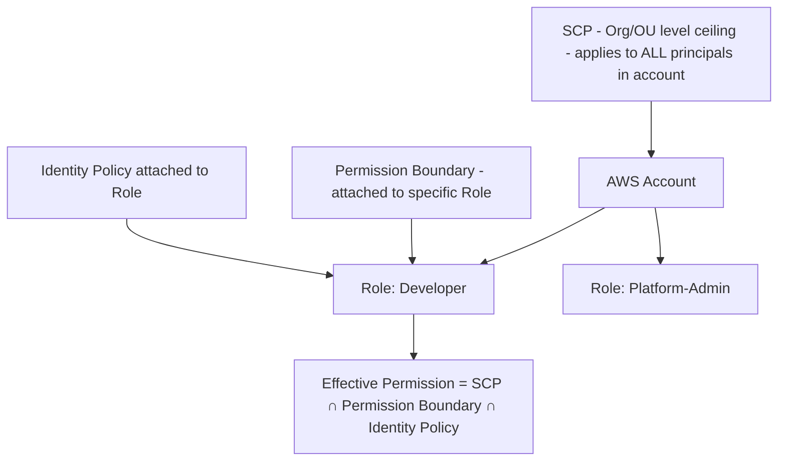

**Layered enforcement model (all three must agree to ALLOW):**

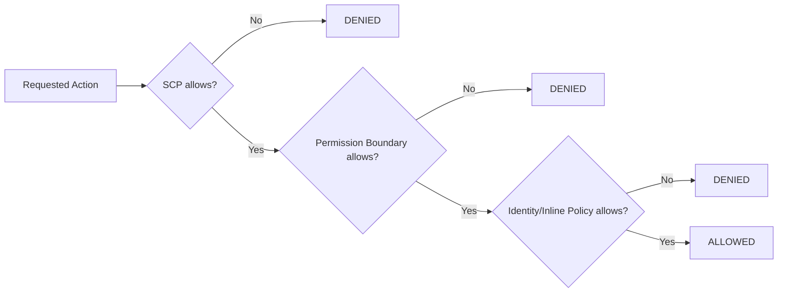

**Why use Permission Boundaries when you already have SCPs?**
- SCPs are managed centrally by the **Organization's Management account** — often too coarse and slow to change (needs central security team approval).
- Permission Boundaries let you **delegate** IAM administration safely: e.g., allow a team lead to create IAM roles for their squad, but cap those roles so they can never exceed `arn:aws:iam::policy/TeamDevBoundary` — even if the team lead attaches `AdministratorAccess` by mistake.

**Example Permission Boundary (cap for developer-created roles):**
```json
{
  "Version": "2012-10-17",
  "Statement": [
    {
      "Effect": "Allow",
      "Action": ["s3:*", "dynamodb:*", "lambda:*", "logs:*"],
      "Resource": "*"
    },
    {
      "Effect": "Deny",
      "Action": ["iam:*", "organizations:*", "kms:ScheduleKeyDeletion"],
      "Resource": "*"
    }
  ]
}
```

**Q: What happens when an SCP allows an action, but a Permission Boundary denies it?**

> The action is **DENIED**. Every layer (SCP, Permission Boundary, and the identity's own policy) is evaluated **independently**, and AWS uses "**most restrictive wins**" logic — think of it as a logical **AND** of three separate ALLOW gates, with an implicit deny if any is missing, and an **explicit Deny anywhere overriding everything**. An SCP granting broad access is meaningless if the Permission Boundary (or the identity policy) doesn't also explicitly allow it.

**Practical layered model used in enterprises:**

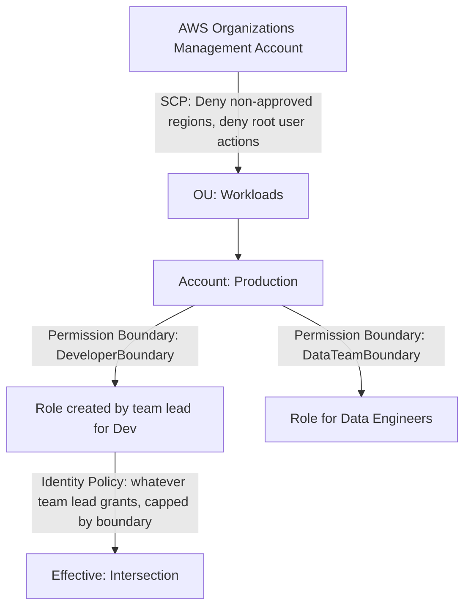

---

### 1.2 AWS KMS Multi-Region Keys — Under the Hood + Aurora Failover

**How Multi-Region Keys (MRK) work:**
- You create a **Primary Key** in Region A (e.g., `ap-south-1`) and **replicate** it to Region B (e.g., `ap-south-2`) as a **Replica Key**.
- Both keys share the **same Key ID material** and **same Key ID prefix** (`mrk-...`) but are **independent KMS resources** — each has its own key policy, grants, and can be independently disabled/rotated (rotation is *not* auto-synced by default unless you enable it centrally).
- Critically: **ciphertext encrypted under the Primary key can be decrypted using the Replica key**, because they share the same cryptographic key material. This is different from normal regional CMKs, where ciphertext is bound to a single region's key.

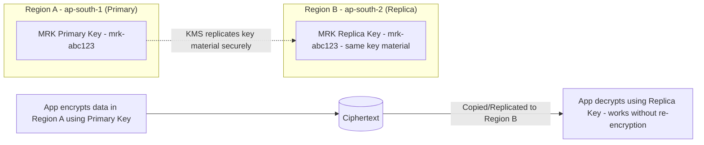

**Aurora PostgreSQL cross-region failover with KMS encryption:**

1. Aurora Global Database requires the **secondary region's cluster** to be encrypted with a **KMS key in that region** — you cannot use a Region A key to encrypt a Region B cluster directly.
2. Use a **Multi-Region KMS Key**: create the Primary MRK in the primary region, replicate to DR region, and specify the DR-region Replica Key when creating the Aurora Global Database secondary cluster.
3. On failover (planned or unplanned), the DR-region Aurora cluster is **already encrypted with its local replica key** — no waiting on cross-region KMS calls, no added latency, and no "cannot decrypt" failure because both keys were provisioned ahead of time.

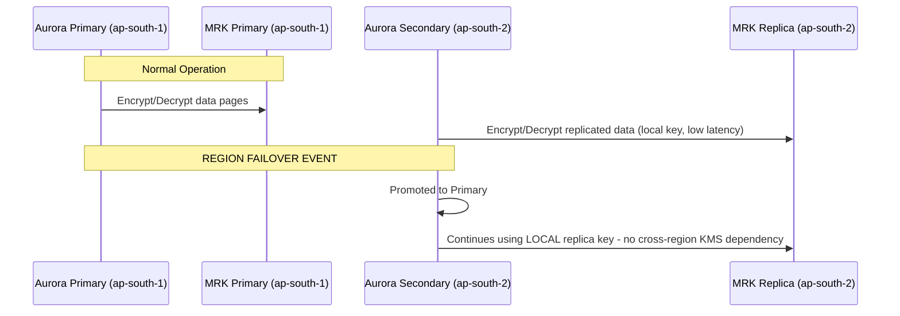

**Key gotcha:** If you had instead used a **regular single-region CMK** and just copied encrypted snapshots to another region, you'd need to **re-encrypt the snapshot with a key from the destination region** before restore — adding time and complexity to your DR runbook. Multi-Region Keys eliminate this step entirely, directly helping meet a tight RTO.

---

### 1.3 Session Policy vs Inline Policy vs Managed Policy in AssumeRole + Confused Deputy Problem

**Three policy types that interact during `sts:AssumeRole`:**

| Policy Type | Attached To | When it applies |
|---|---|---|
| **Managed Policy** (AWS or Customer) | The IAM Role itself (permanent) | Always, whenever the role is assumed |
| **Inline Policy** | Embedded directly in the Role (permanent, 1:1) | Always, whenever the role is assumed |
| **Session Policy** | Passed **at the moment of `AssumeRole` call** (temporary, exists only for that session) | Only for that specific assumed session |

**Effective permission during an assumed session:**
```
Effective = Role's (Managed + Inline Policies) ∩ Session Policy (if provided) ∩ any applicable SCP/Boundary
```

Session Policies can only **further restrict** — never expand — what the role's own permanent policies allow. This is how you build **dynamic, scoped-down access** at runtime, e.g., a broker application assuming a broad role but restricting each caller's session to only their own S3 prefix.

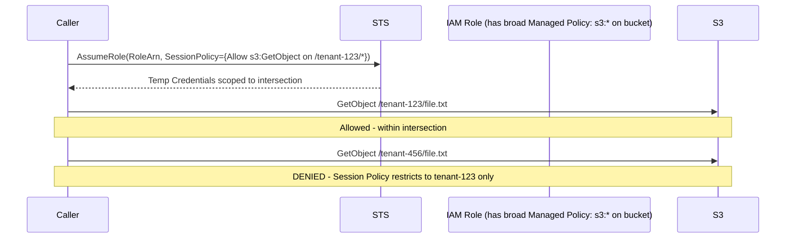

---

### The Confused Deputy Problem & External ID

**Problem:** A "deputy" (your AWS account/role) has permission to act on a resource, but a **third party tricks it** into misusing that permission on behalf of an attacker (e.g., a SaaS vendor's role, if compromised or reused by another customer, could access **your** resources by guessing/reusing a Role ARN meant for you).

**Solution: External ID** — a shared secret string that the third party MUST pass in every `AssumeRole` call, checked in your trust policy's `Condition`.

```json
{
  "Effect": "Allow",
  "Principal": { "AWS": "arn:aws:iam::VENDOR_ACCOUNT_ID:root" },
  "Action": "sts:AssumeRole",
  "Condition": {
    "StringEquals": { "sts:ExternalId": "customer-A-unique-secret-9f8e7d" }
  }
}
```

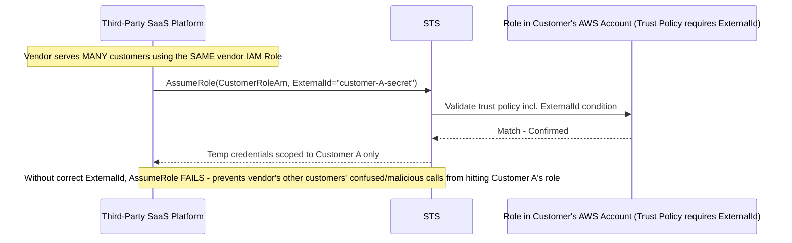

**Best practices to prevent Confused Deputy fully:**
1. Always require `sts:ExternalId` (unique per customer) in cross-account trust policies for third-party vendor access.
2. Use `aws:SourceArn` / `aws:SourceAccount` condition keys for service-to-service trust (e.g., S3 → Lambda invocation permissions) — AWS's own recommended mitigation for services like SNS/S3 invoking Lambda/roles.
3. Scope the role's permission policy to the **minimum resources** needed — never wildcard `Resource: "*"` for vendor-assumed roles.

---

### 1.4 Zero Trust Microservice-to-Microservice Traffic in EKS/ECS (mTLS via App Mesh)

**From scratch — Zero Trust principle:** Never trust traffic just because it's "inside the VPC." Every service must **authenticate and encrypt** every call, verifying identity cryptographically (mTLS), regardless of network location.

**AWS App Mesh** implements a **service mesh** using the **Envoy proxy** as a sidecar injected into every pod/task — all traffic between services is intercepted by Envoy, which handles mTLS transparently.

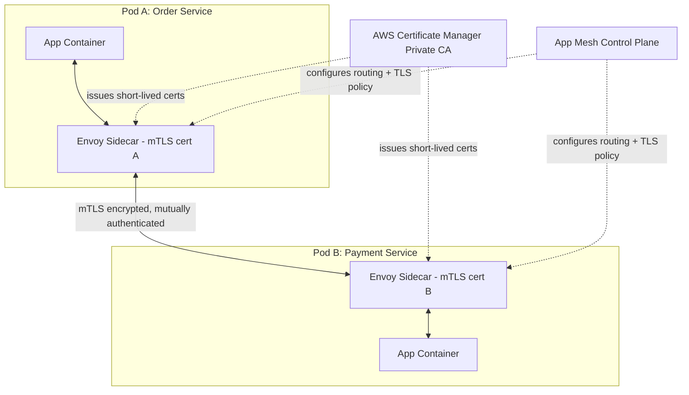

**How it's configured:**
1. Define a **Virtual Node** per microservice (its Envoy config) and a **Virtual Service** (the logical DNS name other services call).
2. Enable **TLS enforcement** in the Virtual Node spec, backed by **AWS Certificate Manager Private CA (ACM PCA)** issuing short-lived certificates automatically rotated to each Envoy sidecar.
3. Set a **Backend Default TLS Validation** so each Envoy only accepts connections presenting a cert signed by your Private CA — enforcing **mutual** authentication (both client and server prove identity).
4. Combine with **Kubernetes Network Policies** (Calico/Cilium on EKS) to enforce **which pods are even allowed to attempt** a connection (Layer 3/4 zero-trust segmentation), while App Mesh handles Layer 7 identity + encryption.

**PrivateLink alternative (when mesh is overkill):** For simpler cases — exposing one internal service to consumers across **VPC/account boundaries** — use **PrivateLink with an NLB**, so traffic never traverses the public internet and the consumer only sees a private ENI, without needing full mesh tooling. App Mesh is for **fine-grained intra-cluster** traffic control; PrivateLink is for **service exposure across network boundaries**.

| Requirement | Use |
|---|---|
| Fine-grained per-microservice mTLS, retries, circuit breaking, observability inside one cluster | **App Mesh** (or open-source Istio/Linkerd) |
| Expose ONE service securely to other VPCs/accounts, no mesh complexity needed | **PrivateLink** |
| Layer 3/4 pod-to-pod firewalling within EKS | **Kubernetes Network Policies (Cilium/Calico)** |

---

### 1.5 Scenario: Secrets in ECS Env Vars → Secrets Manager with Auto-Rotation, No Restart

**Problem:** Plaintext secrets in ECS Task Definition environment variables are visible in the Task Definition JSON (via console/API/CloudTrail) and in `ecs describe-tasks` output — a major audit failure.

**Re-architecture:**

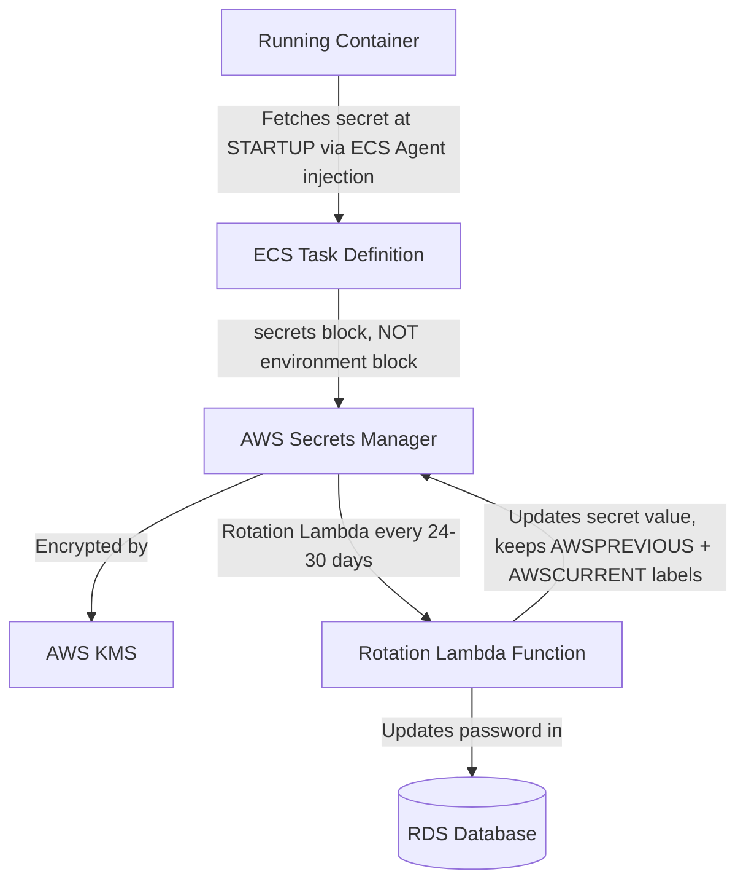

**Step 1 — Fix injection (no plaintext, no restart needed for the *initial* fetch):**
```json
"containerDefinitions": [{
  "name": "app",
  "secrets": [
    { "name": "DB_PASSWORD", "valueFrom": "arn:aws:secretsmanager:ap-south-1:123456789012:secret:prod/db-AbCdEf:password::" }
  ]
}]
```
The ECS Agent (not the app) resolves this at container **launch time** via the Task Execution Role, injecting it as an env var into the container process — never stored in the Task Definition itself.

**Step 2 — Handle rotation WITHOUT restarting containers:**

The challenge: Secrets Manager rotates the password on a schedule, but the already-running container has the **old value cached in its environment variables** (env vars are immutable once a process starts).

**Solution — avoid env-var caching, fetch live at connection time:**
1. **Application-level fix (best practice):** Instead of reading `DB_PASSWORD` once at startup, use the **AWS SDK + Secrets Manager caching client library** (`aws-secretsmanager-caching-java`, or equivalent for Python/Node) inside the app. This library calls `GetSecretValue` on each new DB connection (or on a TTL cache, e.g., 5 min), automatically picking up the rotated value **without a restart**.
2. **Database driver-level fix:** Use **RDS Proxy** in front of the database — RDS Proxy natively integrates with Secrets Manager and manages the credential rotation transparently at the connection-pooling layer; your application connects to the Proxy endpoint and never needs to know the password changed.
3. Enable **Secrets Manager native rotation** for RDS/Aurora (built-in rotation Lambda, no custom code needed):
```bash
aws secretsmanager rotate-secret \
  --secret-id prod/db \
  --rotation-lambda-arn arn:aws:lambda:ap-south-1:123456789012:function:SecretsManagerRDSRotation \
  --rotation-rules AutomaticallyAfterDays=30
```

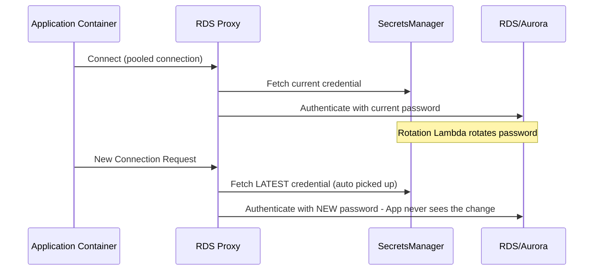

**Result:** Zero application restarts, zero downtime, fully automated rotation, and no secrets ever visible in Task Definitions, logs, or CloudTrail.

---

### 1.6 Preventing & Remediating S3 Data Exfiltration

**Threat model:** A compromised EC2 role or insider copies sensitive S3 data to an **external/public S3 bucket** (possibly in another AWS account) or downloads it over the public internet.

**Defense-in-depth layers:**

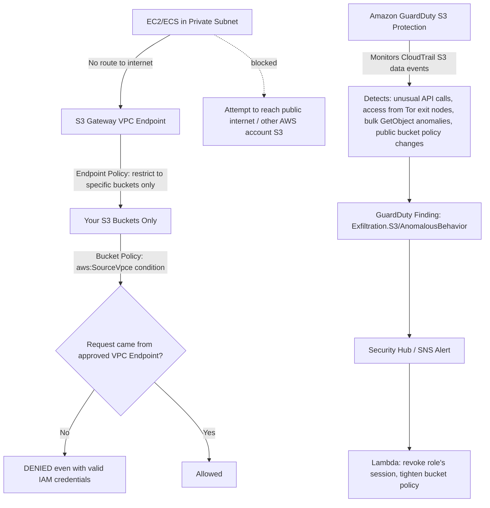

**1. S3 Bucket Policy — restrict access to only your VPC Endpoint:**
```json
{
  "Effect": "Deny",
  "Principal": "*",
  "Action": "s3:*",
  "Resource": ["arn:aws:s3:::sensitive-bucket", "arn:aws:s3:::sensitive-bucket/*"],
  "Condition": {
    "StringNotEquals": { "aws:SourceVpce": "vpce-0abc123456" }
  }
}
```
This means even if an attacker steals valid IAM credentials, they **cannot** access the bucket from outside your VPC (e.g., from their laptop over the internet) — the request must physically originate from traffic routed through your specific VPC Endpoint.

**2. VPC Endpoint Policy — restrict which buckets the VPC can even reach:**
```json
{
  "Statement": [{
    "Effect": "Allow",
    "Principal": "*",
    "Action": "s3:*",
    "Resource": ["arn:aws:s3:::approved-bucket-1/*", "arn:aws:s3:::approved-bucket-2/*"]
  }]
}
```
This prevents an insider from using your VPC's legitimate S3 access to exfiltrate data to **their own personal S3 bucket** in another account — the endpoint itself won't route to unapproved bucket ARNs.

**3. GuardDuty S3 Protection** — analyzes S3 **data event** CloudTrail logs (object-level API calls) using ML to detect:
- Unusual `GetObject` volume/pattern (bulk download anomaly).
- API calls from suspicious IPs / Tor exit nodes / known malicious IP lists.
- Bucket policy or ACL changes that suddenly make a bucket public.
- Credential usage anomalies (e.g., access from a geography never seen before for this role).

**4. Additional controls:**
- **S3 Block Public Access** at the account and bucket level (prevents accidental/malicious public exposure).
- **SCP** denying `s3:PutBucketPolicy` / `s3:PutBucketAcl` for anyone except a dedicated security-admin role.
- **AWS Macie** to continuously scan for sensitive data (PII, credit cards) and flag if such data exists in a bucket that isn't properly locked down.

---

### 1.7 AWS Resource Access Manager (RAM) — Sharing Across 50+ Accounts

**From scratch:** RAM lets you share AWS resources you own with other AWS accounts (or your entire AWS Organization) **without duplicating the resource** — the consuming account gets to *use* it, but doesn't own it.

**Commonly shared resources:** Transit Gateways, Subnets, Route 53 Resolver Rules, License Manager configurations, ACM Private CA.

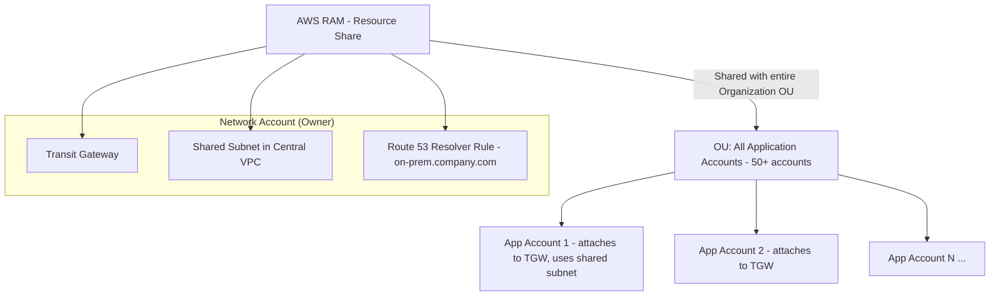

**Enterprise pattern — Hub-and-Spoke with RAM:**
1. A dedicated **Network Account** owns the Transit Gateway, core shared subnets, and Resolver Rules.
2. Using **RAM**, share the TGW with the entire **AWS Organization** (or specific OUs) — enable **"Share with AWS Organizations"** to auto-propagate to new accounts as they're created, no manual per-account invite needed.
3. Each of the 50+ application accounts then creates a **VPC attachment** to the shared TGW from their own VPC — they don't need to own or manage the TGW itself.
4. **Shared Subnets** ("VPC Sharing"): The Network Account can even share **specific subnets** of a centrally-managed VPC directly into other accounts — those accounts launch EC2/RDS/Lambda **directly into the shared subnet**, simplifying IP management and reducing the number of VPCs (and peering connections) needed enterprise-wide.
5. **Resolver Rule sharing**: Centralize the on-prem DNS forwarding rule once, share via RAM, so every spoke account automatically resolves `*.company.internal` on-prem records without configuring their own Resolver endpoints.

**Why RAM matters at 50+ account scale:** Without RAM, you'd need to duplicate resources per account (unmanageable) or set up 50+ individual VPC peering/DX Gateway associations (operationally heavy). RAM + Organizations integration = **share once, auto-propagate to all current and future accounts**, governed centrally.

---

## 2. Advanced Networking, VPC & Hybrid Connectivity

### 2.1 Hybrid Topology: Bengaluru On-Prem ↔ AWS Mumbai (ap-south-1) with DX + VPN Backup

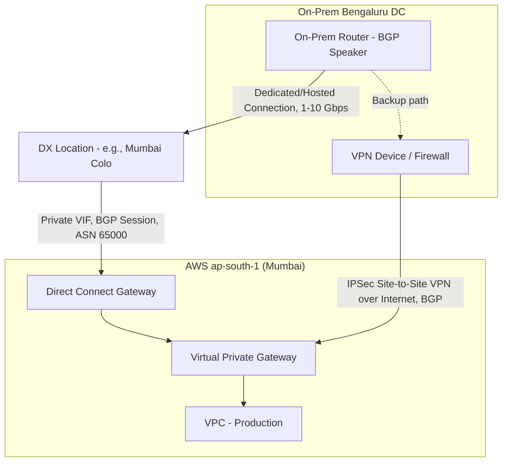

**BGP Failover & Route Prioritization:**

Both DX and VPN establish **BGP sessions** advertising the same on-prem routes to the VPC. By default, AWS prefers **Direct Connect over VPN** automatically because BGP prefers routes with a **shorter AS-PATH** and DX typically has a more direct path — but you must engineer this explicitly for reliable failover:

1. **AS-PATH Prepending**: On the VPN connection's BGP advertisement, prepend your own ASN multiple times (e.g., repeat it 3x) to artificially lengthen the AS-PATH for the VPN route, making DX the mathematically preferred path under normal conditions.
```
# On-prem router VPN BGP config (prepend to make route "longer"/less preferred)
route-map PREPEND-VPN permit 10
 set as-path prepend 65000 65000 65000
```
2. **Local Preference**: Within AWS, for routes learned via DX vs VPN into the same VPC, set a **higher Local Preference** on the DX-learned routes (higher = more preferred in BGP path selection) via the DX Gateway/VGW route preference settings.
3. **BFD (Bidirectional Forwarding Detection)**: Enable BFD on the DX BGP session for **sub-second failure detection** (vs BGP's default ~90 sec hold-timer) — critical for a fast automatic failover to VPN when DX physically drops.

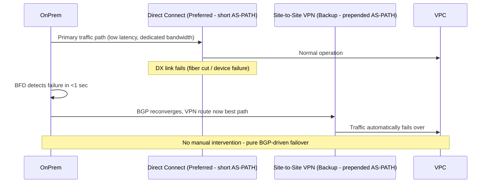

4. For **active-active** rather than pure backup, use **ECMP (Equal-Cost Multi-Path)** across two DX connections (from different DX locations/devices) for redundancy at the same priority level, with VPN strictly as tertiary backup.
5. Use a **Direct Connect Gateway** (not just a VGW directly) if you need this single DX connection to reach **multiple VPCs across regions** — DX Gateway is global and can attach to VGWs/TGWs in many regions.

---

### 2.2 Overlapping CIDR Blocks After Company Acquisition

**Problem:** Both companies use `10.0.0.0/16`. VPC Peering and standard TGW attachments **require non-overlapping CIDRs** — they will simply reject the configuration.

**Solutions (in order of preference):**

**Option A — AWS PrivateLink (Best for specific service-to-service needs, no re-IP needed):**
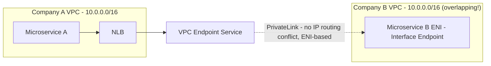
PrivateLink works regardless of overlapping CIDRs because it doesn't route based on the consumer's IP space — it creates an ENI *inside* the consumer's VPC using the consumer's own IP, connecting privately to the provider's NLB. **No peering, no route tables involved, no CIDR conflict possible.**

**Option B — Transit Gateway with NAT for overlapping ranges (if many-to-many connectivity needed, not just point services):**
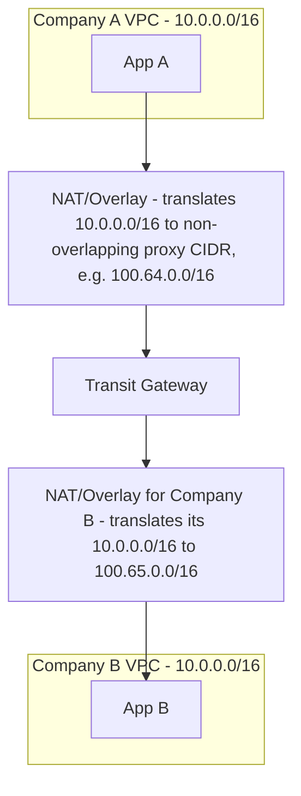
Since TGW **cannot** route overlapping CIDRs directly, insert a **NAT layer** (e.g., a fleet of NAT instances/appliances doing 1:1 static NAT, or a purpose-built overlay like **PrivateLink combined with TGW**) to translate each VPC's real CIDR into a **non-overlapping proxy CIDR** for cross-VPC communication.

**Option C — Re-IP one VPC (cleanest long-term, but disruptive):** Migrate one company's VPC to a fresh non-overlapping CIDR (e.g., `10.100.0.0/16`) using tools like **VPC IP Address Manager (IPAM)** to plan clean allocation. This is the recommended **end-state** for a true merger, but too disruptive for immediate post-acquisition connectivity — hence PrivateLink/NAT overlay is used as an interim/permanent bridge for specific service integrations.

**Decision guide:**
| Need | Solution |
|---|---|
| A handful of specific services need to talk cross-company | **PrivateLink** (fastest, no re-IP, minimal blast radius) |
| Full network-level, many-to-many connectivity required | **TGW + NAT overlay**, or eventual **re-IP** |
| Long-term unified network architecture | **Re-IP via IPAM**, phased migration |

---

### 2.3 Transit Gateway Appliance Mode — Solving Asymmetric Routing

**Problem without Appliance Mode:** When routing traffic through a central VPC of firewall appliances (Palo Alto/Fortinet) attached to TGW, TGW by default load-balances flows across **all Availability Zone associations** based on 5-tuple hashing **per-packet-direction**, independently for each direction. This can cause the **request** to go through Firewall Instance in AZ-A, but the **response** to route back through Firewall Instance in AZ-B — since stateful firewalls track connection state per-instance, the return packet arrives at a firewall that never saw the outbound request, and it **drops the packet** (asymmetric routing failure).

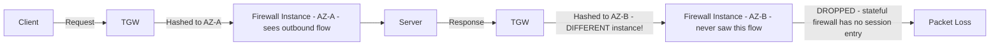

**Solution: Enable Appliance Mode on the TGW VPC attachment.**

With **Appliance Mode enabled**, TGW ensures **flow stickiness** — all packets for a given flow (in **both directions**) are consistently routed to the **same Availability Zone / same appliance instance** for the life of that flow, based on 5-tuple hash pinned to a single AZ.

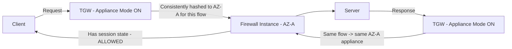

**Configuration:**
```bash
aws ec2 modify-transit-gateway-vpc-attachment \
  --transit-gateway-attachment-id tgw-attach-0123456789 \
  --options ApplianceModeSupport=enable
```

**Design implication:** Appliance Mode should be enabled on the **TGW attachment to the Firewall/Inspection VPC** (the "central" VPC hosting the Palo Alto/Fortinet cluster), ensuring symmetric routing for all inspected traffic — a mandatory setting for any **centralized traffic inspection architecture** (hub-spoke with a security VPC) on AWS.

---

### 2.4 Global Accelerator vs CloudFront for Real-Time Trading (non-HTTP/TCP)

| Feature | CloudFront | Global Accelerator |
|---|---|---|
| Layer | Layer 7 (HTTP/HTTPS caching CDN) | Layer 3/4 (TCP/UDP, IP-based) |
| Protocol support | HTTP/HTTPS/WebSocket only | **Any TCP/UDP protocol** — including FIX protocol, custom binary trading protocols, gaming UDP |
| Static IPs | No (uses shared edge IPs, changes) | **Yes — 2 static Anycast IPs**, never change |
| Routing mechanism | Content caching at edge | **Anycast routing** — routes into the AWS global network backbone at the **nearest edge**, then travels over AWS's private backbone (not public internet) to origin |
| Caching | Yes (content cache) | No caching — pure network path optimization |
| Best for | Static/dynamic web content, video, APIs | Low-latency **non-HTTP TCP/UDP** traffic: trading platforms, VoIP, gaming, IoT telemetry |

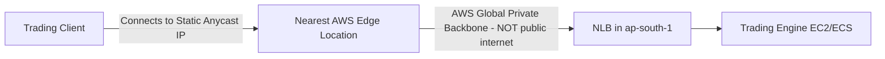

**Why Global Accelerator wins for real-time trading:**
1. **Static IP requirement**: Trading counterparties often **whitelist specific IPs** for FIX protocol connections — CloudFront's edge IPs are shared and dynamic, unusable for this. Global Accelerator gives you **2 fixed Anycast IPs** for the life of the accelerator.
2. **Lower, more consistent latency**: Traffic enters the AWS backbone at the nearest edge and travels over AWS's **private, low-jitter backbone network** instead of the public internet — critical for trading systems sensitive to latency variance (jitter), not just average latency.
3. **Non-HTTP protocol support**: Trading systems typically use **FIX protocol over TCP** or custom binary UDP protocols — CloudFront literally cannot proxy this (HTTP/HTTPS/WebSocket only). Global Accelerator works at the TCP/UDP level, protocol-agnostic.
4. **Instant regional failover**: Global Accelerator continuously health-checks origins in multiple regions and can **shift traffic to a healthy region within seconds** using the same static IP — no DNS propagation delay (unlike Route 53 failover, which is subject to DNS TTL caching).

---

### 2.5 VPC Lattice vs PrivateLink

**VPC Lattice** (newer service) is an **application networking service** that manages service-to-service connectivity, security, and observability **across VPCs and accounts** — without needing to manage the underlying networking (ENIs, route tables, peering) at all.

| Feature | PrivateLink | VPC Lattice |
|---|---|---|
| Abstraction level | Network layer (ENI-based private connectivity to a specific NLB/service) | **Application layer** — service directory, native HTTP/HTTPS/gRPC routing, weighted target groups |
| Setup complexity | Per-service: create Endpoint Service + NLB + Endpoint | Register services once into a **Service Network**; auth/routing managed centrally |
| Built-in Auth | No (must build your own at app layer) | **Yes** — native IAM-based auth per request (SigV4), fine-grained access policies per service |
| Cross-account | Yes | Yes, natively multi-account via **Service Network** shared through RAM |
| Best for | Simple 1:1 exposing of a TCP/HTTP service | Enterprise-wide **service mesh across account boundaries** with centralized policy |

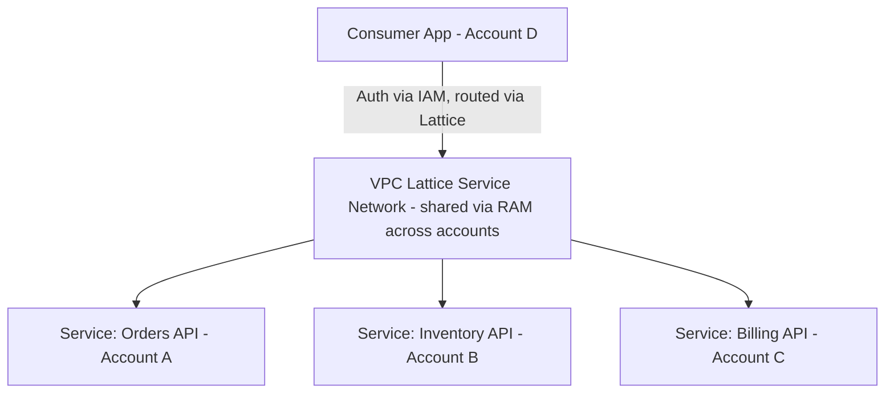

**When to use PrivateLink over VPC Lattice/TGW for B2B SaaS:**
- You are a **SaaS vendor** exposing exactly **one well-defined service endpoint** (e.g., an API) to many customer accounts, and want the **simplest, most battle-tested, widely-supported** mechanism → **PrivateLink**. It's the industry-standard pattern for B2B SaaS (used by Snowflake, Datadog, etc.) precisely because it requires zero networking knowledge from the customer (no route tables, no CIDR planning) — just "create an Interface Endpoint."
- If you're building an **internal, multi-team, multi-account platform** with many services calling many other services and want centralized access policy + built-in auth → **VPC Lattice**.
- If you need **full network-layer reachability** (not just specific services) between many VPCs, e.g., for VDI, shared infrastructure, monitoring agents → **Transit Gateway**.

---

### 2.6 Scenario: ALB (Public) → EC2 (Private) → External Payment Gateway — Full Traffic Path

```mermaid
graph TB
    Client((Internet Client)) --> IGW[Internet Gateway]
    IGW --> ALBNacl[Public Subnet NACL]
    ALBNacl --> ALB[ALB - Public Subnet]
    ALB --> ALBSG[ALB Security Group - allow 443 inbound]
    ALBSG --> AppNacl[Private Subnet NACL]
    AppNacl --> EC2SG[EC2 Security Group - allow from ALB SG only]
    EC2SG --> EC2[EC2 Instance - Private Subnet]
    EC2 --> PrivRouteTable[Private Route Table - 0.0.0.0/0 -> NAT GW]
    PrivRouteTable --> NATGW[NAT Gateway - Public Subnet]
    NATGW --> NATNacl[Public Subnet NACL - outbound]
    NATNacl --> IGW2[Internet Gateway]
    IGW2 --> PaymentGateway((External Payment Gateway))
```

**Exact hop-by-hop path:**

1. **Client → IGW**: Public internet request arrives at the Internet Gateway.
2. **IGW → Public Subnet NACL**: Evaluated (stateless — must allow inbound 443 AND outbound ephemeral ports).
3. **NACL → ALB**: ALB accepts on its Security Group (must allow inbound 443/80 from `0.0.0.0/0` or restricted CIDR).
4. **ALB → Private Subnet NACL**: Traffic to the target EC2 crosses into the private subnet — private subnet NACL must allow inbound from the ALB's subnet CIDR range (not just "ALB" — NACLs don't understand SG references, only IP/CIDR).
5. **NACL → EC2 Security Group**: EC2's SG should allow inbound **only from the ALB's Security Group** (SG-to-SG reference — this is the correctly scoped, least-privilege rule) on the app port (e.g., 8080).
6. **EC2 processes request → needs to call external Payment Gateway**: EC2 has **no public IP** (private subnet), so it uses its route table's `0.0.0.0/0 → NAT Gateway` route.
7. **EC2 → NAT Gateway**: Traffic first re-checked against the **private subnet's outbound NACL rule** (must allow outbound 443).
8. **NAT Gateway (in public subnet) → Public Subnet NACL**: Must allow outbound 443 to the internet, AND inbound on ephemeral ports for the *return* traffic (since NAT terminates/re-originates the connection with its own IP).
9. **NAT Gateway → IGW → Payment Gateway**: NAT performs SNAT (source IP replaced with NAT's Elastic IP), request reaches the external payment gateway over the internet.
10. **Response path**: Reverses through NAT Gateway (which remembers the translation - it's stateful) → EC2 → ALB → Client.

**Where packet drops commonly occur (troubleshooting checklist):**

| # | Failure Point | Symptom |
|---|---|---|
| 1 | Private subnet NACL missing outbound rule for ephemeral ports/443 | EC2 → payment gateway calls time out |
| 2 | Public subnet NACL (where NAT lives) missing inbound rule for ephemeral ports | NAT can't return response to EC2 — response silently dropped |
| 3 | EC2 Security Group doesn't allow outbound (rare, default allows all, but often over-restricted in "secure" configs) | Outbound calls blocked at instance level |
| 4 | Private route table missing `0.0.0.0/0 → NAT Gateway` route | EC2 has literally no path to the internet at all |
| 5 | NAT Gateway placed in the **wrong AZ** relative to EC2 (cross-AZ NAT works but adds latency + cross-AZ data charges, and breaks if that AZ's NAT GW fails without redundancy) | Intermittent failures during AZ issues |
| 6 | ALB → EC2 SG rule references CIDR instead of ALB's Security Group ID | Works initially, breaks when ALB scales/changes IPs; also less secure |
| 7 | Payment gateway whitelists specific IPs but NAT Gateway EIP wasn't shared with them | Connection refused/blocked at the payment gateway's firewall, not AWS side |

---

### 2.7 Route 53 Resolver Endpoints — Hybrid DNS (On-Prem AD ↔ Private Hosted Zones)

**From scratch:** By default, a VPC's private DNS (Route 53 Resolver, at `169.254.169.253` / `.2` address) can only resolve records within its own VPC/Private Hosted Zones, and cannot resolve on-prem Active Directory domain names. Conversely, on-prem clients cannot resolve AWS `.internal` Private Hosted Zone records. **Resolver Endpoints** bridge this gap.

```mermaid
graph TB
    subgraph "On-Premises Bengaluru DC"
        AD[Active Directory DNS Server - corp.local]
        OnPremClient[On-Prem Client]
    end
    subgraph "AWS VPC - ap-south-1"
        InboundEP[Route 53 Resolver - INBOUND Endpoint]
        OutboundEP[Route 53 Resolver - OUTBOUND Endpoint]
        PHZ[Private Hosted Zone - app.internal]
        EC2App[EC2/ECS App]
    end
    OnPremClient -->|Query: db.app.internal| AD
    AD -->|Conditional Forwarder: app.internal -> AWS Inbound EP IP| InboundEP
    InboundEP --> PHZ
    PHZ -->|Answer| AD --> OnPremClient

    EC2App -->|Query: server1.corp.local| VPCResolver[VPC Resolver .2]
    VPCResolver -->|Resolver Rule: corp.local -> forward via Outbound EP| OutboundEP
    OutboundEP -->|Via DX/VPN| AD
    AD -->|Answer| OutboundEP --> EC2App
```

**Configuration steps:**

1. **Inbound Endpoint** (on-prem → AWS direction): Create a Resolver **Inbound Endpoint** in your VPC with ENIs in 2+ AZs, each getting a private IP. On your **on-prem AD DNS server**, configure a **conditional forwarder** for your Route 53 Private Hosted Zone domain (e.g., `app.internal`) pointing to these Inbound Endpoint IPs. Now on-prem clients/AD-joined machines can resolve AWS private DNS names.

2. **Outbound Endpoint** (AWS → on-prem direction): Create a Resolver **Outbound Endpoint**, then define a **Resolver Rule** (`FORWARD` type) for your on-prem domain (e.g., `corp.local`) that targets your **on-prem AD DNS server IPs** (reachable via Direct Connect/VPN). Associate this rule with your VPC(s). Now EC2/ECS/Lambda-in-VPC can resolve on-prem AD hostnames.

3. **Share Resolver Rules via RAM** (ties back to section 1.7) so all 50+ spoke accounts automatically get the `corp.local` forwarding rule without each having to build their own Outbound Endpoint.

**Security group requirement:** Both endpoints need an SG allowing **UDP/TCP port 53** from the relevant CIDR ranges (on-prem CIDR for Inbound; VPC CIDR for Outbound).

---

## 3. Resilient Architecture & High Availability (HA/DR)

### 3.1 Active-Active Multi-Region DR for Fintech: DynamoDB Global Tables vs Aurora Global Database

```mermaid
graph TB
    subgraph "Region A - ap-south-1"
        App1[App Tier]
        DDBTable1[DynamoDB Global Table - Replica 1]
        AuroraA[Aurora Writer - Region A]
    end
    subgraph "Region B - ap-south-2"
        App2[App Tier]
        DDBTable2[DynamoDB Global Table - Replica 2]
        AuroraB[Aurora Writer - Region B, requires Aurora Global DB write forwarding OR promoted secondary]
    end
    App1 <-->|Read/Write locally| DDBTable1
    App2 <-->|Read/Write locally| DDBTable2
    DDBTable1 <-->|Multi-Master, ~1 sec async replication, Last-Writer-Wins conflict resolution| DDBTable2
    AuroraA -->|Async replication ~<1 sec typical| AuroraB
    App2 -.Writes forwarded to Region A OR require failover promotion.-> AuroraA
```

| Factor | DynamoDB Global Tables | Aurora Global Database |
|---|---|---|
| Write model | **Multi-Master** — write to ANY region, true active-active | **Single-Writer** — one primary region writes; secondary regions are read-only (unless using "Write Forwarding" for MySQL, which forwards writes to primary transparently) |
| RPO | Near-zero for non-conflicting writes; conflict resolution is **Last-Writer-Wins** (based on timestamp) — potential silent data loss on conflicting concurrent writes to the same item | Typically <1 second lag; RPO ~seconds since it's physical log-based replication |
| RTO | **Zero** for reads/writes (already active-active, no failover needed) | Managed failover promotes secondary to primary in **~1 minute** (unplanned) |
| Consistency | Eventually consistent across regions (strongly consistent only within a single region) | Strongly consistent within primary; secondary reads are eventually consistent |
| Best for | True active-active apps that can tolerate eventual consistency + conflict resolution (session data, catalogs, user profiles, shopping carts) | Relational/transactional workloads (ledger, transaction tables) needing ACID **within a region**, with fast regional failover, not simultaneous multi-region writes |

**Recommended fintech architecture (hybrid):**
- Use **DynamoDB Global Tables** for **idempotent, conflict-tolerant** data: user sessions, feature flags, fraud-scoring cache, read-heavy reference data — true active-active, zero RTO.
- Use **Aurora Global Database** for the **core ledger/transactional** data requiring strict ACID consistency — accept that only ONE region can be the authoritative writer at a time, but achieve **RPO < 1 sec, RTO ~1 min** via Managed Planned Failover (or faster with automation for unplanned).
- For "active-active" transactional writes across regions (rare and hard), consider a **cell-based architecture with regional data sharding** (e.g., customers in North India write to `ap-south-1`, customers in South India write to `ap-south-2`, each region authoritative for its own shard) rather than trying to make Aurora itself multi-master — this avoids distributed-transaction complexity entirely.

```mermaid
sequenceDiagram
    participant RegionA as Aurora Global DB - Primary (ap-south-1)
    participant RegionB as Aurora Global DB - Secondary (ap-south-2)
    Note over RegionA,RegionB: Normal: RegionA is writer, RegionB read-only replica, lag <1s
    Note over RegionA: ap-south-1 outage detected
    RegionB->>RegionB: Managed/Unplanned Failover - promote to Writer
    Note over RegionB: RTO ~1 min for unplanned failover
    RegionA->>RegionA: Once recovered, demoted to replica, resyncs from new primary
```

---

### 3.2 Scenario: EKS AZ Outage — Stateful Pods Stuck to EBS in Dead AZ

**Problem:** EBS volumes are **AZ-locked** — an EBS-backed PersistentVolume created in `ap-south-1a` **cannot** be attached to a node in `ap-south-1b`. If `ap-south-1a` degrades, the Kubernetes scheduler/Cluster Autoscaler tries to reschedule the pod onto healthy nodes in other AZs, but the **PVC/PV binding forces it back onto an AZ-a node** that may not exist/be healthy → pod stuck in `Pending`.

```mermaid
flowchart TD
    Problem[AZ-1a degraded] --> Pod[StatefulSet Pod tries reschedule]
    Pod --> PVC[PVC bound to EBS PV in AZ-1a]
    PVC --> Stuck[Scheduler CANNOT place pod in AZ-1b/1c - EBS not attachable cross-AZ]
    Stuck --> Pending[Pod stuck Pending indefinitely]
```

**Solutions:**

1. **Immediate mitigation — Topology-aware storage with multiple replicas across AZs:** Use a **replicated storage layer** instead of raw single-AZ EBS for stateful workloads: **Amazon EFS** (multi-AZ by nature) or **Amazon FSx**, or application-level replication (e.g., a database that replicates across AZs like a StatefulSet running Postgres with **Patroni** for automated multi-AZ failover, or better — **use RDS/Aurora instead of self-hosting the DB in-cluster**).

2. **Use EBS CSI Driver with `WaitForFirstConsumer` + Multi-AZ node groups + Volume topology awareness**, but recognize this only helps with **initial scheduling**, not surviving an AZ that's already degraded — the fundamental fix is to **not pin stateful data to a single AZ's EBS** for HA-critical workloads.

3. **Karpenter/Cluster Autoscaler configuration**: Ensure node groups span **at least 3 AZs**, and use **Pod Topology Spread Constraints** to prevent all replicas of a StatefulSet from landing in one AZ in the first place (proactive prevention):
```yaml
topologySpreadConstraints:
  - maxSkew: 1
    topologyKey: topology.kubernetes.io/zone
    whenUnsatisfiable: DoNotSchedule
    labelSelector:
      matchLabels:
        app: my-stateful-app
```

4. **For true resilience, externalize state**: Move databases OUT of EKS entirely onto **RDS Multi-AZ / Aurora** (which handles AZ failover natively in ~30-60 sec, transparent to the app), and keep EKS pods **stateless**, connecting to the externalized DB. This is the AWS-recommended pattern — **Kubernetes is excellent at compute orchestration, but AZ-aware stateful failover is a solved problem in managed AWS data services; don't reinvent it inside EKS.**

5. **Immediate incident response** (if already stuck): Manually **cordon** the affected AZ's nodes, **delete the stuck Pending pod's PVC binding** (if data loss is acceptable / restore from snapshot), and let it reschedule with a **freshly provisioned EBS volume in a healthy AZ**, restoring data from the latest **EBS Snapshot** or application-level backup.

```mermaid
graph LR
    Recommended[Recommended End State] --> Stateless[EKS Pods: Stateless, any AZ]
    Recommended --> ExternalDB[Database: RDS Multi-AZ / Aurora - handles AZ failover natively]
    Recommended --> SharedFS[Shared File needs: EFS - inherently Multi-AZ]
    Recommended --> Spread[Topology Spread Constraints across 3+ AZs for redundant replicas]
```

---

### 3.3 Cellular Architecture — Limiting Blast Radius for Large SaaS

**From scratch:** A **Cell** is a fully self-contained, independent deployment unit (its own compute, database, queues) serving a **subset** of customers/traffic. Instead of one giant shared infrastructure serving all customers, you partition into N cells — a failure in Cell 3 **only** affects the customers routed to Cell 3.

```mermaid
graph TB
    Router[Cell Router / Routing Layer - maps CustomerID -> Cell] --> Cell1
    Router --> Cell2
    Router --> Cell3
    Router --> CellN

    subgraph Cell1 [Cell 1 - Customers A-F]
        ALB1[ALB] --> App1[App Tier] --> DB1[(Isolated DB Shard)]
    end
    subgraph Cell2 [Cell 2 - Customers G-M]
        ALB2[ALB] --> App2[App Tier] --> DB2[(Isolated DB Shard)]
    end
    subgraph Cell3 [Cell 3 - Customers N-S - EXPERIENCING ISSUE]
        ALB3[ALB] --> App3[App Tier - degraded] --> DB3[(Isolated DB Shard)]
    end

    Cell3 -.Blast radius CONTAINED - only these customers impacted.-> Impact[Limited Impact Zone]
    Cell1 -.Unaffected.-> Healthy1[Healthy]
    Cell2 -.Unaffected.-> Healthy2[Healthy]
```

**Key design components:**
1. **Cell Router (Thin routing layer)**: A lightweight, extremely reliable component (often just DynamoDB Global Table + Lambda@Edge/CloudFront Function) that maps a `CustomerID`/`TenantID` to their assigned Cell. This router itself must be simpler and more reliable than the cells it routes to (avoid making the router the new single point of failure).
2. **Full stack duplication per cell**: Each cell has its own ALB, compute (ASG/EKS namespace/ECS cluster), and **database shard** — no shared state between cells. A bad deployment, a noisy-neighbor query, a memory leak, or a regional dependency failure impacts **only that cell's customers**.
3. **Independent deployment per cell**: Roll out new app versions **cell-by-cell** (canary at the cell level) — if Cell 1's deployment has a bug, halt before it reaches Cell 2-N.
4. **Sizing cells appropriately**: Common approach — size cells so that the **worst-case blast radius** (e.g., "at most 5% of customers affected by any single failure") meets your SLA commitments. AWS itself uses this pattern internally (e.g., S3, Lambda are built from cells).
5. **Cross-cell shared services** (auth, billing) should either be **replicated per-cell** too, or made extremely highly available (multi-AZ/multi-region) since they ARE a shared dependency across all cells — this is often the hardest part of a cellular design.

**Benefits:** Bounded blast radius, easier capacity planning (cells are cookie-cutter, so scaling = adding more cells, not resizing one giant system), simpler incident response (identify + fail over/isolate one cell), enables **noisy-neighbor isolation** for multi-tenant SaaS (put your biggest/most demanding customers in their own dedicated cell).

---

### 3.4 Zero-Downtime Migration: On-Prem Oracle → Aurora PostgreSQL (DMS + SCT)

```mermaid
graph TB
    OracleOnPrem[(On-Prem Oracle DB)]
    SCT[AWS Schema Conversion Tool - SCT]
    SCT -->|Converts schema: tables, stored procs, PL/SQL -> PL/pgSQL| SchemaReport[Conversion Assessment Report + Converted Schema]
    SchemaReport -->|Apply converted schema| AuroraPG[(Aurora PostgreSQL - empty schema)]
    OracleOnPrem -->|Full Load - bulk copy existing data| DMS[AWS DMS Replication Instance]
    DMS -->|Loads historical data| AuroraPG
    OracleOnPrem -->|CDC - Change Data Capture, ongoing changes via redo logs| DMS
    DMS -->|Continuously applies new changes| AuroraPG
    AppOld[Application - currently pointing to Oracle] -.cutover.-> AppNew[Application - repointed to Aurora]
```

**Step-by-step process:**

1. **Assessment Phase (SCT):** Run **AWS Schema Conversion Tool** against the Oracle database. SCT analyzes schema objects (tables, views, stored procedures, triggers, PL/SQL) and generates an **Assessment Report** categorizing objects as: automatically convertible, convertible with minor edits, or requiring manual rewrite (common for complex Oracle-specific features like `CONNECT BY`, Oracle packages, sequences with custom logic).

2. **Schema Conversion:** SCT converts Oracle DDL/PL-SQL to PostgreSQL DDL/PL-pgSQL automatically where possible. Manually rewrite the flagged incompatible objects (this is usually the **most time-consuming** part of an Oracle→PostgreSQL migration — budget significant time here).

3. **Apply converted schema to Aurora PostgreSQL** (target is empty, no data yet, indexes/constraints may be initially disabled for faster bulk load).

4. **Full Load with AWS DMS:** Provision a **DMS Replication Instance**, configure Source Endpoint (Oracle) and Target Endpoint (Aurora PostgreSQL). Run a **Full Load task** to bulk-copy all existing historical data — Oracle keeps serving production traffic uninterrupted during this phase.

5. **CDC (Change Data Capture) — the key to zero downtime:** Configure DMS for **"Full Load + CDC"** mode. After the full load completes, DMS reads Oracle's **redo logs** (via Oracle LogMiner or binary reader) and **continuously streams every INSERT/UPDATE/DELETE** happening on Oracle in near-real-time into Aurora — keeping both databases in sync while the app is STILL live on Oracle.

6. **Validation:** Use **DMS Data Validation** feature (built-in row-by-row comparison) to confirm Aurora data matches Oracle exactly, continuously, throughout the CDC phase.

7. **Cutover window (minutes, not hours):** Once CDC lag is near-zero and validated:
   - Briefly pause writes to Oracle (short maintenance window, seconds to a few minutes).
   - Let DMS drain the final remaining CDC changes (catch up to zero lag).
   - Repoint application connection strings (ideally via a DNS/config change, ex: Route 53 record or Secrets Manager secret update) to Aurora.
   - Resume traffic — now flowing to Aurora.

```mermaid
sequenceDiagram
    participant Oracle
    participant DMS
    participant Aurora
    participant App
    App->>Oracle: Live traffic (Phase 1)
    DMS->>Oracle: Full Load (historical data)
    DMS->>Aurora: Bulk insert historical data
    Note over DMS: Full load complete, switch to CDC
    App->>Oracle: Live traffic continues
    Oracle->>DMS: Redo log changes (CDC) streamed continuously
    DMS->>Aurora: Apply changes in near real-time
    Note over Oracle,Aurora: Lag monitored until ~0
    Note over App: CUTOVER WINDOW (seconds-minutes)
    App->>App: Brief write pause
    DMS->>Aurora: Final CDC catch-up
    App->>Aurora: Repoint connection string
    App->>Aurora: Live traffic (Phase 2) - Oracle decommissioned after grace period
```

8. **Rollback plan:** Keep Oracle running (read-only or fully paused) for a grace period post-cutover; if issues found in Aurora, can reverse DMS direction or simply repoint the app back to Oracle since it wasn't decommissioned yet.

---

### 3.5 AWS Fault Injection Service (FIS) — Chaos Engineering in CI/CD

**From scratch:** FIS is AWS's managed **Chaos Engineering** service — it lets you run controlled "experiments" that deliberately inject failures (kill instances, throttle API calls, spike CPU, inject network latency, degrade AZ) into your **real infrastructure** to validate that your resilience mechanisms (auto-scaling, failover, retries, circuit breakers) actually work — rather than assuming they do.

```mermaid
graph TD
    Experiment[FIS Experiment Template] --> Target[Target: e.g., 50% of EC2 instances in ASG, tagged Environment=staging]
    Experiment --> Action[Action: aws:ec2:stop-instances / aws:ssm:send-command CPU stress / aws:network:disrupt-connectivity]
    Experiment --> StopCondition[Stop Condition: CloudWatch Alarm - e.g., if error rate > 20%, ABORT experiment immediately]
    Action --> Observe[Observe: Does Auto Scaling replace instances? Does ALB reroute? Do alarms fire? Does app degrade gracefully?]
```

**Common FIS experiment types:**
| Action | Simulates |
|---|---|
| `aws:ec2:stop-instances` / `terminate-instances` | Instance failure |
| `aws:ecs:stop-task` | Container crash |
| `aws:network:disrupt-connectivity` | AZ/network partition |
| `aws:ssm:send-command` (stress-ng) | CPU/memory exhaustion |
| `aws:fis:inject-api-throttle-error` | Throttling from a dependent AWS service |
| `aws:rds:reboot-db-instances` (failover test) | Database failover behavior |

**Integrating into CI/CD pipeline:**

```mermaid
graph LR
    Deploy[CI/CD: Deploy to Staging] --> IntegrationTests[Run Integration Tests]
    IntegrationTests --> ChaosStage[Chaos Stage: Trigger FIS Experiment via API/CLI]
    ChaosStage --> FISRun[FIS Experiment: Kill 1 AZ's instances]
    FISRun --> AutoObserve[Automated Observability Check: CloudWatch Alarms, X-Ray traces, synthetic canary tests]
    AutoObserve --> Gate{Recovery within SLA? e.g., <60s, error rate <1%}
    Gate -- Pass --> ProceedProd[Promote to Production Deployment]
    Gate -- Fail --> BlockDeploy[Block Pipeline - Alert Team - Resilience Regression Detected]
```

**Practical setup:**
1. Define an **FIS Experiment Template** targeting your **staging/pre-prod environment** (never start directly in prod), tagged resources (e.g., `Chaos-Eligible: true`) to scope blast radius safely.
2. **Always configure a Stop Condition** tied to a CloudWatch Alarm (e.g., overall error rate or latency threshold) — FIS will **automatically halt** the experiment if things go worse than expected, a critical safety net.
3. Trigger the experiment as an automated **stage in your CI/CD pipeline** (e.g., AWS CodePipeline custom action, or GitHub Actions calling `aws fis start-experiment`) after normal integration tests pass but before promoting to production.
4. Use **Synthetic Canaries (CloudWatch Synthetics)** running continuously during the experiment to measure real user-facing impact automatically, gating the pipeline's promotion decision.
5. Gradually increase chaos sophistication over maturity: start with single-instance termination → AZ-level disruption → dependency throttling → full "Game Day" exercises simulating regional failures.

---

## 4. Serverless & Event-Driven Enterprise Patterns

### 4.1 Scenario: EventBridge → Lambda → Rate-Limited External API During Peak Sale

**Problem:** During Flipkart Big Billion Days-style peak, thousands of EventBridge events trigger Lambda concurrently, each calling an external payment/shipping API that enforces a rate limit (e.g., 50 req/sec) — causing massive throttling, failed Lambda invocations, wasted concurrency, and potential DLQ pile-up.

**Solution: Decouple with an SQS buffer + controlled-rate consumer.**

```mermaid
graph TB
    EventBridge[EventBridge Rule] -->|High volume events| SQS[SQS Standard Queue - Buffer]
    SQS -->|Lambda Event Source Mapping with LOW Batch Size + Reserved Concurrency| LambdaConsumer[Lambda Function - Reserved Concurrency = 5]
    LambdaConsumer -->|Rate-limited calls, max ~50/sec matching external API limit| ExternalAPI[External Rate-Limited API]
    LambdaConsumer -->|On failure after retries| DLQ[(Dead Letter Queue)]
    ExternalAPI -.429 Too Many Requests.-> LambdaConsumer
    LambdaConsumer -->|Exponential backoff + retry| SQS
```

**Implementation details:**

1. **Insert an SQS Standard Queue between EventBridge and Lambda** — EventBridge can target SQS directly (`Target: SQS ARN`). This immediately decouples the **burst rate of incoming events** from the **processing rate**, since SQS can absorb millions of messages durably without loss.

2. **Throttle the consumer, not the producer:** Set **Reserved Concurrency** on the Lambda function consuming from SQS (e.g., `ReservedConcurrentExecutions: 5`). Since each concurrent Lambda execution processes messages somewhat sequentially, this effectively caps your **maximum concurrent calls** to the external API, keeping you under its rate limit.

3. **Tune the Event Source Mapping**: Reduce `BatchSize` and increase `MaximumBatchingWindowInSeconds` to control throughput pacing further; use **Lambda's built-in SQS polling scaling controls** (`ScalingConfig.MaximumConcurrency` on the event source mapping — a native feature specifically for this exact problem) to cap concurrency at the source without needing Reserved Concurrency tuning tricks:
```bash
aws lambda update-event-source-mapping \
  --uuid <mapping-uuid> \
  --scaling-config MaximumConcurrency=10
```

4. **Application-level rate limiting/backoff**: Inside the Lambda, implement **exponential backoff with jitter** when the external API returns `429`, and if still failing, let the message **return to the queue** (don't delete it) so SQS's visibility timeout naturally requeues it for retry.

5. **DLQ for poison messages**: Configure `maxReceiveCount` on the SQS Redrive Policy so messages failing repeatedly (e.g., malformed events, or the external API persistently down) move to a **DLQ** instead of looping forever — alert on DLQ depth.

6. **Alternative/complementary: API Gateway with Usage Plans** if the "external API" were actually fronted by your own API Gateway, you'd use **Usage Plans + Throttling (rate/burst limits)** natively — but for a genuinely external third-party API, the SQS-buffer-and-throttle-the-consumer pattern above is the standard AWS answer.

```mermaid
sequenceDiagram
    participant EventBridge
    participant SQS
    participant Lambda as Lambda (MaxConcurrency=10)
    participant ExtAPI as External API (limit 50/sec)
    EventBridge->>SQS: Burst of 50,000 events in 1 minute
    Note over SQS: Buffered safely, no loss
    loop Controlled polling
        SQS->>Lambda: Deliver batch (max 10 concurrent pollers)
        Lambda->>ExtAPI: Call at sustainable rate
        ExtAPI-->>Lambda: 200 OK
        Lambda->>SQS: Delete message (success)
    end
```

---

### 4.2 Kinesis Data Streams vs Amazon MSK for 100k events/sec

| Factor | Kinesis Data Streams | Amazon MSK (Kafka) |
|---|---|---|
| Management overhead | Fully managed, no broker/ZooKeeper management | Managed brokers, but you still manage topics, partitions, ZK/KRaft tuning |
| Scaling | Scale via **Shards** (each shard: 1MB/s in, 2MB/s out); resharding is an API call but takes time | Scale via **Partitions**; Kafka ecosystem more mature for very high partition counts |
| Ecosystem | Native AWS integration: Firehose, Lambda, Analytics | Vast Kafka ecosystem: Kafka Streams, ksqlDB, Connect, existing on-prem Kafka apps portable |
| Ordering | Ordered **within a shard** (by Partition Key) | Ordered **within a partition** |
| Retention | Up to 365 days (extended retention) | Configurable, effectively unlimited (disk-based) |
| Cost model | Pay per shard-hour + PUT payload unit | Pay per broker instance-hour + storage |
| Best for | AWS-native pipelines, simpler ops, tight Lambda/Firehose integration | Migrating existing Kafka workloads, need Kafka-specific ecosystem/APIs, very high throughput fine-tuning control |

**For 100k events/sec:**
- **Kinesis**: Each shard handles 1,000 records/sec or 1MB/s (whichever limit hits first). For 100k events/sec, you'd need roughly **100+ shards** (assuming small records) — use **On-Demand mode** to let AWS auto-manage shard scaling, or provisioned mode with **Enhanced Fan-Out** consumers for dedicated throughput per consumer (2MB/s per consumer per shard, avoiding the shared 2MB/s read limit).
- **MSK**: Provision brokers sized for throughput (e.g., `kafka.m5.4xlarge` brokers) with enough partitions (partition count should be ≥ number of max consumer parallelism needed) — MSK typically handles very high throughput well when properly partitioned, often the choice if the team **already has deep Kafka expertise** or is migrating an existing on-prem Kafka estate.

**Handling out-of-order events:**
```mermaid
graph LR
    Producer -->|events with EventTime timestamp + SequenceNumber| Stream[Kinesis/Kafka Partition]
    Stream --> Consumer[Consumer Application]
    Consumer --> Buffer[Windowing Buffer - e.g., Kinesis Analytics / Kafka Streams Windowed State Store]
    Buffer -->|Reorder using event-time watermarking, allow lateness window e.g. 30s| Reordered[Reordered/Windowed Output]
```
- Since ordering is only guaranteed **within a single shard/partition**, always use a consistent **Partition Key** (e.g., `customerID` or `deviceID`) so all events for the same entity land on the same shard/partition, preserving relative order for that entity.
- For true event-time reordering across partitions, use **stream processing frameworks** with watermarking: **Kinesis Data Analytics (Apache Flink)** or **Kafka Streams**, which buffer events for a configurable "allowed lateness" window and reorder based on event timestamps rather than arrival order.

**Handling "poison pill" messages** (malformed records that repeatedly crash the consumer):
1. Wrap message processing in **try/catch**; on failure, don't let it block the shard/partition — instead, route the poison message to a **DLQ or a separate "dead-letter" S3 prefix/topic**, then continue processing subsequent records.
2. For **Kinesis + Lambda**: configure `BisectBatchOnFunctionError` (splits a failing batch into smaller batches to isolate the exact poison record) and `MaximumRetryAttempts`, with a **Destination on Failure** (SQS/SNS) to capture the failed batch for offline analysis — critical because unlike SQS, a stuck Kinesis shard **blocks all subsequent records on that shard** until resolved.
3. For **Kafka**: use a **Dead Letter Topic** pattern in your consumer application code (e.g., Kafka Streams' `DeserializationExceptionHandler` configured to route bad records to a `*.DLT` topic) so the consumer group's offset keeps advancing instead of stalling.

---

### 4.3 Saga Pattern with AWS Step Functions for Distributed Transactions

**From scratch:** In a microservices architecture, you can't use a traditional ACID database transaction across services (each has its own DB). The **Saga Pattern** achieves eventual consistency by breaking a business transaction into a sequence of **local transactions**, each with a corresponding **compensating transaction** to undo it if a later step fails.

```mermaid
stateDiagram-v2
    [*] --> ReserveInventory
    ReserveInventory --> ChargePayment: Success
    ReserveInventory --> [*]: Failure (nothing to compensate)
    ChargePayment --> CreateShipment: Success
    ChargePayment --> CompensateInventory: Payment Failed
    CreateShipment --> [*]: Success - Saga Complete
    CreateShipment --> CompensatePayment: Shipment Failed
    CompensatePayment --> CompensateInventory
    CompensateInventory --> [*]: Saga Rolled Back
```

**Step Functions implementation (Orchestration-based Saga — the recommended approach over Choreography for complex flows):**

```json
{
  "StartAt": "ReserveInventory",
  "States": {
    "ReserveInventory": {
      "Type": "Task",
      "Resource": "arn:aws:lambda:...:ReserveInventoryFn",
      "Catch": [{ "ErrorEquals": ["States.ALL"], "Next": "SagaFailed" }],
      "Next": "ChargePayment"
    },
    "ChargePayment": {
      "Type": "Task",
      "Resource": "arn:aws:lambda:...:ChargePaymentFn",
      "Catch": [{ "ErrorEquals": ["States.ALL"], "Next": "CompensateInventory" }],
      "Next": "CreateShipment"
    },
    "CreateShipment": {
      "Type": "Task",
      "Resource": "arn:aws:lambda:...:CreateShipmentFn",
      "Catch": [{ "ErrorEquals": ["States.ALL"], "Next": "CompensatePayment" }],
      "Next": "SagaSucceeded"
    },
    "CompensatePayment": {
      "Type": "Task",
      "Resource": "arn:aws:lambda:...:RefundPaymentFn",
      "Next": "CompensateInventory"
    },
    "CompensateInventory": {
      "Type": "Task",
      "Resource": "arn:aws:lambda:...:ReleaseInventoryFn",
      "Next": "SagaFailed"
    },
    "SagaSucceeded": { "Type": "Succeed" },
    "SagaFailed": { "Type": "Fail" }
  }
}
```

**Why Step Functions is well-suited for Saga (Orchestration style):**
- **Native `Catch`/`Retry` per state** maps directly to Saga's "on failure, compensate" logic — no custom glue code.
- **Visual execution history** shows exactly which step failed and which compensations ran — critical for debugging distributed transactions, which are notoriously hard to trace otherwise.
- **Built-in state persistence**: If the orchestration itself crashes mid-saga, Step Functions durably resumes from the last completed state — you don't need to build your own "saga log" table.
- Supports **long-running sagas** (e.g., waiting hours for a shipment confirmation) without holding compute resources idle, unlike a Lambda-chaining approach that would need to stay "alive" or use fragile polling.

**Choreography alternative (for comparison):** Each service publishes events (via EventBridge/SNS) that trigger the next service, with no central orchestrator. Simpler for 2-3 steps, but becomes very hard to trace/debug and reason about failure/compensation ordering beyond a few steps — **Orchestration (Step Functions) is generally preferred for anything beyond trivial sagas** in enterprise systems.

---

### 4.4 Lambda Concurrency Limits: Reserved vs Provisioned + Preventing Noisy-Neighbor Starvation

| Type | Purpose | Behavior |
|---|---|---|
| **Account Concurrency Limit** | Default ceiling per account per region (e.g., 1000, can request increase) | Shared pool across ALL functions in the account/region |
| **Reserved Concurrency** | **Guarantees** AND **caps** concurrency for a specific function | Carves out a dedicated slice from the account pool — that slice is unavailable to other functions, but also protected from being starved by them |
| **Provisioned Concurrency** | Pre-warms N execution environments to eliminate cold starts | Independent of Reserved Concurrency (can be used together); billed even when idle |

```mermaid
graph TB
    AccountLimit["Account Concurrency Limit: 1000"]
    AccountLimit --> Unreserved["Unreserved Pool: shared by all functions without explicit Reserved Concurrency"]
    AccountLimit --> ReservedA["Function A: Reserved Concurrency = 200 (guaranteed + capped)"]
    AccountLimit --> ReservedB["Function B: Reserved Concurrency = 100 (guaranteed + capped)"]
    Unreserved --> ManyFns["Functions C, D, E... compete for remaining 700"]
```

**Preventing a spiking function from starving critical workflows — concrete strategy:**

1. **Set Reserved Concurrency on EVERY critical function** — this is the #1 mitigation. Without it, a runaway/spiking non-critical function (e.g., a batch image-processing Lambda triggered by S3 uploads going viral) can consume the **entire account's unreserved concurrency pool**, causing **critical functions (e.g., payment processing API backend) to get throttled (429s)** even though they had nothing to do with the spike.

```bash
aws lambda put-function-concurrency \
  --function-name PaymentProcessor \
  --reserved-concurrent-executions 300
```

2. **Set a LOW Reserved Concurrency cap on known "bursty/non-critical" functions** (e.g., cap the image-processing function at 50) — this **throttles that function's own scaling**, protecting the shared pool for everyone else, even if it means that function's own throughput is limited during a spike (an acceptable trade-off since it's non-critical).

3. **Isolate noisy workloads into a separate AWS account** — the most robust structural fix: since concurrency limits are per-account-per-region, put high-volume/bursty batch workloads in a **different AWS account** than customer-facing critical APIs, eliminating any possibility of resource contention entirely (aligns with the multi-account governance strategy from Section 1).

4. **Use Provisioned Concurrency for latency-critical functions** combined with Reserved Concurrency — guarantees both "always warm" AND "always has room to scale."

5. **Monitor via CloudWatch**: Set alarms on `ConcurrentExecutions` (per function) and `Throttles` metrics; use **Application Auto Scaling** on Provisioned Concurrency to scale it based on utilization for predictable traffic patterns.

---

### 4.5 Idempotency in Lambda Consuming SQS Standard Queue

**Problem:** SQS **Standard Queues** provide **at-least-once delivery** — meaning the **same message can be delivered more than once** (due to network retries, visibility timeout expiry before processing completes, etc.). If your Lambda processes a "charge customer $500" message twice, that's a serious bug.

**Solution: Make the Lambda handler idempotent using a deduplication store.**

```mermaid
sequenceDiagram
    participant SQS
    participant Lambda
    participant DDB as DynamoDB - Idempotency Table
    participant Downstream as Payment API
    SQS->>Lambda: Deliver message (MessageId: abc-123)
    Lambda->>DDB: ConditionalPut(PK=abc-123, IF NOT EXISTS)
    alt First delivery
        DDB-->>Lambda: Write succeeded (new record)
        Lambda->>Downstream: Process payment charge
        Downstream-->>Lambda: Success
        Lambda->>DDB: Update record: status=COMPLETED
        Lambda-->>SQS: Delete message
    else Duplicate delivery
        DDB-->>Lambda: ConditionalCheckFailedException (already exists!)
        Lambda->>Lambda: Skip processing - return cached result / no-op
        Lambda-->>SQS: Delete message (ack, don't reprocess)
    end
```

**Implementation pattern:**
1. Every SQS message has a unique `MessageId` (or better, use a **business-level idempotency key**, e.g., `OrderID + Action`, since `MessageId` changes if you re-send manually).
2. On receiving a message, the Lambda performs a **conditional write** to a DynamoDB table using `ConditionExpression: attribute_not_exists(idempotency_key)`:
```python
import boto3
from botocore.exceptions import ClientError

table = boto3.resource('dynamodb').Table('IdempotencyTable')

def handler(event, context):
    for record in event['Records']:
        idempotency_key = record['messageAttributes']['OrderId']['stringValue']
        try:
            table.put_item(
                Item={'idempotency_key': idempotency_key, 'status': 'PROCESSING'},
                ConditionExpression='attribute_not_exists(idempotency_key)'
            )
        except ClientError as e:
            if e.response['Error']['Code'] == 'ConditionalCheckFailedException':
                print(f"Duplicate message {idempotency_key} - skipping")
                continue  # already processed or in-flight, safely skip
            raise
        # Safe to process - this is genuinely the first time
        process_payment(record)
        table.update_item(
            Key={'idempotency_key': idempotency_key},
            UpdateExpression='SET #s = :completed',
            ExpressionAttributeNames={'#s': 'status'},
            ExpressionAttributeValues={':completed': 'COMPLETED'}
        )
```
3. Set a **TTL** on the DynamoDB idempotency table (e.g., 24 hours) to auto-expire old keys and control table growth (DynamoDB TTL feature — free automatic cleanup).
4. **Use AWS Lambda Powertools' built-in `@idempotent` decorator** (available for Python/Java/TypeScript) — it implements exactly this DynamoDB-conditional-write pattern out of the box, including handling in-progress/race conditions, so you don't need to hand-roll it:
```python
from aws_lambda_powertools.utilities.idempotency import idempotent, DynamoDBPersistenceLayer

persistence_layer = DynamoDBPersistenceLayer(table_name="IdempotencyTable")

@idempotent(persistence_store=persistence_layer)
def handler(event, context):
    return process_payment(event)
```
5. **Design downstream operations to be naturally idempotent too** where possible (e.g., use `UPSERT`/conditional writes on the payment record itself keyed by `OrderID`, rather than an `INSERT`-only operation) as defense-in-depth beyond just the Lambda-level check.

---

## 5. Containers (EKS/ECS) & Microservices at Scale

### 5.1 Karpenter vs Cluster Autoscaler on EKS

**From scratch:** Cluster Autoscaler (CA) works by scaling **predefined Auto Scaling Groups (node groups)** up/down based on pending pods — it's constrained by whatever instance types/AZs you pre-configured in those ASGs, and node provisioning (launching an EC2 instance, joining the cluster) typically takes **2-5 minutes**.

**Karpenter** eliminates the ASG middle-layer entirely — it provisions **right-sized EC2 instances directly** based on the actual aggregate resource requirements of pending pods, using EC2 Fleet API directly.

```mermaid
graph TB
    subgraph "Cluster Autoscaler Model"
        PendingPod1[Pending Pod] --> CA[Cluster Autoscaler]
        CA -->|Scale existing ASG| ASG[Pre-defined ASG - fixed instance types]
        ASG -->|Launch template, 2-5 min boot| Node1[New Node]
    end
    subgraph "Karpenter Model"
        PendingPod2[Pending Pod - specific CPU/Mem/GPU needs] --> Karpenter[Karpenter Controller]
        Karpenter -->|Directly calls EC2 Fleet API - picks OPTIMAL instance type/AZ/purchase option in real-time| EC2Fleet[EC2 Fleet: On-Demand or Spot]
        EC2Fleet -->|Launch in seconds, bypasses ASG| Node2[New Node - perfectly sized]
    end
```

**Key advantages of Karpenter:**
1. **Speed**: Provisions nodes in **~30-60 seconds** vs 2-5 minutes for ASG-based scaling (no ASG launch template/warm-up lag).
2. **Right-sizing**: Instead of you guessing "should my node group use m5.xlarge or m5.2xlarge," Karpenter looks at the **actual pending pod requirements** (aggregate CPU/memory/GPU across all unscheduled pods) and picks the **most cost-efficient EC2 instance type/size** from potentially hundreds of eligible types — reducing wasted capacity from over-provisioned generic node groups.
3. **Native Spot support with automatic diversification**: Karpenter automatically selects from a diversified pool of Spot instance types to minimize interruption risk, and gracefully drains/reschedules pods on Spot interruption notices.
4. **Consolidation**: Continuously re-evaluates the cluster and **proactively consolidates** underutilized nodes (bin-packing workloads onto fewer nodes, then terminating emptied ones) — Cluster Autoscaler only scales down, it doesn't actively repack for efficiency.

**Basic Karpenter NodePool config:**
```yaml
apiVersion: karpenter.sh/v1beta1
kind: NodePool
metadata:
  name: default
spec:
  template:
    spec:
      requirements:
        - key: karpenter.sh/capacity-type
          operator: In
          values: ["spot", "on-demand"]
        - key: kubernetes.io/arch
          operator: In
          values: ["amd64"]
      nodeClassRef:
        name: default
  limits:
    cpu: 1000
  disruption:
    consolidationPolicy: WhenUnderutilized
```

---

### 5.2 Fargate vs Self-Managed EC2 Worker Nodes on EKS

| Factor | Fargate (EKS) | Self-Managed EC2 Nodes |
|---|---|---|
| Cost model | Per-pod vCPU/memory, per-second, generally higher $/vCPU than EC2 | Pay for EC2 instance regardless of full utilization; can be cheaper at high, consistent density with good bin-packing |
| Security isolation | **Strong isolation** — each pod runs in its own dedicated micro-VM (Firecracker), no shared kernel between pods | Pods share the **same underlying kernel/OS** on a node — a container escape could theoretically impact co-located pods |
| Custom AMI | ❌ Not supported — can't customize the underlying OS/AMI | ✅ Full control — custom AMIs, kernel modules, GPU drivers, specific OS patches |
| DaemonSet support | ❌ **Not supported** — no access to the underlying node to run node-level agents | ✅ Supported — required for node-level monitoring agents (Datadog agent, CloudWatch Container Insights agent, Calico CNI, etc.) |
| GPU workloads | ❌ Not supported | ✅ Supported (p3/g4/g5 instance families) |
| Privileged containers/hostNetwork | ❌ Not supported | ✅ Supported |
| Scaling granularity | Per-pod (no node management at all) | Per-node (Karpenter/CA needed to manage) |
| Best for | Simple, stateless microservices, security-sensitive multi-tenant workloads, teams wanting zero node ops | GPU/ML workloads, DaemonSet-dependent tooling, cost optimization at scale via Spot+Karpenter, workloads needing custom kernel tuning |

```mermaid
graph TB
    Decision{Workload Requirements} -->|Needs DaemonSet, GPU, custom AMI, hostNetwork| EC2Path[Self-Managed EC2 Nodes + Karpenter]
    Decision -->|Stateless, standard resource needs, want zero node-ops, strong isolation for multi-tenant| FargatePath[Fargate]
    Decision -->|Mixed cluster| Hybrid["Hybrid: Fargate Profile for namespace X, EC2 Node Group (Karpenter) for namespace Y"]
```

**Common real-world pattern:** Run **system-critical/DaemonSet-dependent workloads** (CNI, monitoring agents, log collectors) on a small **EC2 managed node group**, and run **stateless application workloads** on **Fargate** for the security isolation and zero node-patching benefit — a hybrid EKS cluster using **Fargate Profiles** for specific namespaces.

---

### 5.3 Scenario: Java Pod OOMKilled — Diagnosing K8s Memory Limits vs JVM Heap

**Root cause pattern:** Kubernetes `OOMKilled` happens when a container's **total memory usage** (not just heap!) exceeds the pod's configured `resources.limits.memory`. A common Java misconfiguration: JVM heap (`-Xmx`) is set close to or equal to the **container memory limit**, ignoring that the JVM also needs memory for **Metaspace, Thread stacks, Native buffers (NIO), JIT compiled code cache, and GC overhead** — all **outside** the heap.

```mermaid
graph TB
    ContainerLimit["Pod Memory Limit: 1024Mi (set in K8s manifest)"]
    ContainerLimit --> Breakdown["Actual Memory Usage Breakdown"]
    Breakdown --> Heap["JVM Heap -Xmx: 900Mi (misconfigured too close to limit!)"]
    Breakdown --> Metaspace["Metaspace: ~100-150Mi"]
    Breakdown --> ThreadStacks["Thread Stacks: ~1Mi x number of threads"]
    Breakdown --> NativeBuffers["Native/Direct Buffers (NIO): variable"]
    Breakdown --> GCOverhead["GC data structures + JIT code cache"]
    Heap -.plus all the above exceeds 1024Mi.-> OOMKilled["Container OOMKilled by kernel cgroup"]
```

**Troubleshooting steps:**

1. **Confirm it's OOMKilled (not app-level OutOfMemoryError):**
```bash
kubectl describe pod <pod-name> | grep -A 5 "Last State"
# Look for: Reason: OOMKilled, Exit Code: 137
```
`Exit Code 137` = SIGKILL from the kernel's cgroup OOM killer — this is the **container/pod-level** limit being hit, distinct from a Java `java.lang.OutOfMemoryError` (heap exhaustion caught by the JVM itself, which would show a different exit code and a heap dump if configured).

2. **Check current resource configuration:**
```bash
kubectl get pod <pod-name> -o jsonpath='{.spec.containers[0].resources}'
```

3. **Inspect actual memory usage trend via Container Insights / Prometheus:**
```bash
kubectl top pod <pod-name> --containers
```
Use **CloudWatch Container Insights** dashboards to view historical `container_memory_utilization` and `container_memory_working_set_bytes` over time, correlating spikes with the OOMKilled event timestamp.

4. **Correct the JVM flags to respect container limits with safety margin:**
   - Use `-XX:MaxRAMPercentage` (modern approach, Java 10+) instead of a fixed `-Xmx`, so the JVM automatically calculates heap as a percentage of the **container's** memory limit (JVM is container-aware since Java 10/11+ via `UseContainerSupport`, enabled by default):
```yaml
env:
  - name: JAVA_OPTS
    value: "-XX:+UseContainerSupport -XX:MaxRAMPercentage=70.0 -XX:InitialRAMPercentage=50.0"
resources:
  requests:
    memory: "1024Mi"
  limits:
    memory: "1536Mi"   # Give headroom above heap for Metaspace/Native/Threads
```
   - Rule of thumb: set **Heap ≈ 60-75% of the container memory limit**, leaving 25-40% for Metaspace, thread stacks, and native memory.

5. **Also cap Metaspace explicitly** (`-XX:MaxMetaspaceSize=256m`) to prevent unbounded class-loading growth (common in apps with dynamic class generation, e.g., excessive Spring proxies) from silently eating the non-heap budget.

6. **Set `requests` = `limits` for Guaranteed QoS** (if predictable, steady memory workload) to avoid the pod being deprioritized for eviction under node memory pressure — or size `requests` conservatively if the workload is bursty, to allow better bin-packing (Karpenter/scheduler efficiency).

7. **Reduce thread count** if the app spawns excessive threads (each default JVM thread stack ~1MB) — check `-Xss` and thread pool configurations (common culprit: unbounded thread pools in a Java web server under load).

8. **Enable heap dump on OOM for deeper analysis** (upload to S3 via an init/sidecar container pattern):
```
-XX:+HeapDumpOnOutOfMemoryError -XX:HeapDumpPath=/dumps/heapdump.hprof
```

---

### 5.4 Graceful Shutdown Behind ALB in ECS/EKS Without Dropping Requests

**Problem:** During a deployment or scale-in, if a container is killed **immediately** while ALB is still routing new requests to it, in-flight requests get dropped (connection reset) and newly-routed requests hit a dead target.

```mermaid
sequenceDiagram
    participant ALB
    participant Target as ECS Task / K8s Pod
    participant Orchestrator as ECS/K8s Control Plane
    Orchestrator->>Target: SIGTERM (deployment/scale-in triggered)
    Note over ALB,Target: WITHOUT graceful handling: Target dies immediately, in-flight requests dropped, ALB still routing new ones = 502/504 errors
    Note over ALB,Target: WITH graceful handling:
    Orchestrator->>ALB: Deregister target FIRST
    ALB->>ALB: Stop sending NEW requests to this target (respects deregistration delay)
    ALB->>Target: Allow IN-FLIGHT requests to complete
    Target->>Target: App catches SIGTERM, stops accepting new connections, finishes active requests, then exits
    Orchestrator->>Target: SIGKILL after grace period (if not already exited)
```

**ECS configuration:**
1. **ALB Target Group Deregistration Delay** (default 300s, tune to your app's typical request duration, e.g., 30-60s): When ECS deregisters a task from the target group, ALB stops sending NEW traffic but waits this long before force-closing, letting in-flight requests finish.
```bash
aws elbv2 modify-target-group-attributes \
  --target-group-arn <arn> \
  --attributes Key=deregistration_delay.timeout_seconds,Value=45
```
2. **ECS Task `stopTimeout`**: Set how long ECS waits between sending `SIGTERM` and the final `SIGKILL` (default 30s, increase if your app needs longer to drain):
```json
"containerDefinitions": [{ "stopTimeout": 60 }]
```
3. **Application-level SIGTERM handler**: The app itself must catch `SIGTERM` and:
   - Stop accepting new connections (close the listening socket / mark health check endpoint unhealthy).
   - Let in-flight requests complete.
   - Close DB connections/flush buffers cleanly.
   - Exit(0) before `stopTimeout` expires.

```javascript
// Node.js Express example
process.on('SIGTERM', () => {
  console.log('SIGTERM received, draining...');
  server.close(() => {
    console.log('All connections drained, exiting.');
    process.exit(0);
  });
});
```

**EKS/Kubernetes configuration:**
1. **`preStop` hook with a sleep** — gives time for the **Endpoint/Service removal** to propagate through kube-proxy/ALB Ingress Controller BEFORE the container actually receives SIGTERM (closes a common race condition where the pod is killed before load balancers know to stop sending traffic):
```yaml
lifecycle:
  preStop:
    exec:
      command: ["sh", "-c", "sleep 15"]
terminationGracePeriodSeconds: 45
```
2. **Readiness probe fails fast on shutdown**: Application should flip its `/readyz` endpoint to unhealthy immediately upon receiving SIGTERM, so kube-proxy/ALB Controller removes it from rotation quickly even before preStop sleep completes.
3. **AWS Load Balancer Controller target deregistration**: If using ALB Ingress (via AWS Load Balancer Controller for EKS), it registers pod IPs directly as ALB targets — ensure `deregistration_delay` on that target group is tuned the same way as the ECS case above.

```mermaid
graph LR
    A[Deployment triggers Pod termination] --> B[preStop hook: sleep 15s]
    B --> C[Readiness probe already failing - removed from Service/ALB rotation]
    C --> D[SIGTERM sent to container]
    D --> E[App drains in-flight requests]
    E --> F[App exits cleanly OR terminationGracePeriodSeconds expires -> SIGKILL]
```

---

### 5.5 Secure GitOps Pipeline for EKS: ArgoCD/Flux + CodeCommit/GitHub + KMS

```mermaid
graph TB
    Dev[Developer] -->|git push| Repo[Git Repo - GitHub/CodeCommit - K8s manifests + Helm charts]
    Repo -->|Webhook / Polling| CI[CI Pipeline - CodeBuild/GitHub Actions]
    CI -->|Build & Push Image| ECR[Amazon ECR - Image Repository]
    CI -->|Update image tag in manifest, commit back to Git| Repo
    ArgoCD[ArgoCD - running IN the EKS cluster] -->|Continuously polls/watches| Repo
    ArgoCD -->|Detects drift/new commit, applies via K8s API| EKS[EKS Cluster]
    SealedSecrets[Sealed Secrets / External Secrets Operator] -->|Fetches decrypted secrets at runtime| SecretsManager[AWS Secrets Manager]
    SecretsManager -->|Encrypted at rest by| KMS[AWS KMS CMK]
    EKS -->|Pod references K8s Secret, synced from| SealedSecrets
    ArgoCD -->|IAM Role for Service Account IRSA| IAMRole[Scoped IAM Role - least privilege]
```

**End-to-end secure GitOps design:**

1. **Source of truth = Git**: All Kubernetes manifests (Deployments, Services, ConfigMaps) and Helm chart values live in a Git repo (CodeCommit or GitHub). **No `kubectl apply` is ever run manually** — this is the core GitOps principle: Git is the single source of truth, and the cluster state must always match what's declared in Git.

2. **CI pipeline (build phase)**: On code push, CodeBuild/GitHub Actions builds the Docker image, pushes to **Amazon ECR**, scans it (**ECR Image Scanning** / Amazon Inspector for CVEs), and — critically — **does NOT deploy directly**. Instead, it updates the image tag reference in the **Git manifest repo** (a separate "config repo" pattern is common: app-code repo triggers CI → updates a separate GitOps config repo with the new image tag).

3. **CD phase — ArgoCD (pull-based, not push-based)**: ArgoCD runs **inside the EKS cluster** and continuously polls the Git config repo. When it detects a diff between Git's desired state and the cluster's actual state, it automatically (or with manual approval gate, per environment) applies the change via the Kubernetes API. This **pull-based model is more secure** than a CI pipeline pushing credentials to the cluster — the cluster's credentials never leave the cluster; ArgoCD only needs **read** access to Git.

4. **Secrets management — never store plaintext secrets in Git:**
   - Use **External Secrets Operator (ESO)** running in EKS: define a `SecretStore`/`ExternalSecret` CRD referencing an **AWS Secrets Manager** secret ARN — ESO syncs the actual decrypted value into a native Kubernetes `Secret` object at runtime, refreshing periodically. The Git repo only ever contains a **reference** (ARN), never the actual secret value.
   - Alternative: **Sealed Secrets** (Bitnami) — encrypt secrets client-side with a public key before committing to Git; only the in-cluster Sealed Secrets controller (holding the private key) can decrypt them — safe to commit ciphertext to Git.
   - Underlying encryption: Secrets Manager itself encrypts at rest using a **KMS CMK**, with IAM policies scoping which roles/service accounts can call `GetSecretValue`.

5. **IRSA (IAM Roles for Service Accounts)**: ArgoCD's and ESO's Kubernetes ServiceAccounts are mapped to **least-privilege IAM Roles** via IRSA (OIDC federation between EKS and IAM) — e.g., ESO's service account can ONLY call `secretsmanager:GetSecretValue` on specific secret ARNs, nothing else.

6. **Branch protection + approvals**: Require **pull request reviews** and signed commits on the GitOps config repo (via GitHub branch protection rules / CodeCommit approval rules) before ArgoCD syncs to **production** — combine with ArgoCD's `syncPolicy: manual` for prod environments (auto-sync only for dev/staging) as a human approval gate.

7. **Audit trail**: Every change is a Git commit (who, what, when) PLUS every ArgoCD sync is logged — giving a complete, immutable audit trail satisfying compliance requirements, superior to manual `kubectl apply` history which is much harder to audit.

```mermaid
sequenceDiagram
    participant Dev
    participant GitRepo as Git Config Repo
    participant ArgoCD
    participant EKS
    participant ESO as External Secrets Operator
    participant SecretsMgr as Secrets Manager
    Dev->>GitRepo: PR: bump image tag v1.2.3, reviewed & merged
    ArgoCD->>GitRepo: Poll/detect new commit
    ArgoCD->>EKS: Apply Deployment manifest (image v1.2.3)
    EKS->>ESO: New pod needs DB_PASSWORD secret
    ESO->>SecretsMgr: GetSecretValue (via IRSA scoped role)
    SecretsMgr-->>ESO: Decrypted value (KMS)
    ESO->>EKS: Sync into native K8s Secret object
    EKS->>EKS: Pod starts with secret mounted/injected
```

---

## 6. Databases, Caching & Performance Optimization

### 6.1 Scenario: RDS PostgreSQL 98% CPU + Deadlocks During Flash Sale, Lagging Replicas

**Diagnosis workflow:**

```mermaid
flowchart TD
    Alert[Alert: CPU 98%, Deadlocks, Replica Lag] --> PI[Open Performance Insights Dashboard]
    PI --> TopSQL[Identify Top SQL by 'DB Load' - which queries dominate CPU/Wait time]
    TopSQL --> WaitType{Dominant Wait Event Type?}
    WaitType -->|Lock:tuple / Lock:transactionid| Deadlock[Root Cause: Row-level lock contention - likely same rows updated by many concurrent transactions e.g. inventory counters]
    WaitType -->|CPU| CPUBound[Root Cause: Inefficient queries - missing indexes, full table scans]
    WaitType -->|IO:XactSync / IO:DataFileRead| IOBound[Root Cause: Insufficient IOPS/buffer cache, or unindexed queries hitting disk]
    Deadlock --> Fix1[Fix: Redesign hot-row updates - use ElastiCache counter or batching]
    CPUBound --> Fix2[Fix: Add missing indexes, EXPLAIN ANALYZE, connection pooling]
    IOBound --> Fix3[Fix: Increase IOPS gp3/io2, or move to Aurora with distributed storage]
```

**Step-by-step diagnosis & fix:**

1. **Use Amazon RDS Performance Insights**: Immediately shows **"DB Load"** broken down by **Wait Events** and **Top SQL** — this pinpoints EXACTLY what's consuming CPU/causing waits, instead of guessing. If DB Load is dominated by `Lock:tuple` wait events, that confirms **row-level lock contention** (classic flash-sale symptom: thousands of transactions trying to `UPDATE inventory SET stock = stock - 1 WHERE product_id = X` on the SAME hot row).

2. **Fix hot-row contention (most common flash-sale root cause):**
   - **Application-level fix**: Move the "decrement inventory counter" operation OUT of PostgreSQL entirely into **ElastiCache Redis** using an **atomic `DECR`** command — Redis single-threaded atomic operations handle extremely high-frequency counter updates without lock contention. Periodically (or via a queue) sync the authoritative count back to PostgreSQL asynchronously.
   - **Database-level fix**: Use `SELECT ... FOR UPDATE SKIP LOCKED` to avoid transactions piling up waiting on the same locked row, or batch inventory decrements (e.g., decrement in chunks of 10 rather than 1 at a time per request) to reduce lock frequency.

3. **Fix read replica lag:**
   - Replica lag on standard RDS PostgreSQL happens because **physical replication is single-threaded** for replay in older engines, and a write-heavy primary (from the flash-sale contention above) generates WAL faster than the replica can replay it.
   - **Migrate to Aurora PostgreSQL**: Aurora's replicas read from the **same shared distributed storage volume** as the writer — there is no "replay lag" in the traditional sense because replicas aren't replaying WAL sequentially against their own separate storage; this **structurally eliminates** the typical RDS-PostgreSQL-replica-lag problem.

4. **Consider Aurora Serverless v2 for elastic capacity**: Instead of provisioning for peak (expensive, wasteful most of the year) or under-provisioning (causing this exact 98% CPU scenario), **Aurora Serverless v2** scales compute (ACUs) up/down **in fine-grained increments within seconds**, automatically absorbing the flash-sale spike without manual intervention or over-provisioning cost year-round.

5. **Add ElastiCache as a read-through/write-through cache layer** for the hottest read queries (e.g., product catalog, pricing) to offload read pressure from PostgreSQL entirely during the sale:
```mermaid
graph LR
    App --> Cache{ElastiCache Redis}
    Cache -->|Hit ~95% during flash sale for read-heavy product pages| App
    Cache -->|Miss| RDS[(Aurora PostgreSQL)]
    RDS --> Cache
```

6. **Connection pooling**: Deploy **RDS Proxy** (or PgBouncer) in front of the database — flash sales often cause an explosion of application-layer connections (especially from Lambda/serverless or auto-scaled EC2/ECS), each holding its own DB connection; PostgreSQL's per-connection memory overhead and context-switching under thousands of connections is itself a major CPU drain. RDS Proxy **multiplexes** many app connections onto a much smaller pool of actual DB connections.

7. **Long-term preventive scaling**: Set up **Scheduled Scaling for Aurora read replica count** ahead of known sale events (similar to the EC2 scenario from Part 1), pre-warming additional replicas before the traffic hits.

---

### 6.2 DynamoDB Single-Table Design — When and When NOT

**From scratch — Single-Table Design philosophy:** Unlike relational databases (normalize, join at query time), DynamoDB has **no server-side joins**. Single-Table Design pre-joins related entities by storing **multiple entity types in ONE table**, using generic `PK`/`SK` attribute names and carefully constructed key patterns, so that **one query** can retrieve an entity and all its related data in a single round-trip.

```mermaid
graph TB
    Table["Single Table: 'AppData'"]
    Table --> Item1["PK=CUSTOMER#123, SK=METADATA - Customer profile"]
    Table --> Item2["PK=CUSTOMER#123, SK=ORDER#001 - Order 1"]
    Table --> Item3["PK=CUSTOMER#123, SK=ORDER#002 - Order 2"]
    Table --> Item4["PK=ORDER#001, SK=ITEM#1 - Order line item (via GSI: PK=CUSTOMER#123 pattern too, using overloaded GSI keys)"]
    Query["Query: PK=CUSTOMER#123 -> Returns customer profile AND all their orders in ONE request"]
```

**Example access pattern table (designed BEFORE writing any code — this is the critical discipline of single-table design):**

| Entity | PK | SK | Access Pattern |
|---|---|---|---|
| Customer | `CUSTOMER#123` | `METADATA` | Get customer profile |
| Order | `CUSTOMER#123` | `ORDER#2024-01-15#001` | Get all orders for a customer (Query PK, SK begins_with `ORDER#`) |
| Order Item | `ORDER#001` | `ITEM#sku-456` | Get all items in an order |
| GSI1 (inverted) | `ORDER#001` (GSI1PK) | `CUSTOMER#123` (GSI1SK) | Find which customer placed a specific order |

**Benefits:** Fewer round-trips (1 query instead of N joins), predictable low-latency performance at any scale (DynamoDB's core value proposition), lower cost (fewer RCU/WCU consumed via batched retrieval).

**When to intentionally use MULTI-table design instead:**

1. **Vastly different access patterns/scaling needs per entity**: If "Orders" need 100,000 WCU and "ProductCatalog" needs 50 WCU, cramming them into one table means you provision/pay for the noisy entity's capacity needs across the whole table (less of an issue with **On-Demand mode**, but still relevant for provisioned capacity cost isolation).
2. **Different lifecycle/TTL requirements**: E.g., "Session data" (needs TTL auto-expiry after 24h) mixed with "permanent Order records" in the same table complicates backup/restore and TTL configuration granularity.
3. **Team/ownership boundaries**: In a large organization, if **different microservice teams** own "Customers" vs "Inventory" as separate bounded contexts (Domain-Driven Design), forcing them into one shared table creates **tight coupling and deployment coordination overhead** — violates microservice autonomy. Separate tables per bounded context is often the **pragmatic enterprise choice** even if it means occasional application-side "joins" (multiple queries).
4. **Simplicity/maintainability for smaller teams**: Single-table design has a steep learning curve and is genuinely harder to evolve (adding a new entity type/access pattern later can require redesigning key structures). Many teams **intentionally choose simpler multi-table designs** and accept the extra round-trip cost, trading raw DynamoDB performance purism for developer velocity and easier onboarding.
5. **When you need genuinely different consistency/GSI/stream configurations per entity type** — since these settings apply at the table level, mixed requirements sometimes force separation.

**Practical guidance:** Use single-table design when you have **well-understood, stable, high-scale access patterns** (classic AWS re:Invent DynamoDB talks scenario). Default to **simpler multi-table (one table per entity/bounded context)** for evolving domains, cross-team ownership, or when the team lacks deep DynamoDB modeling experience — premature single-table optimization is a common over-engineering trap.

---

### 6.3 DynamoDB Adaptive Capacity — Preventing Hot Partitions

**From scratch:** DynamoDB distributes a table's data (and provisioned throughput) across multiple **physical partitions** based on the **Partition Key**. If your access pattern is skewed (e.g., one `CustomerID` or one `ProductID` gets 100x more traffic than others — a "celebrity" item), that single physical partition can be **throttled** even though the table's *overall* provisioned capacity has plenty of headroom, because a single partition has a hard throughput ceiling (3,000 RCU / 1,000 WCU per partition).

```mermaid
graph TB
    Table["Table: 1000 WCU total provisioned, spread across 5 partitions = 200 WCU/partition nominally"]
    Table --> P1["Partition 1: Normal traffic - 150 WCU used"]
    Table --> P2["Partition 2: Normal traffic - 180 WCU used"]
    Table --> P3["Partition 3: HOT - Celebrity Product ID - needs 600 WCU but capped at base 200!"]
    P3 --> Throttle["Without Adaptive Capacity: THROTTLED despite table having spare overall capacity"]
```

**How Adaptive Capacity solves this (automatic, no configuration needed since 2019 - "instant" Adaptive Capacity):**

DynamoDB continuously monitors partition-level traffic and **automatically, instantly increases the throughput allocation for the hot partition**, borrowing from the table's overall provisioned capacity — **without you doing anything** and without needing to pre-split partitions manually (which was required in the old, pre-Adaptive-Capacity days).

```mermaid
graph TB
    Table2["Table: 1000 WCU total"]
    Table2 --> P1b["Partition 1: 150 WCU"]
    Table2 --> P2b["Partition 2: 180 WCU"]
    Table2 --> P3b["Partition 3 - HOT: Adaptive Capacity automatically boosts its ceiling toward 600+ WCU by reallocating from table's total pool"]
    P3b --> Success["Requests succeed - no throttling, as long as TABLE-level total isn't exceeded"]
```

**Important caveats/limits even with Adaptive Capacity:**
1. It helps **within** the table's total provisioned/on-demand capacity — if the hot partition genuinely needs MORE than your table's total provisioned capacity, you'll still get throttled; Adaptive Capacity redistributes, it doesn't create unlimited extra capacity.
2. **Best practice remains proper key design**: Adaptive Capacity is a safety net, not a substitute for good partition key design. For genuinely predictable hot-key patterns (e.g., a single "trending product" during a flash sale), still apply:
   - **Write Sharding**: Append a random suffix (e.g., `PRODUCT#456#shard-{0-9}`) to the partition key for hot items, distributing writes across N virtual partitions, then aggregate reads across all N shards at query time.
   - **Use DAX (DynamoDB Accelerator)** as an in-memory cache in front of DynamoDB for read-heavy hot-key scenarios, absorbing repeated reads for the same celebrity item without hitting the table's partition throughput at all.
3. On-Demand Capacity Mode has its **own** internal adaptive scaling and is often the simplest way to sidestep hot-partition planning entirely for unpredictable spiky workloads (with the trade-off of per-request pricing).

---

### 6.4 Amazon OpenSearch — Multi-Tenant Log Aggregation at 2TB/day with Hot-Warm-Cold Tiers

```mermaid
graph TB
    Ingest[2TB/day logs from 1000s of sources] --> Firehose[Kinesis Data Firehose / Fluent Bit]
    Firehose --> HotTier[HOT Tier - Data Nodes on fast SSD/NVMe instance types - r6gd/i3 - last 3-7 days]
    HotTier -->|ISM Policy: after 7 days| WarmTier[WARM Tier - UltraWarm nodes backed by S3 - cheaper, slightly higher query latency - days 7-30]
    WarmTier -->|ISM Policy: after 30 days| ColdTier[COLD Tier - Cold Storage backed fully by S3, detached compute - days 30-365]
    ColdTier -->|ISM Policy: after 365 days| Delete[Delete or Snapshot to S3 Glacier for compliance archive]
```

**Index strategy for multi-tenancy at this scale:**

1. **Index-per-day, per-tenant-group pattern** (not one giant index): `logs-tenantA-2024.01.15`, using **Index State Management (ISM) policies** to automate the entire lifecycle (rollover, tier migration, deletion) — never manually manage index lifecycle at this scale.
2. **Index Templates + Rollover**: Use an **Index Rollover Alias** (`logs-tenantA-write`) so the application always writes to a logical alias; ISM automatically rolls over to a new physical index when size/age thresholds are hit (e.g., 50GB or 24 hours), preventing any single index from growing unbounded (unbounded indices are the #1 cause of OpenSearch cluster instability).
3. **Sharding strategy**: Size primary shards to **10-50GB each** (OpenSearch best practice) — for 2TB/day, that's roughly 40-200 primary shards/day depending on tenant distribution; avoid **over-sharding** (thousands of tiny shards create massive cluster metadata/heap overhead on master nodes).
4. **Multi-tenancy isolation options**:
   - **Shared cluster, index-per-tenant** + **OpenSearch Security plugin** with **Index-level role mapping** (tenant A's IAM/SAML role can only query `logs-tenantA-*` indices) — cost-efficient, good for many small-medium tenants.
   - **Dedicated clusters per large tenant** — for tenants needing guaranteed isolation/SLA (noisy-neighbor protection) or contractually requiring dedicated infrastructure.

**Hot-Warm-Cold tiering (using UltraWarm + Cold Storage, native OpenSearch Service features):**

| Tier | Storage | Compute | Query latency | Retention (typical) |
|---|---|---|---|---|
| **Hot** | Local NVMe/SSD on data nodes | Full dedicated compute | Milliseconds | 3-7 days (active troubleshooting/dashboards) |
| **Warm (UltraWarm)** | S3-backed, cached | Shared, lighter compute | Seconds (still queryable via Kibana/OpenSearch Dashboards) | 7-30 days |
| **Cold** | Fully S3-backed | Detached (attach on-demand when queried) | Higher (minutes to attach) | 30-365+ days, compliance/rare-access |

```json
{
  "policy": {
    "description": "Hot-Warm-Cold lifecycle for tenant logs",
    "default_state": "hot",
    "states": [
      { "name": "hot", "actions": [{"rollover": {"min_size": "50gb", "min_index_age": "1d"}}], "transitions": [{"state_name": "warm", "conditions": {"min_index_age": "7d"}}] },
      { "name": "warm", "actions": [{"replica_count": {"number_of_replicas": 1}}], "transitions": [{"state_name": "cold", "conditions": {"min_index_age": "30d"}}] },
      { "name": "cold", "actions": [{"read_only": {}}], "transitions": [{"state_name": "delete", "conditions": {"min_index_age": "365d"}}] },
      { "name": "delete", "actions": [{"delete": {}}] }
    ]
  }
}
```

5. **Cost control**: 2TB/day is significant — evaluate whether ALL logs need to be in OpenSearch at all; route only **actionable/searchable** logs there, and send the **raw firehose** to **S3 (via Kinesis Firehose direct-to-S3)** for cheap long-term storage, queryable later via **Athena** if ever needed (ties back to Part 1's S3 Inventory/Athena pattern) — a common cost-optimization: OpenSearch for 7-30 days of "hot" operational search, S3+Athena for everything older/compliance-only.

---

### 6.5 ElastiCache Redis Cluster Mode Enabled vs Disabled

| Feature | Cluster Mode Disabled | Cluster Mode Enabled |
|---|---|---|
| Data distribution | Single primary shard holds ALL data (replicas are read-only copies of the SAME full dataset) | Data **sharded** across multiple shards (up to 500), each shard = 1 primary + up to 5 replicas |
| Write scaling | ❌ All writes go to ONE primary — write throughput capped by a single node's capacity | ✅ Writes distributed across multiple shard primaries — horizontally scalable write throughput |
| Max dataset size | Limited to single node's max memory (e.g., largest node type ~635GB) | Scales to **hundreds of TBs** across shards |
| Failover | Automatic promotion of a replica to primary within the single shard group | Automatic promotion **per shard** — failure in one shard doesn't affect others |
| Client complexity | Simple — single endpoint | Requires a **cluster-aware client** (understands hash slots, redirects `MOVED`/`ASK` responses) |
| Best for | Smaller datasets, read-heavy workloads needing simple setup | Very high write throughput, datasets too large for one node, need horizontal write scaling |

```mermaid
graph TB
    subgraph "Cluster Mode DISABLED"
        Primary1[Primary - ALL data, ALL writes]
        Primary1 --> Replica1a[Read Replica 1]
        Primary1 --> Replica1b[Read Replica 2]
    end
    subgraph "Cluster Mode ENABLED - Sharded"
        Shard1P[Shard 1 Primary - Hash Slots 0-5460] --> Shard1R[Shard 1 Replica]
        Shard2P[Shard 2 Primary - Hash Slots 5461-10922] --> Shard2R[Shard 2 Replica]
        Shard3P[Shard 3 Primary - Hash Slots 10923-16383] --> Shard3R[Shard 3 Replica]
    end
```

**Handling node failovers:**
- **Cluster Mode Disabled**: Redis Multi-AZ automatic failover promotes a replica within seconds; client reconnects to the **same cluster endpoint** (a DNS record that repoints internally) — mostly transparent, minimal client-side complexity.
- **Cluster Mode Enabled**: Each shard fails over **independently** — a failure in Shard 2 only triggers promotion within Shard 2's replica set; Shards 1 and 3 continue serving traffic unaffected. The client must use a **Redis Cluster-aware client library** (e.g., `redis-py-cluster`, Lettuce for Java) that automatically discovers shard topology and handles slot-migration redirects.

**Scaling write capacity seamlessly (Cluster Mode Enabled):**
1. **Online resharding**: You can **add shards** to a running cluster (`ModifyReplicationGroup` with increased `NumNodeGroups`), and ElastiCache automatically redistributes hash slots across the new shard topology **without downtime** — existing keys are migrated in the background.
2. Since Redis Cluster uses **16,384 hash slots** distributed across shards, adding a 4th shard to a 3-shard cluster triggers slot rebalancing (e.g., from 3 shards of ~5461 slots each to 4 shards of ~4096 slots each), increasing aggregate write throughput proportionally.
3. Design keys with **hash tags** (`{user123}.profile`, `{user123}.orders`) when you need **related keys to always land on the same shard** (for multi-key operations like transactions or Lua scripts that require same-slot keys) — otherwise, default hashing distributes keys independently across shards for maximum spread.

**Recommendation:** Start with **Cluster Mode Disabled** for most applications (simpler); move to **Cluster Mode Enabled** only when you have validated a genuine need for either (a) more write throughput than a single primary node can handle, or (b) a dataset that exceeds a single node's max memory capacity.

---

## 7. Cost Optimization & FinOps Governance

### 7.1 Scenario: Bill Spiked $50K → $120K in 2 Months — Systematic FinOps Audit

```mermaid
flowchart TD
    Start[Bill Spike Detected: 50K -> 120K] --> Step1[Step 1: Cost Explorer - Group by Service, then by Linked Account, then by Tag]
    Step1 --> Step2[Step 2: Identify WHICH service(s) drove the delta - usually 1-2 services explain 80% of the spike]
    Step2 --> Compute{Compute spike?}
    Step2 --> Storage{Storage spike?}
    Step2 --> DataTransfer{Data Transfer spike?}
    Step2 --> Idle{Idle Resources?}

    Compute -->|Yes| CheckCompute[Check: New instance types launched? Auto Scaling misconfigured scaling too aggressively? Runaway Lambda concurrency? Unintended Spot->OnDemand fallback?]
    Storage -->|Yes| CheckStorage[Check: S3 storage class drift - objects stuck in Standard? Snapshot proliferation - EBS/RDS snapshots never cleaned up? Log retention misconfigured - infinite CloudWatch Logs retention?]
    DataTransfer -->|Yes| CheckDT[Check: Cross-AZ chatter increased? New Cross-Region replication enabled? NAT Gateway data processing spike? Public egress to internet grew?]
    Idle -->|Yes| CheckIdle[Check: Trusted Advisor + Compute Optimizer report - unattached EBS, idle EIPs, oversized RDS/EC2]

    CheckCompute --> Remediate[Remediation Plan + Owner + Deadline]
    CheckStorage --> Remediate
    CheckDT --> Remediate
    CheckIdle --> Remediate
    Remediate --> Guardrails[Implement Guardrails: Budgets, SCPs, Tagging enforcement, Anomaly Detection]
```

**Detailed audit methodology:**

1. **Cost Explorer — Top-down decomposition**:
   - Filter last 2 months, **Group By: Service** → identify which service(s) show the largest absolute $ increase (not percentage — a service going from $100→$1000 is a 10x jump but tiny in absolute terms compared to EC2 going from $30K→$70K).
   - Then **Group By: Linked Account** (if multi-account via Organizations) to find which team/environment is responsible.
   - Then **Group By: Tag** (`Environment`, `Team`, `Project`) — this is why **mandatory tagging** (see 7.4) is a FinOps prerequisite; without it, this step is impossible and you're stuck guessing.

2. **Common root causes to check systematically (in priority order by typical $ impact):**

| Category | What to check |
|---|---|
| **Compute** | New EC2 instance families launched without RI/SP coverage; Auto Scaling Group `MinSize` accidentally raised; runaway Lambda invocations (check `Invocations` + `Duration` metrics); Fargate task count growth; forgotten dev/test environments left running 24/7 |
| **Storage** | EBS snapshot count growth (automated backups without lifecycle cleanup — very common silent cost creep); S3 objects not transitioning per lifecycle policy (check S3 Storage Lens); CloudWatch Logs with **no retention period set** (defaults to "Never Expire" — logs accumulate forever) |
| **Data Transfer** | New cross-AZ traffic pattern (e.g., a microservice redeployed without AZ-affinity, now chattering across AZs); NAT Gateway **data processing** charges (per-GB, often underestimated) spiking due to new egress-heavy workload; unoptimized CloudFront cache hit ratio causing more origin fetches |
| **Idle/Orphaned Resources** | Unattached EBS volumes (from terminated instances that didn't clean up), unassociated Elastic IPs, idle Load Balancers with zero healthy targets, old RDS read replicas never decommissioned after a project ended |

3. **Tools to run immediately:**
   - **AWS Cost Anomaly Detection**: Enable retroactively — it will highlight the exact date and service where the anomaly began, narrowing your investigation window dramatically.
   - **AWS Trusted Advisor** (Cost Optimization category) — flags idle load balancers, low-utilization EC2, unattached EBS, unused EIPs directly.
   - **AWS Compute Optimizer** — rightsizing recommendations with **projected savings** for EC2/EBS/Lambda/ECS.
   - **S3 Storage Lens** — organization-wide visibility into storage growth trends, storage class distribution, and unusual growth patterns per bucket.
   - **CUR (Cost and Usage Report)** loaded into **Athena** for custom deep-dive SQL queries when Cost Explorer's UI isn't granular enough (e.g., "show me EBS snapshot cost broken down by source-volume tag").

4. **Immediate remediation actions** (quick wins, do these in week 1):
   - Release unattached EIPs, delete orphaned EBS volumes (snapshot first if any doubt).
   - Set explicit **CloudWatch Logs retention** (e.g., 30-90 days) across all log groups — a shockingly common and large silent cost.
   - Implement/verify **S3 Lifecycle policies** are actually running (not just configured but misapplied due to prefix filter mismatches).
   - Rightsize or terminate long-running dev/test resources; implement scheduled start/stop.

5. **Structural/preventive fixes (weeks 2-4):**
   - Purchase **Savings Plans** to cover the now-understood steady-state compute baseline.
   - Enforce **mandatory tagging** via SCP + AWS Config rules (see 7.4) so this investigation is instant next time.
   - Set up **AWS Budgets** with 80%/100% alert thresholds per account/team, and **Cost Anomaly Detection monitors** per service, going forward.
   - Establish a **monthly FinOps review cadence** with team leads reviewing their Cost Explorer dashboards proactively rather than reactively.

---

### 7.2 Data Transfer Cost Mechanics

```mermaid
graph TB
    subgraph "Same AZ"
        EC2A1[EC2 in AZ-1] <-->|FREE| EC2A2[EC2 in AZ-1]
    end
    subgraph "Cross-AZ, Same Region"
        EC2B1[EC2 in AZ-1] <-->|"$0.01/GB each direction (~$0.02/GB round trip)"| EC2B2[EC2 in AZ-2]
    end
    subgraph "Cross-Region"
        EC2C1[EC2 in ap-south-1] -->|"~$0.02-0.09/GB depending on regions"| EC2C2[EC2 in us-east-1]
    end
    EC2D[EC2/VPC] -->|"Egress to Internet: ~$0.09/GB (tiered, cheaper at volume)"| Internet((Internet))
    EC2E[EC2] -->|"S3 same-region: FREE"| S3Same[(S3 - same region)]
    S3Diff[(S3 - different region)] -.->|Cross-region transfer charge applies| EC2F[EC2 different region]
    OnPrem[On-Premises] -->|"VPN over Internet: standard internet egress rates apply"| VPNGW[VPN Gateway]
    OnPrem -->|"Direct Connect: LOWER flat per-GB rate, no internet egress rate"| DXGW[Direct Connect]
```

| Path | Typical Cost | Notes |
|---|---|---|
| Within same AZ | **Free** | Use Placement Groups / AZ-aware service discovery to keep chatty services co-located |
| Cross-AZ (same region) | ~$0.01/GB **each direction** | The most commonly underestimated cost — a chatty microservice architecture with services spread across AZs for HA silently generates huge inter-AZ bills |
| Cross-Region | ~$0.02–$0.09/GB (varies by region pair) | Applies to replication (S3 CRR, Aurora Global DB, DynamoDB Global Tables), cross-region API calls |
| VPC Peering | Same as Cross-AZ/Cross-Region rates (peering itself is free, but data transfer over it is billed at standard inter-AZ/inter-region rates) | No separate "peering fee," just standard transfer pricing based on AZ/region relationship of the two ends |
| Direct Connect | Lower flat per-GB **outbound** rate than internet egress; **inbound is free** | Also eliminates the variable/unpredictable public internet path |
| S3 Egress to Internet | ~$0.09/GB (first 10TB tier, cheaper beyond) | Often the largest line item for content-heavy applications; **mitigate with CloudFront** (CloudFront's own egress rate is typically cheaper than direct S3 egress, plus caching reduces origin fetches) |
| NAT Gateway | ~$0.045/GB **processing charge** (on top of standard transfer rate) | Often overlooked — high-volume egress through NAT Gateway (backups, updates, API calls to SaaS) generates both the NAT processing fee AND the underlying transfer fee |

**Minimizing intra-region cross-AZ costs — concrete techniques:**
1. **AZ-affinity routing**: Use **ALB with `az_affinity`** or service mesh locality-aware routing (e.g., Istio/App Mesh locality load balancing) to prefer sending traffic to a **same-AZ** instance of a downstream service when a healthy one exists, only crossing AZs when necessary for failover.
2. **VPC Endpoints** (Gateway/Interface) for AWS service traffic (S3, DynamoDB) avoid the NAT Gateway processing charge AND, if used correctly, don't incur inter-AZ charges when the endpoint has an ENI in each AZ your resources use.
3. **Co-locate chatty services**: If Service A calls Service B thousands of times/sec, ensure both are **AZ-aware and prefer local replicas** — don't just round-robin across all AZs blindly for internal chatty calls; reserve cross-AZ distribution for genuine HA/failover needs.
4. **Cache aggressively** (ElastiCache in the same AZ as compute where possible) to reduce the NUMBER of cross-tier calls in the first place — fewer calls = less transfer regardless of AZ topology.
5. **Right-size replica counts**: Don't spread a chatty stateful service across more AZs than your HA requirement actually demands — each additional AZ is additional potential cross-AZ chatter surface.

---

### 7.3 Mixing Savings Plans, Convertible RIs, and Spot in Heterogeneous ASG

```mermaid
graph TB
    LaunchTemplate[Launch Template - defines AMI, instance requirements, NOT a fixed instance type] --> ASG[Auto Scaling Group - Mixed Instances Policy]
    ASG --> AttrSelection["Attribute-Based Instance Type Selection: vCPUs=4, Memory=8-16GiB, exclude 'a1' family, allow burstable=false"]
    AttrSelection --> InstancePool[AWS dynamically resolves matching instance types: m5.xlarge, m5a.xlarge, m5n.xlarge, m6i.xlarge, c5.xlarge, etc.]
    ASG --> BaseCapacity["Base On-Demand/Reserved: 20% - covered by Compute Savings Plan commitment"]
    ASG --> SpotCapacity["Remaining 80%: Spot - capacity-optimized allocation across the resolved instance pool"]
```

**Implementation approach:**

1. **Attribute-Based Instance Type Selection (ABS)**: Instead of hardcoding specific instance types in your Launch Template/ASG (which becomes stale as new instance generations release, and limits Spot diversification), specify **attributes**:
```json
{
  "InstanceRequirements": {
    "VCpuCount": {"Min": 4, "Max": 8},
    "MemoryMiB": {"Min": 8192, "Max": 16384},
    "InstanceGenerations": ["current"],
    "SpotMaxPricePercentageOverLowestPrice": 100
  }
}
```
AWS automatically resolves this to **dozens of eligible instance types** across families/generations, dramatically improving Spot capacity availability and interruption resilience (more pools to draw from = lower chance all pools are reclaimed simultaneously) — and automatically includes newer, often cheaper/more efficient instance types as they launch, with zero manual template updates.

2. **Layer the purchasing options**:
   - **Compute Savings Plans** (not Instance-based RIs) — commit to a **$/hour** spend, and it automatically applies to ANY instance family/size/OS/region usage (EC2, Fargate, Lambda even), giving you the discount **regardless of which specific instance type the ASG/Spot allocation actually picks** — critical when using attribute-based selection where the exact instance type is dynamic/unpredictable.
   - Set the ASG's **Base/On-Demand portion** (e.g., 20-30% of desired capacity) to roughly match your **committed Savings Plan** spend level — this guarantees baseline capacity always runs, covered at the discounted rate.
   - Use **Convertible RIs** (instead of Standard RIs) only if you specifically need the ability to **exchange** the RI for a different instance family/size later (e.g., anticipating a migration from `m5` to `m7g` Graviton) — Convertible RIs offer slightly less discount than Standard RIs in exchange for this flexibility; Savings Plans have mostly superseded this need for compute-family flexibility, but Convertible RIs still uniquely allow OS/tenancy changes that Savings Plans don't cover.
   - Fill the remaining 70-80% of capacity with **Spot**, using **capacity-optimized allocation strategy** (picks the deepest/most stable pools) across the wide attribute-based instance pool.

3. **Mixed Instances Policy example (CLI/CloudFormation concept):**
```yaml
MixedInstancesPolicy:
  LaunchTemplate:
    LaunchTemplateSpecification: {LaunchTemplateId: lt-0123, Version: "$Latest"}
    Overrides:
      - InstanceRequirements: {VCpuCount: {Min: 4, Max: 8}, MemoryMiB: {Min: 8192, Max: 16384}}
  InstancesDistribution:
    OnDemandBaseCapacity: 2
    OnDemandPercentageAboveBaseCapacity: 20
    SpotAllocationStrategy: capacity-optimized
```

4. **Result**: You get (a) guaranteed baseline capacity at Savings Plan discount rates, (b) burst/scale capacity at up to 90% Spot discount, (c) resilience to Spot interruption via wide instance-pool diversification, and (d) discount coverage that automatically follows whatever instance types are actually launched, rather than being locked to specific SKUs.

---

### 7.4 Cost Categories, Tag Policies & Enforcing Cost Allocation Tags via IaC + SCP

**AWS Cost Categories**: A feature to **group costs using custom rules** (beyond simple tags) — e.g., define a Cost Category "BusinessUnit" that maps combinations of linked accounts + tags + services into logical groups like "Retail", "Payments", "Logistics" for executive-level financial reporting, even when the underlying tagging isn't perfectly consistent.

**AWS Tag Policies** (via AWS Organizations): Define the **allowed values and required case-formatting** for specific tag keys **organization-wide**, and report on/prevent non-compliant tags.
```json
{
  "tags": {
    "Environment": {
      "tag_key": {"@@assign": "Environment"},
      "tag_value": {"@@assign": ["Production", "Staging", "Development"]},
      "enforced_for": {"@@assign": ["ec2:instance", "rds:db", "s3:bucket"]}
    },
    "CostCenter": {
      "tag_key": {"@@assign": "CostCenter"},
      "tag_value": {"@@assign": ["CC-1001", "CC-1002", "CC-2001"]}
    }
  }
}
```
Tag Policies **report** non-compliance (visible in Organizations console / Resource Groups Tag Editor) but **don't natively block** resource creation by themselves — for hard enforcement, combine with SCPs.

**Enforcing tags at LAUNCH time — two complementary layers:**

**Layer 1 — SCP (Preventive, hard block):**
```json
{
  "Version": "2012-10-17",
  "Statement": [{
    "Sid": "DenyEC2LaunchWithoutRequiredTags",
    "Effect": "Deny",
    "Action": "ec2:RunInstances",
    "Resource": "arn:aws:ec2:*:*:instance/*",
    "Condition": {
      "Null": {
        "aws:RequestTag/CostCenter": "true",
        "aws:RequestTag/Environment": "true"
      }
    }
  }]
}
```
This **hard-blocks** `RunInstances` calls that don't include both `CostCenter` and `Environment` tags in the request itself — no exceptions possible, enforced at the API level before the resource is even created.

**Layer 2 — IaC-level enforcement (shift-left, catch it before deployment):**
- **Terraform**: Use a **Sentinel policy** (Terraform Enterprise/Cloud) or **`tflint` custom rule** / **Open Policy Agent (OPA)** in CI to fail the `terraform plan` step if required tags are missing from any `aws_instance`/`aws_db_instance` resource block.
- **AWS CDK**: Use **Aspects** — a CDK construct that can visit every resource in the construct tree and enforce/auto-inject required tags at synth time:
```typescript
import { Aspects, Tags } from 'aws-cdk-lib';

class RequireCostCenterTag implements IAspect {
  visit(node: IConstruct): void {
    if (node instanceof CfnResource && !node.tags.tagValues()['CostCenter']) {
      throw new Error(`Resource ${node.node.path} missing required CostCenter tag`);
    }
  }
}
Aspects.of(app).add(new RequireCostCenterTag());
```
- **CloudFormation**: Combine with **AWS Config Rule `required-tags`** for **detective + auto-remediation** (SSM Automation runbook that either tags the resource with a default/flagged value or notifies the owner) for anything that slips through despite the above.

**Layered defense summary:**
```mermaid
graph TD
    IaC[Layer 1 - IaC/CI Policy Check: OPA/Sentinel/CDK Aspects - catch BEFORE deployment] --> SCP[Layer 2 - SCP: hard-block at API level if somehow bypassed]
    SCP --> Config[Layer 3 - AWS Config Rule: detect + auto-remediate any that slip through, e.g., console-created resources]
    Config --> CostExplorer[Layer 4 - Cost Categories/Explorer: accurate reporting relies on Layers 1-3 having worked]
```

---

## 8. Observability, Monitoring & Operations

### 8.1 Centralized Logging: CloudWatch Container Insights + Fluent Bit + Kinesis Firehose

```mermaid
graph TB
    subgraph "Application Accounts (Many)"
        EC2Logs[EC2 Instances - CloudWatch Agent] --> LocalCWLogs[Local CloudWatch Logs]
        EKSPods[EKS Pods] --> FluentBit[Fluent Bit DaemonSet - collects stdout/stderr + Container Insights metrics]
        ECSTasks[ECS Tasks] --> FireLensFB[FireLens - Fluent Bit sidecar]
    end
    FluentBit --> Firehose[Kinesis Data Firehose - cross-account delivery stream]
    FireLensFB --> Firehose
    LocalCWLogs -->|CloudWatch Logs Subscription Filter| Firehose
    Firehose -->|Buffered, batched, compressed| CentralS3[(Central Logging Account - S3 Bucket)]
    Firehose -->|Optional real-time path| CentralOpenSearch[Central OpenSearch Service - for dashboards/alerting]
    CentralS3 --> Athena[Athena - ad-hoc historical queries]
    CentralOpenSearch --> Dashboards[Kibana/OpenSearch Dashboards - Ops team]
```

**Implementation:**

1. **EKS — Fluent Bit as a DaemonSet**: Deploy Fluent Bit on every EKS node (via the `aws-for-fluent-bit` Helm chart) — it tails container stdout/stderr logs from `/var/log/containers`, enriches them with Kubernetes metadata (pod name, namespace, labels), and ships to a destination.

2. **CloudWatch Container Insights**: Enable on the EKS/ECS cluster to automatically collect **infrastructure-level metrics** (CPU/memory/network per pod/node/cluster, without needing custom instrumentation) — this is complementary to Fluent Bit's log shipping; Container Insights handles the **metrics** side, Fluent Bit handles the **logs** side.

3. **ECS — FireLens**: AWS's log router for ECS, essentially a managed Fluent Bit/Fluentd sidecar container defined directly in the Task Definition — routes container logs to any destination without needing a custom log driver per task.

4. **Cross-account centralization via Kinesis Data Firehose**:
   - Each application account's Fluent Bit/FireLens config points to a **Kinesis Data Firehose delivery stream** in a **centralized Logging/Security account** (cross-account IAM role trust required).
   - Firehose **buffers, batches, compresses (gzip), and optionally transforms** (via a Lambda transformation step, e.g., to redact PII) the logs before delivering to the final destination.
   - Destination options: **S3** (cheap, long-term, queryable via Athena) for the bulk/audit path, and/or **Amazon OpenSearch Service** (central cluster) for real-time operational dashboards and alerting.

5. **Why Firehose (not direct CloudWatch Logs cross-account) at this scale**: Firehose provides **built-in buffering, batching, compression, and format conversion (e.g., to Parquet for efficient Athena querying)** — essential when aggregating logs from **thousands of sources** to avoid overwhelming the destination with millions of tiny individual PUT requests, and it's significantly cheaper per GB than CloudWatch Logs' native cross-account log group subscription at very high volume.

6. **Retention/lifecycle**: Apply **S3 Lifecycle policies** on the centralized bucket (tie back to Section 4.2 of Part 1) to transition older logs to IA/Glacier automatically, keeping the centralized logging cost-efficient at scale.

---

### 8.2 Scenario: Tracing 504 Errors — CloudFront → ALB → ECS → Aurora

```mermaid
graph LR
    Client --> CloudFront
    CloudFront --> ALB
    ALB --> ECS[ECS Container]
    ECS --> Aurora[(Aurora)]
```

**Tracing setup — each hop must propagate the trace context:**

1. **Enable AWS X-Ray tracing at every layer:**
   - **CloudFront**: Enable **X-Ray active tracing is not native to CloudFront directly** — instead, enable **CloudFront real-time logs / standard logs** correlated by request ID, or use **CloudFront + Lambda@Edge** with X-Ray SDK to inject a trace header at the edge.
   - **ALB**: Enable **ALB Access Logs** (captures `request_processing_time`, `target_processing_time`, `response_processing_time` **separately** — critical for isolating WHERE the 504 delay occurs: was it ALB→Target connection, or Target processing?). Also check ALB's own idle timeout setting (default 60s) vs the target's actual processing time.
   - **ECS**: Enable **X-Ray SDK / AWS Distro for OpenTelemetry (ADOT) sidecar container** in the Task Definition — instruments the application code to create **Segments/Subsegments** for each downstream call (e.g., the Aurora query).
   - **Aurora**: X-Ray/OpenTelemetry captures the SQL call duration as a subsegment; combine with **RDS Performance Insights** for deep query-level analysis if the DB itself is the bottleneck.

2. **Propagate trace ID through the whole chain**: X-Ray/OpenTelemetry automatically injects a `X-Amzn-Trace-Id` HTTP header; ensure your ALB (`Include X-Ray trace ID` — ALB natively adds this header) and application code **forward this header** on any downstream calls, so all segments link into ONE trace.

```mermaid
sequenceDiagram
    participant CF as CloudFront
    participant ALB
    participant ECS as ECS Container (ADOT sidecar)
    participant Aurora
    CF->>ALB: Request (X-Amzn-Trace-Id generated/propagated)
    ALB->>ECS: Forward (adds request_processing_time, target_processing_time to access log)
    ECS->>Aurora: SQL Query (X-Ray subsegment: duration, SQL statement)
    Note over Aurora: If Aurora query takes 55s (near ALB's 60s idle timeout)...
    Aurora-->>ECS: Slow response
    ECS-->>ALB: Response arrives just as ALB times out
    ALB-->>CF: 504 Gateway Timeout (ALB gave up waiting on target)
    CF-->>Client: 504
```

3. **Diagnosis using the X-Ray Service Map**: The X-Ray console renders a **visual service map** showing average/p99 latency **per hop** — immediately reveals if the bottleneck is the ECS-to-Aurora call (e.g., a missing index causing a slow query) vs. ECS application logic itself vs. an external dependency the container calls.

4. **Common root causes for CloudFront→ALB→ECS→Aurora 504s specifically:**
   - **ALB idle timeout (default 60s) shorter than actual backend processing time** for a slow query — fix: either optimize the slow query (found via X-Ray subsegment + Performance Insights) or increase ALB idle timeout (a band-aid, not a real fix).
   - **ECS task exhausting connections to Aurora** (connection pool exhaustion) — fix: RDS Proxy or tune the app's connection pool size relative to `max_connections` on Aurora.
   - **ECS task CPU/memory throttling** causing slow request processing — visible via Container Insights correlated with the X-Ray trace timestamps.
   - **CloudFront's own origin timeout** (default 30s, separate from ALB's timeout) — if CloudFront gives up before ALB/ECS even finish, you'd see the 504 originate at the CloudFront layer instead; check **CloudFront's origin response timeout setting** as a distinct possible culprit.

5. **OpenTelemetry as the vendor-neutral alternative**: Increasingly, teams use the **AWS Distro for OpenTelemetry (ADOT) Collector** instead of the native X-Ray SDK — same end result (traces sent to X-Ray backend, or optionally to a third-party APM like Datadog/Honeycomb simultaneously), but with a vendor-neutral instrumentation standard, recommended for new projects to avoid lock-in.

---

### 8.3 CloudWatch Metric Math for Error-Percentage Alarms

**From scratch — the problem with absolute-number alarms:** An alarm like "trigger if `5XXError` count > 10" will **false-alarm during off-peak hours** (10 errors out of 50 requests = 20% error rate — genuinely bad) as easily as it under-alarms during peak (10 errors out of 1,000,000 requests = 0.001% — statistically insignificant, probably just noise) — the same absolute threshold means wildly different severity depending on traffic volume.

**Solution: CloudWatch Metric Math** — combine two metrics (`5XXError` count and `RequestCount`) into a computed **percentage**, and alarm on THAT.

```mermaid
graph LR
    M1["Metric 1: HTTPCode_Target_5XX_Count (m1)"] --> MetricMath["Metric Math Expression: (m1 / m2) * 100"]
    M2["Metric 2: RequestCount (m2)"] --> MetricMath
    MetricMath --> ErrorRate["Computed Metric: ErrorRatePercent"]
    ErrorRate --> Alarm["CloudWatch Alarm: trigger if ErrorRatePercent > 5% for 3 consecutive periods"]
```

**CloudWatch Alarm definition using Metric Math (via console/CLI/CloudFormation):**
```yaml
Alarms:
  - AlarmName: HighErrorRatePercent
    Metrics:
      - Id: m1
        MetricStat:
          Metric:
            Namespace: AWS/ApplicationELB
            MetricName: HTTPCode_Target_5XX_Count
            Dimensions: [{Name: LoadBalancer, Value: app/my-alb/50dc6c495c0c9188}]
          Period: 60
          Stat: Sum
        ReturnData: false
      - Id: m2
        MetricStat:
          Metric:
            Namespace: AWS/ApplicationELB
            MetricName: RequestCount
            Dimensions: [{Name: LoadBalancer, Value: app/my-alb/50dc6c495c0c9188}]
          Period: 60
          Stat: Sum
        ReturnData: false
      - Id: e1
        Expression: "IF(m2 > 10, (m1 / m2) * 100, 0)"   # avoid divide-by-zero AND avoid false alarms on tiny sample sizes
        Label: ErrorRatePercent
        ReturnData: true
    EvaluationPeriods: 3
    DatapointsToAlarm: 3
    Threshold: 5
    ComparisonOperator: GreaterThanThreshold
```

**Key design details that eliminate false alarms:**
1. **`IF(m2 > 10, ...)` guard clause**: Prevents alarming (or divide-by-zero errors) when request volume is so low (e.g., 2am, 3 total requests) that even 1-2 errors would spike the percentage misleadingly — require a **minimum sample size** before the percentage calculation is even considered meaningful.
2. **`EvaluationPeriods: 3` + `DatapointsToAlarm: 3`**: Requires the error rate to be sustained across **3 consecutive periods** (not just one noisy spike), filtering transient blips from triggering pages.
3. **Consider `M out of N` alarm evaluation** (e.g., "3 out of 5 datapoints breaching") instead of strict consecutive breaches, for additional noise tolerance while still catching genuine sustained issues.
4. **Anomaly Detection Alarms** (a related, more advanced CloudWatch feature): Instead of a fixed threshold, use `ANOMALY_DETECTION_BAND(m1, 2)` to have CloudWatch **learn your traffic's normal seasonal pattern** (e.g., naturally lower error counts off-peak) and alarm only when metrics deviate significantly from the **expected band for that time of day/week** — even more robust than a flat percentage threshold for workloads with strong daily/weekly seasonality.

---

### 8.4 Automating Remediation of AWS Config Compliance Drift via SSM Automation

```mermaid
graph TD
    ResourceChange[Resource changed - e.g., Security Group opened 0.0.0.0/0:22] --> ConfigRule[AWS Config Rule: restricted-ssh]
    ConfigRule -->|Evaluates| NonCompliant[Status: NON_COMPLIANT]
    NonCompliant --> Remediation[Config Remediation Configuration - linked to an SSM Automation Document]
    Remediation --> SSMDoc[SSM Automation Document: AWSConfigRemediation-RemoveVPCDefaultSecurityGroupRules or Custom Doc]
    SSMDoc --> Action[Automatically revokes the offending ingress rule]
    Action --> Reevaluate[Config re-evaluates resource]
    Reevaluate --> Compliant[Status: COMPLIANT]
    NonCompliant --> Notify[SNS Notification to Security Team - parallel path for visibility/audit]
```

**Setup steps:**

1. **Deploy an AWS Config Rule** (managed, e.g., `restricted-ssh`, `s3-bucket-public-read-prohibited`, `encrypted-volumes`, or a custom Lambda-backed rule for org-specific policy).

2. **Attach a Remediation Configuration** to the Config Rule, pointing to an **SSM Automation Document**:
```bash
aws configservice put-remediation-configurations \
  --remediation-configurations '[{
    "ConfigRuleName": "restricted-ssh",
    "TargetType": "SSM_DOCUMENT",
    "TargetId": "AWSConfigRemediation-RemoveVPCDefaultSecurityGroupRules",
    "Parameters": {
      "GroupId": {"ResourceValue": {"Value": "RESOURCE_ID"}},
      "AutomationAssumeRole": {"StaticValue": {"Values": ["arn:aws:iam::123456789012:role/ConfigRemediationRole"]}}
    },
    "Automatic": true,
    "MaximumAutomaticAttempts": 3,
    "RetryAttemptSeconds": 60
  }]'
```

3. **`Automatic: true`** makes this **fully self-healing** — the moment Config detects the non-compliant Security Group rule, it automatically triggers the SSM Automation runbook to revoke the offending rule, **without any human intervention**, typically within minutes of the drift occurring.

4. **AWS provides ~100+ pre-built remediation documents** (`AWSConfigRemediation-*`) for common scenarios (encrypt unencrypted EBS volumes, enable S3 bucket versioning, remove public S3 ACLs, enable VPC Flow Logs) — for organization-specific rules, author a **custom SSM Automation Document** (YAML/JSON) defining the exact remediation steps (a sequence of `aws:executeAwsApi` or `aws:invokeLambdaFunction` steps).

5. **Safety controls for automatic remediation:**
   - `MaximumAutomaticAttempts` + `RetryAttemptSeconds`: Prevents infinite remediation loops if the remediation itself keeps failing (e.g., permissions issue) — caps retries and then alerts a human instead.
   - For **higher-risk remediations** (e.g., terminating an instance, deleting a resource), set `Automatic: false` and instead route to an **SNS topic requiring manual approval** before executing — reserve full auto-remediation for **low-risk, easily-reversible** fixes (like tightening a Security Group rule or enabling encryption/versioning).
   - Always pair automated remediation with an **SNS notification** to the security team for audit visibility, even when the fix is fully automatic — "silent auto-healing" without any record is itself a governance risk (you want to know it happened and investigate the root cause of why it drifted in the first place).

6. **Conformance Packs** (tie-in to Part 1, Section 7.3): Bundle a set of Config Rules + their Remediation Configurations into a single deployable **Conformance Pack** (e.g., "CIS-Benchmark-AutoRemediate"), deployable consistently across all 50+ accounts via **StackSets** or RAM-shared templates, ensuring uniform self-healing governance organization-wide.

---

## 9. Infrastructure as Code & Deployment Pipelines

### 9.1 Multi-Account, Multi-Region Terraform/CDK State Management

**The core challenges at enterprise scale:**
1. Hundreds of resources across 50+ accounts and multiple regions — a single monolithic state file becomes slow, risky (one mistake can corrupt/lock the entire state), and creates a **single point of failure/contention** for concurrent team changes.
2. Different teams need to independently deploy their own stacks without waiting on / blocking each other.
3. Some resources (e.g., a shared VPC, a Transit Gateway) genuinely need to be **referenced** by many other stacks — how do you share that reference without creating a fragile dependency web?

**Terraform — Recommended pattern: State Isolation + Remote State Data Sources**

```mermaid
graph TB
    subgraph "Network Account - Foundational Layer"
        NetworkState["State: network/terraform.tfstate - VPC, TGW, Subnets"]
    end
    subgraph "App Team A Account"
        AppAState["State: app-a/terraform.tfstate - ECS, RDS"]
    end
    subgraph "App Team B Account"
        AppBState["State: app-b/terraform.tfstate - Lambda, DynamoDB"]
    end
    S3Backend[(S3 Backend - versioned, one bucket per env/account, with DynamoDB lock table)]
    NetworkState --> S3Backend
    AppAState --> S3Backend
    AppBState --> S3Backend
    AppAState -->|terraform_remote_state data source - READ ONLY reference| NetworkState
    AppBState -->|terraform_remote_state data source - READ ONLY reference| NetworkState
```

1. **Split state per logical layer/team/environment/account** — never one giant state file. Common split: `network/`, `security/`, `platform/`, then one state per application/team per environment.
2. **S3 backend with native locking** (Terraform now supports S3 native locking without needing a separate DynamoDB table, in recent versions; older setups still use S3 + DynamoDB lock table) — versioned bucket for state history/rollback safety.
```hcl
terraform {
  backend "s3" {
    bucket         = "company-tfstate-network-account"
    key            = "network/vpc/terraform.tfstate"
    region         = "ap-south-1"
    dynamodb_table = "terraform-locks"
    encrypt        = true
  }
}
```
3. **Cross-stack references via `terraform_remote_state` data source** (read-only, decoupled): The App Team's Terraform reads specific **outputs** (e.g., `vpc_id`, `private_subnet_ids`) from the Network team's state, WITHOUT the App team needing write access to the Network state, and without a tight module-level coupling:
```hcl
data "terraform_remote_state" "network" {
  backend = "s3"
  config = {
    bucket = "company-tfstate-network-account"
    key    = "network/vpc/terraform.tfstate"
    region = "ap-south-1"
  }
}

resource "aws_ecs_service" "app" {
  network_configuration {
    subnets = data.terraform_remote_state.network.outputs.private_subnet_ids
  }
}
```
4. **Alternative, often better for many-consumer scenarios: SSM Parameter Store as the "contract"** instead of remote state — the Network team **publishes** key outputs (`vpc_id`, `tgw_id`) as SSM Parameters, and consumer teams **read** those parameters directly (via `aws_ssm_parameter` data source) — this fully decouples teams (consumer doesn't even need read access to the producer's raw Terraform state, just to the specific published parameter), and works identically for CDK/CloudFormation consumers too, not just Terraform.
5. **Terraform Workspaces vs separate state files for multi-region**: For deploying the **same** module to multiple regions, use either **Workspaces** (`terraform workspace new ap-south-1`) with region as a variable, or (more explicit and often preferred at enterprise scale for clarity) **separate directories/state files per region** invoked via a wrapper (Terragrunt is popular here specifically to reduce this boilerplate).

**AWS CDK — equivalent patterns:**
1. **Separate CDK Apps/Stacks per account/region** — CDK natively supports specifying `env: {account, region}` per stack, and a single CDK App can synthesize multiple stacks targeting different accounts/regions in one codebase.
2. **Cross-stack references** within the SAME CDK app/account use native CDK constructs (`exportValue`/`Fn.importValue` under the hood, or directly passing constructs as props between stacks in the same app) — CDK manages the CloudFormation Export/Import wiring automatically.
3. For **cross-account/cross-region** references (equivalent to Terraform's remote state problem), CDK also recommends **SSM Parameter Store** (`ssm.StringParameter.valueFromLookup` or cross-account custom resources) rather than trying to force a native CloudFormation cross-stack export (which doesn't work across account boundaries).
4. **CDK Pipelines** construct natively supports multi-account, multi-region deployment orchestration (deploy to Dev → Staging → Prod across different accounts) as a first-class pattern, reducing the custom tooling needed compared to a hand-rolled Terraform multi-account pipeline.

**Avoiding tight coupling — golden rules:**
- Producer publishes a small, **stable, explicit "contract"** (a handful of named outputs/parameters) — never let a consumer reach into the producer's full state/internals.
- Consumers should only ever **read**, never write, another team's state/stack.
- Version/document the contract (e.g., "network module output `private_subnet_ids` is a stable API") so producer teams know breaking it impacts consumers.

---

### 9.2 Canary Deployment for Lambda/ECS via CodeDeploy with Auto-Rollback

**Lambda Canary Deployment:**

```mermaid
graph TB
    Alias[Lambda Alias: PROD] -->|Traffic Shifting| V1["Version N (current) - 90%"]
    Alias -->|Traffic Shifting| V2["Version N+1 (new) - 10% - Canary"]
    V2 --> CWAlarm[CloudWatch Alarms: Errors, Duration, Throttles on Version N+1]
    CWAlarm -->|Healthy after bake time| Shift[CodeDeploy shifts remaining 90% to V N+1]
    CWAlarm -->|Alarm triggers| Rollback[Automatic Rollback: Alias reverts 100% to Version N]
```

**AWS SAM/CodeDeploy configuration for Lambda:**
```yaml
MyFunction:
  Type: AWS::Serverless::Function
  Properties:
    AutoPublishAlias: live
    DeploymentPreference:
      Type: Canary10Percent5Minutes   # 10% traffic for 5 min, then 100%
      Alarms:
        - !Ref ErrorRateAlarm
        - !Ref DurationAlarm
      Hooks:
        PreTraffic: !Ref PreTrafficHookFunction
        PostTraffic: !Ref PostTrafficHookFunction
```
- **`Canary10Percent5Minutes`**: Shifts 10% of traffic to the new version, waits 5 minutes monitoring the specified CloudWatch Alarms, then shifts the remaining 90% if healthy. Other built-in options: `Linear10PercentEvery1Minute`, `AllAtOnce`.
- **Pre/Post Traffic Hooks**: Lambda functions that run automated validation (e.g., synthetic test invocation) BEFORE shifting any traffic and AFTER the canary period — if the hook itself fails, deployment auto-aborts before real user traffic is ever affected.
- **Alarms**: If `ErrorRateAlarm` breaches during the 5-minute canary window, CodeDeploy **automatically rolls back** — the alias immediately reverts 100% of traffic to the previous stable version, with zero manual intervention.

**ECS Canary Deployment (via CodeDeploy Blue/Green, canary-style traffic shifting):**

```yaml
# appspec.yaml for ECS CodeDeploy
version: 0.0
Resources:
  - TargetService:
      Type: AWS::ECS::Service
      Properties:
        TaskDefinition: <TASK_DEFINITION_ARN>
        LoadBalancerInfo:
          ContainerName: "app"
          ContainerPort: 8080
Hooks:
  - BeforeAllowTraffic: "PreTrafficValidationFunction"
  - AfterAllowTraffic: "PostTrafficValidationFunction"
```
- CodeDeploy for ECS uses **two Target Groups** (Blue = current, Green = new) behind the same ALB; deployment configs like `CodeDeployDefault.ECSCanary10Percent5Minutes` shift traffic in the ALB's listener rule weights (10% to Green, monitor, then 100%).
- **Automatic rollback triggers**: Configured via **CloudWatch Alarms attached to the CodeDeploy Deployment Group** — if `HTTPCode_Target_5XX_Count` or `TargetResponseTime` on the Green target group breaches during the bake-time window, CodeDeploy automatically **shifts traffic back to Blue (100%)** and stops/terminates the Green deployment.
```bash
aws deploy create-deployment-group \
  --application-name my-ecs-app \
  --auto-rollback-configuration enabled=true,events=DEPLOYMENT_FAILURE,DEPLOYMENT_STOP_ON_ALARM \
  --alarm-configuration enabled=true,alarms=[{name=ECS-5xx-Alarm}]
```

**Key principle common to both:** Never rely on manual observation during a canary — the **CloudWatch Alarm + Auto-Rollback linkage** is what makes it a truly safe, unattended progressive delivery mechanism suitable for a real CI/CD pipeline.

---

### 9.3 Scenario: Manual Console Changes — Detecting & Reconciling Drift (CloudFormation/Terraform)

**Problem:** A junior engineer manually deleted an S3 bucket and modified an ALB listener rule directly in the console — bypassing IaC entirely. Now the live infrastructure **diverges** from what's declared in your Terraform/CloudFormation templates.

**Detection:**

**CloudFormation Drift Detection:**
```bash
aws cloudformation detect-stack-drift --stack-name my-production-stack
aws cloudformation describe-stack-resource-drifts --stack-name my-production-stack
```
```mermaid
graph LR
    Template[CFN Template - Desired State] -.compare.-> Live[Live Resources]
    Live --> Result{Drift Status}
    Result -->|DELETED| Deleted[S3 Bucket: DELETED - manually removed]
    Result -->|MODIFIED| Modified[ALB Listener Rule: MODIFIED - priority/action changed]
    Result -->|IN_SYNC| InSync[Other resources: unaffected]
```
- Schedule **automatic periodic drift detection** (e.g., via a scheduled EventBridge rule triggering a Lambda that calls `detect-stack-drift` daily) rather than relying on manual checks — drift left undetected for weeks compounds risk.

**Terraform Drift Detection:**
```bash
terraform plan   # Compares real infrastructure (via provider API refresh) against .tf state/config
```
Output would show:
```
# aws_s3_bucket.media will be created
  (because it was deleted outside of Terraform)

# aws_lb_listener_rule.api_route has changed
  ~ priority = 10 -> 5
```
- **Automate this in CI**: Run `terraform plan` on a **schedule** (e.g., nightly via CI pipeline / Atlantis) even without any code changes, purely to catch drift — pipe the output to Slack/alerting if any diff is detected (`terraform plan -detailed-exitcode` returns exit code `2` specifically when there are pending changes/drift, distinct from `0`=no changes and `1`=error, enabling automated alerting).

**Reconciliation (fixing the drift):**

1. **For the deleted S3 bucket**: Since Terraform/CloudFormation still has it in state/template but it no longer exists in

For more details refer: https://cortex-by-scaler.up.railway.app/dashboard
