# Prepared by Vilas Varghese

# AWS Solutions Architect – Complete Concept-to-Scenario Tutorial

> A ground-up guide covering IAM, Networking, Compute, Storage, Databases, Serverless, Observability, IaC/CI-CD and real-world architecture scenarios — with diagrams, tables, and examples.

---

## Table of Contents

1. [IAM & Security](#1-iam--security)
2. [Networking & VPC](#2-networking--vpc)
3. [Compute & Containerization](#3-compute--containerization)
4. [Storage & Content Delivery](#4-storage--content-delivery)
5. [Databases & Analytics](#5-databases--analytics)
6. [Serverless & Event-Driven Architecture](#6-serverless--event-driven-architecture)
7. [Monitoring, Observability & Management](#7-monitoring-observability--management)
8. [Infrastructure as Code & CI/CD](#8-infrastructure-as-code--cicd)
9. [Architecture & Real-World Scenarios](#9-architecture--real-world-scenarios)

---

## 1. IAM & Security

### 1.1 IAM Role vs IAM Policy vs IAM User — When to use a Role over a User?

**From scratch:**
- **IAM User** – A permanent identity for a human or an application. It has long-term credentials (password, access keys).
- **IAM Policy** – A JSON document that defines **permissions** (Allow/Deny on Actions + Resources). Policies don't do anything by themselves — they must be *attached* to a User, Group, or Role.
- **IAM Role** – An identity **without permanent credentials**. It is *assumed* temporarily by a trusted entity (a user, an AWS service like EC2/Lambda, or another AWS account) and provides **temporary security credentials** via STS.

**Policy structure example:**
```json
{
  "Version": "2012-10-17",
  "Statement": [
    {
      "Effect": "Allow",
      "Action": "s3:GetObject",
      "Resource": "arn:aws:s3:::my-bucket/*"
    }
  ]
}
```

**When to use a Role instead of a User:**
| Situation | Use |
|---|---|
| A person needs console/CLI access | IAM User (or better, Federated login via IAM Identity Center) |
| An EC2/Lambda/ECS task needs to call AWS APIs | IAM **Role** (Instance Profile / Execution Role) |
| Cross-account access | IAM **Role** with trust policy |
| Third-party SaaS needs limited access to your account | IAM **Role** with External ID |
| A service like AWS Config needs to inspect resources | Service-linked **Role** |

**Golden rule:** Never hardcode long-term access keys into an application or an EC2 instance. Always prefer a **Role**, because credentials are temporary, auto-rotated, and never stored on disk.

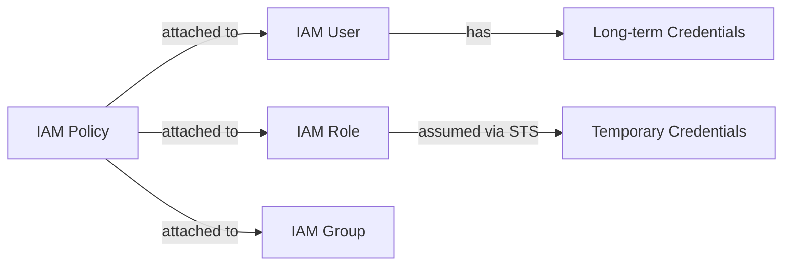

---

### 1.2 Resource-based Policy vs Identity-based Policy — Evaluation Logic

**From scratch:**
- **Identity-based Policy**: Attached to a User/Group/Role. Answers: *"What can THIS IDENTITY do?"*
- **Resource-based Policy**: Attached to the resource itself (S3 bucket policy, KMS key policy, SQS queue policy, Lambda resource policy). Answers: *"Who can access THIS RESOURCE?"*

The key difference: a resource-based policy can grant access to a **principal in another AWS account** without that account needing a role in your account — this enables cross-account access directly.

**Evaluation order (very important for interviews):**

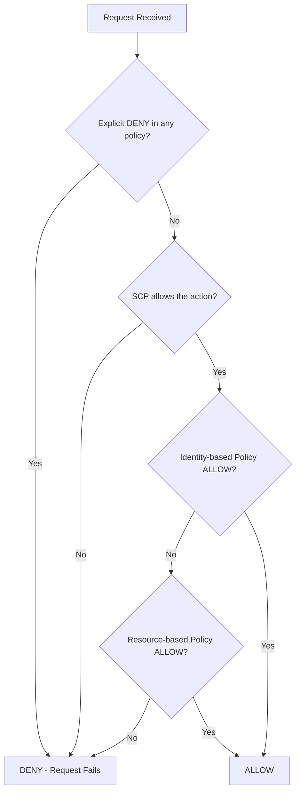

Rule of thumb: **Explicit Deny always wins.** Then, for same-account access, either an identity-based OR a resource-based Allow is sufficient. For cross-account access, you generally need the resource-based policy on the target AND the identity-based policy on the caller side to both allow it (unless it's an S3 bucket policy granting broad access).

---

### 1.3 AWS Service Control Policy (SCP) — Does it grant permissions?

**From scratch:**
AWS Organizations lets you group multiple AWS accounts under an **OU (Organizational Unit)**. An **SCP** is a policy attached at the Org/OU/Account level that defines the **maximum available permissions** for all IAM Users/Roles in that account — including the root user.

> **SCPs NEVER grant permissions.** They only **restrict** what IAM policies inside the account are allowed to do. Think of it as a *guardrail* or a *ceiling*, not a permission grant.

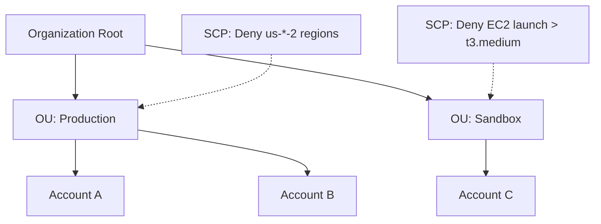

Effective permission = **Intersection** of SCP (ceiling) AND IAM Policy (grant).
Even if an IAM policy grants `s3:*`, if the SCP denies `s3:DeleteBucket`, the action fails.

---

### 1.4 AWS KMS Customer Managed Keys (CMK) & Envelope Encryption

**From scratch:**
- **KMS (Key Management Service)** securely creates and manages encryption keys.
- **CMK (Customer Managed Key)**: A key that YOU create and control the policy/rotation for (vs. AWS Managed Keys which AWS controls).
- KMS never lets the actual **master key (CMK)** leave the KMS service boundary — this is why **Envelope Encryption** exists.

**Envelope Encryption Flow:**
1. Application asks KMS to `GenerateDataKey`.
2. KMS returns **two versions** of a Data Encryption Key (DEK): a **plaintext DEK** and an **encrypted DEK** (encrypted by the CMK).
3. Application uses plaintext DEK to encrypt the actual data, then **discards the plaintext DEK from memory**.
4. Application stores the **encrypted DEK** alongside the encrypted data.
5. To decrypt later: send encrypted DEK back to KMS → KMS decrypts it using CMK → returns plaintext DEK → app decrypts data.

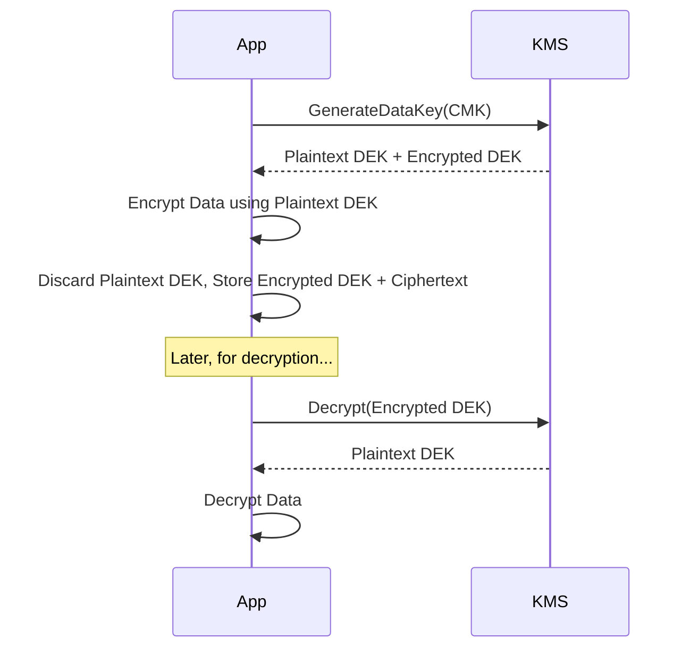

**Why this matters:** Large data never travels to KMS (KMS has payload limits ~4KB for direct Encrypt calls). Only small DEKs are exchanged with KMS, making encryption of large files (S3 SSE-KMS, EBS encryption) efficient and secure.

---

### 1.5 Securely Passing Secrets to EC2/ECS Applications

**From scratch:** Never embed secrets in AMIs, code, environment variables in plaintext config, or Docker images.

**Recommended approaches:**

| Method | Best for | How it works |
|---|---|---|
| **AWS Secrets Manager** | DB passwords, API keys with auto-rotation | App calls `GetSecretValue` API using IAM role; supports automatic rotation via Lambda |
| **SSM Parameter Store (SecureString)** | Config values, cheaper than Secrets Manager | Encrypted with KMS, fetched at boot/runtime via IAM role |
| **ECS Task Definition `secrets` field** | Containers | ECS agent injects secret from Secrets Manager/SSM directly as env variable at container startup — never stored in task definition |

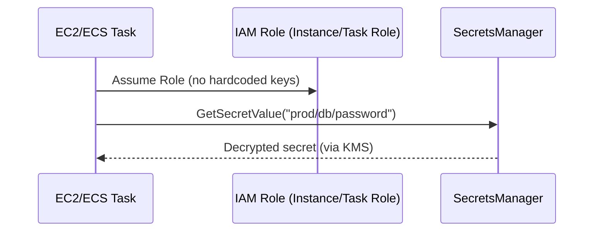

**ECS Task Definition Example:**
```json
"containerDefinitions": [{
  "name": "app",
  "secrets": [
    { "name": "DB_PASSWORD", "valueFrom": "arn:aws:secretsmanager:us-east-1:123:secret:prod/db-AbCdEf" }
  ]
}]
```

---

### 1.6 AWS WAF vs Shield Standard vs Shield Advanced

**From scratch:**

| Feature | AWS WAF | Shield Standard | Shield Advanced |
|---|---|---|---|
| Protects against | Layer 7 attacks (SQLi, XSS, bot traffic) | Layer 3/4 DDoS (SYN floods, UDP reflection) | Advanced L3/4/7 DDoS |
| Cost | Pay per rule/request | **Free**, automatic for all AWS customers | Paid subscription (~$3000/month) |
| Attachment point | CloudFront, ALB, API Gateway, AppSync | Automatically on all AWS resources | CloudFront, ALB, Global Accelerator, Route 53 |
| Extra Features | Custom rules, Rate limiting, Managed Rule Groups, Bot Control | Basic always-on protection | 24/7 DDoS Response Team (DRT), cost protection for scaling during attack, advanced metrics |

**Analogy:** WAF is a smart bouncer checking *what* is in each request (a firewall for application logic). Shield is the security perimeter fence stopping *volume-based floods* before they reach your app.

---

### 1.7 STS & AssumeRole for Cross-Account Access

**From scratch:**
**STS (Security Token Service)** issues short-lived credentials (Access Key, Secret Key, Session Token) valid from 15 minutes to 36 hours (varies per API).

**AssumeRole Flow for Cross-Account Access:**

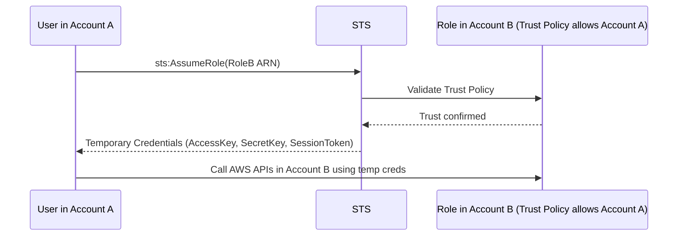

**Two policies required:**
1. **Trust Policy** (on Role in Account B) — *who* can assume this role.
```json
{
  "Effect": "Allow",
  "Principal": { "AWS": "arn:aws:iam::AccountA_ID:root" },
  "Action": "sts:AssumeRole",
  "Condition": { "StringEquals": { "sts:ExternalId": "unique-id-123" } }
}
```
2. **Permission Policy** (on Role in Account B) — *what* the role can do once assumed.

Used heavily in: Cross-account CI/CD pipelines, third-party SaaS integrations (with `ExternalId` to prevent confused-deputy attacks), and multi-account landing zones.

---

## 2. Networking & VPC

### 2.1 Designing a 3-Tier VPC Architecture

**From scratch:** A VPC (Virtual Private Cloud) is your isolated network in AWS. A 3-tier design separates concerns and blast-radius across subnets and Availability Zones (AZs) for high availability.

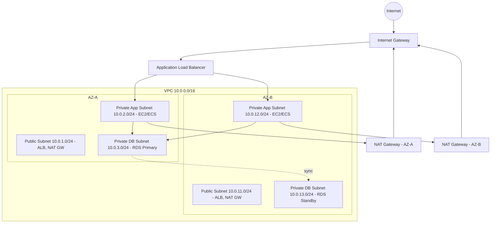

**Design principles:**
- **Presentation tier** (Public Subnet): ALB, NAT Gateways, Bastion Host.
- **Application tier** (Private Subnet): EC2/ECS/Lambda — no direct internet route, egress only via NAT.
- **Database tier** (Private/Isolated Subnet): RDS/Aurora — no route to Internet Gateway or NAT at all, only accessible from App tier SG.
- Always span **≥2 Availability Zones** for HA.
- Use **separate Route Tables** per subnet tier to enforce network boundaries.
- Use **Security Groups** for tier-to-tier access control (App SG only allows DB SG on port 3306, etc.)

---

### 2.2 Security Group vs Network ACL (NACL)

| Feature | Security Group | Network ACL |
|---|---|---|
| Level | Instance/ENI level | Subnet level |
| State | **Stateful** (return traffic auto-allowed) | **Stateless** (must define both inbound & outbound rules) |
| Rule types | Allow only | Allow AND Deny |
| Evaluation | All rules evaluated, most permissive wins | Rules processed **in order** by rule number, first match wins |
| Default | Deny all inbound, allow all outbound | Allow all inbound/outbound (default NACL) |
| Applies to | Only instances explicitly associated | All instances in the associated subnet automatically |

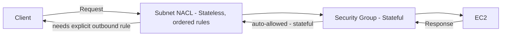

**Interview tip:** Because NACL is stateless, if you allow inbound port 443, you MUST also add an outbound rule for ephemeral ports (1024-65535) so responses can leave the subnet.

---

### 2.3 Private Subnet EC2 — Internet Access for Updates Without Exposing to Inbound Traffic

**Solution: NAT Gateway (or NAT Instance).**

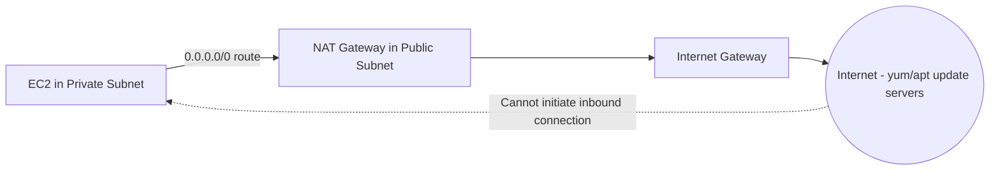

- Private subnet's route table sends `0.0.0.0/0` traffic to the **NAT Gateway** (which lives in a public subnet).
- NAT Gateway performs **source NAT**, translating private IP to its own Elastic IP, and forwards to the Internet Gateway.
- Because NAT only allows **outbound-initiated** connections and tracks return traffic, external hosts can never initiate a new inbound connection to the private EC2 — providing one-way "phone home" access, perfect for OS patching (yum/apt), pulling from S3/Docker Hub, etc.
- Alternative for AWS-service-only traffic (no internet needed at all): **VPC Gateway/Interface Endpoints** (see 2.6).

---

### 2.4 NAT Gateway vs Internet Gateway

| Feature | Internet Gateway (IGW) | NAT Gateway |
|---|---|---|
| Purpose | Enables **two-way** internet connectivity for public subnet resources with public IPs | Enables **one-way (outbound only)** internet access for private subnet resources |
| Where placed | Attached to VPC | Deployed inside a **public** subnet |
| Who uses it | Resources with a Public IP / EIP | Resources in private subnets, via route table |
| Cost | Free | Charged hourly + per GB processed |
| HA | Highly available by design | Must deploy one per AZ for HA |

---

### 2.5 VPC Peering vs Transit Gateway vs PrivateLink

| Feature | VPC Peering | Transit Gateway (TGW) | PrivateLink |
|---|---|---|---|
| Topology | 1:1 connection | Hub-and-spoke, many:many | Service-to-consumer (1 service exposed to N consumers) |
| Transitive routing | ❌ No (A-B, B-C doesn't allow A-C) | ✅ Yes, via central hub | N/A — not a routing solution |
| Overlapping CIDR | Not supported | Not supported | Supported (no IP conflicts since it's ENI-based) |
| Use case | Small number of VPCs needing direct connectivity | Large-scale multi-VPC/multi-account networks, on-prem via VPN/DX | Securely exposing a specific service (e.g., a SaaS API or internal microservice) without exposing the whole network |
| Scale limit | Becomes unmanageable with many VPCs (N² problem) | Scales to thousands of VPCs/accounts | Scales per-service |

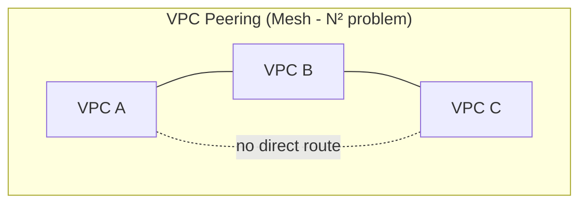
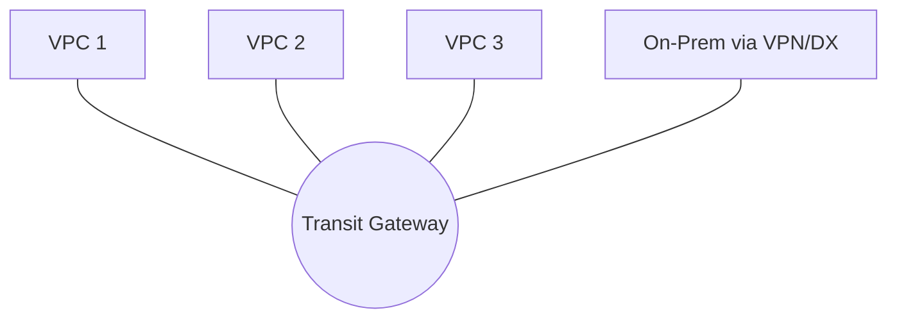
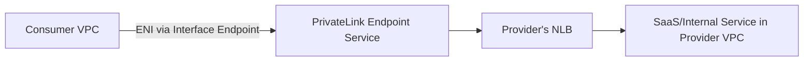

**Decision guide:**
- 2-3 VPCs, simple → **Peering**
- Enterprise-wide hub, many VPCs/accounts/on-prem → **Transit Gateway**
- Expose a single service securely across accounts/VPCs (e.g., third-party SaaS) → **PrivateLink**

---

### 2.6 VPC Endpoints: Gateway vs Interface

**From scratch:** VPC Endpoints let resources in a private subnet reach AWS services **without traversing the public internet** (no IGW/NAT needed).

| Type | Services | How it works | Cost |
|---|---|---|---|
| **Gateway Endpoint** | S3, DynamoDB only | Adds a route table entry pointing to a prefix-list target | Free |
| **Interface Endpoint** (powered by PrivateLink) | Most AWS services (SSM, KMS, SNS, ECR, Secrets Manager, etc.) | Creates an ENI with a private IP inside your subnet; uses DNS to resolve service to private IP | Hourly + per GB charge |

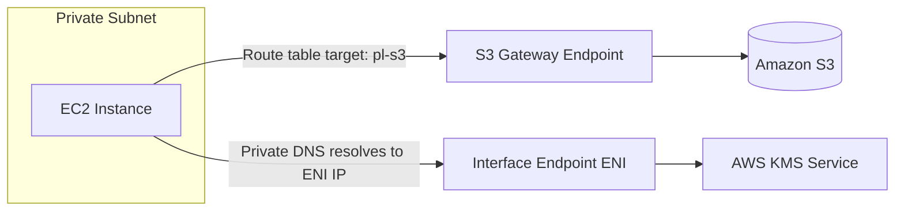

**Why it matters:** Removes dependency on NAT Gateway (cost savings + reduced attack surface) and keeps traffic entirely within the AWS private network backbone.

---

### 2.7 EC2 in Public Subnet Can't Reach the Internet — Troubleshooting Checklist

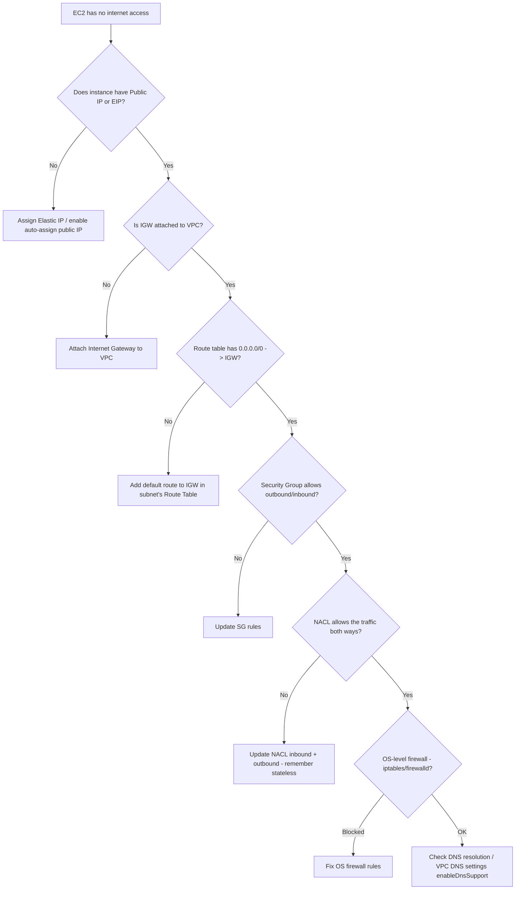

**Most common real culprits (in order of frequency):**
1. No Public IP/EIP assigned.
2. Missing `0.0.0.0/0` route to IGW in the route table.
3. Security Group missing outbound rule (rare, default allows all outbound) or missing inbound rule for return traffic if SG was customized.
4. NACL blocking ephemeral ports.

---

## 3. Compute & Containerization

### 3.1 On-Demand vs Reserved Instances vs Savings Plans vs Spot Instances

| Type | Discount | Commitment | Best for | Risk |
|---|---|---|---|---|
| **On-Demand** | 0% (baseline) | None | Unpredictable, short-term workloads | Highest cost |
| **Reserved Instances (RI)** | Up to ~72% | 1 or 3 years, specific instance family/region | Steady-state, predictable workloads | Low flexibility (Standard RI) |
| **Savings Plans** | Up to ~72% | 1 or 3 years, $/hour commitment (flexible across instance types/families) | Similar to RI but more flexible (compute or EC2 instance savings plans) | Must maintain min spend |
| **Spot Instances** | Up to ~90% | None (bid on spare capacity) | Fault-tolerant, stateless, batch jobs | Can be reclaimed with 2-min warning |

**Using Spot without risking downtime:**
1. **Diversify** across multiple instance types/AZs (Spot Fleet / EC2 Auto Scaling with mixed instance policies).
2. Use **Capacity-Optimized allocation strategy** to pick pools with lowest interruption chance.
3. Combine with **On-Demand base + Spot burst** using a mixed instances policy in an Auto Scaling Group.
4. Handle the **2-minute interruption notice** via EventBridge/Instance Metadata to gracefully drain connections (deregister from ALB, checkpoint work).
5. Use Spot only for **stateless/idempotent** workloads (batch, CI/CD runners, big data processing) — never for single-instance stateful DB nodes.

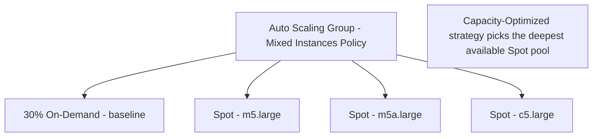

---

### 3.2 ALB vs NLB vs GWLB (OSI Layers)

| Load Balancer | OSI Layer | Protocol | Use Case | Key Feature |
|---|---|---|---|---|
| **ALB** (Application) | Layer 7 | HTTP/HTTPS/gRPC | Web apps, microservices | Path/Host-based routing, WebSocket, Lambda targets |
| **NLB** (Network) | Layer 4 | TCP/UDP/TLS | Ultra-high performance, static IP needed | Millions of req/sec, preserves source IP, extremely low latency |
| **GWLB** (Gateway) | Layer 3 (Network) with GENEVE encapsulation | IP | Inserting 3rd-party virtual appliances (firewalls, IDS/IPS) transparently | Transparent traffic inspection using GENEVE protocol on port 6081 |

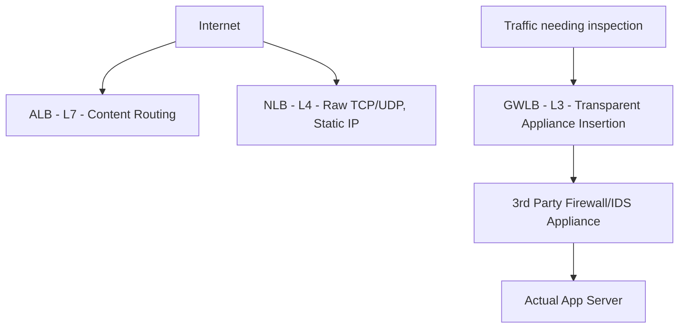

---

### 3.3 ALB Path-Based & Host-Based Routing

**From scratch:** ALB uses **Listener Rules** evaluated in priority order, forwarding requests to different **Target Groups** based on conditions.

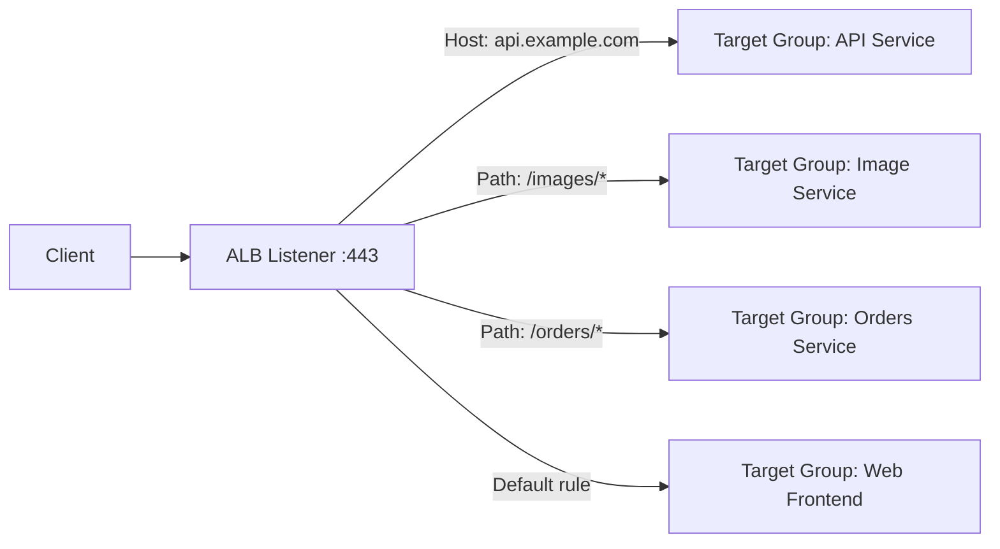

**Example rule (CLI):**
```bash
aws elbv2 create-rule \
  --listener-arn <listener-arn> \
  --priority 10 \
  --conditions Field=path-pattern,Values='/orders/*' \
  --actions Type=forward,TargetGroupArn=<orders-tg-arn>
```
This enables **microservices behind one ALB** — reducing cost (fewer load balancers) and simplifying DNS/SSL management.

---

### 3.4 EC2 Placement Groups

| Type | Layout | Use Case | Trade-off |
|---|---|---|---|
| **Cluster** | Packed into a single AZ, single rack (low-latency network) | HPC, tightly-coupled MPI workloads needing 10Gbps+ low-latency | Higher risk — hardware failure affects all instances |
| **Spread** | Each instance on distinct hardware racks (max 7 per AZ) | Small number of critical instances needing max isolation (e.g., domain controllers) | Limited scale |
| **Partition** | Instances grouped into partitions, each on separate racks | Large distributed systems needing rack-awareness (Hadoop, Cassandra, Kafka) | Partition failure isolated, but not as low-latency as Cluster |

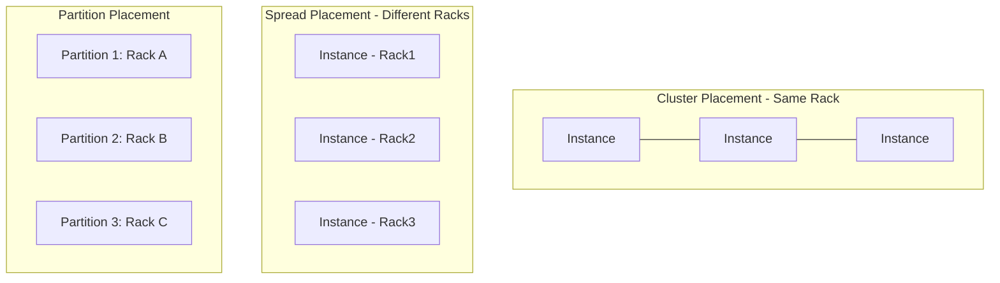

---

### 3.5 ECS (EC2 Launch Type) vs AWS Fargate

| Feature | ECS on EC2 | Fargate |
|---|---|---|
| Infrastructure management | You manage EC2 instances (patching, scaling, capacity) | Serverless — AWS manages the underlying compute |
| Billing | Per EC2 instance (even if underutilized) | Per task, based on vCPU/memory reserved, per second |
| Control | Full control over instance type, GPU, custom AMIs | Limited to Fargate-supported configurations |
| Density | Can pack multiple tasks per instance (higher utilization, more complex bin-packing) | 1:1 task isolation (like micro-VMs, via Firecracker) |
| Startup time | Instances need to be running/scaled already | Faster/simpler autoscaling, slightly slower cold starts per task |
| Best for | Cost optimization at scale, GPU workloads, custom networking needs | Simplicity, variable workloads, no ops overhead |

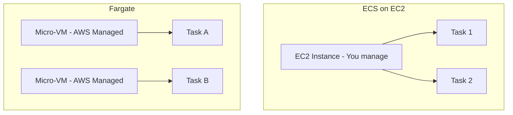

---

### 3.6 AMI Baking vs Runtime Configuration Management

| Approach | Description | Pros | Cons |
|---|---|---|---|
| **AMI Baking** (Golden Image, e.g., via Packer) | Pre-install app/dependencies into a custom AMI | Fast boot time, immutable, consistent | Slower iteration (rebuild AMI per change), storage cost |
| **Runtime Config Mgmt** (User Data scripts, SSM Run Command, Ansible/Chef/Puppet) | Install/configure at instance launch or on-demand | Faster iteration, flexible | Slower boot (installs at runtime), risk of config drift, dependency on external repos at boot |

**Best practice (hybrid):** Bake a "mostly-ready" golden AMI with OS hardening + agents (CloudWatch agent, SSM agent) via Packer/EC2 Image Builder, then use **User Data** or **SSM State Manager** for final environment-specific configuration (e.g., pulling latest app version, environment variables). This balances speed and flexibility — commonly called **Immutable Infrastructure with light bootstrap**.

---

## 4. Storage & Content Delivery

### 4.1 EBS vs EFS vs S3

| Feature | EBS | EFS | S3 |
|---|---|---|---|
| Type | Block storage | File storage (NFS) | Object storage |
| Attach point | Single EC2 instance (per AZ) | Multiple EC2/containers, multi-AZ | Accessed via API/HTTP, not mounted as filesystem (natively) |
| Durability | 99.8-99.9% (AZ-bound); use snapshots for cross-AZ durability | 99.999999999% (11 nines) multi-AZ | 99.999999999% (11 9s) |
| Scaling | Manually resize | Auto-scales elastically | Virtually unlimited |
| Use case | Boot volumes, databases needing low-latency block I/O | Shared file storage for web servers, CMS, ML training data | Static assets, backups, data lake, logs |
| Performance | Consistent low-latency IOPS | Good throughput, higher latency than EBS | High throughput, higher per-request latency |

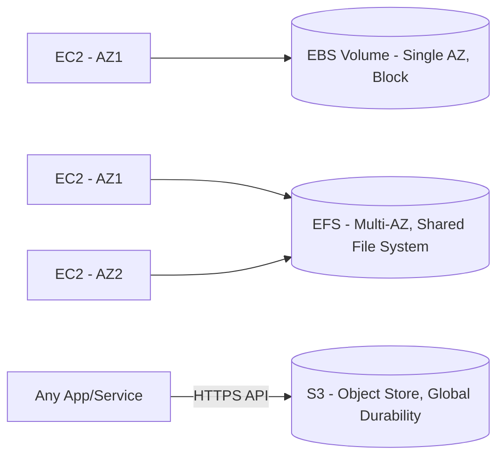

**Decision rule:** Need a boot disk or DB storage → **EBS**. Need shared access from many instances → **EFS**. Need to store/retrieve files via API at massive scale (images, backups, logs, data lake) → **S3**.

---

### 4.2 S3 Storage Classes & Lifecycle Policies

| Class | Retrieval time | Min storage duration | Use case |
|---|---|---|---|
| **Standard** | Milliseconds | None | Frequently accessed data |
| **Intelligent-Tiering** | Milliseconds | None | Unknown/changing access patterns (auto-moves between tiers) |
| **Standard-IA** | Milliseconds | 30 days | Infrequent access, needs fast retrieval when accessed |
| **One Zone-IA** | Milliseconds | 30 days | Infrequent, re-creatable data (single AZ, cheaper) |
| **Glacier Instant Retrieval** | Milliseconds | 90 days | Archive, needs instant access rarely |
| **Glacier Flexible Retrieval** | Minutes to hours | 90 days | Archives accessed a couple times a year |
| **Glacier Deep Archive** | 12 hours | 180 days | Long-term compliance archives (7-10 years) |

**Lifecycle Policy example:**
```json
{
  "Rules": [{
    "ID": "MoveToIA-ThenGlacier",
    "Status": "Enabled",
    "Filter": { "Prefix": "logs/" },
    "Transitions": [
      { "Days": 30, "StorageClass": "STANDARD_IA" },
      { "Days": 90, "StorageClass": "GLACIER" },
      { "Days": 365, "StorageClass": "DEEP_ARCHIVE" }
    ],
    "Expiration": { "Days": 2555 }
  }]
}
```

```mermaid
graph LR
    A[Day 0: S3 Standard] -->|Day 30| B[Standard-IA]
    B -->|Day 90| C[Glacier Flexible Retrieval]
    C -->|Day 365| D[Glacier Deep Archive]
    D -->|Day 2555| E[Object Expired/Deleted]
```

---

### 4.3 S3 Object Locking & Versioning (Ransomware Protection)

**From scratch:**
- **Versioning**: Keeps every version of an object every time it's overwritten or deleted (a "delete" just adds a delete-marker; the old version remains recoverable).
- **Object Lock**: WORM (Write Once Read Many) model. Prevents an object version from being deleted or overwritten for a defined retention period — **even by the root user/account owner**, unless using Governance mode with special permission.

**Two Object Lock modes:**
- **Governance mode**: Users with special IAM permission (`s3:BypassGovernanceRetention`) can override.
- **Compliance mode**: Nobody — including root — can delete or shorten retention until it expires. True immutability.

```mermaid
graph TD
    Upload[Object Uploaded v1] --> Lock[Object Lock: Retain until 2026-01-01, Compliance Mode]
    Attacker[Ransomware/Malicious Actor] -->|Attempts Delete| Lock
    Lock -->|BLOCKED - even root cannot delete| Denied[Request Denied]
    Versioning[Versioning Enabled] --> V1[v1] --> V2[v2 overwritten]
    V2 --> DeleteMarker[Delete adds marker, not real deletion]
    DeleteMarker -->|Restore by removing marker| V1
```

**Why it matters:** Combined with **Cross-Region Replication** and **MFA Delete**, this forms the backbone of a ransomware-resilient backup strategy — even if credentials are compromised, immutable backups survive.

---

### 4.4 CloudFront + Origin Access Control (OAC/OAI)

**From scratch:** **CloudFront** is AWS's CDN — it caches content at 400+ global **Edge Locations**, so users fetch data from a nearby edge instead of the origin server (S3, ALB, custom origin) — reducing latency significantly.

```mermaid
graph TB
    UserUS[User in USA] --> EdgeUS[Edge Location - New York]
    UserEU[User in Europe] --> EdgeEU[Edge Location - Frankfurt]
    UserAsia[User in Asia] --> EdgeAsia[Edge Location - Singapore]
    EdgeUS -.Cache Miss.-> Origin[(Origin: S3 / ALB)]
    EdgeEU -.Cache Miss.-> Origin
    EdgeAsia -.Cache Miss.-> Origin
```

**OAC (Origin Access Control)** — the modern replacement for the older **OAI (Origin Access Identity)**:
- Ensures an S3 bucket is **private** and can ONLY be accessed via CloudFront (blocking direct public S3 URL access).
- CloudFront signs each request (SigV4) to S3 using the OAC identity; the S3 Bucket Policy only allows requests from that specific CloudFront distribution.

```mermaid
sequenceDiagram
    participant User
    participant CloudFront
    participant S3
    User->>CloudFront: GET /image.jpg
    CloudFront->>CloudFront: Check edge cache
    alt Cache Hit
        CloudFront-->>User: Return cached object
    else Cache Miss
        CloudFront->>S3: Signed request via OAC
        S3-->>CloudFront: Object (S3 bucket policy verifies CloudFront OAC principal)
        CloudFront-->>User: Return object + cache it
    end
```

OAC supports SSE-KMS encrypted buckets and all AWS regions (advantages over legacy OAI).

---

### 4.5 EBS Volume Types: gp3 vs io2 (IOPS & Throughput Scaling)

| Volume Type | Use Case | Baseline IOPS | Max IOPS | Throughput | IOPS/Throughput independent of size? |
|---|---|---|---|---|---|
| **gp3** (General Purpose SSD) | Most workloads, boot volumes, dev/test DBs | 3,000 IOPS free | up to 16,000 IOPS | up to 1,000 MB/s | ✅ Yes — provision IOPS/throughput independently of storage size, at extra cost above baseline |
| **io2 / io2 Block Express** | Mission-critical, high-IOPS DBs (Oracle, SAP HANA) | Provisioned | up to 256,000 IOPS (Block Express) | up to 4,000 MB/s | ✅ Yes, plus 99.999% durability, sub-millisecond latency |

**Key point:** Older `gp2` scaled IOPS **based on volume size** (3 IOPS/GB baseline). `gp3` decouples this — you can get 3000 IOPS on a small 10GB volume without over-provisioning storage just to get performance, saving cost. `io2` is for the most demanding, latency-sensitive, durability-critical databases.

---

## 5. Databases & Analytics

### 5.1 Amazon RDS vs DynamoDB

| Factor | RDS (Relational) | DynamoDB (NoSQL) |
|---|---|---|
| Data model | Structured, tables with relations, joins | Key-value / document, denormalized |
| Schema | Fixed schema | Schemaless (flexible attributes) |
| Scaling | Vertical (bigger instance) + Read Replicas | Horizontal, virtually unlimited, auto-scaling |
| Consistency | Strong (ACID transactions) | Eventually consistent by default; strongly consistent reads optional |
| Latency | Single-digit ms typically | Single-digit **millisecond** at any scale |
| Use case | Complex queries, joins, transactions (financial systems, ERPs) | High-scale, low-latency apps (gaming leaderboards, IoT, session stores, e-commerce carts) |
| Ops overhead | Patching/backup managed, but instance sizing needed | Fully serverless option (On-Demand mode) |

**Rule of thumb:** If you need **JOINs, complex transactions, reporting** → RDS. If you need **massive scale, predictable low-latency access patterns, flexible schema** → DynamoDB.

---

### 5.2 Amazon Aurora — High Availability & Read Performance

**From scratch:** Aurora is AWS's cloud-native relational DB (MySQL/PostgreSQL compatible) that **decouples compute from storage**.

```mermaid
graph TB
    Writer[Aurora Writer Instance]
    Reader1[Aurora Read Replica 1]
    Reader2[Aurora Read Replica 2]
    Storage[(Shared Distributed Storage Volume - 6 copies across 3 AZs)]
    Writer --> Storage
    Reader1 --> Storage
    Reader2 --> Storage
    Client[Application] -->|Writes| Writer
    Client -->|Reads via Reader Endpoint| Reader1
    Client -->|Reads via Reader Endpoint| Reader2
```

**How it achieves this:**
1. **Storage layer** is automatically replicated **6 ways across 3 AZs**, decoupled from compute — survives loss of up to 2 copies without impacting writes, and up to 3 copies without impacting reads.
2. Up to **15 read replicas** share the *same* underlying storage volume — no replication lag from separate data copies like traditional MySQL (which replays binlogs). Aurora replicas read directly from shared storage — much faster failover (<30 sec).
3. **Aurora Auto Scaling** for read replicas, and **Aurora Serverless v2** for automatic compute scaling.
4. Backtracking, fast cloning, and continuous backup to S3 without performance impact.

---

### 5.3 DynamoDB GSI vs LSI

| Feature | LSI (Local Secondary Index) | GSI (Global Secondary Index) |
|---|---|---|
| Partition key | Must be **same** as base table | Can be **different** from base table |
| Sort key | Different sort key, same partition key | Can have any partition + sort key |
| Creation | Must be created **at table creation time** | Can be created/deleted **anytime** |
| Capacity | Shares table's throughput | Has its **own** provisioned throughput |
| Consistency | Supports strongly consistent reads | Eventually consistent only |
| Size limit | 10GB per partition key value | No such limit |

```mermaid
graph LR
    subgraph Base Table - PK: UserID, SK: OrderDate
    end
    subgraph LSI - PK: UserID same, SK: OrderTotal different
    end
    subgraph GSI - PK: ProductCategory different, SK: OrderDate
    end
```

**Use LSI** when you need alternate sort orders for the same partition key (e.g., sort a user's orders by amount instead of date). **Use GSI** when you need to query by a completely different attribute (e.g., find all orders for a given "ProductCategory" regardless of user).

---

### 5.4 DynamoDB On-Demand vs Provisioned Capacity Mode

| Mode | Billing | Scaling | Best for |
|---|---|---|---|
| **On-Demand** | Pay per request (read/write) | Instantly scales to handle spikes automatically | Unpredictable/spiky traffic, new applications, low ops overhead |
| **Provisioned (with Auto Scaling)** | Pay for reserved RCU/WCU capacity per hour | Scales based on CloudWatch-tracked utilization target (e.g., 70%), takes minutes to react | Predictable, steady-state traffic (cost-efficient at scale) |

```mermaid
graph LR
    Traffic[Incoming Request Pattern] --> Decision{Predictable Load?}
    Decision -- Yes, steady with known peaks --> Provisioned[Provisioned + Auto Scaling - Cheaper]
    Decision -- No, spiky/unknown --> OnDemand[On-Demand Mode - Simple, pay-per-use]
```

---

### 5.5 Amazon ElastiCache (Redis/Memcached) Role

**From scratch:** ElastiCache is a managed **in-memory cache**, sitting between your application and your database, storing frequently accessed data in RAM (microsecond latency) instead of hitting disk-based DB every time.

```mermaid
sequenceDiagram
    participant App
    participant Cache as ElastiCache Redis
    participant DB as RDS/Database
    App->>Cache: GET user:123
    alt Cache Hit
        Cache-->>App: Return cached data (fast, microseconds)
    else Cache Miss
        Cache-->>App: null
        App->>DB: Query database
        DB-->>App: Return data
        App->>Cache: SET user:123 (populate cache, with TTL)
    end
```

**Redis vs Memcached:**
- **Redis**: Persistence, replication, Pub/Sub, complex data structures (sorted sets, lists), Multi-AZ failover, Cluster mode.
- **Memcached**: Simple, multi-threaded, pure caching, no persistence, no replication — good for simple, horizontally scaled caching.

**Common patterns:** Lazy Loading (cache-aside, shown above), Write-Through (write to cache and DB simultaneously), used for session storage, leaderboard, rate limiting.

---

### 5.6 Amazon Redshift (OLAP) vs Standard RDBMS (OLTP)

| Factor | OLTP (RDS/Aurora) | OLAP (Redshift) |
|---|---|---|
| Purpose | Transaction processing (INSERT/UPDATE/DELETE-heavy) | Analytical queries (aggregations over huge datasets) |
| Storage | Row-based storage | **Columnar storage** (reads only needed columns → huge scan speedup) |
| Query pattern | Many small, fast transactions | Few, complex queries scanning millions/billions of rows |
| Scaling | Vertical + read replicas | **Massively Parallel Processing (MPP)** — distributes query across multiple compute nodes |
| Use case | E-commerce order processing, banking | BI dashboards, data warehousing, reporting |

```mermaid
graph TB
    subgraph Redshift Cluster - MPP
    Leader[Leader Node - Query Planning] --> C1[Compute Node 1 - Slice of Data]
    Leader --> C2[Compute Node 2 - Slice of Data]
    Leader --> C3[Compute Node 3 - Slice of Data]
    end
    Client[BI Tool - QuickSight/Tableau] --> Leader
```

---

## 6. Serverless & Event-Driven Architecture

### 6.1 Lambda Cold Start & Provisioned Concurrency

**From scratch:** A **Cold Start** happens when Lambda must create a brand-new execution environment (download code, initialize runtime, run init code outside the handler) before processing the first request. This adds latency (100ms - several seconds, worse for VPC-attached functions or large deployment packages/runtimes like Java/.NET).

```mermaid
sequenceDiagram
    participant Client
    participant Lambda Service
    Client->>Lambda Service: Invoke (no warm environment available)
    Lambda Service->>Lambda Service: Download code, init runtime, run global/init code (COLD START - slow)
    Lambda Service->>Lambda Service: Execute handler function
    Lambda Service-->>Client: Response
    Note over Client,Lambda Service: Subsequent request reuses same environment (WARM - fast)
```

**Mitigations:**
1. **Provisioned Concurrency** — Pre-initializes N execution environments so they're always warm and ready, eliminating cold starts for those requests (costs extra, billed even when idle).
2. Reduce package size, use lighter runtimes (Node.js/Python vs Java).
3. Move heavy SDK client initialization outside the handler (reused across warm invocations).
4. Use **SnapStart** (Java) to cache initialized JVM snapshots.
5. Avoid unnecessary VPC attachment (or use Hyperplane ENIs, now much faster than older Lambda VPC networking).

---

### 6.2 Lambda Concurrency Scaling

**From scratch:** Each concurrent request gets its own execution environment. Lambda scales horizontally very fast (burst of up to 1000 concurrent executions per region initially, then +500/min after that, subject to account concurrency limits).

```mermaid
graph TD
    Requests[1000 Simultaneous Requests] --> Lambda
    Lambda --> E1[Execution Env 1]
    Lambda --> E2[Execution Env 2]
    Lambda --> E3[Execution Env 3]
    Lambda --> EN[... Execution Env N up to account concurrency limit]
    EN --> Throttle{Limit Reached?}
    Throttle -- Yes --> Error[429 TooManyRequestsException - Throttled]
```

**When concurrency limit is hit:**
- Synchronous invocations (API Gateway) → caller receives a **429 throttling error**.
- Asynchronous invocations (S3, SNS) → automatically **retried** (twice by default) and can route to a **DLQ** if it keeps failing.
- Use **Reserved Concurrency** to guarantee/limit capacity per function, and **Provisioned Concurrency** to pre-warm.

---

### 6.3 SQS vs SNS vs EventBridge + Fan-Out Architecture

| Service | Model | Delivery | Use case |
|---|---|---|---|
| **SQS** | Queue (pull-based) | Point-to-point, message consumed by one consumer, decouples producer/consumer | Task queues, buffering, decoupling microservices |
| **SNS** | Pub/Sub (push-based) | Broadcast to many subscribers (SQS, Lambda, HTTP, email, SMS) simultaneously | Fan-out notifications |
| **EventBridge** | Event bus with routing rules | Content-based routing, schema registry, 3rd-party SaaS integrations | Complex event-driven architectures with many event sources/targets |

**Fan-Out Pattern (SNS → multiple SQS queues):**

```mermaid
graph TB
    Producer[Order Service] -->|Publish OrderCreated event| SNS[SNS Topic]
    SNS --> SQS1[SQS: Inventory Queue]
    SNS --> SQS2[SQS: Billing Queue]
    SNS --> SQS3[SQS: Notification Queue]
    SQS1 --> InventoryService[Inventory Service - Lambda/EC2]
    SQS2 --> BillingService[Billing Service]
    SQS3 --> NotificationService[Notification Service]
```

**Why fan-out with SNS+SQS instead of direct SNS→Lambda?** SQS buffers messages, adds retry/DLQ support, and prevents message loss if a downstream consumer is briefly down or overwhelmed (back-pressure protection), unlike direct push subscriptions.

---

### 6.4 Standard SQS vs FIFO SQS

| Feature | Standard Queue | FIFO Queue |
|---|---|---|
| Order | Best-effort ordering (not guaranteed) | Strict FIFO order guaranteed |
| Delivery | At-least-once (possible duplicates) | Exactly-once processing (via dedup) |
| Throughput | Nearly unlimited (very high TPS) | 300 msg/sec (3000 with batching), or up to 70,000/sec with high throughput mode |
| Naming | Any name | Must end in `.fifo` |
| Deduplication | None | **Content-based deduplication** (SHA-256 hash of body) OR explicit `MessageDeduplicationId`, within a 5-minute dedup window |
| Ordering scope | N/A | Per **MessageGroupId** — messages with the same group ID are ordered; different groups process in parallel |

```mermaid
graph LR
    Producer -->|MessageGroupId: OrderA| FIFOQueue[FIFO Queue]
    Producer -->|MessageGroupId: OrderB| FIFOQueue
    FIFOQueue -->|OrderA messages strictly ordered| ConsumerA
    FIFOQueue -->|OrderB messages strictly ordered, parallel| ConsumerB
```

---

### 6.5 Dead Letter Queue (DLQ) in SQS/Lambda

**From scratch:** A DLQ is a separate queue that captures messages/events that **failed processing repeatedly**, so they aren't lost or retried infinitely, and can be inspected/replayed later.

```mermaid
graph LR
    Source[SQS Source Queue / Lambda] -->|Process Attempt 1| Consumer
    Consumer -->|Fails| Retry1[Retry per maxReceiveCount]
    Retry1 -->|Still Fails after N retries| DLQ[(Dead Letter Queue)]
    DLQ --> Engineer[Manual Inspection / Alerting / Replay Script]
```

- **SQS**: Configured via **Redrive Policy** — `maxReceiveCount` defines how many times a message can be received before moving to DLQ.
- **Lambda**: Can configure a DLQ (SQS or SNS) for **async invocations** that fail after all retries, OR use **Lambda Destinations** (recommended, more detailed failure context) to route failures to SQS/SNS/EventBridge/another Lambda.
- **Best practice**: Set up a CloudWatch Alarm on `ApproximateNumberOfMessagesVisible` for the DLQ to alert engineers.

---

### 6.6 AWS Step Functions vs Chaining Lambda Functions Directly

**From scratch:** Step Functions orchestrates multi-step workflows using a **state machine** (defined in Amazon States Language - JSON), managing state, retries, error handling, and parallelism **without you writing that glue code**.

```mermaid
stateDiagram-v2
    [*] --> ValidateOrder
    ValidateOrder --> CheckInventory
    CheckInventory --> PaymentProcessing: Inventory Available
    CheckInventory --> NotifyOutOfStock: Inventory Unavailable
    PaymentProcessing --> ShipOrder: Payment Success
    PaymentProcessing --> RefundAndNotify: Payment Failed
    ShipOrder --> [*]
    NotifyOutOfStock --> [*]
    RefundAndNotify --> [*]
```

**Why not just chain Lambdas (Lambda A invokes Lambda B invokes Lambda C)?**

| Problem with direct chaining | Step Functions solves it via |
|---|---|
| No visibility into where a multi-step process failed | Visual workflow + execution history in console |
| Manual retry/error-handling code in every Lambda | Built-in `Retry`/`Catch` per state |
| Long-running workflows (hours/days) hit Lambda's 15-min timeout | Step Functions supports workflows running up to 1 year |
| Tight coupling (Lambda A must know about Lambda B) | Central orchestrator decouples business logic from workflow logic |
| Hard to do parallel/human-approval steps | Native `Parallel`, `Wait`, `Choice`, and `Task Token` (human-in-the-loop) states |
| Paying for idle Lambda waiting on other calls | Step Functions (Standard) doesn't charge for waiting; Lambdas only run when needed |

---

## 7. Monitoring, Observability & Management

### 7.1 CloudWatch vs CloudTrail

| Feature | CloudWatch | CloudTrail |
|---|---|---|
| Purpose | **Performance & operational monitoring** | **Audit & governance** — who did what, when |
| Data captured | Metrics (CPU, latency), Logs (app/system logs), Alarms | API call history (every `Create`, `Delete`, `Modify` action across AWS) |
| Question answered | "Is my system healthy? Is CPU spiking?" | "Who deleted this S3 bucket, and from what IP, at what time?" |
| Key features | Dashboards, Alarms, Logs Insights, Custom Metrics, EventBridge integration | Event history, Trails (delivered to S3), Insights (anomaly detection on API activity) |

```mermaid
graph LR
    Resource[AWS Resource - EC2/RDS/Lambda] -->|Performance Data| CloudWatch[CloudWatch: Metrics, Logs, Alarms]
    User[IAM User/Role] -->|API Call: e.g. TerminateInstance| CloudTrail[CloudTrail: Who, What, When, Source IP]
    CloudWatch --> Dashboard[Dashboards/Alarms -> SNS Alerts]
    CloudTrail --> S3Trail[(S3 Bucket - Audit Log Archive)]
    CloudTrail --> Athena[Athena - Query historical API activity]
```

**Analogy:** CloudWatch is the **heart-rate monitor** (health/performance). CloudTrail is the **security camera footage** (who did what).

---

### 7.2 Distributed Tracing with AWS X-Ray

**From scratch:** In microservices, a single user request may traverse API Gateway → Lambda → DynamoDB → another service. X-Ray attaches a **Trace ID** to the request at the entry point and propagates it through every downstream call, building a full **service map** and timeline.

```mermaid
sequenceDiagram
    participant Client
    participant APIGW as API Gateway
    participant Lambda1 as Lambda: OrderService
    participant Lambda2 as Lambda: PaymentService
    participant DynamoDB
    Client->>APIGW: Request (Trace ID: abc-123 generated)
    APIGW->>Lambda1: Forward (Trace ID: abc-123)
    Lambda1->>DynamoDB: Query (Trace ID: abc-123, Segment recorded)
    Lambda1->>Lambda2: Call (Trace ID: abc-123 propagated)
    Lambda2-->>Lambda1: Response
    Lambda1-->>APIGW: Response
    APIGW-->>Client: Response
    Note over Client,DynamoDB: X-Ray Console shows full trace timeline + service map with latency per hop
```

Implementation: Enable **X-Ray SDK** (auto-instrumentation via Lambda layers, or manual `AWSXRay.captureAWS(...)` wrapping SDK clients), enable **Active Tracing** on Lambda/API Gateway. X-Ray highlights bottlenecks (e.g., "DynamoDB call took 800ms of the total 900ms request") and errors per segment.

---

### 7.3 AWS Config — Compliance Enforcement

**From scratch:** AWS Config continuously records **configuration state** of your resources and evaluates them against **Config Rules** (managed or custom Lambda-backed) to detect non-compliance.

```mermaid
graph TD
    Resource[Resource Change - e.g., S3 Bucket made Public] --> ConfigRecorder[AWS Config Recorder]
    ConfigRecorder --> Rule[Config Rule: s3-bucket-public-read-prohibited]
    Rule --> Evaluate{Compliant?}
    Evaluate -- No --> NonCompliant[Marked NON_COMPLIANT]
    NonCompliant --> Remediation[Auto Remediation via SSM Automation Document]
    NonCompliant --> Notify[SNS Notification to Security Team]
    Remediation --> Fixed[Bucket ACL automatically corrected]
```

**Use cases:**
- Detect and auto-remediate (via SSM Automation) resources like unencrypted EBS volumes, open Security Groups (0.0.0.0/0 on port 22), public S3 buckets.
- **Conformance Packs**: Bundle of Config rules + remediation deployed as one unit (e.g., "PCI-DSS pack", "CIS Benchmark pack").
- Provides a full **configuration timeline/history** for audit — "what did this Security Group look like on March 3rd?"

---

### 7.4 SSM Parameter Store vs Secrets Manager

| Feature | SSM Parameter Store | Secrets Manager |
|---|---|---|
| Cost | Free tier (Standard); Advanced tier has small cost | Paid per secret per month + API calls |
| Automatic Rotation | ❌ No native rotation (must build your own Lambda + EventBridge schedule) | ✅ Built-in rotation (native support for RDS, Redshift, DocumentDB; custom Lambda for others) |
| Max size | 4KB (Standard), 8KB (Advanced) | 64KB |
| Versioning | Basic | Full version history with staging labels (AWSCURRENT/AWSPREVIOUS) |
| Cross-region replication | Manual | Built-in multi-region secret replication |
| Best for | Config values, feature flags, non-sensitive/semi-sensitive parameters, cheap secure strings | Highly sensitive credentials needing automatic rotation (DB passwords, API keys) |

**Rule of thumb:** Use **Parameter Store** for app configuration and infrequently-changing secrets (cost-sensitive). Use **Secrets Manager** when you need automatic rotation for database credentials or compliance requirements mandate frequent rotation.

---

## 8. Infrastructure as Code & CI/CD

### 8.1 CloudFormation — Updates, Drift Detection, Change Sets

**From scratch:** CloudFormation (CFN) manages infrastructure via declarative **Templates** (YAML/JSON) organized into **Stacks**.

**Change Sets:** Before applying an update, CFN can generate a **preview** of exactly what will be added/modified/**replaced** (critical — some updates require resource replacement, e.g., renaming an RDS instance may delete & recreate it!).

```mermaid
sequenceDiagram
    participant Dev
    participant CFN as CloudFormation
    Dev->>CFN: Update Template
    CFN->>CFN: Generate Change Set (dry-run, no changes applied yet)
    CFN-->>Dev: Preview: "RDS Instance will be REPLACED"
    Dev->>CFN: Review & Execute Change Set
    CFN->>CFN: Apply changes to real resources
```

**Drift Detection:** Detects when actual resource state **diverges** from what's defined in the template (e.g., someone manually changed a Security Group rule in the console). CFN compares live state vs template and flags resources as `MODIFIED`, `DELETED`, or `IN_SYNC`.

```mermaid
graph LR
    Template[CFN Template - Desired State] -.compare.-> Live[Live AWS Resource - Actual State]
    Live -->|Manual console change made| Drift[DRIFTED: Security Group rule differs]
```

---

### 8.2 CloudFormation vs CDK vs Terraform

| Feature | CloudFormation | AWS CDK | Terraform |
|---|---|---|---|
| Language | YAML/JSON | TypeScript, Python, Java, C#, Go (compiles to CFN) | HCL (HashiCorp Configuration Language) |
| Cloud support | AWS only | AWS only (also supports CDK for Terraform/K8s variants) | Multi-cloud (AWS, Azure, GCP, etc.) |
| State management | Managed by AWS automatically | Managed by AWS (via underlying CFN) | Requires managing a **state file** (local or remote, e.g., S3+DynamoDB lock) |
| Abstraction | Low-level, verbose | High-level constructs (L1/L2/L3), reusable via real programming constructs (loops, classes) | Medium-level, module-based reuse |
| Drift detection | Native | Native (via underlying CFN) | Via `terraform plan` (detects drift on each run) |
| Best for | Teams wanting native AWS-only IaC without extra tooling | Developers who want to use real programming languages/logic to define AWS infra | Multi-cloud environments, teams preferring HCL and mature ecosystem/modules |

```mermaid
graph LR
    CDK[AWS CDK - TypeScript/Python Code] -->|cdk synth| CFNTemplate[CloudFormation Template - JSON]
    CFNTemplate -->|cdk deploy| AWS[AWS Resources]
    TerraformCode[Terraform HCL] -->|terraform apply| StateFile[(State File - S3 backend)]
    StateFile --> AWS
```

---

### 8.3 Blue/Green & Canary Deployment with CodeDeploy + ALB

**Blue/Green Deployment:**

```mermaid
graph TB
    ALB[ALB Listener] -->|100% traffic initially| Blue[Blue - Target Group v1 - Current Prod]
    Green[Green - Target Group v2 - New Version] -.deployed but not live.-> Test[Automated Tests / Health Checks]
    Test -->|Pass| Switch[CodeDeploy shifts ALB listener to Green]
    Switch --> ALB2[ALB Listener] -->|100% traffic switched| Green
    Blue -.kept for rollback window.-> Rollback[Instant rollback if issues detected]
```

**Steps:**
1. Deploy new version (Green) to a **separate, fully-scaled Target Group** — zero impact on live traffic.
2. Run automated health checks/smoke tests against Green.
3. CodeDeploy **reroutes ALB listener** from Blue → Green (instant cutover).
4. Keep Blue running for a rollback window (e.g., 5-60 min); if CloudWatch Alarms trigger, **auto-rollback** by re-pointing listener back to Blue.
5. Terminate Blue once confidence is confirmed.

**Canary Deployment:**

```mermaid
graph LR
    ALB[ALB] -->|90% traffic| V1[Version 1 - Stable]
    ALB -->|10% traffic - Canary| V2[Version 2 - New]
    V2 --> Monitor[CloudWatch Alarms monitor error rate/latency]
    Monitor -->|Healthy - increase traffic gradually| Increase[10% -> 50% -> 100%]
    Monitor -->|Unhealthy| AutoRollback[Auto Rollback to 100% V1]
```

CodeDeploy natively supports canary configs like `Canary10Percent5Minutes` (shift 10%, wait 5 min, then shift rest) or `Linear10PercentEvery1Minute`, with **CloudWatch Alarms** wired in to trigger automatic rollback if error rates spike.

---

## 9. Architecture & Real-World Scenarios

### 9.1 Scenario: Monday Traffic Spikes Causing 504s (Auto Scaling too slow)

**Problem:** Reactive scaling (based on CPU/ALB metrics) takes ~5 minutes to launch new instances — too slow for a predictable, sudden Monday-morning spike.

**Solution — combine Predictive + Scheduled + Warm Pool strategies:**

```mermaid
graph TD
    A[Problem: Reactive Scaling too slow] --> B[Scheduled Scaling: Pre-scale ASG at 8:45 AM every Monday]
    A --> C[Predictive Scaling: ML-based forecast from historical CloudWatch data]
    A --> D[EC2 Warm Pool: Pre-initialized, stopped instances ready to start in seconds]
    A --> E[Faster health checks / reduce ASG cooldown & AMI boot time via baked AMI]
    A --> F[ALB Connection Draining + Target Group slow-start to avoid overwhelming new instances]
    B --> Result[Capacity ready BEFORE spike hits]
    C --> Result
    D --> Result
```

**Concrete plan:**
1. **AWS Auto Scaling - Predictive Scaling**: Analyzes historical load patterns (it will learn "every Monday 9 AM = spike") and proactively scales out **ahead of time**.
2. **Scheduled Scaling Action**: As a guaranteed baseline, set a scheduled action to increase `MinSize`/`DesiredCapacity` at 8:45 AM every Monday.
3. **Warm Pools for Auto Scaling**: Keep pre-initialized (stopped or running) instances in a warm pool so scale-out takes seconds instead of minutes (skips OS boot + app startup).
4. **Use a baked Golden AMI** (app pre-installed) to minimize boot/startup time for genuinely new instances.
5. Add **CloudFront + caching** in front of the ALB to absorb read-heavy spikes before they even hit EC2.
6. Consider evaluating current **ALB target group health check intervals** to register new instances faster.

---

### 9.2 Scenario: Migrate 50TB On-Prem Static Files to S3

```mermaid
graph TD
    Decision{Network bandwidth available?} -->|Good bandwidth, ongoing sync needed| DataSync[AWS DataSync]
    Decision -->|Limited/no reliable bandwidth| Snowball[AWS Snowball Edge - Physical Device]
    DataSync --> DX[Optional: AWS Direct Connect for dedicated, consistent bandwidth]
    Snowball --> Ship[Ship device back to AWS, data auto-loaded to S3]
    DX --> S3Target[(Amazon S3)]
    Ship --> S3Target
```

**Recommended approach for 50TB:**
1. **Calculate transfer time** over available internet: 50TB over a 1Gbps line ≈ 4-5 days (theoretical, real-world slower). If this is acceptable and connection is stable → **AWS DataSync**.
2. **AWS DataSync**: Install the DataSync agent on-prem (VM), it efficiently transfers files (with checksums, incremental sync, bandwidth throttling) directly into S3. Great if you need **ongoing/incremental syncs**, not just one-time migration.
3. If bandwidth is limited/unreliable, or 50TB would take too long/cost too much over the wire → **AWS Snowball Edge**: AWS ships a physical device, you copy data locally at LAN speed, ship it back, and AWS ingests it directly into S3 (typically 1-2 weeks total).
4. For **ongoing, permanent, high-volume, low-latency connectivity** (not just this migration) → provision **AWS Direct Connect** for a dedicated private network link, then run DataSync over it.
5. Post-migration: Enable **S3 Storage Class analysis / Lifecycle rules** to auto-tier older static files to IA/Glacier and validate transfer integrity via DataSync's built-in verification.

**Decision matrix:**
| Bandwidth available | Timeline flexibility | Recommended |
|---|---|---|
| High (500Mbps+, stable) | Can wait several days | DataSync (+ optional Direct Connect) |
| Low/unreliable | Need it done in ~1-2 weeks | Snowball Edge |
| Need continuous future syncing | N/A | DataSync (scheduled tasks) |

---

### 9.3 Scenario: Cost Optimization Assessment (Unattached EBS, Unused EIPs, Over-provisioned RDS)

```mermaid
graph TD
    Start[Cost Optimization Assessment] --> Tool1[AWS Cost Explorer - identify spend trends]
    Start --> Tool2[AWS Trusted Advisor - flags idle resources]
    Start --> Tool3[AWS Compute Optimizer - rightsizing recommendations]
    Tool2 --> Find1[Unattached EBS Volumes]
    Tool2 --> Find2[Unused Elastic IPs - charged when not attached to running instance]
    Tool3 --> Find3[Over-provisioned RDS/EC2 instances]
    Find1 --> Action1[Snapshot then delete unused volumes]
    Find2 --> Action2[Release unassociated EIPs]
    Find3 --> Action3[Rightsize instance class based on CloudWatch CPU/Memory utilization]
    Start --> Tags[Enforce Cost Allocation Tags for accountability]
    Start --> Budgets[Set AWS Budgets + Anomaly Detection alerts]
```

**Step-by-step assessment:**
1. **AWS Cost Explorer**: Break down cost by service/tag over time to identify the biggest cost drivers.
2. **AWS Trusted Advisor** (Business/Enterprise support): Directly flags "Idle Load Balancers," "Unattached EBS Volumes," "Underutilized EC2 instances," and "Elastic IPs not associated."
3. **AWS Compute Optimizer**: ML-based rightsizing recommendations for EC2, EBS, Lambda, based on actual CloudWatch utilization (CPU, memory via CloudWatch Agent).
4. **Remediation actions:**
   - Unattached EBS → snapshot to S3 (cheap), then delete the volume.
   - Unused EIPs → release them (AWS charges for EIPs **not attached** to a running instance).
   - Over-provisioned RDS → check CPU/Memory/IOPS CloudWatch metrics over 2 weeks; downsize instance class or switch to **Aurora Serverless v2** for variable workloads.
5. **Preventive controls going forward:**
   - **AWS Budgets** with alerts at 80%/100% thresholds.
   - **Cost Anomaly Detection** for sudden spend spikes.
   - Mandatory **cost allocation tags** (`Environment`, `Owner`, `Project`) enforced via SCP/Config rules.
   - Consider **Savings Plans/RIs** once steady-state usage is understood.
   - Scheduled **start/stop for non-prod** instances (e.g., Lambda + EventBridge to stop dev EC2/RDS after hours).

---

### 9.4 Scenario: Cross-Region DR — RPO < 15 min, RTO < 30 min

**From scratch:** **RPO** (Recovery Point Objective) = how much data you can afford to lose. **RTO** (Recovery Time Objective) = how long you can be down.

Given RPO<15min & RTO<30min, this maps to a **Warm Standby** DR strategy (not full Multi-Site Active-Active, which is costlier; not Pilot Light, which would be too slow for a 30-min RTO with app-tier cold-start).

```mermaid
graph TB
    subgraph "Primary Region - us-east-1"
        R53[Route 53 - Health Check + Failover Routing]
        ALB1[ALB]
        ASG1[EC2 ASG - Full Capacity]
        RDSPrimary[(RDS/Aurora Primary)]
    end
    subgraph "DR Region - us-west-2"
        ALB2[ALB]
        ASG2[EC2 ASG - Scaled Down, e.g. 1-2 instances]
        RDSReplica[(Aurora Global Database - Read Replica)]
    end
    R53 -->|Primary - Active| ALB1
    R53 -.Failover if health check fails.-> ALB2
    ALB1 --> ASG1 --> RDSPrimary
    ALB2 --> ASG2 --> RDSReplica
    RDSPrimary -->|Aurora Global DB replication - typically <1 sec lag| RDSReplica
    S3Primary[(S3 Primary Bucket)] -->|Cross-Region Replication CRR| S3DR[(S3 DR Bucket)]
```

**Implementation details:**
1. **Database**: Use **Aurora Global Database** — replicates with typical lag <1 second (well under the 15-min RPO), and supports **managed planned failover** or fast unplanned promotion of the secondary region (~<1 min for Aurora, meeting RTO easily). For standard RDS, use **Cross-Region Read Replica** with automated promotion scripts.
2. **Compute**: Keep a "**Warm Standby**" — a scaled-down (e.g., 10-20% capacity) copy of the application stack always running in the DR region (not fully cold like Pilot Light, not full-scale like Active-Active) so it can absorb traffic quickly once scaled up via Auto Scaling.
3. **Storage**: **S3 Cross-Region Replication (CRR)** for static assets, typically replicates within minutes.
4. **DNS Failover**: **Route 53 Health Checks + Failover Routing Policy** — automatically redirects traffic to DR region ALB when primary health checks fail (detection + DNS TTL typically completes failover within a few minutes).
5. **Automation**: Use **Route 53 Application Recovery Controller** or a runbook (Lambda/Step Functions) to: (a) promote Aurora replica to writer, (b) scale up DR Auto Scaling Group, (c) update Route 53 records — fully automated to hit the 30-min RTO reliably.
6. **Regular DR drills** (e.g., quarterly) to validate actual RTO/RPO achievement.

---

### 9.5 Scenario: Querying Millions of S3 Objects Efficiently

**Problem:** `aws s3 ls` or `ListObjectsV2` API pagination against millions of objects is extremely slow.

```mermaid
graph TD
    S3[(S3 Bucket - Millions of Objects)] --> Inventory[S3 Inventory - Daily/Weekly CSV/ORC/Parquet Report]
    Inventory --> InventoryFile[(Inventory Report stored in another S3 bucket)]
    InventoryFile --> Athena[Amazon Athena - SQL queries directly on the report]
    Athena --> Result[Fast Results: e.g., 'find all objects >100MB not accessed in 90 days']
    S3 -.alternative real-time.-> EventBridge[S3 Event Notifications -> EventBridge/Lambda]
    EventBridge --> DDBIndex[(DynamoDB Table - Real-time Object Metadata Index)]
    DDBIndex --> FastQuery[Query DynamoDB instead of S3 List API]
```

**Solution options:**
1. **S3 Inventory**: Configure S3 Inventory to generate a **daily/weekly report** (CSV, ORC, or Parquet) listing all objects with metadata (size, storage class, last modified, encryption status) — delivered to another S3 bucket. This avoids expensive real-time `ListObjects` calls entirely.
2. **Amazon Athena**: Run standard SQL directly against the Inventory report (or S3 access logs) — e.g.:
```sql
SELECT key, size, last_modified_date
FROM s3_inventory_table
WHERE size > 104857600 AND storage_class = 'STANDARD'
ORDER BY last_modified_date ASC
LIMIT 100;
```
3. **Real-time indexing alternative**: For applications needing up-to-the-second object metadata queries, configure **S3 Event Notifications** (on `PUT`/`DELETE`) → **EventBridge/Lambda** → maintain a **DynamoDB table** as a live metadata index queryable by any application attribute (much faster than S3 List operations).
4. Use **S3 Batch Operations** (fed by the Inventory report) to perform bulk actions (copy, tag, restore from Glacier) on the resulting object list without writing custom pagination code.

---

### 9.6 Scenario: Prevent Developers from Launching Large EC2 Instances or Using Wrong Regions

**Solution: Service Control Policies (SCPs) in AWS Organizations** (preventive guardrails, not just IAM policies, since SCPs apply org-wide and can't be bypassed even by account admins).

**SCP to restrict EC2 instance types:**
```json
{
  "Version": "2012-10-17",
  "Statement": [
    {
      "Sid": "DenyLargeInstanceTypes",
      "Effect": "Deny",
      "Action": "ec2:RunInstances",
      "Resource": "arn:aws:ec2:*:*:instance/*",
      "Condition": {
        "ForAnyValue:StringNotLike": {
          "ec2:InstanceType": ["t3.nano","t3.micro","t3.small","t3.medium"]
        }
      }
    }
  ]
}
```

**SCP to restrict allowed regions:**
```json
{
  "Version": "2012-10-17",
  "Statement": [
    {
      "Sid": "DenyOutsideApprovedRegions",
      "Effect": "Deny",
      "NotAction": [
        "iam:*", "organizations:*", "route53:*", "cloudfront:*", "support:*"
      ],
      "Resource": "*",
      "Condition": {
        "StringNotEquals": { "aws:RequestedRegion": ["us-east-1", "eu-west-1"] }
      }
    }
  ]
}
```

```mermaid
graph TD
    Dev[Developer tries: RunInstances t3.2xlarge in ap-south-1] --> SCP1{SCP: Instance Type Check}
    SCP1 -->|t3.2xlarge not in allowed list| Deny1[DENIED before reaching IAM evaluation]
    Dev2[Developer tries: RunInstances t3.medium in us-east-1] --> SCP2{SCP: Instance Type Check}
    SCP2 -->|Passes| SCP3{SCP: Region Check}
    SCP3 -->|us-east-1 is approved| IAMCheck{IAM Policy allows RunInstances?}
    IAMCheck -->|Yes| Allowed[Request Allowed]
```

**Additional layers for defense-in-depth:**
- **AWS Config Rules** (`desired-instance-type`, custom region-check rule) for **detective** control + auto-remediation (auto-terminate non-compliant instances).
- **IAM Permission Boundaries** at the individual role level as an additional restriction layer within the account.
- **Tag Policies** in AWS Organizations to enforce consistent tagging so cost/compliance tracking works alongside these guardrails.

**Why SCP over just IAM Policy?** IAM policies can be modified by account/IAM admins within that account. SCPs are managed centrally at the **Organization Management Account** level — individual account admins (even account root users) cannot override or bypass them, making it a true **guardrail** for multi-account governance.

---

## Summary Cheat-Sheet

| Category | Key Services Covered |
|---|---|
| IAM & Security | IAM, KMS, STS, Secrets Manager, WAF, Shield |
| Networking | VPC, IGW, NAT GW, Transit Gateway, PrivateLink, VPC Endpoints |
| Compute | EC2, ASG, ALB/NLB/GWLB, ECS, Fargate |
| Storage | EBS, EFS, S3, CloudFront |
| Database | RDS, Aurora, DynamoDB, ElastiCache, Redshift |
| Serverless | Lambda, SQS, SNS, EventBridge, Step Functions |
| Observability | CloudWatch, CloudTrail, X-Ray, Config, SSM |
| IaC/CI-CD | CloudFormation, CDK, Terraform, CodeDeploy |

---

*End of Tutorial — Prepared by Vilas Varghese*
